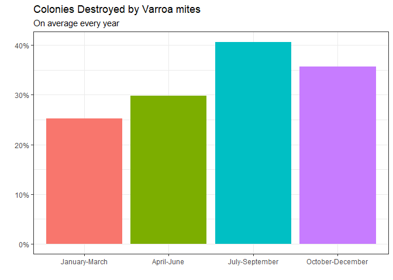
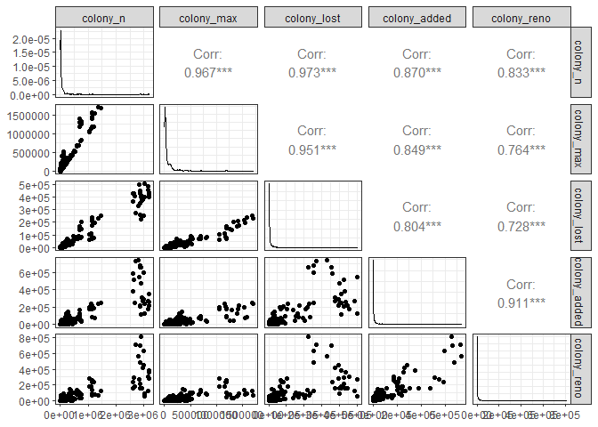
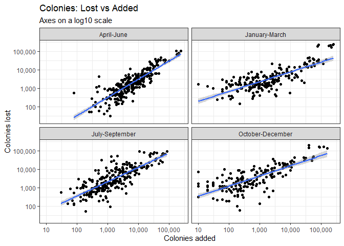

Bee Colony
================
Matthew
1/11/2022

# Explore

``` r
beecolony %>%
  select(where(is.numeric), -year) %>%
  gather() %>%
  ggplot(aes(value)) + geom_histogram() + scale_x_log10(labels = scales::comma) + facet_wrap(~key, scales = "free", ncol = 3)
```

    ## `stat_bin()` using `bins = 30`. Pick better value with `binwidth`.

<!-- -->

``` r
beecolony %>%
  arrange(-colony_added) %>%
  select(colony_added)
```

    ## # A tibble: 685 x 1
    ##    colony_added
    ##           <dbl>
    ##  1       250000
    ##  2       240000
    ##  3       240000
    ##  4       215000
    ##  5       210000
    ##  6       200000
    ##  7       200000
    ##  8       184000
    ##  9       176000
    ## 10       175000
    ## # ... with 675 more rows

## Colony\_\* Function and plots

``` r
gplot <- function(x){
  colony %>%
    filter(!is.na({{x}})) %>%
    mutate(across(where(is.character), as.factor)) %>%
    distinct(months, year, state, {{x}}) %>%
    ggplot(aes({{x}}, reorder(state, {{x}}, order = TRUE))) + geom_col() + labs(y = "")
}

gplot(colony_n)
```

<!-- -->

## Stressors

``` r
levels <- c("Disesases", "Unknown", "Other", "Pesticides", "Other pests/parasites", "Varroa mites")

stressor %>%
  drop_na() %>%
  mutate(stressor = as.factor(stressor), stressor = fct_relevel(stressor, levels = levels)) %>%
  group_by(year, stressor) %>%
  summarize(n = mean(stress_pct)) %>%
  ggplot(aes(year, n, fill = stressor)) + geom_col(position = "dodge") + 
  scale_y_continuous(labels = scales::percent_format(scale = 1))
```

    ## `summarise()` has grouped output by 'year'. You can override using the
    ## `.groups` argument.

<!-- -->

``` r
beecolony %>%
  mutate(months = as.factor(months), 
         months = fct_relevel(months, c("January-March", "April-June", 
                                        "July-September", "October-December"))) %>%
  group_by(months) %>%
  summarize(n = mean(`Varroa mites`)) %>%
  ggplot(aes(months, n, fill = months)) + geom_col() + scale_y_continuous(labels = scales::percent_format(scale = 1)) +
  labs(y = "", x = "", title = "Colonies Destroyed by Varroa mites", subtitle = "On average every year" ) +
  theme(legend.position = "none")
```

<!-- -->

``` r
library(GGally)
```

    ## Registered S3 method overwritten by 'GGally':
    ##   method from   
    ##   +.gg   ggplot2

``` r
colony %>%
  select(contains("colony"), -contains("pct")) %>%
  ggpairs()
```

<!-- -->

``` r
colony %>%
  drop_na() %>%
  ggplot(aes(colony_added, colony_lost)) + geom_point() + scale_x_log10(labels = scales::label_comma()) +
  scale_y_log10(labels = scales::label_comma()) + geom_smooth(method = "lm") + facet_wrap(~months) +
  labs(x = "Colonies added", y = "Colonies lost", title = "Colonies: Lost vs Added", subtitle = "Axes on a log10 scale")
```

    ## `geom_smooth()` using formula 'y ~ x'

<!-- -->
