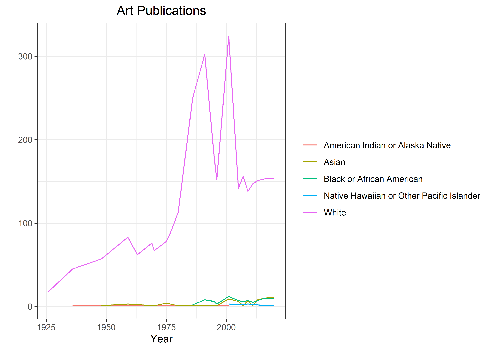

Art History
================
Matthew
2023-01-17

-   <a href="#data-cleaning" id="toc-data-cleaning">Data Cleaning</a>
    -   <a href="#missing-values" id="toc-missing-values">Missing Values</a>
    -   <a href="#counts" id="toc-counts">Counts</a>
-   <a href="#exploratory-data-analysis"
    id="toc-exploratory-data-analysis">Exploratory Data Analysis</a>
    -   <a href="#race" id="toc-race">Race</a>

``` r
artist <- read_csv('https://raw.githubusercontent.com/rfordatascience/tidytuesday/master/data/2023/2023-01-17/artists.csv')
```

    ## Rows: 3162 Columns: 14
    ## -- Column specification --------------------------------------------------------
    ## Delimiter: ","
    ## chr (8): artist_name, artist_nationality, artist_nationality_other, artist_g...
    ## dbl (6): edition_number, year, space_ratio_per_page_total, artist_unique_id,...
    ## 
    ## i Use `spec()` to retrieve the full column specification for this data.
    ## i Specify the column types or set `show_col_types = FALSE` to quiet this message.

``` r
artist <- artist %>% 
  rename_with(~gsub("artist_", "", .x))
```

# Data Cleaning

## Missing Values

``` r
skimr::skim(artist) %>% select(skim_type, skim_variable, n_missing)
```

|                                                  |        |
|:-------------------------------------------------|:-------|
| Name                                             | artist |
| Number of rows                                   | 3162   |
| Number of columns                                | 14     |
| \_\_\_\_\_\_\_\_\_\_\_\_\_\_\_\_\_\_\_\_\_\_\_   |        |
| Column type frequency:                           |        |
| character                                        | 8      |
| numeric                                          | 6      |
| \_\_\_\_\_\_\_\_\_\_\_\_\_\_\_\_\_\_\_\_\_\_\_\_ |        |
| Group variables                                  | None   |

Data summary

**Variable type: character**

| skim_variable     | n_missing |
|:------------------|----------:|
| name              |         0 |
| nationality       |         0 |
| nationality_other |         0 |
| gender            |         0 |
| race              |         0 |
| ethnicity         |        58 |
| book              |         0 |
| race_nwi          |         0 |

**Variable type: numeric**

| skim_variable              | n_missing |
|:---------------------------|----------:|
| edition_number             |         0 |
| year                       |         0 |
| space_ratio_per_page_total |         0 |
| unique_id                  |         0 |
| moma_count_to_year         |         0 |
| whitney_count_to_year      |         0 |

## Counts

``` r
artist %>% 
  count(race, sort = TRUE)
```

    ## # A tibble: 6 x 2
    ##   race                                          n
    ##   <chr>                                     <int>
    ## 1 White                                      2936
    ## 2 Black or African American                    83
    ## 3 Asian                                        79
    ## 4 N/A                                          29
    ## 5 Native Hawaiian or Other Pacific Islander    23
    ## 6 American Indian or Alaska Native             12

*race* has a string called N/A, this should be replaced with NA values
as missing data.

``` r
artist %>% 
  mutate(race = ifelse(race == "N/A", NA, race))
```

    ## # A tibble: 3,162 x 14
    ##    name           edition_number  year nationality nationality_oth~ gender race 
    ##    <chr>                   <dbl> <dbl> <chr>       <chr>            <chr>  <chr>
    ##  1 Aaron Douglas               9  1991 American    American         Male   Blac~
    ##  2 Aaron Douglas              10  1996 American    American         Male   Blac~
    ##  3 Aaron Douglas              11  2001 American    American         Male   Blac~
    ##  4 Aaron Douglas              12  2005 American    American         Male   Blac~
    ##  5 Aaron Douglas              13  2009 American    American         Male   Blac~
    ##  6 Aaron Douglas              14  2013 American    American         Male   Blac~
    ##  7 Aaron Douglas              15  2016 American    American         Male   Blac~
    ##  8 Aaron Douglas              16  2020 American    American         Male   Blac~
    ##  9 Adélaïde Labi~             14  2013 French      French           Female White
    ## 10 Adélaïde Labi~             15  2016 French      French           Female White
    ## # ... with 3,152 more rows, and 7 more variables: ethnicity <chr>, book <chr>,
    ## #   space_ratio_per_page_total <dbl>, unique_id <dbl>,
    ## #   moma_count_to_year <dbl>, whitney_count_to_year <dbl>, race_nwi <chr>

# Exploratory Data Analysis

### Race

``` r
artist %>% 
  group_by(ethnicity) %>% 
  count(race, sort = TRUE) %>% 
  drop_na() %>% 
  ggplot(aes(n, fct_reorder(race, n, sum))) +
  geom_col(color = "black", aes(fill = fct_rev(ethnicity))) +
  scale_x_log10() +
  labs(y = "", x = "", fill = "")
```

<!-- -->

``` r
artist %>% 
  group_by(year) %>% 
  count(race) %>% 
  ggplot(aes(year, n, color = race)) +
  geom_line()
```

<!-- -->

``` r
artist %>% 
  drop_na() %>% 
  ggplot(aes(year, fill = race, color = race)) +
  geom_density(alpha = 0.5)
```

<!-- -->
