Boardgames
================
Matthew
1/25/2022

# EDA

## Check Data

``` r
games %>%
  select_if(is.numeric) %>%
  gather() %>%
  ggplot(aes(value)) + geom_histogram() + facet_wrap(~key, scales = "free")
```

    ## `stat_bin()` using `bins = 30`. Pick better value with `binwidth`.

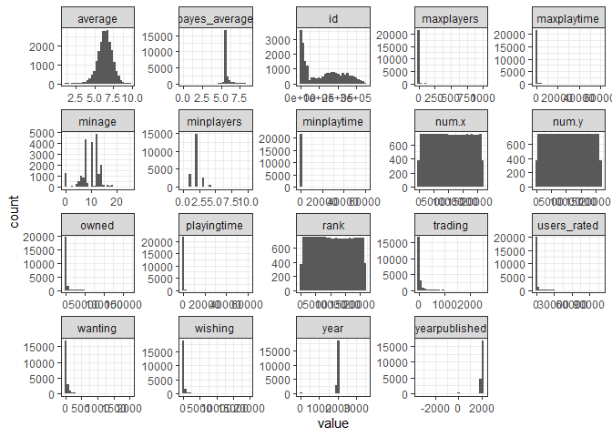<!-- -->

``` r
games %>%
  count(mechanic, sort = TRUE)
```

    ## # A tibble: 8,292 x 2
    ##    mechanic                                           n
    ##    <chr>                                          <int>
    ##  1 <NA>                                            1590
    ##  2 ['Hand Management']                              428
    ##  3 ['Hexagon Grid']                                 389
    ##  4 ['Roll / Spin and Move']                         381
    ##  5 ['Dice Rolling']                                 365
    ##  6 ['Tile Placement']                               287
    ##  7 ['Dice Rolling', 'Hexagon Grid', 'Simulation']   264
    ##  8 ['Dice Rolling', 'Hexagon Grid']                 252
    ##  9 ['Set Collection']                               237
    ## 10 ['Hand Management', 'Set Collection']            180
    ## # ... with 8,282 more rows

## Facet numerics

### Playtime

``` r
games %>%
  group_by(name) %>%
  arrange(-average) %>%
  head(20) %>%
  pivot_longer(contains("playtime"), names_to = "key", values_to = "value") %>%
  ggplot(aes(average, fct_reorder(name, average), fill = factor(value))) + geom_col(color = "black") + facet_wrap(~key) +
  scale_fill_viridis_d(option = "magma") +
  labs(x = "Average Rating", y = "", title = "Top 20 Games") 
```

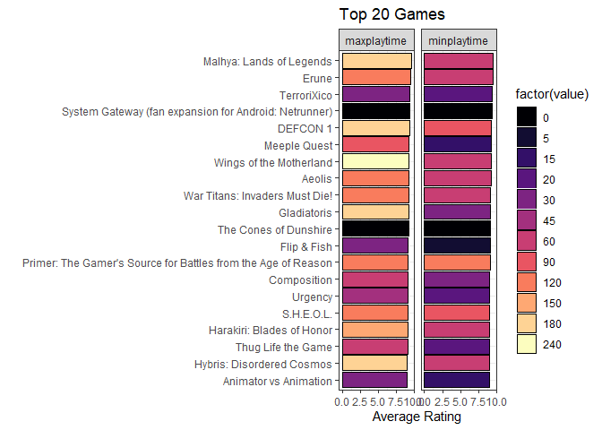<!-- -->

### Number of players

``` r
games %>%
  group_by(name) %>%
  arrange(-average) %>%
  head(20) %>%
  pivot_longer(contains("player"), names_to = "key", values_to = "value") %>%
  ggplot(aes(average, fct_reorder(name, average), fill = factor(value))) + geom_col(color = "black") + facet_wrap(~key) +
  scale_fill_viridis_d(option = "magma") +
  labs(x = "Average Rating", y = "", title = "Top 20 Games")
```

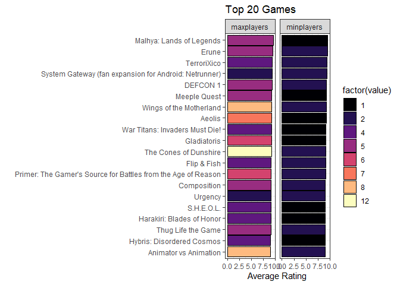<!-- -->

### Gplot column function for filling by numeric

``` r
Gplot <- function(x) {
  games %>%
    group_by(name) %>%
    arrange(-average) %>%
    head(20) %>%
    ggplot(aes(average, fct_reorder(name, average), fill = {{x}})) + geom_col(color = "black") +
    labs(x = "Average Rating", y = "", title = "Top 20 Games") 
}

Gplot(maxplayers)
```

<!-- -->

``` r
Gplot(minplayers)
```

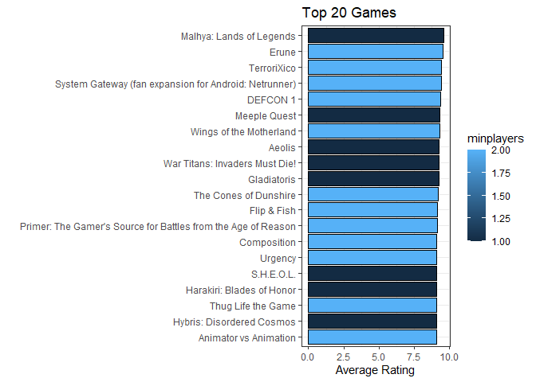<!-- -->

### Gplot2 point function of numerics and average

``` r
Gplot2 <- function(x) {
  games %>%
    filter({{x}} != 0) %>%
    ggplot(aes({{x}}, average)) + geom_point(alpha = 0.1) + scale_x_log10() + 
    geom_hline(yintercept = mean(games$average), lty = 3, size = 1.5, color = "red") +
    geom_smooth()
}

Gplot2(wanting)
```

    ## `geom_smooth()` using method = 'gam' and formula 'y ~ s(x, bs = "cs")'

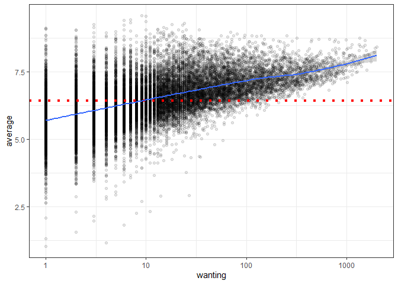<!-- -->

``` r
Gplot2(wishing)
```

    ## `geom_smooth()` using method = 'gam' and formula 'y ~ s(x, bs = "cs")'

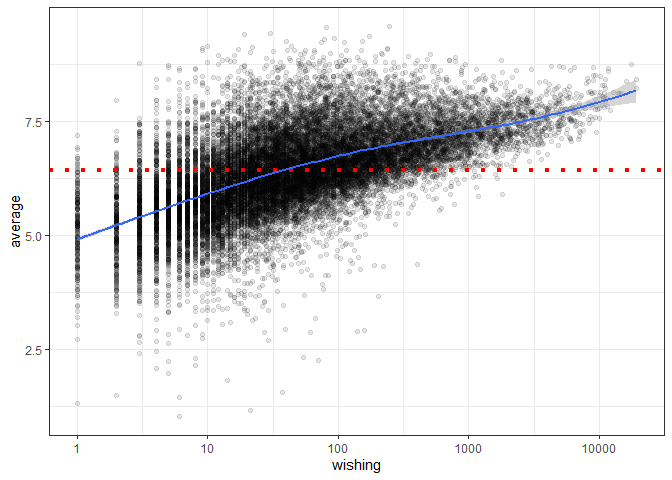<!-- -->

``` r
Gplot2(trading)
```

    ## `geom_smooth()` using method = 'gam' and formula 'y ~ s(x, bs = "cs")'

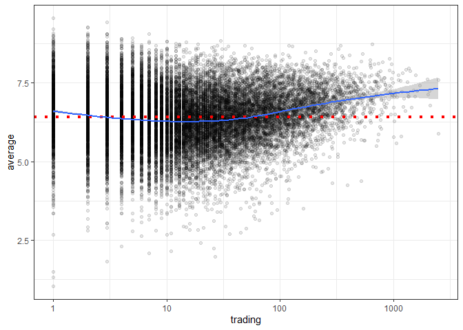<!-- -->

``` r
Gplot2(owned)
```

    ## `geom_smooth()` using method = 'gam' and formula 'y ~ s(x, bs = "cs")'

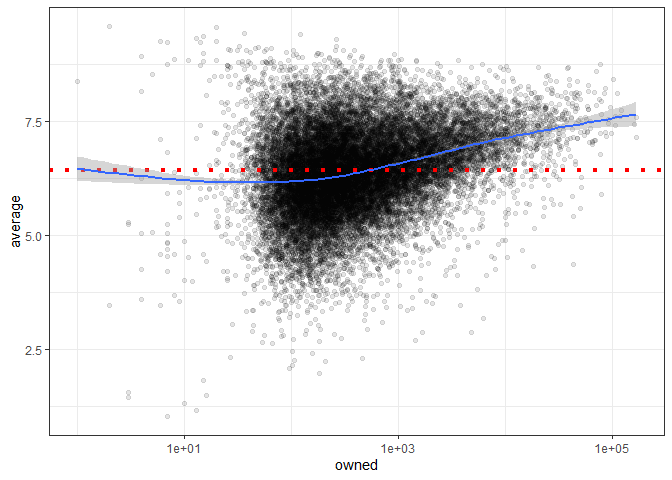<!-- -->

## Game Mechanics

``` r
games %>%
  unnest_tokens(word, mechanic) %>%
  group_by(word) %>%
  summarize(n = n(), mean = mean(average)) %>%
  arrange(-n) %>%
  filter(!word %in% c("game", "and", "player"), !is.na(word)) %>%
  head(30) %>%
  ggplot(aes(mean, fct_reorder(word, mean), fill = word)) + geom_col() + geom_vline(xintercept = mean(games$average), lty = 3) +
  theme(legend.position = "") + labs(y = "", x = "Average rating", title = "Average rating by most common game mechanics")
```

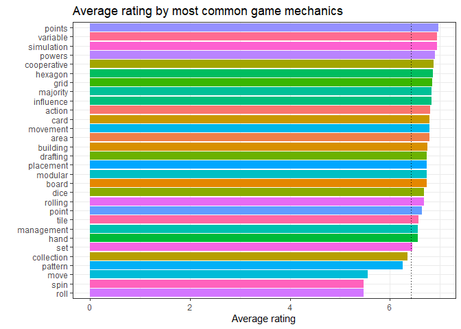<!-- -->

### Tidy mechanic column and furthur analysis

``` r
games %>%
  separate_rows(mechanic, sep = ",") %>%
  mutate(mechanic = str_replace_all(mechanic, "\\[|\\]", ""),
         mechanic = str_replace_all(mechanic, "\'", ""),
         mechanic = str_trim(mechanic, "both")) %>% 
  group_by(mechanic) %>%
  summarize(n = n(), average = mean(average)) %>%
  filter(n >100) %>%
  arrange(-average) %>%
  head(30) %>%
  ggplot(aes(average, fct_reorder(mechanic, average), fill = average)) + geom_col(color = "black") + 
  theme(legend.position = "") +
  geom_vline(xintercept = mean(games$average), lty = 3, color = "red") +
  labs(y = "", x = "", title = "Average rating by common mechanics", subtitle = "Highest 30 Mechanics",
       caption = "Red line indicates global average")
```

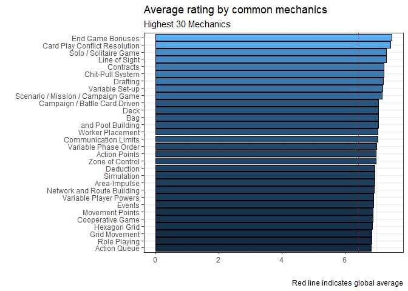<!-- -->

``` r
games %>%
  separate_rows(mechanic, sep = ",") %>%
  mutate(mechanic = str_replace_all(mechanic, "\\[|\\]", ""),
         mechanic = str_replace_all(mechanic, "\'", ""),
         mechanic = str_trim(mechanic, "both")) %>% 
  group_by(mechanic) %>%
  summarize(n = n(), average = mean(average)) %>%
  filter(n >100, !is.na(mechanic)) %>%
  arrange(average) %>%
  head(30) %>%
  ggplot(aes(average, fct_reorder(mechanic, average), fill = average)) + geom_col(color = "black") + 
  geom_vline(xintercept = mean(games$average), lty = 3, color = "red") +
  theme(legend.position = "") +
  labs(y = "", x = "", title = "Average rating by common mechanics", subtitle = "Lowest 30 Mechanics",
       caption = "Red line indicates global average")
```

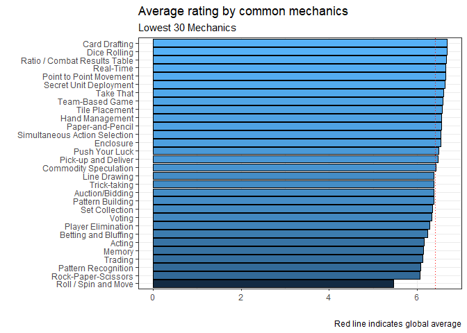<!-- -->

``` r
games %>%
  separate_rows(mechanic, sep = ",") %>%
  mutate(mechanic = str_replace_all(mechanic, "\\[|\\]", ""),
         mechanic = str_replace_all(mechanic, "\'", ""),
         mechanic = str_trim(mechanic, "both")) %>% 
  group_by(mechanic) %>%
  summarize(n = n(), average = mean(average)) %>%
  filter(n >100, !is.na(mechanic)) %>%
  arrange(-average) %>%
  ggplot(aes(average, n)) + geom_text(aes(label = mechanic), check_overlap = TRUE)
```

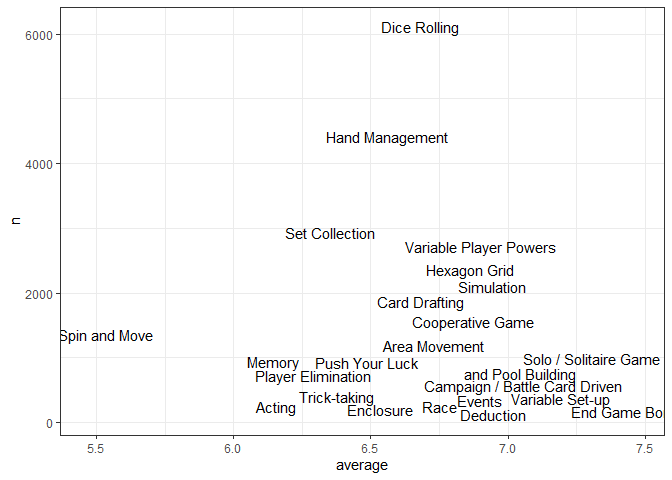<!-- -->

## Game category

``` r
games %>%
  separate_rows(category, sep = ",") %>%
  mutate(category = str_replace_all(category, "\\[|\\]", ""),
         category = str_replace_all(category, "\'",""),
         category = str_replace_all(category, "\\\"",""),
         category = str_trim(category, "both")) %>%
  group_by(category) %>%
  drop_na() %>%
  summarize(n = n(), mean = mean(average)) %>%
  arrange(-mean) %>%
  filter(n > 25) %>%
  head(25) %>%
  ggplot(aes(mean, fct_reorder(category, mean), fill = mean)) + geom_col(color = "black") + 
  geom_vline(xintercept = mean(games$average), lty = 3, color = "red") +
  labs(y = "", x = "Average Rating", title = "Top 25 Categories", caption = "Only categories with more than 25 occurances") + 
  theme(legend.position = "")
```

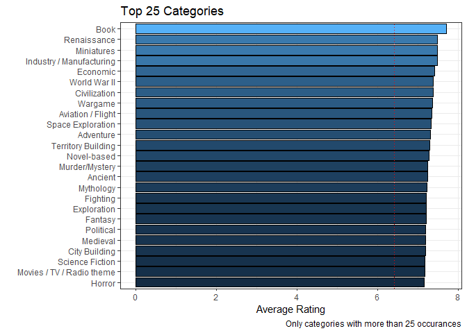<!-- -->

``` r
games %>%
  separate_rows(category, sep = ",") %>%
  mutate(category = str_replace_all(category, "\\[|\\]", ""),
         category = str_replace_all(category, "\'",""), 
         category = str_replace_all(category, "\\\"",""),
         category = str_trim(category, "both")) %>%
  group_by(category) %>%
  drop_na() %>%
  summarize(n = n(), mean = mean(average)) %>%
  arrange(mean) %>%
  filter(n > 10) %>%
  head(25) %>%
  ggplot(aes(mean, fct_reorder(category, mean), fill = mean)) + geom_col(color = "black") + 
  geom_vline(xintercept = mean(games$average), lty = 3, color = "red") +
  labs(y = "", x = "Average Rating", title = "Bottom 25 Categories", caption = "Only categories with more than 10 occurances") +
  theme(legend.position = "")
```

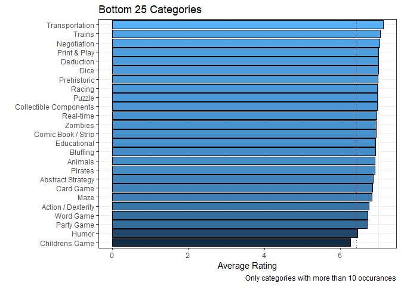<!-- -->

## Bayes Average and gplot function

``` r
gplot <- function(x,y) {
  games %>%
    filter({{x}} > 0) %>%
    group_by({{x}}) %>%
    summarize(y = mean({{y}})) %>%
    ggplot(aes({{x}}, y)) + geom_point()
}
gplot(wanting, bayes_average) + scale_x_sqrt()
```

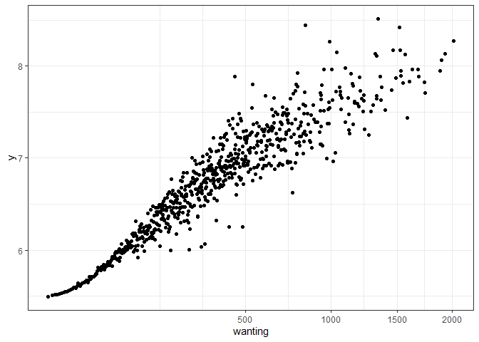<!-- -->

### Gathered Bayes/Average and make another gplot function

``` r
gplot2 <- function(x) {
  games %>% 
    gather(key = key, value = value, bayes_average, average) %>%
    filter({{x}} > 0) %>%
    group_by({{x}}, key) %>%
    summarize(value = mean(value)) %>%
    ggplot(aes({{x}}, value)) + geom_point(alpha = 0.3) + facet_wrap(~key)
}

gplot2(wishing) + scale_x_log10() + geom_smooth(method = "lm") + 
  labs(title = "Comparison of Average vs Bayes Average", subtitle = "X is on a log10 scale")
```

    ## `summarise()` has grouped output by 'wishing'. You can override using the `.groups` argument.

    ## `geom_smooth()` using formula 'y ~ x'

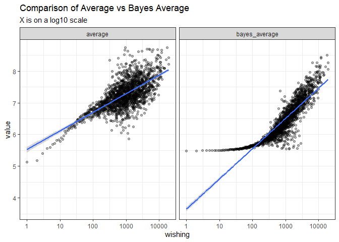<!-- -->

``` r
gplot2(wishing) + scale_x_sqrt() + geom_smooth(method = "lm") + 
  labs(title = "Comparison of Average vs Bayes Average", subtitle = "X is on a square root scale")
```

    ## `summarise()` has grouped output by 'wishing'. You can override using the `.groups` argument.
    ## `geom_smooth()` using formula 'y ~ x'

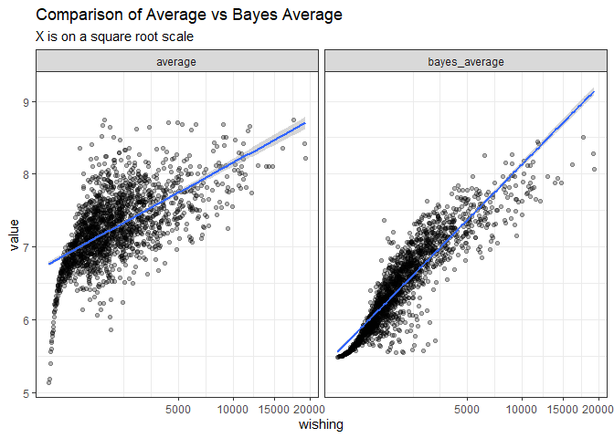<!-- -->

#### Quick lm models

``` r
lm(bayes_average ~ sqrt(wishing) * sqrt(wanting) + log(minplayers), games %>% filter(wishing >0, minplayers >0)) %>% summary()
```

    ## 
    ## Call:
    ## lm(formula = bayes_average ~ sqrt(wishing) * sqrt(wanting) + 
    ##     log(minplayers), data = games %>% filter(wishing > 0, minplayers > 
    ##     0))
    ## 
    ## Residuals:
    ##     Min      1Q  Median      3Q     Max 
    ## -5.4731 -0.0587  0.0030  0.0570  1.1481 
    ## 
    ## Coefficients:
    ##                               Estimate Std. Error t value Pr(>|t|)    
    ## (Intercept)                  5.334e+00  2.801e-03 1904.10   <2e-16 ***
    ## sqrt(wishing)                2.044e-02  3.658e-04   55.88   <2e-16 ***
    ## sqrt(wanting)                2.724e-02  7.252e-04   37.56   <2e-16 ***
    ## log(minplayers)              5.194e-02  2.996e-03   17.34   <2e-16 ***
    ## sqrt(wishing):sqrt(wanting) -8.792e-05  8.110e-06  -10.84   <2e-16 ***
    ## ---
    ## Signif. codes:  0 '***' 0.001 '**' 0.01 '*' 0.05 '.' 0.1 ' ' 1
    ## 
    ## Residual standard error: 0.1467 on 21474 degrees of freedom
    ## Multiple R-squared:  0.8403, Adjusted R-squared:  0.8403 
    ## F-statistic: 2.825e+04 on 4 and 21474 DF,  p-value: < 2.2e-16

``` r
lm(average ~ log(wishing), games %>% filter(wishing >0)) %>% summary()
```

    ## 
    ## Call:
    ## lm(formula = average ~ log(wishing), data = games %>% filter(wishing > 
    ##     0))
    ## 
    ## Residuals:
    ##     Min      1Q  Median      3Q     Max 
    ## -5.0085 -0.4565 -0.0583  0.4316  3.2637 
    ## 
    ## Coefficients:
    ##              Estimate Std. Error t value Pr(>|t|)    
    ## (Intercept)  5.191703   0.012817   405.1   <2e-16 ***
    ## log(wishing) 0.320822   0.003059   104.9   <2e-16 ***
    ## ---
    ## Signif. codes:  0 '***' 0.001 '**' 0.01 '*' 0.05 '.' 0.1 ' ' 1
    ## 
    ## Residual standard error: 0.7533 on 21520 degrees of freedom
    ## Multiple R-squared:  0.3382, Adjusted R-squared:  0.3382 
    ## F-statistic: 1.1e+04 on 1 and 21520 DF,  p-value: < 2.2e-16

##### Plots of tidy lm models

``` r
lm(bayes_average ~ sqrt(wishing) * sqrt(wanting), games %>% filter(wishing >0)) %>% 
  tidy(conf.int = TRUE) %>%
  filter(term != "(Intercept)") %>%
  ggplot(aes(estimate, term, color = term)) + geom_point() + geom_errorbar(aes(xmin = conf.low, xmax = conf.high))
```

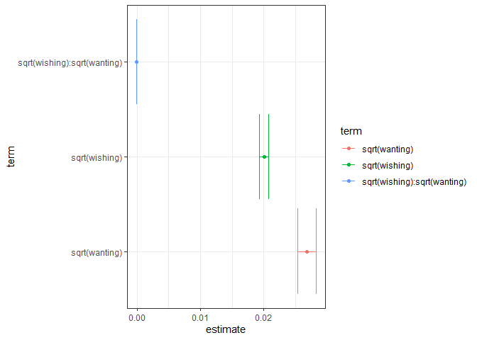<!-- -->

``` r
lm(bayes_average ~ ., games %>% select_if(is.numeric) %>% 
  filter(wishing >0)) %>% 
  tidy(conf.int = TRUE) %>%
  filter(term != "(Intercept)") %>% 
  drop_na() %>%
  ggplot(aes(estimate, fct_reorder(term, estimate), color = term)) + 
  geom_point() + geom_errorbar(aes(xmin = conf.low, xmax = conf.high)) +
  theme(legend.position = "") + labs(y = "", title = "Linear model using only numeric estimates")
```

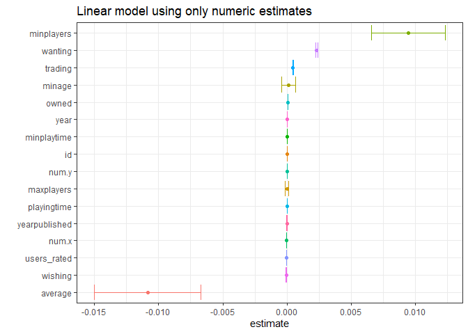<!-- -->

``` r
library(tidymodels)
```

    ## Registered S3 method overwritten by 'tune':
    ##   method                   from   
    ##   required_pkgs.model_spec parsnip

    ## -- Attaching packages -------------------------------------- tidymodels 0.1.4 --

    ## v broom        0.7.10     v rsample      0.1.1 
    ## v dials        0.0.10     v tune         0.1.6 
    ## v infer        1.0.0      v workflows    0.2.4 
    ## v modeldata    0.1.1      v workflowsets 0.1.0 
    ## v parsnip      0.1.7      v yardstick    0.0.9 
    ## v recipes      0.1.17

    ## -- Conflicts ----------------------------------------- tidymodels_conflicts() --
    ## x scales::discard() masks purrr::discard()
    ## x dplyr::filter()   masks stats::filter()
    ## x recipes::fixed()  masks stringr::fixed()
    ## x dplyr::lag()      masks stats::lag()
    ## x yardstick::spec() masks readr::spec()
    ## x recipes::step()   masks stats::step()
    ## * Learn how to get started at https://www.tidymodels.org/start/

``` r
library(mgcv)
```

    ## Loading required package: nlme

    ## 
    ## Attaching package: 'nlme'

    ## The following object is masked from 'package:dplyr':
    ## 
    ##     collapse

    ## This is mgcv 1.8-38. For overview type 'help("mgcv-package")'.

``` r
games_split <- initial_split(games, strata = bayes_average)
games_train <- training(games_split)
games_test <- testing(games_split)

set.seed(2022)

model <- lm(bayes_average ~ sqrt(wishing) * sqrt(wanting) + minplayers + average, games_train)

model %>% summary()
```

    ## 
    ## Call:
    ## lm(formula = bayes_average ~ sqrt(wishing) * sqrt(wanting) + 
    ##     minplayers + average, data = games_train)
    ## 
    ## Residuals:
    ##     Min      1Q  Median      3Q     Max 
    ## -5.5321 -0.0595  0.0038  0.0579  1.1030 
    ## 
    ## Coefficients:
    ##                               Estimate Std. Error t value Pr(>|t|)    
    ## (Intercept)                  5.203e+00  9.941e-03 523.361  < 2e-16 ***
    ## sqrt(wishing)                1.946e-02  4.243e-04  45.853  < 2e-16 ***
    ## sqrt(wanting)                2.457e-02  8.481e-04  28.975  < 2e-16 ***
    ## minplayers                   2.441e-02  1.713e-03  14.252  < 2e-16 ***
    ## average                      2.069e-02  1.496e-03  13.831  < 2e-16 ***
    ## sqrt(wishing):sqrt(wanting) -3.716e-05  9.746e-06  -3.813 0.000138 ***
    ## ---
    ## Signif. codes:  0 '***' 0.001 '**' 0.01 '*' 0.05 '.' 0.1 ' ' 1
    ## 
    ## Residual standard error: 0.1477 on 16215 degrees of freedom
    ## Multiple R-squared:  0.8374, Adjusted R-squared:  0.8374 
    ## F-statistic: 1.671e+04 on 5 and 16215 DF,  p-value: < 2.2e-16

``` r
games_test %>%
  mutate(predictions = predict(model, games_test),
         residuals = bayes_average - predictions) %>%
  ggplot(aes(predictions, residuals)) + geom_point(alpha = 0.1) + 
  geom_hline(yintercept = 0, lty = 2, color = "blue", size = 1) +
  labs(title = "Residual plot for first lm")
```

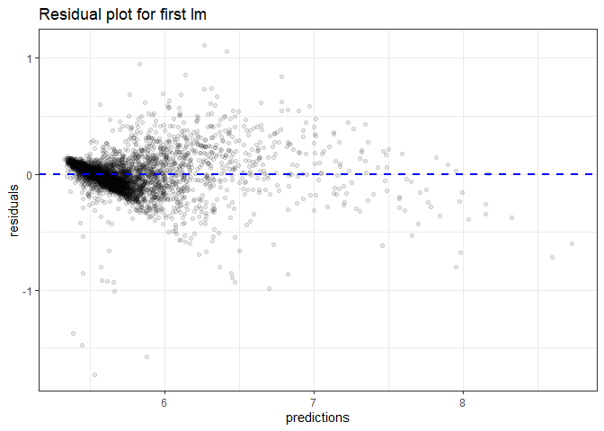<!-- -->

``` r
games_test %>%
  mutate(predictions = predict(model, games_test)) %>%
  group_by(wishing) %>%
  summarize(bayes_average = mean(bayes_average),
            predictions = mean(predictions)) %>%
  ggplot(aes(wishing)) + geom_point(aes(y = bayes_average), alpha = 0.3) + 
  geom_point(aes(y = predictions), color = "blue", alpha = 0.3) + scale_x_sqrt()
```

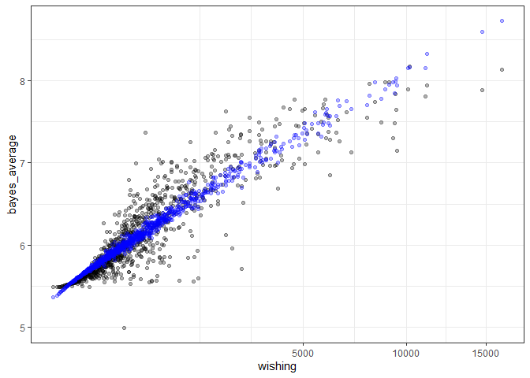<!-- -->

``` r
games_test %>%
  mutate(predictions = predict(model, games_test)) %>%
  ggplot(aes(predictions, bayes_average)) + geom_point(alpha = 0.07) + 
  geom_abline(color = "blue", linetype = "dashed", size = 1) +
  xlim(5.5,8.5) + ylim(5.5,8.5)
```

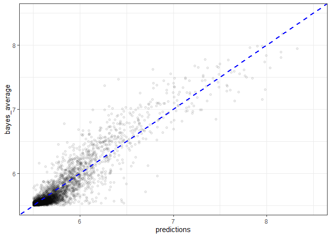<!-- -->

##### Gam model

``` r
model2 <- gam(bayes_average ~ s(wishing), family = gaussian, data = games_train)

model2 %>% summary()
```

    ## 
    ## Family: gaussian 
    ## Link function: identity 
    ## 
    ## Formula:
    ## bayes_average ~ s(wishing)
    ## 
    ## Parametric coefficients:
    ##             Estimate Std. Error t value Pr(>|t|)    
    ## (Intercept) 5.683226   0.001148    4950   <2e-16 ***
    ## ---
    ## Signif. codes:  0 '***' 0.001 '**' 0.01 '*' 0.05 '.' 0.1 ' ' 1
    ## 
    ## Approximate significance of smooth terms:
    ##              edf Ref.df    F p-value    
    ## s(wishing) 8.915  8.998 9503  <2e-16 ***
    ## ---
    ## Signif. codes:  0 '***' 0.001 '**' 0.01 '*' 0.05 '.' 0.1 ' ' 1
    ## 
    ## R-sq.(adj) =  0.841   Deviance explained = 84.1%
    ## GCV = 0.021396  Scale est. = 0.021383  n = 16221

``` r
games_test %>%
  mutate(predictions = predict(model2, games_test),
         residuals = bayes_average - predictions) %>%
  ggplot(aes(predictions, residuals)) + geom_point(alpha = 0.1) + 
  geom_hline(yintercept = 0, lty = 2, color = "blue", size = 1) +
  labs(title = "Residual plot for first Gam")
```

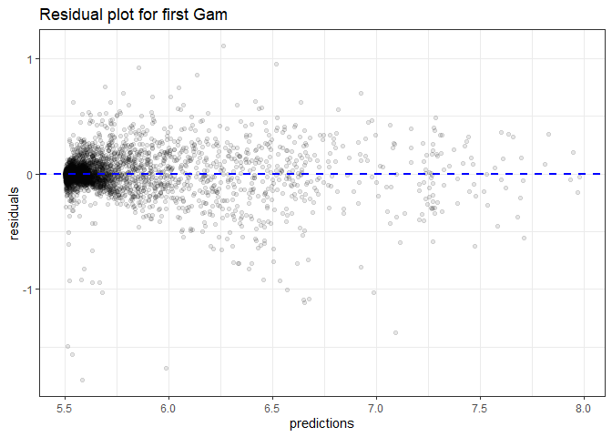<!-- -->

``` r
games_test %>%
  mutate(predictions = predict(model2, games_test)) %>%
  group_by(wishing) %>%
  summarize(bayes_average = mean(bayes_average),
            predictions = mean(predictions)) %>%
  ggplot(aes(wishing)) + geom_point(aes(y = bayes_average), alpha = 0.3) + 
  geom_point(aes(y = predictions), color = "blue", alpha = 0.3) + scale_x_sqrt()
```

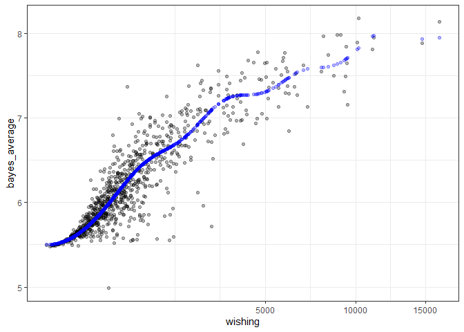<!-- -->

``` r
games_test %>%
  mutate(predictions = predict(model2, games_test)) %>%
  ggplot(aes(predictions, bayes_average)) + geom_point(alpha = 0.07) + 
  geom_abline(color = "blue", linetype = "dashed", size = 1) +
  xlim(5.5,8.5) + ylim(5.5,8.5)
```

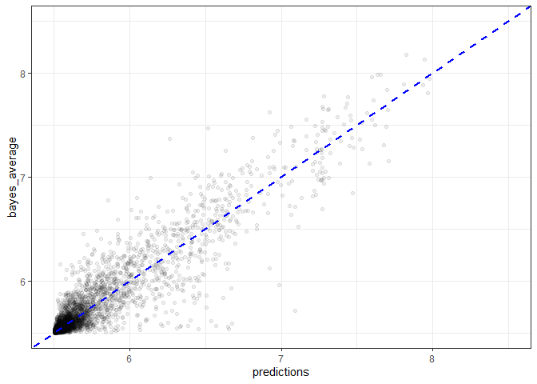<!-- -->

##### Both models

``` r
games_test %>%
  mutate(predictions = predict(model2, games_test),
         model = "2") %>%
  bind_rows(games_test %>%
              mutate(predictions = predict(model, games_test),
                     model = "1")) %>%
  group_by(wishing, model) %>%
  summarize(bayes_average = mean(bayes_average),
            predictions = mean(predictions)) %>%
  ggplot(aes(wishing)) + geom_point(aes(y = bayes_average), alpha = 0.3) + 
  geom_point(aes(y = predictions, color = model), alpha = 0.3) + scale_x_sqrt() +
  labs(title = "Both models fitted", subtitle = "Square root scale")
```

    ## `summarise()` has grouped output by 'wishing'. You can override using the `.groups` argument.

<!-- -->

``` r
games_df <- games %>%
  select(bayes_average, category, wishing) %>%
  drop_na() %>%
  separate_rows(category, sep = ",") %>%
  mutate(category = str_replace_all(category, "\\[|\\]", ""),
         category = str_replace_all(category, "\'",""), 
         category = str_replace_all(category, "\\\"",""),
         category = str_trim(category, "both")) %>%
  mutate_if(is.character, factor) %>%
  mutate(category = fct_lump(category, prop = 0.01))
```

#### Gam model 3 using categories

``` r
df_split <- initial_split(games_df, strata = bayes_average)
df_train <- training(df_split)
df_test <- testing(df_split)

model3 <- gam(bayes_average ~ s(wishing) + category, gaussian, df_train)

model3 %>% summary()
```

    ## 
    ## Family: gaussian 
    ## Link function: identity 
    ## 
    ## Formula:
    ## bayes_average ~ s(wishing) + category
    ## 
    ## Parametric coefficients:
    ##                                    Estimate Std. Error  t value Pr(>|t|)    
    ## (Intercept)                        5.705316   0.004512 1264.511  < 2e-16 ***
    ## categoryAction / Dexterity        -0.016482   0.006922   -2.381 0.017266 *  
    ## categoryAdventure                 -0.057144   0.006880   -8.306  < 2e-16 ***
    ## categoryAncient                    0.014456   0.007795    1.855 0.063650 .  
    ## categoryAnimals                   -0.018471   0.006605   -2.796 0.005169 ** 
    ## categoryBluffing                   0.008037   0.006816    1.179 0.238364    
    ## categoryCard Game                  0.017500   0.005019    3.487 0.000489 ***
    ## categoryChildrens Game            -0.025534   0.006234   -4.096 4.21e-05 ***
    ## categoryDeduction                 -0.001942   0.006941   -0.280 0.779676    
    ## categoryDice                      -0.016878   0.006081   -2.775 0.005517 ** 
    ## categoryEconomic                   0.022929   0.006415    3.575 0.000351 ***
    ## categoryExploration               -0.051801   0.007435   -6.967 3.28e-12 ***
    ## categoryFantasy                   -0.003808   0.005677   -0.671 0.502339    
    ## categoryFighting                   0.011242   0.006261    1.796 0.072562 .  
    ## categoryHorror                    -0.031026   0.008134   -3.814 0.000137 ***
    ## categoryHumor                     -0.013900   0.006840   -2.032 0.042130 *  
    ## categoryMedieval                   0.013613   0.007105    1.916 0.055362 .  
    ## categoryMiniatures                 0.013872   0.006948    1.997 0.045875 *  
    ## categoryMovies / TV / Radio theme -0.025177   0.006985   -3.604 0.000313 ***
    ## categoryNautical                   0.009293   0.008334    1.115 0.264859    
    ## categoryNegotiation               -0.016547   0.008173   -2.025 0.042924 *  
    ## categoryParty Game                -0.003093   0.006012   -0.515 0.606855    
    ## categoryPrint & Play              -0.026945   0.008467   -3.182 0.001461 ** 
    ## categoryPuzzle                     0.004864   0.008170    0.595 0.551606    
    ## categoryRacing                    -0.007302   0.008394   -0.870 0.384374    
    ## categoryReal-time                  0.012585   0.007747    1.624 0.104282    
    ## categoryScience Fiction           -0.020416   0.006275   -3.253 0.001142 ** 
    ## categoryTrivia                    -0.003011   0.008504   -0.354 0.723289    
    ## categoryWargame                    0.021488   0.005336    4.027 5.67e-05 ***
    ## categoryWorld War II               0.029326   0.006784    4.322 1.55e-05 ***
    ## categoryOther                      0.006197   0.004762    1.301 0.193175    
    ## ---
    ## Signif. codes:  0 '***' 0.001 '**' 0.01 '*' 0.05 '.' 0.1 ' ' 1
    ## 
    ## Approximate significance of smooth terms:
    ##              edf Ref.df     F p-value    
    ## s(wishing) 8.991      9 26362  <2e-16 ***
    ## ---
    ## Signif. codes:  0 '***' 0.001 '**' 0.01 '*' 0.05 '.' 0.1 ' ' 1
    ## 
    ## R-sq.(adj) =  0.854   Deviance explained = 85.4%
    ## GCV = 0.023275  Scale est. = 0.023253  n = 42473

``` r
df_fit <- df_test %>%
  mutate(predictions = predict(model3, df_test),
         residuals = bayes_average - predictions)

df_fit %>%
  group_by(wishing) %>%
  summarize(bayes_average = mean(bayes_average),
            predictions = mean(predictions)) %>%
  ggplot(aes(wishing)) + geom_point(aes(y = bayes_average), alpha = 0.3) + 
  geom_point(aes(y = predictions), color = "blue", alpha = 0.3) + scale_x_sqrt() +
  labs(title = "GAM model", subtitle = "Includes wishing and top 31 most common categories")
```

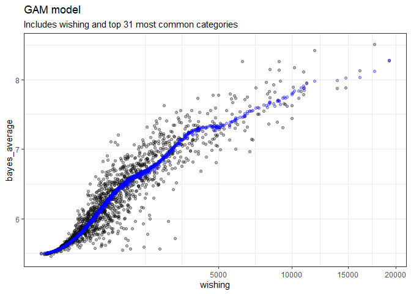<!-- -->

#### Model 2

``` r
games_test %>%
  filter(bayes_average > 0) %>%
  mutate(predictions = predict(model2, games_test %>% filter(bayes_average > 0)),
         residuals = bayes_average - predictions) %>%
  summarize(rmse = sqrt(mean(residuals^2)),
            relerr = sqrt(mean((residuals/bayes_average)^2)))
```

    ## # A tibble: 1 x 2
    ##    rmse relerr
    ##   <dbl>  <dbl>
    ## 1 0.140 0.0238

#### Model 3

``` r
df_test %>%
  filter(bayes_average > 0) %>%
  mutate(predictions = predict(model3, df_test %>% filter(bayes_average > 0)),
         residuals = bayes_average - predictions) %>%
  summarize(rmse = sqrt(mean(residuals^2)),
            relerr = sqrt(mean((residuals/bayes_average)^2)))
```

    ## # A tibble: 1 x 2
    ##    rmse relerr
    ##   <dbl>  <dbl>
    ## 1 0.149 0.0252
