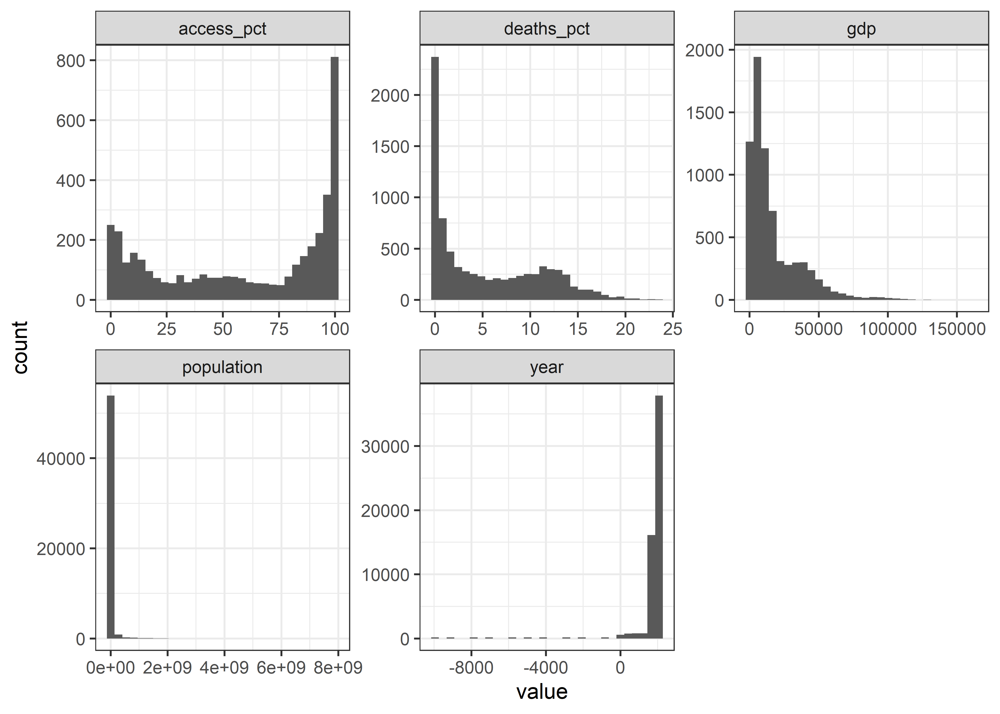
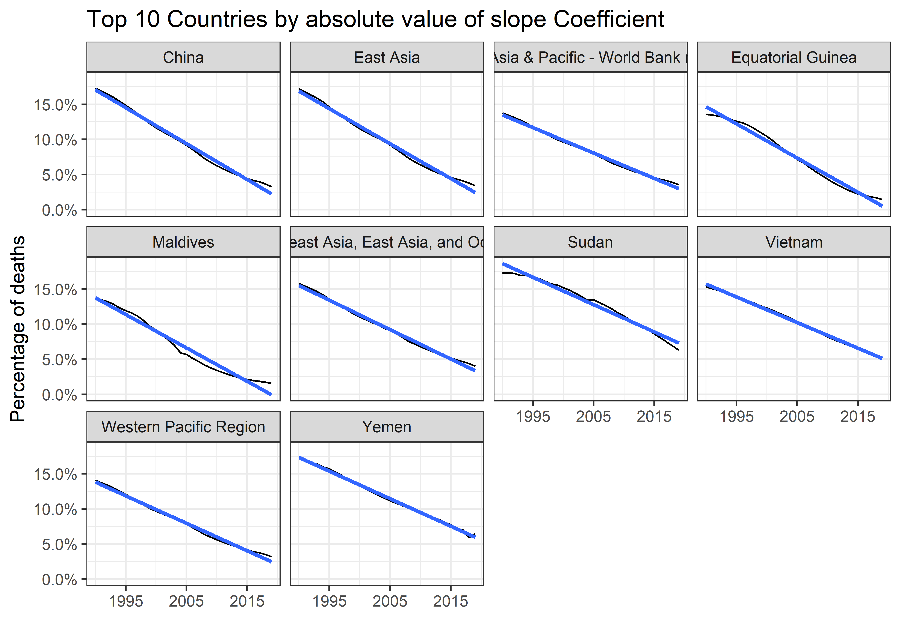
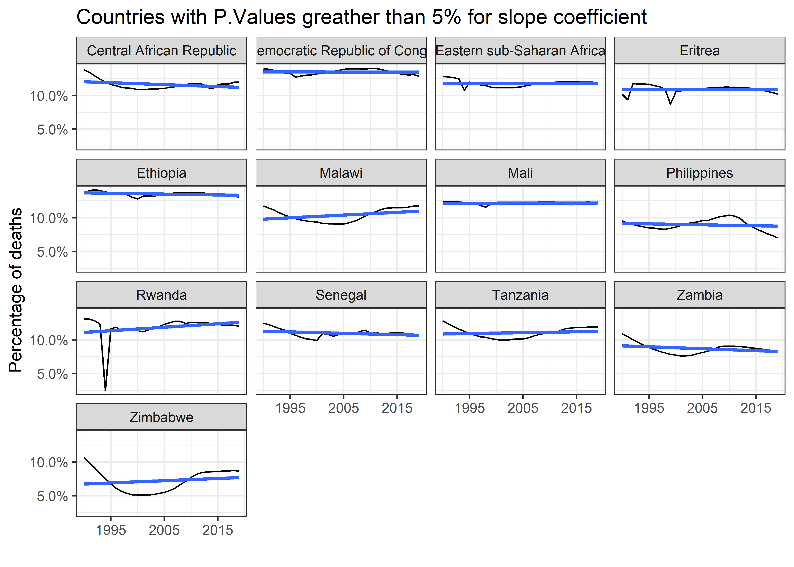
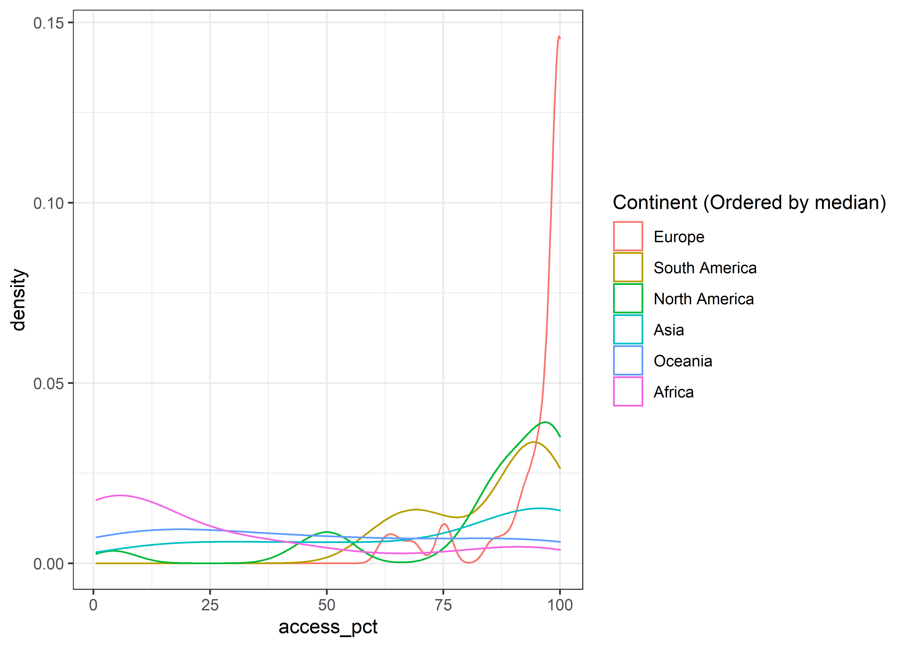
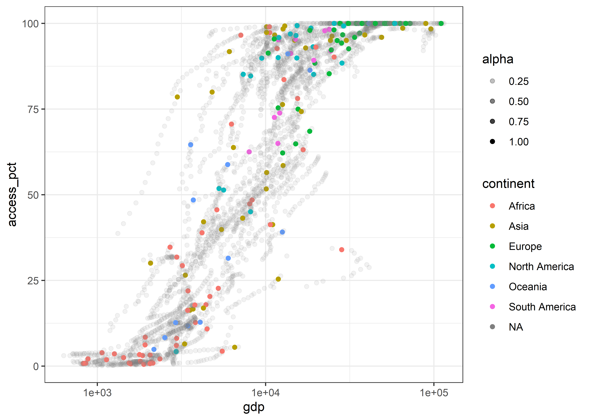
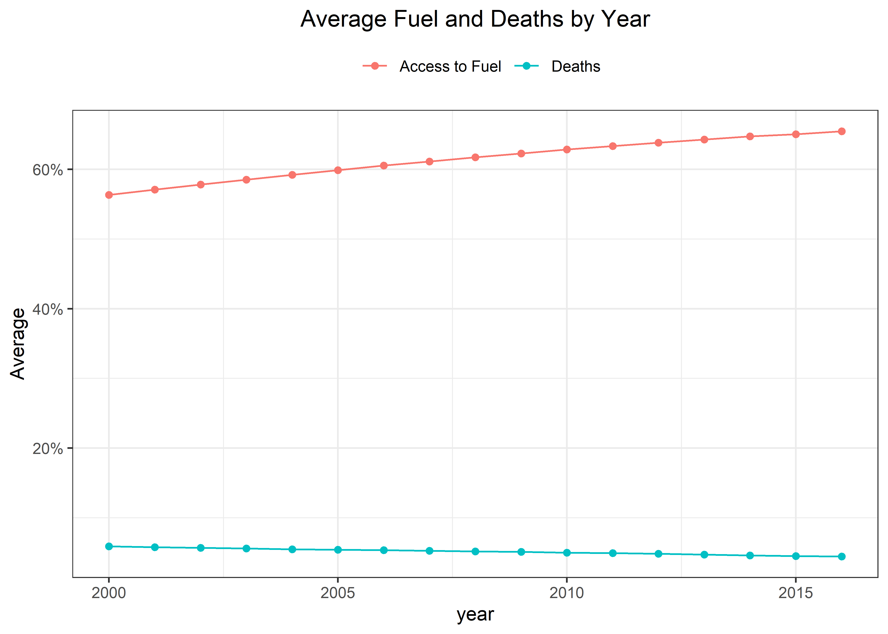

Indoor Pollution
================
Matthew
4/11/2022

``` r
indoor_pollution <- 
  read_csv(
    'https://raw.githubusercontent.com/rfordatascience/tidytuesday/master/data/2022/2022-04-12/indoor_pollution.csv')
```

    ## Rows: 8010 Columns: 4
    ## -- Column specification --------------------------------------------------------
    ## Delimiter: ","
    ## chr (2): Entity, Code
    ## dbl (2): Year, Deaths - Cause: All causes - Risk: Household air pollution fr...
    ## 
    ## i Use `spec()` to retrieve the full column specification for this data.
    ## i Specify the column types or set `show_col_types = FALSE` to quiet this message.

``` r
fuel_access <- 
  read_csv(
    'https://raw.githubusercontent.com/rfordatascience/tidytuesday/master/data/2022/2022-04-12/fuel_gdp.csv')
```

    ## Rows: 57108 Columns: 7
    ## -- Column specification --------------------------------------------------------
    ## Delimiter: ","
    ## chr (3): Entity, Code, Continent
    ## dbl (4): Year, Access to clean fuels and technologies for cooking (% of popu...
    ## 
    ## i Use `spec()` to retrieve the full column specification for this data.
    ## i Specify the column types or set `show_col_types = FALSE` to quiet this message.

``` r
fuel_access <- fuel_access %>% 
  rename_with(tolower) %>% 
  rename(access_pct = "access to clean fuels and technologies for cooking (% of population)") %>% 
  rename(gdp = `gdp per capita, ppp (constant 2017 international $)`) %>% 
  rename(population = `population (historical estimates)`)

indoor_pollution <- indoor_pollution %>% 
  rename(deaths_pct = "Deaths - Cause: All causes - Risk: Household air pollution from solid fuels - Sex: Both - Age: Age-standardized (Percent)") %>% 
  rename_with(tolower)

joined_data <- indoor_pollution %>% 
  full_join(fuel_access) 
```

    ## Joining, by = c("entity", "code", "year")

# EDA

``` r
indoor_pollution %>% 
  count(entity)
```

    ## # A tibble: 267 x 2
    ##    entity                   n
    ##    <chr>                <int>
    ##  1 Afghanistan             30
    ##  2 Africa                  30
    ##  3 African Region          30
    ##  4 African Union           30
    ##  5 Albania                 30
    ##  6 Algeria                 30
    ##  7 America                 30
    ##  8 American Samoa          30
    ##  9 Andean Latin America    30
    ## 10 Andorra                 30
    ## # ... with 257 more rows

``` r
indoor_pollution %>% 
  distinct(year) %>% 
  arrange(-year)
```

    ## # A tibble: 30 x 1
    ##     year
    ##    <dbl>
    ##  1  2019
    ##  2  2018
    ##  3  2017
    ##  4  2016
    ##  5  2015
    ##  6  2014
    ##  7  2013
    ##  8  2012
    ##  9  2011
    ## 10  2010
    ## # ... with 20 more rows

``` r
joined_data %>% 
  keep(is.numeric) %>% 
  gather() %>% 
  ggplot(aes(value)) + geom_histogram() + facet_wrap(~key, scales = "free")
```

    ## `stat_bin()` using `bins = 30`. Pick better value with `binwidth`.

<!-- -->

``` r
joined_data %>%
  filter(year < 0) %>% 
  arrange(year)
```

    ## # A tibble: 1,797 x 8
    ##    entity           code   year deaths_pct access_pct   gdp population continent
    ##    <chr>            <chr> <dbl>      <dbl>      <dbl> <dbl>      <dbl> <chr>    
    ##  1 Afghanistan      AFG    -1e4         NA         NA    NA      14737 <NA>     
    ##  2 Africa           <NA>   -1e4         NA         NA    NA     227611 <NA>     
    ##  3 Albania          ALB    -1e4         NA         NA    NA       1199 <NA>     
    ##  4 Algeria          DZA    -1e4         NA         NA    NA      12090 <NA>     
    ##  5 Andorra          AND    -1e4         NA         NA    NA         25 <NA>     
    ##  6 Angola           AGO    -1e4         NA         NA    NA        379 <NA>     
    ##  7 Antigua and Bar~ ATG    -1e4         NA         NA    NA          1 <NA>     
    ##  8 Argentina        ARG    -1e4         NA         NA    NA      27969 <NA>     
    ##  9 Armenia          ARM    -1e4         NA         NA    NA       9614 <NA>     
    ## 10 Asia             <NA>   -1e4         NA         NA    NA    1184300 <NA>     
    ## # ... with 1,787 more rows

``` r
fuel_access %>% 
  filter(year < 0)
```

    ## # A tibble: 1,797 x 7
    ##    entity      code    year access_pct   gdp population continent
    ##    <chr>       <chr>  <dbl>      <dbl> <dbl>      <dbl> <chr>    
    ##  1 Afghanistan AFG   -10000         NA    NA      14737 <NA>     
    ##  2 Afghanistan AFG    -9000         NA    NA      20405 <NA>     
    ##  3 Afghanistan AFG    -8000         NA    NA      28253 <NA>     
    ##  4 Afghanistan AFG    -7000         NA    NA      39120 <NA>     
    ##  5 Afghanistan AFG    -6000         NA    NA      54166 <NA>     
    ##  6 Afghanistan AFG    -5000         NA    NA      74999 <NA>     
    ##  7 Afghanistan AFG    -4000         NA    NA     306250 <NA>     
    ##  8 Afghanistan AFG    -3000         NA    NA     537500 <NA>     
    ##  9 Afghanistan AFG    -2000         NA    NA     768751 <NA>     
    ## 10 Afghanistan AFG    -1000         NA    NA     999998 <NA>     
    ## # ... with 1,787 more rows

``` r
indoor_pollution %>% 
  filter(year < 0)
```

    ## # A tibble: 0 x 4
    ## # ... with 4 variables: entity <chr>, code <chr>, year <dbl>, deaths_pct <dbl>

``` r
joined_data <- 
  joined_data %>% 
  filter(year > 1900)
```

## Deaths over time

``` r
indoor_pollution %>% 
  group_by(entity) %>% 
  summarize(diff = deaths_pct[year == 1990] - deaths_pct[year == 2019]) %>% 
  arrange(-diff)
```

    ## # A tibble: 267 x 2
    ##    entity                                   diff
    ##    <chr>                                   <dbl>
    ##  1 China                                    14.1
    ##  2 East Asia                                13.8
    ##  3 Equatorial Guinea                        12.1
    ##  4 Maldives                                 12.1
    ##  5 Southeast Asia, East Asia, and Oceania   11.8
    ##  6 Sudan                                    11.0
    ##  7 Western Pacific Region                   10.9
    ##  8 Yemen                                    10.7
    ##  9 East Asia & Pacific - World Bank region  10.2
    ## 10 Vietnam                                  10.0
    ## # ... with 257 more rows

``` r
tidy_pollution <- indoor_pollution %>% 
  nest(-entity) %>% 
  mutate(model = map(data, ~lm(deaths_pct ~ year, .x)),
         tidy = map(model, broom::tidy)) %>% 
  unnest(tidy)

tidy_pollution %>% 
  filter(term == "year") %>% 
  arrange(-abs(estimate))
```

    ## # A tibble: 267 x 8
    ##    entity             data     model term  estimate std.error statistic  p.value
    ##    <chr>              <list>   <lis> <chr>    <dbl>     <dbl>     <dbl>    <dbl>
    ##  1 China              <tibble> <lm>  year    -0.512   0.00961     -53.3 1.09e-29
    ##  2 East Asia          <tibble> <lm>  year    -0.498   0.00941     -52.9 1.29e-29
    ##  3 Equatorial Guinea  <tibble> <lm>  year    -0.488   0.0115      -42.3 6.23e-27
    ##  4 Maldives           <tibble> <lm>  year    -0.477   0.0159      -30.0 7.77e-23
    ##  5 Southeast Asia, E~ <tibble> <lm>  year    -0.419   0.00661     -63.3 9.10e-32
    ##  6 Yemen              <tibble> <lm>  year    -0.392   0.00484     -81.0 9.41e-35
    ##  7 Western Pacific R~ <tibble> <lm>  year    -0.392   0.00681     -57.6 1.27e-30
    ##  8 Sudan              <tibble> <lm>  year    -0.390   0.0119      -32.9 6.44e-24
    ##  9 Vietnam            <tibble> <lm>  year    -0.365   0.00388     -94.1 1.42e-36
    ## 10 East Asia & Pacif~ <tibble> <lm>  year    -0.362   0.00578     -62.6 1.24e-31
    ## # ... with 257 more rows

``` r
x <- tidy_pollution %>%
  filter(term == "year") %>% 
  arrange(-abs(estimate)) %>% 
  pull(entity)

y <- indoor_pollution %>% 
  group_by(entity) %>% 
  summarize(diff = deaths_pct[year == min(year)] - deaths_pct[year == max(year)]) %>% 
  arrange(-abs(diff)) %>% 
  pull(entity)

mean(x[1:10] == y[1:10])
```

    ## [1] 0.6

``` r
mean(x == y)
```

    ## [1] 0.1011236

``` r
indoor_pollution %>% 
  filter(entity %in% x[1:10]) %>% 
  ggplot(aes(year, deaths_pct)) + geom_line() + geom_smooth(method = "lm", se = FALSE) +
  facet_wrap(~entity) + 
  labs(title = "Top 10 Countries by absolute value of slope Coefficient", y = "Percentage of deaths", x = "") + 
  scale_x_continuous(breaks = c(1995,2005,2015)) + 
  scale_y_continuous(labels = scales::percent_format(scale = 1))
```

    ## `geom_smooth()` using formula 'y ~ x'

<!-- -->

``` r
tidy_pollution %>% 
  filter(term == "year" & p.value > 0.05)
```

    ## # A tibble: 13 x 8
    ##    entity              data     model term  estimate std.error statistic p.value
    ##    <chr>               <list>   <lis> <chr>    <dbl>     <dbl>     <dbl>   <dbl>
    ##  1 Central African Re~ <tibble> <lm>  year  -2.86e-2   0.0146     -1.96   0.0601
    ##  2 Democratic Republi~ <tibble> <lm>  year  -9.72e-4   0.00864    -0.112  0.911 
    ##  3 Eastern sub-Sahara~ <tibble> <lm>  year  -2.08e-3   0.0109     -0.190  0.850 
    ##  4 Eritrea             <tibble> <lm>  year  -2.11e-3   0.0139     -0.152  0.881 
    ##  5 Ethiopia            <tibble> <lm>  year  -1.24e-2   0.00627    -1.98   0.0581
    ##  6 Malawi              <tibble> <lm>  year   4.05e-2   0.0200      2.03   0.0522
    ##  7 Mali                <tibble> <lm>  year   1.49e-3   0.00416     0.357  0.724 
    ##  8 Philippines         <tibble> <lm>  year  -1.39e-2   0.0181     -0.767  0.449 
    ##  9 Rwanda              <tibble> <lm>  year   5.16e-2   0.0385      1.34   0.191 
    ## 10 Senegal             <tibble> <lm>  year  -2.05e-2   0.0116     -1.77   0.0878
    ## 11 Tanzania            <tibble> <lm>  year   1.31e-2   0.0173      0.756  0.456 
    ## 12 Zambia              <tibble> <lm>  year  -2.89e-2   0.0161     -1.80   0.0834
    ## 13 Zimbabwe            <tibble> <lm>  year   3.27e-2   0.0351      0.933  0.359

``` r
indoor_pollution %>% 
  filter(entity %in% (tidy_pollution %>% filter(term == "year" & p.value > 0.05) %>% pull(entity))) %>% 
  ggplot(aes(year, deaths_pct)) + geom_line() + geom_smooth(method = "lm", se = FALSE) +
  facet_wrap(~entity) +
  labs(title = "Countries with P.Values greather than 5% for slope coefficient", y = "Percentage of deaths", x = "") + 
  scale_x_continuous(breaks = c(1995,2005,2015)) + 
  scale_y_continuous(labels = scales::percent_format(scale = 1))
```

    ## `geom_smooth()` using formula 'y ~ x'

<!-- -->

## Access

``` r
fuel_access %>% 
  filter(!is.na(access_pct) & !is.na(continent)) %>% 
  ggplot(aes(access_pct, color = fct_reorder(continent, access_pct, median, .desc = TRUE))) + 
  geom_density() + labs(color = "Continent (Ordered by median)") +
  labs(x = "Access to clean fuel", title = "Proportion Access to Clean Fuel for each Continent") + 
  scale_x_continuous(labels = scales::percent_format(scale = 1))
```

<!-- -->

``` r
fuel_access %>% 
  mutate(alpha = ifelse(is.na(continent), 0.1, 1)) %>% 
  filter(!is.na(access_pct) & !is.na(gdp)) %>% 
  ggplot(aes(gdp, access_pct, color = continent)) + geom_point(aes(alpha = alpha)) + 
  scale_x_log10(labels = scales::comma) + scale_y_continuous(labels = scales::percent_format(scale = 1)) +
  guides(alpha = "none") + 
  labs(color = "Continent", y = "Access to Clean Fuel", x = "GDP", title = "Access to fuel by GDP")
```

<!-- -->

``` r
joined_data %>% 
  filter(!is.na(deaths_pct) & !is.na(access_pct)) %>% 
  gather("key", "value", c("deaths_pct", "access_pct")) %>% 
  group_by(year, key) %>% 
  summarize(avg = mean(value)) %>% 
  ggplot(aes(year, avg, color = key)) + geom_line() + geom_point() +
  labs(y = "Average", color = "", title = "Average Fuel and Deaths by Year") + 
  scale_y_continuous(labels = scales::percent_format(scale = 1)) +
  scale_color_discrete(labels = c("Access to Fuel", "Deaths")) + 
  theme(legend.position = "top", plot.title = element_text(hjust = 0.5))
```

    ## `summarise()` has grouped output by 'year'. You can override using the
    ## `.groups` argument.

<!-- -->
