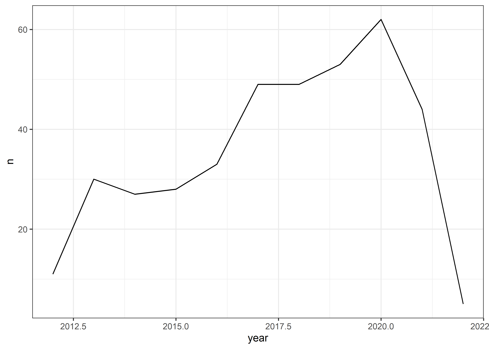
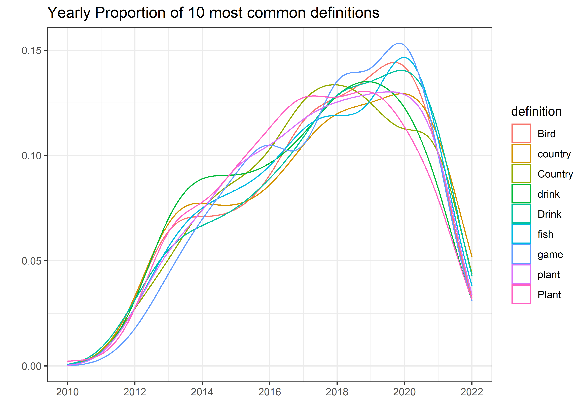
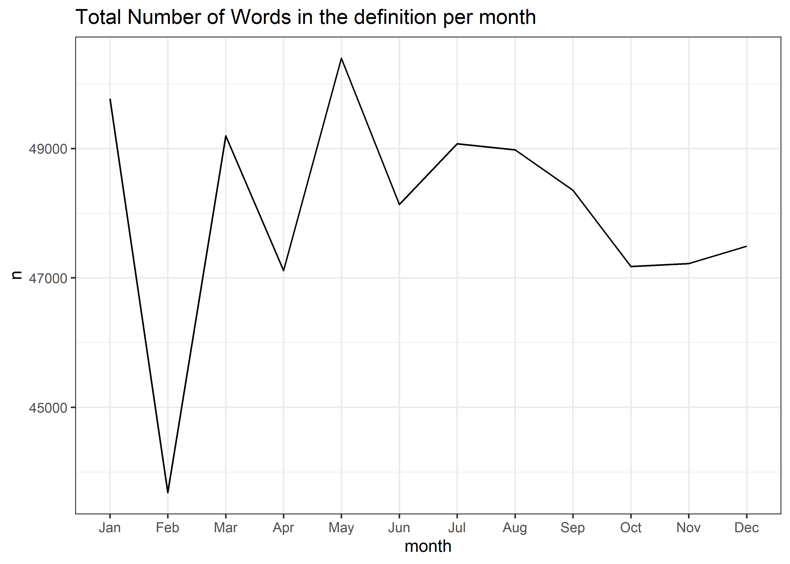
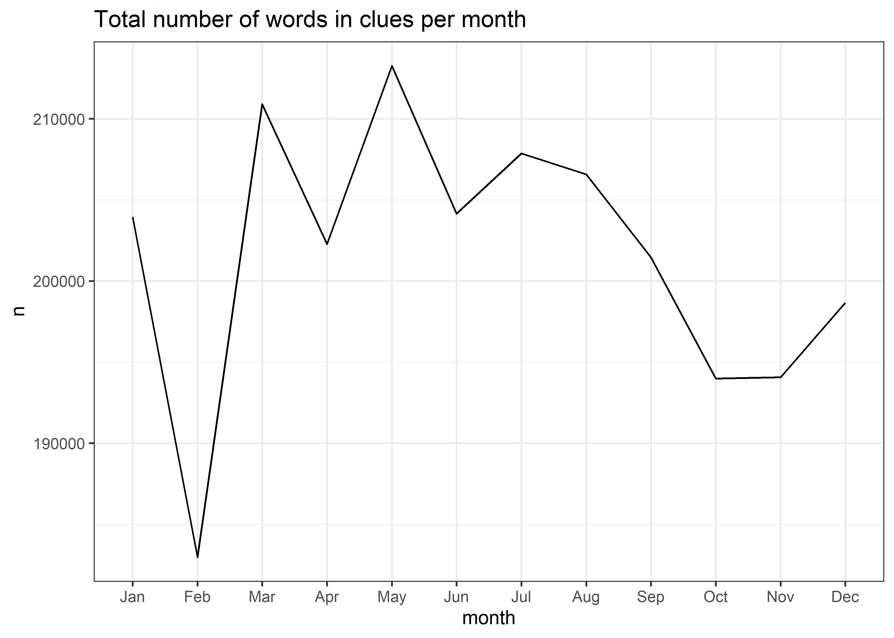
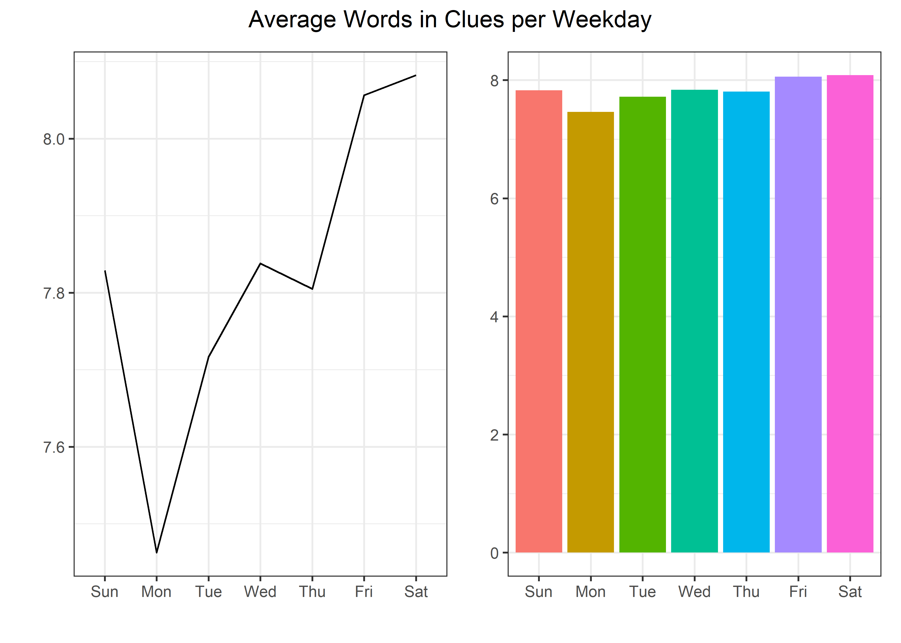

Crossword Puzzle
================
Matthew
4/18/2022

``` r
big_dave <- 
  read_csv('https://raw.githubusercontent.com/rfordatascience/tidytuesday/master/data/2022/2022-04-19/big_dave.csv')
```

    ## Rows: 214794 Columns: 9
    ## -- Column specification --------------------------------------------------------
    ## Delimiter: ","
    ## chr  (7): clue, answer, definition, clue_number, puzzle_name, source_url, so...
    ## dbl  (1): rowid
    ## date (1): puzzle_date
    ## 
    ## i Use `spec()` to retrieve the full column specification for this data.
    ## i Specify the column types or set `show_col_types = FALSE` to quiet this message.

``` r
times <- 
  read_csv('https://raw.githubusercontent.com/rfordatascience/tidytuesday/master/data/2022/2022-04-19/times.csv')
```

    ## Rows: 100661 Columns: 9
    ## -- Column specification --------------------------------------------------------
    ## Delimiter: ","
    ## chr  (7): clue, answer, definition, clue_number, puzzle_name, source_url, so...
    ## dbl  (1): rowid
    ## date (1): puzzle_date
    ## 
    ## i Use `spec()` to retrieve the full column specification for this data.
    ## i Specify the column types or set `show_col_types = FALSE` to quiet this message.

``` r
puzzles <- big_dave %>% 
  bind_rows(times)

rm(list = c("big_dave","times"))
```

# EDA

``` r
puzzles %>% 
  group_by(source) %>% 
  count(definition, sort = TRUE)
```

    ## # A tibble: 151,289 x 3
    ## # Groups:   source [2]
    ##    source          definition     n
    ##    <chr>           <chr>      <int>
    ##  1 bigdave44       <NA>       69595
    ##  2 times_xwd_times <NA>        3215
    ##  3 bigdave44       Bird         249
    ##  4 bigdave44       drink        202
    ##  5 bigdave44       game         194
    ##  6 bigdave44       Country      179
    ##  7 bigdave44       plant        176
    ##  8 bigdave44       Plant        163
    ##  9 bigdave44       country      160
    ## 10 bigdave44       fish         154
    ## # ... with 151,279 more rows

``` r
puzzles %>%
  group_by(source) %>% 
  count(puzzle_name, sort = TRUE)
```

    ## # A tibble: 10,781 x 3
    ## # Groups:   source [2]
    ##    source          puzzle_name                 n
    ##    <chr>           <chr>                   <int>
    ##  1 times_xwd_times Jumbo 1423                 90
    ##  2 times_xwd_times Saturday,                  86
    ##  3 times_xwd_times Times 27195                76
    ##  4 bigdave44       MPP – 061                  72
    ##  5 bigdave44       Double Toughie 100003      64
    ##  6 bigdave44       Toughie 2766               64
    ##  7 bigdave44       Double Toughie 100011      63
    ##  8 times_xwd_times Bank Holiday Jumbo 1326    62
    ##  9 times_xwd_times Jumbo 1197                 62
    ## 10 times_xwd_times Jumbo 1210                 62
    ## # ... with 10,771 more rows

``` r
puzzles %>% 
  group_by(source) %>% 
  count(clue_number, sort = TRUE)
```

    ## # A tibble: 1,194 x 3
    ## # Groups:   source [2]
    ##    source    clue_number     n
    ##    <chr>     <chr>       <int>
    ##  1 bigdave44 2d           7269
    ##  2 bigdave44 3d           7187
    ##  3 bigdave44 10a          6792
    ##  4 bigdave44 5d           6775
    ##  5 bigdave44 7d           6657
    ##  6 bigdave44 4d           6426
    ##  7 bigdave44 12a          6407
    ##  8 bigdave44 6d           6188
    ##  9 bigdave44 11a          5990
    ## 10 bigdave44 1a           5871
    ## # ... with 1,184 more rows

``` r
puzzles %>% 
  filter(!is.na(definition)) %>% 
  filter(definition == "Bird") %>% 
  group_by(year = year(puzzle_date)) %>% 
  summarize(n = n()) %>% 
  ggplot(aes(year, n)) + geom_line()
```

<!-- -->

``` r
puzzles %>% 
  filter(!is.na(definition)) %>% 
  filter(definition %in% pull(puzzles %>% count(definition, sort = TRUE) %>% head(10), definition)) %>% 
  group_by(year = year(puzzle_date), definition) %>% 
  ggplot(aes(year, color = definition)) + geom_density() +
  scale_x_continuous(breaks = seq(2010,2022,2)) +
  labs(title = "Yearly Proportion of 10 most common definitions", y = "", x = "")
```

<!-- -->

## Number of words per Month

``` r
puzzles %>% 
  unnest_tokens(word, definition) %>% 
  group_by(month = month(puzzle_date, label = TRUE)) %>% 
  summarize(n = n()) %>% 
  arrange(-n) %>% 
  ggplot(aes(month, n, group = 1)) + geom_line() +
  labs(title = "Total Number of Words in the definition per month")
```

<!-- -->

``` r
puzzles %>% 
  unnest_tokens(word, clue) %>% 
  group_by(month = month(puzzle_date, label = TRUE)) %>% 
  summarize(n = n()) %>% 
  ggplot(aes(month, n, group = 1)) + geom_line() +
  labs(title = "Total number of words in clues per month")
```

<!-- -->

## Number of words per Week

``` r
week_count <- puzzles %>%
  group_by(week = wday(puzzle_date, label = TRUE)) %>% 
  summarize(count = n())

p <- puzzles %>% 
  unnest_tokens(word, clue) %>% 
  group_by(week = wday(puzzle_date, label = TRUE)) %>% 
  summarize(n = n()) %>% 
  inner_join(week_count) %>% 
  ggplot(aes(week, n/count, group = 1)) + labs(y = "", x = "")
```

    ## Joining, by = "week"

``` r
(p + geom_line()) +
  (p + geom_col(aes(fill = week)) + scale_fill_discrete(guide = "none")) + 
  plot_annotation(title = "Average Words in Clues per Weekday",
                  theme = theme(plot.title = element_text(hjust = 0.5)))
```

<!-- -->
