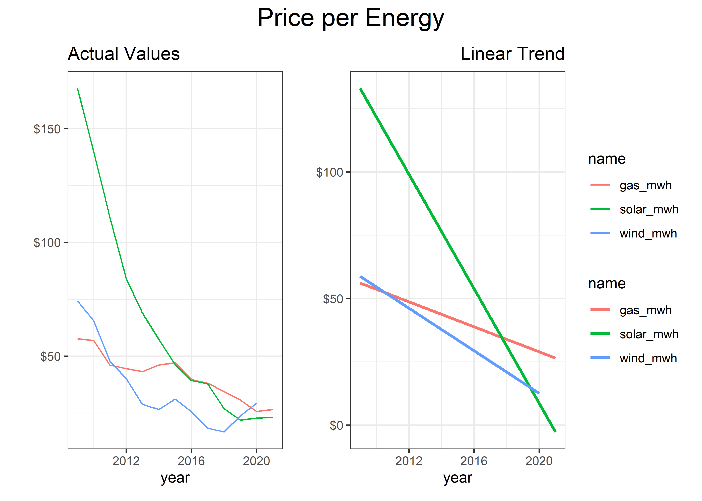

Solar and Wind
================
Matthew
5/3/2022

# EDA

``` r
(average_cost %>% 
  pivot_longer(-year) %>% 
  ggplot(aes(year, value, color = name)) + geom_line() +
  labs(y = "", title = "Actual Values") + scale_y_continuous(labels = scales::dollar)) +
(average_cost %>% 
  pivot_longer(-year) %>% 
  ggplot(aes(year, value, color = name)) + geom_smooth(method = "lm", se = FALSE) +
  labs(y = "", title = "Linear Trend") + scale_y_continuous(labels = scales::dollar) +
  theme(plot.title = element_text(hjust = 1))) +
  plot_layout(guides = 'collect') + 
  plot_annotation(title = "Price per Energy", 
                  theme = theme(plot.title = element_text(hjust = 0.5, size = 18)))
```

    ## `geom_smooth()` using formula 'y ~ x'

<!-- -->
