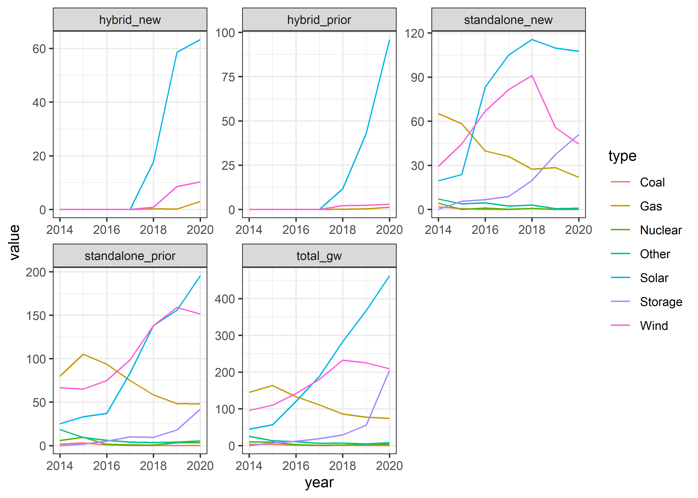
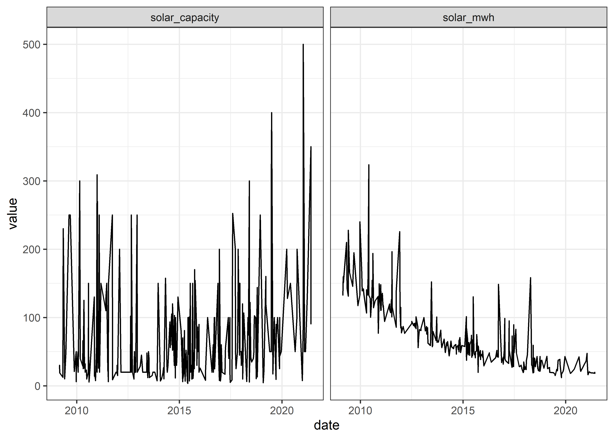
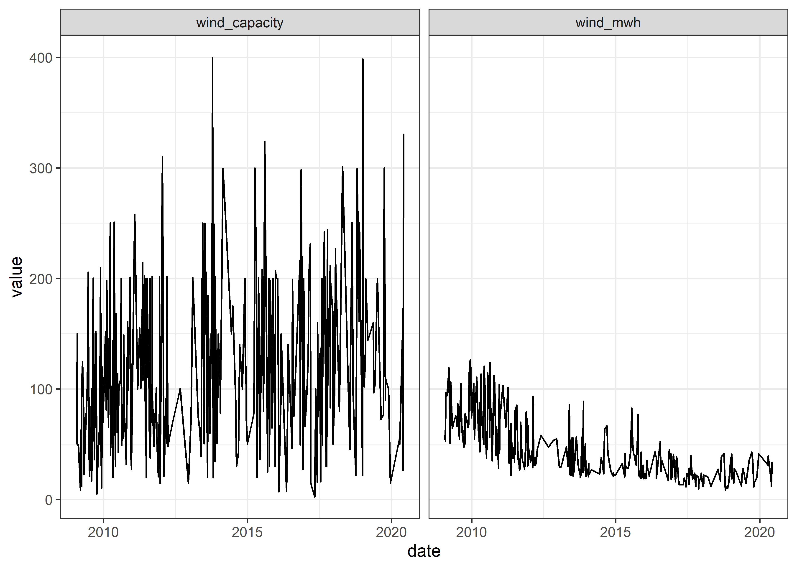

Solar and Wind
================
Matthew
5/3/2022

# EDA

``` r
(average_cost %>% 
  pivot_longer(-year) %>% 
  ggplot(aes(year, value, color = name)) + geom_line() +
  labs(y = "", title = "Actual Values") + scale_y_continuous(labels = scales::dollar)) +
(average_cost %>% 
  pivot_longer(-year) %>% 
  ggplot(aes(year, value, color = name)) + geom_smooth(method = "lm", se = FALSE) +
  labs(y = "", title = "Linear Trend") + scale_y_continuous(labels = scales::dollar) +
  theme(plot.title = element_text(hjust = 1))) +
  plot_layout(guides = 'collect') + 
  plot_annotation(title = "Price per Energy", 
                  theme = theme(plot.title = element_text(hjust = 0.5, size = 18)))
```

    ## `geom_smooth()` using formula 'y ~ x'

<!-- -->

``` r
average_cost %>% 
  pivot_longer(-year) %>% 
  nest(-name) %>% 
  mutate(model = map(data, ~ lm(value ~ year, .)),
         tidy = map(model, broom::tidy)) %>% 
  unnest(tidy) %>% 
  filter(term == "year") %>% 
  arrange(-abs(estimate))
```

    ## # A tibble: 3 x 8
    ##   name      data              model  term  estimate std.error statistic  p.value
    ##   <chr>     <list>            <list> <chr>    <dbl>     <dbl>     <dbl>    <dbl>
    ## 1 solar_mwh <tibble [13 x 2]> <lm>   year    -11.3      1.41      -8.05  6.17e-6
    ## 2 wind_mwh  <tibble [13 x 2]> <lm>   year     -4.20     0.885     -4.75  7.77e-4
    ## 3 gas_mwh   <tibble [13 x 2]> <lm>   year     -2.47     0.246    -10.1   7.02e-7

``` r
capacity %>% 
  pivot_longer(-c(type, year)) %>% 
  ggplot(aes(year, value, color = type)) + geom_line() +
  facet_wrap(~name, scales = "free")
```

<!-- -->

``` r
solar %>% 
  pivot_longer(-date) %>% 
  ggplot(aes(date, value)) + geom_line() +
  facet_wrap(~name)
```

<!-- -->

``` r
wind %>% 
  pivot_longer(-date) %>% 
  ggplot(aes(date, value)) + geom_line() +
  facet_wrap(~name)
```

<!-- -->

``` r
wind %>% 
  select(date, wind_capacity) %>% 
  summarize(diff = diff(date)) %>% 
  count(diff) %>% 
  arrange(-n)
```

    ## # A tibble: 58 x 2
    ##    diff        n
    ##    <drtn>  <int>
    ##  1  0 days    60
    ##  2  1 days    22
    ##  3  7 days    19
    ##  4  2 days    15
    ##  5  5 days    15
    ##  6  8 days    15
    ##  7  4 days    13
    ##  8 14 days    13
    ##  9  3 days    11
    ## 10 12 days    11
    ## # ... with 48 more rows
