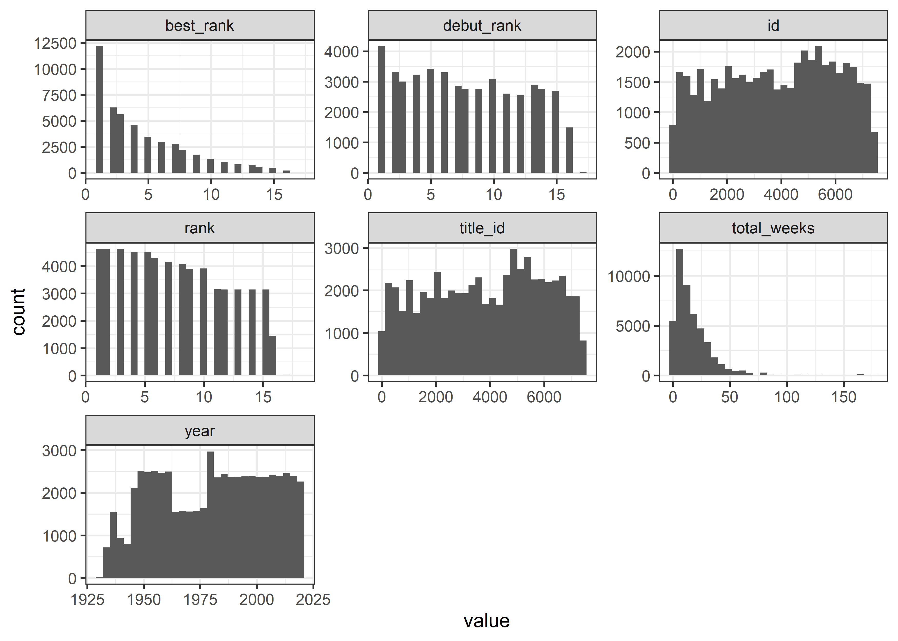
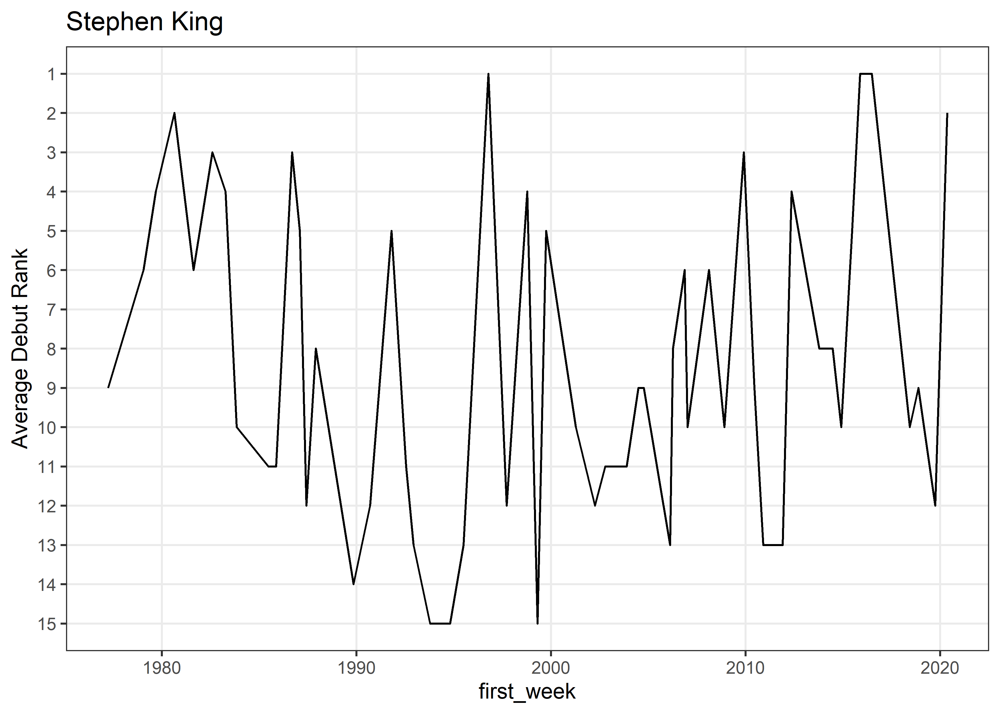
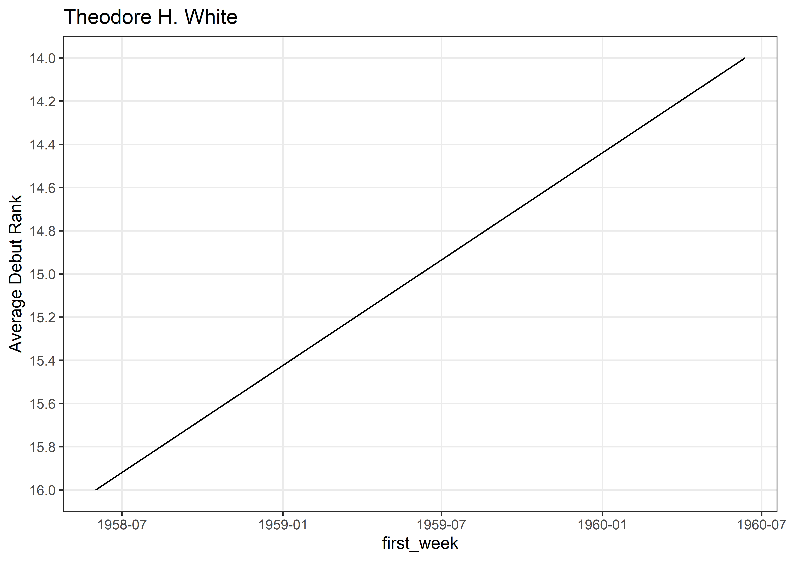
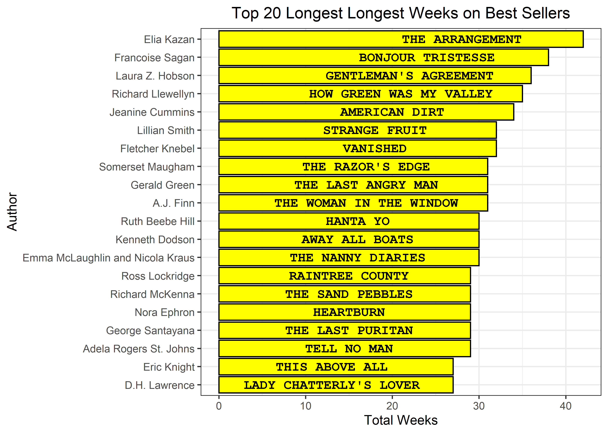

NY Times Best Sellers
================
Matthew
5/10/2022

``` r
nyt_titles <- read_tsv('https://raw.githubusercontent.com/rfordatascience/tidytuesday/master/data/2022/2022-05-10/nyt_titles.tsv')
```

    ## Rows: 7431 Columns: 8
    ## -- Column specification --------------------------------------------------------
    ## Delimiter: "\t"
    ## chr  (2): title, author
    ## dbl  (5): id, year, total_weeks, debut_rank, best_rank
    ## date (1): first_week
    ## 
    ## i Use `spec()` to retrieve the full column specification for this data.
    ## i Specify the column types or set `show_col_types = FALSE` to quiet this message.

``` r
nyt_full <- read_tsv('https://raw.githubusercontent.com/rfordatascience/tidytuesday/master/data/2022/2022-05-10/nyt_full.tsv')
```

    ## Rows: 60386 Columns: 6
    ## -- Column specification --------------------------------------------------------
    ## Delimiter: "\t"
    ## chr  (2): title, author
    ## dbl  (3): year, rank, title_id
    ## date (1): week
    ## 
    ## i Use `spec()` to retrieve the full column specification for this data.
    ## i Specify the column types or set `show_col_types = FALSE` to quiet this message.

``` r
nyt <- nyt_titles %>% 
  full_join(nyt_full)
```

    ## Joining, by = c("title", "author", "year")

``` r
nyt %>% 
  keep(is.numeric) %>% 
  gather() %>% 
  ggplot(aes(value)) + geom_histogram() + facet_wrap(~key, scales = "free")
```

    ## `stat_bin()` using `bins = 30`. Pick better value with `binwidth`.

<!-- -->

``` r
nyt %>% 
  count(author, sort = TRUE)
```

    ## # A tibble: 2,206 x 2
    ##    author                 n
    ##    <chr>              <int>
    ##  1 Danielle Steel       957
    ##  2 Stephen King         892
    ##  3 John Grisham         789
    ##  4 Taylor Caldwell      524
    ##  5 James A. Michener    494
    ##  6 Robert Ludlum        406
    ##  7 Leon Uris            405
    ##  8 Mary Higgins Clark   403
    ##  9 David Baldacci       396
    ## 10 Nicholas Sparks      390
    ## # ... with 2,196 more rows

``` r
p_authors <- nyt %>% 
  group_by(author) %>% 
  distinct(title) %>% 
  summarize(n = n()) %>% 
  arrange(-n) %>% 
  pull(author)

nyt %>% 
  filter(author %in% head(p_authors,10)) %>% 
  group_by(author) %>% 
  ggplot(aes(rank, fct_reorder(author, rank, median, .desc = TRUE))) +
  geom_boxplot() + scale_x_reverse(breaks = seq(1:20)) +
  labs(y = "", title = "Top 10 most prolific authors") +
  theme(panel.grid.minor = element_blank())
```

<!-- -->

``` r
gplot <- function(x) {
  nyt_titles %>% 
    filter(author == {{x}}) %>% 
    group_by(first_week) %>% 
    summarize(m = mean(debut_rank, na.rm = TRUE)) %>% 
    ggplot(aes(first_week, m)) + geom_line() +
    scale_y_reverse(breaks = pretty_breaks(12)) +
    labs(y = "Average Debut Rank", title = {{x}}) +
    theme(panel.grid.minor = element_blank())
}
gplot("Stephen King")
```

<!-- -->

``` r
mult_author <- nyt_titles %>% 
  group_by(author) %>% 
  distinct(first_week) %>% 
  summarize(n = n()) %>% 
  filter(n > 1) %>% 
  pull(author)

nyt_titles %>% 
  filter(author %in% mult_author) %>% 
  group_by(author) %>% 
  summarize(m = mean(debut_rank)) %>% 
  arrange(-m) 
```

    ## # A tibble: 979 x 2
    ##    author                       m
    ##    <chr>                    <dbl>
    ##  1 "Romain Gary"             16  
    ##  2 "\"Miss Read\""           15.5
    ##  3 "May Sarton"              15.5
    ##  4 "B.J. Chute"              15  
    ##  5 "C.Y. Lee"                15  
    ##  6 "Christina Baker Kline"   15  
    ##  7 "Hamilton Basso"          15  
    ##  8 "Katherine Wigmore Eyre"  15  
    ##  9 "Richard Powell"          15  
    ## 10 "Theodore H. White"       15  
    ## # ... with 969 more rows

``` r
gplot("Richard Powell")
```

<!-- -->

``` r
gplot("Theodore H. White")
```

<!-- -->

``` r
nyt_titles %>% 
  inner_join((nyt_titles %>% 
    group_by(author) %>% 
    distinct(title) %>% 
    summarize(num_titles = n())), by = "author") %>% 
  filter(author != "Danielle Steel") %>% 
  group_by(num_titles) %>% 
  summarize(m = mean(debut_rank)) %>% 
  ggplot(aes(num_titles, m)) + geom_point() +
  geom_smooth(method = "lm", se = FALSE)
```

    ## `geom_smooth()` using formula 'y ~ x'

<!-- -->

``` r
nyt_titles %>% 
  group_by(author) %>% 
  distinct(title) %>% 
  summarize(n = n()) %>% 
  arrange(-n) %>% 
  head(20) %>% 
  ggplot(aes(n, fct_reorder(author, n), fill = author)) + geom_col() +
  scale_x_continuous(breaks = pretty_breaks(10)) +
  theme(legend.position = "none", panel.grid.minor = element_blank(),
        plot.title = element_text(hjust = 0.5)) +
  labs(y = "", title = "Number of Published Titles")
```

<!-- -->

``` r
nyt_titles %>% 
  filter(author == "Danielle Steel") %>% 
  distinct(title)
```

    ## # A tibble: 116 x 1
    ##    title          
    ##    <chr>          
    ##  1 CHILD'S PLAY   
    ##  2 COMING OUT     
    ##  3 COUNTRY        
    ##  4 CROSSINGS      
    ##  5 A GOOD WOMAN   
    ##  6 DADDY          
    ##  7 DADDY'S GIRLS  
    ##  8 DANGEROUS GAMES
    ##  9 DATING GAME    
    ## 10 ECHOES         
    ## # ... with 106 more rows

``` r
nyt_titles %>% 
  filter(author == "Danielle Steel") %>% 
  group_by(title) %>% 
  summarize(m = mean(debut_rank)) %>% 
  count(m) %>% 
  ggplot(aes(n, fct_rev(factor(m)))) + geom_col() +
  scale_x_continuous(breaks = pretty_breaks(8)) +
  theme(panel.grid.minor = element_blank()) +
  labs(y = "Debut Rank", x = "Number of Titles", 
       title = "Danielle Steel's Debut Rankings")
```

<!-- -->

``` r
nyt %>% 
  group_by(author) %>% 
  summarize(total_weeks = max(total_weeks)) %>% 
  arrange(-total_weeks) %>% 
  head(20) %>% 
  inner_join((nyt %>% select(total_weeks, author, title)), by = c("total_weeks", "author")) %>% 
  distinct(author, total_weeks, title) %>% 
  ggplot(aes(total_weeks, fct_reorder(author, total_weeks), label = title)) + 
  geom_col(fill = "yellow", color = "black") + 
  geom_text(aes(family = "mono", fontface = "bold"), nudge_x = -14) +
  labs(y = "Author", x = "Total Weeks", title = "Top 20 Longest Longest Weeks on Best Sellers") +
  theme(legend.position = "none", plot.title = element_text(hjust = 0.5))
```

<!-- -->
