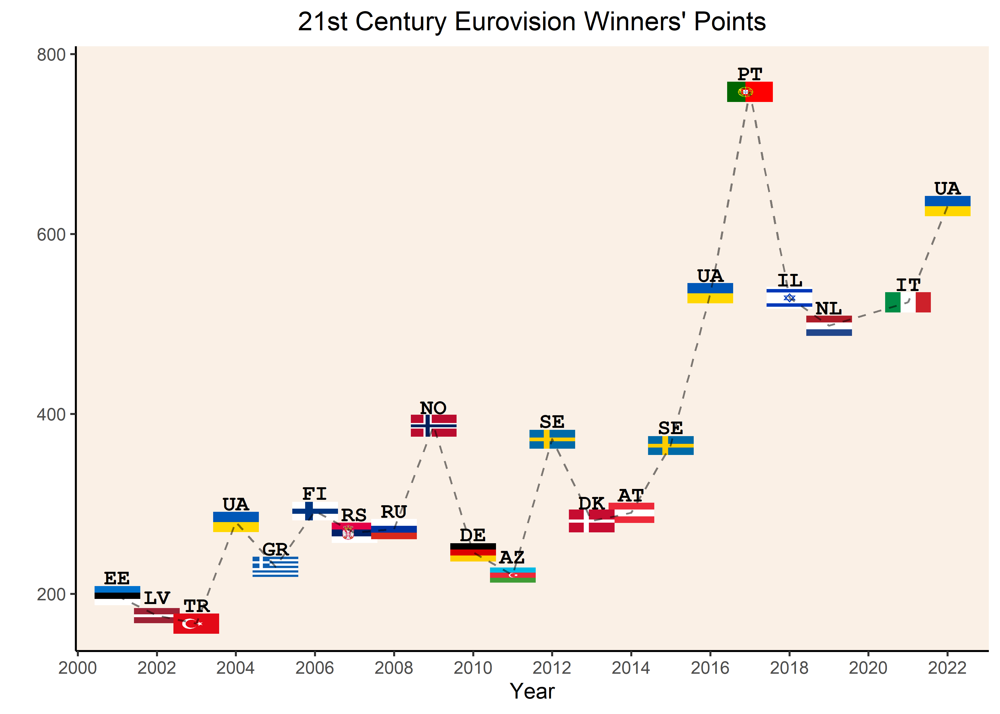

Eurovision
================
Matthew
5/16/2022

``` r
eurovision <- read_csv('https://raw.githubusercontent.com/rfordatascience/tidytuesday/master/data/2022/2022-05-17/eurovision.csv')
```

    ## Rows: 2005 Columns: 18
    ## -- Column specification --------------------------------------------------------
    ## Delimiter: ","
    ## chr (12): event, host_city, host_country, event_url, section, artist, song, ...
    ## dbl  (4): year, running_order, total_points, rank
    ## lgl  (2): qualified, winner
    ## 
    ## i Use `spec()` to retrieve the full column specification for this data.
    ## i Specify the column types or set `show_col_types = FALSE` to quiet this message.

``` r
head(eurovision)
```

    ## # A tibble: 6 x 18
    ##   event   host_city  year host_country event_url section artist song  artist_url
    ##   <chr>   <chr>     <dbl> <chr>        <chr>     <chr>   <chr>  <chr> <chr>     
    ## 1 Turin ~ Turin      2022 Italy        https://~ first-~ Kalus~ Stef~ https://e~
    ## 2 Turin ~ Turin      2022 Italy        https://~ first-~ S10    De D~ https://e~
    ## 3 Turin ~ Turin      2022 Italy        https://~ first-~ Amand~ Die ~ https://e~
    ## 4 Turin ~ Turin      2022 Italy        https://~ first-~ MARO   Saud~ https://e~
    ## 5 Turin ~ Turin      2022 Italy        https://~ first-~ Intel~ Inte~ https://e~
    ## 6 Turin ~ Turin      2022 Italy        https://~ first-~ LPS    Disko https://e~
    ## # ... with 9 more variables: image_url <chr>, artist_country <chr>,
    ## #   country_emoji <chr>, running_order <dbl>, total_points <dbl>, rank <dbl>,
    ## #   rank_ordinal <chr>, qualified <lgl>, winner <lgl>

``` r
eurovision <- eurovision %>% 
  select(!contains("url"))

skimr::skim(eurovision)
```

|                                                  |            |
|:-------------------------------------------------|:-----------|
| Name                                             | eurovision |
| Number of rows                                   | 2005       |
| Number of columns                                | 15         |
| \_\_\_\_\_\_\_\_\_\_\_\_\_\_\_\_\_\_\_\_\_\_\_   |            |
| Column type frequency:                           |            |
| character                                        | 9          |
| logical                                          | 2          |
| numeric                                          | 4          |
| \_\_\_\_\_\_\_\_\_\_\_\_\_\_\_\_\_\_\_\_\_\_\_\_ |            |
| Group variables                                  | None       |

Data summary

**Variable type: character**

| skim\_variable  | n\_missing | complete\_rate | min | max | empty | n\_unique | whitespace |
|:----------------|-----------:|---------------:|----:|----:|------:|----------:|-----------:|
| event           |          0 |           1.00 |   9 |  15 |     0 |        67 |          0 |
| host\_city      |          0 |           1.00 |   4 |  10 |     0 |        44 |          0 |
| host\_country   |          0 |           1.00 |   5 |  14 |     0 |        26 |          0 |
| section         |          0 |           1.00 |   5 |  17 |     0 |         5 |          0 |
| artist          |          0 |           1.00 |   2 |  84 |     0 |      1556 |          0 |
| song            |          1 |           1.00 |   2 |  64 |     0 |      1645 |          0 |
| artist\_country |          0 |           1.00 |   5 |  20 |     0 |        52 |          0 |
| country\_emoji  |          0 |           1.00 |   9 |  14 |     0 |        51 |          0 |
| rank\_ordinal   |         41 |           0.98 |   3 |   4 |     0 |        28 |          0 |

**Variable type: logical**

| skim\_variable | n\_missing | complete\_rate | mean | count               |
|:---------------|-----------:|---------------:|-----:|:--------------------|
| qualified      |          0 |              1 | 0.16 | FAL: 1685, TRU: 320 |
| winner         |          0 |              1 | 0.14 | FAL: 1716, TRU: 289 |

**Variable type: numeric**

| skim\_variable | n\_missing | complete\_rate |    mean |    sd |   p0 |     p25 |    p50 |  p75 | p100 | hist  |
|:---------------|-----------:|---------------:|--------:|------:|-----:|--------:|-------:|-----:|-----:|:------|
| year           |          0 |           1.00 | 1999.01 | 18.38 | 1956 | 1986.00 | 2005.0 | 2014 | 2022 | ▂▂▃▅▇ |
| running\_order |          5 |           1.00 |   10.91 |  6.43 |    1 |    5.75 |   10.5 |   16 |   28 | ▇▆▇▃▁ |
| total\_points  |         92 |           0.95 |   81.53 | 81.97 |    0 |   23.00 |   61.0 |  111 |  758 | ▇▁▁▁▁ |
| rank           |         41 |           0.98 |   10.82 |  6.46 |    1 |    5.00 |   10.0 |   16 |   28 | ▇▆▇▃▁ |

# EDA

``` r
eurovision %>% 
  group_by(artist_country) %>% 
  summarize(total_first = sum(rank == 1, na.rm = TRUE)) %>% 
  arrange(-total_first)
```

    ## # A tibble: 52 x 2
    ##    artist_country total_first
    ##    <chr>                <int>
    ##  1 Sweden                  10
    ##  2 Ireland                  7
    ##  3 Netherlands              7
    ##  4 France                   5
    ##  5 Israel                   5
    ##  6 Luxembourg               5
    ##  7 Norway                   5
    ##  8 Ukraine                  5
    ##  9 United Kingdom           5
    ## 10 Denmark                  4
    ## # ... with 42 more rows

``` r
eurovision %>% 
  group_by(artist_country) %>% 
  summarize(total_wins = sum(winner)) %>% 
  arrange(-total_wins)
```

    ## # A tibble: 52 x 2
    ##    artist_country total_wins
    ##    <chr>               <int>
    ##  1 Sweden                 13
    ##  2 Ukraine                13
    ##  3 Ireland                12
    ##  4 Denmark                10
    ##  5 Greece                 10
    ##  6 Israel                 10
    ##  7 Norway                 10
    ##  8 Russia                 10
    ##  9 Azerbaijan              9
    ## 10 Netherlands             9
    ## # ... with 42 more rows

``` r
eurovision %>% 
  group_by(artist_country) %>% 
  summarize(mean_rank = mean(rank, na.rm = TRUE)) %>% 
  arrange(mean_rank)
```

    ## # A tibble: 52 x 2
    ##    artist_country      mean_rank
    ##    <chr>                   <dbl>
    ##  1 Ukraine                  6.63
    ##  2 Russia                   6.65
    ##  3 Italy                    7.17
    ##  4 Australia                7.33
    ##  5 Sweden                   7.59
    ##  6 Azerbaijan               8.15
    ##  7 Serbia & Montenegro      8.5 
    ##  8 Luxembourg               8.82
    ##  9 Armenia                  8.92
    ## 10 Serbia                   9   
    ## # ... with 42 more rows

``` r
eurovision %>% 
  filter(winner == TRUE) %>% 
  distinct(artist_country, year) %>% 
  count(artist_country, sort = TRUE)
```

    ## # A tibble: 49 x 2
    ##    artist_country     n
    ##    <chr>          <int>
    ##  1 Ireland           12
    ##  2 Sweden            11
    ##  3 Ukraine           11
    ##  4 Greece            10
    ##  5 Israel            10
    ##  6 Denmark            9
    ##  7 Netherlands        9
    ##  8 Norway             9
    ##  9 Romania            9
    ## 10 Russia             9
    ## # ... with 39 more rows

``` r
eurovision %>% 
  filter(artist_country == "Greece" & winner == TRUE) %>% 
  View

eurovision %>% 
  arrange(-year, -total_points) %>% 
  select(artist_country, total_points, year, winner) %>% 
  View
```

``` r
eurovision %>% 
  count(artist, sort = TRUE) %>% 
  inner_join(eurovision %>% 
               distinct(artist_country, artist) %>% 
               select(artist, artist_country)) %>% 
  arrange(-n, artist_country)
```

    ## Joining, by = "artist"

    ## # A tibble: 1,571 x 3
    ##    artist                n artist_country
    ##    <chr>             <int> <chr>         
    ##  1 Fud Leclerc           4 Belgium       
    ##  2 Sakis Rouvas          4 Greece        
    ##  3 Jedward               4 Ireland       
    ##  4 Donny Montell         4 Lithuania     
    ##  5 Chiara                4 Malta         
    ##  6 Alexander Rybak       4 Norway        
    ##  7 Dima Bilan            4 Russia        
    ##  8 Sergey Lazarev        4 Russia        
    ##  9 Valentina Monetta     4 San Marino    
    ## 10 Lys Assia             4 Switzerland   
    ## # ... with 1,561 more rows

``` r
eurovision %>% 
  filter(rank == parse_number(rank_ordinal))
```

    ## # A tibble: 1,964 x 15
    ##    event      host_city  year host_country section   artist song  artist_country
    ##    <chr>      <chr>     <dbl> <chr>        <chr>     <chr>  <chr> <chr>         
    ##  1 Turin 2022 Turin      2022 Italy        first-se~ Kalus~ Stef~ Ukraine       
    ##  2 Turin 2022 Turin      2022 Italy        first-se~ S10    De D~ Netherlands   
    ##  3 Turin 2022 Turin      2022 Italy        first-se~ Amand~ Die ~ Greece        
    ##  4 Turin 2022 Turin      2022 Italy        first-se~ MARO   Saud~ Portugal      
    ##  5 Turin 2022 Turin      2022 Italy        first-se~ Intel~ Inte~ Bulgaria      
    ##  6 Turin 2022 Turin      2022 Italy        first-se~ LPS    Disko Slovenia      
    ##  7 Turin 2022 Turin      2022 Italy        first-se~ Rosa ~ Snap  Armenia       
    ##  8 Turin 2022 Turin      2022 Italy        first-se~ Subwo~ Give~ Norway        
    ##  9 Turin 2022 Turin      2022 Italy        first-se~ Monik~ Sent~ Lithuania     
    ## 10 Turin 2022 Turin      2022 Italy        first-se~ Zdob ~ Tren~ Moldova       
    ## # ... with 1,954 more rows, and 7 more variables: country_emoji <chr>,
    ## #   running_order <dbl>, total_points <dbl>, rank <dbl>, rank_ordinal <chr>,
    ## #   qualified <lgl>, winner <lgl>

``` r
eurovision %>% 
  filter(is.na(rank_ordinal))
```

    ## # A tibble: 41 x 15
    ##    event        host_city  year host_country section artist song  artist_country
    ##    <chr>        <chr>     <dbl> <chr>        <chr>   <chr>  <chr> <chr>         
    ##  1 Rotterdam 2~ Rotterdam  2020 Netherlands  first-~ Ana S~ Voda  Slovenia      
    ##  2 Rotterdam 2~ Rotterdam  2020 Netherlands  first-~ Ulrik~ Atte~ Norway        
    ##  3 Rotterdam 2~ Rotterdam  2020 Netherlands  first-~ Eden ~ Feke~ Israel        
    ##  4 Rotterdam 2~ Rotterdam  2020 Netherlands  first-~ Sandro Runn~ Cyprus        
    ##  5 Rotterdam 2~ Rotterdam  2020 Netherlands  first-~ Efendi Cleo~ Azerbaijan    
    ##  6 Rotterdam 2~ Rotterdam  2020 Netherlands  first-~ Go_A   Solo~ Ukraine       
    ##  7 Rotterdam 2~ Rotterdam  2020 Netherlands  first-~ Hoove~ Rele~ Belgium       
    ##  8 Rotterdam 2~ Rotterdam  2020 Netherlands  first-~ Littl~ Uno   Russia        
    ##  9 Rotterdam 2~ Rotterdam  2020 Netherlands  first-~ Vasil  YOU   North Macedon~
    ## 10 Rotterdam 2~ Rotterdam  2020 Netherlands  first-~ The R~ On F~ Lithuania     
    ## # ... with 31 more rows, and 7 more variables: country_emoji <chr>,
    ## #   running_order <dbl>, total_points <dbl>, rank <dbl>, rank_ordinal <chr>,
    ## #   qualified <lgl>, winner <lgl>

``` r
eurotidy <- eurovision %>% 
  select(year, total_points, artist_country) %>% 
  nest(-artist_country) %>% 
  mutate(model = map(data, ~ lm(total_points ~ year,.)),
         tidy = map(model, broom::tidy)) %>% 
  unnest(tidy) %>% 
  filter(term == "year") %>% 
  arrange(-abs(estimate))

x <- eurotidy %>% 
  head(10) %>% 
  pull(artist_country)

eurovision %>% 
  filter(artist_country %in% x) %>% 
  ggplot(aes(year, total_points)) + geom_line() + geom_smooth(method = "lm", se = FALSE) +
  geom_point() +
  facet_wrap(~artist_country)
```

    ## `geom_smooth()` using formula 'y ~ x'

<!-- -->

``` r
(euro_summary <-  eurovision %>% 
  group_by(artist_country) %>% 
  summarize(diff = total_points[year == max(year)] - total_points[year == min(year)]) %>% 
  arrange(-abs(diff)))
```

    ## `summarise()` has grouped output by 'artist_country'. You can override using
    ## the `.groups` argument.

    ## # A tibble: 81 x 2
    ## # Groups:   artist_country [52]
    ##    artist_country  diff
    ##    <chr>          <dbl>
    ##  1 Ukraine          601
    ##  2 United Kingdom   460
    ##  3 Spain            451
    ##  4 Sweden           428
    ##  5 Sweden           386
    ##  6 Ukraine          307
    ##  7 Czech Republic   226
    ##  8 Greece           208
    ##  9 Estonia          207
    ## 10 Greece           204
    ## # ... with 71 more rows

``` r
y <- euro_summary %>% 
  head(10) %>% 
  pull(artist_country)

eurovision %>% 
  filter(artist_country %in% y) %>% 
  ggplot(aes(year, total_points)) + geom_line() + geom_smooth(method = "lm", se = FALSE) +
  geom_point() + 
  facet_wrap(~artist_country)
```

    ## `geom_smooth()` using formula 'y ~ x'

<!-- -->
