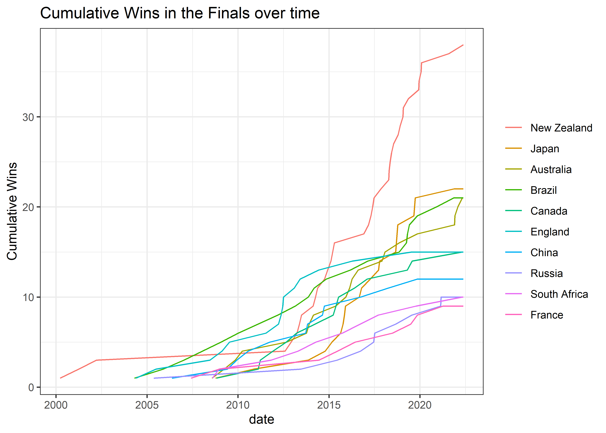

Women’s Rugby
================
Matthew Hondrakis
2022-05-24

``` r
sevens <- readr::read_csv('https://raw.githubusercontent.com/rfordatascience/tidytuesday/master/data/2022/2022-05-24/sevens.csv')
```

    ## Rows: 7966 Columns: 16
    ## -- Column specification --------------------------------------------------------
    ## Delimiter: ","
    ## chr  (10): team_1, score_1, score_2, team_2, venue, tournament, stage, winne...
    ## dbl   (5): row_id, t1_game_no, t2_game_no, series, margin
    ## date  (1): date
    ## 
    ## i Use `spec()` to retrieve the full column specification for this data.
    ## i Specify the column types or set `show_col_types = FALSE` to quiet this message.

``` r
fifteens <- readr::read_csv('https://raw.githubusercontent.com/rfordatascience/tidytuesday/master/data/2022/2022-05-24/fifteens.csv')
```

    ## Rows: 1468 Columns: 15
    ## -- Column specification --------------------------------------------------------
    ## Delimiter: ","
    ## chr  (7): team_1, team_2, venue, tournament, home_away_win, winner, loser
    ## dbl  (7): test_no, score_1, score_2, home_test_no, away_test_no, series_no, ...
    ## date (1): date
    ## 
    ## i Use `spec()` to retrieve the full column specification for this data.
    ## i Specify the column types or set `show_col_types = FALSE` to quiet this message.

``` r
which(is.na(sevens$row_id))
```

    ## [1]    1 3990

``` r
sevens$row_id[1] <- 1
sevens$row_id[3990] <- 3990

sevens %>% 
  pivot_longer(starts_with("team")) %>% 
  select(row_id, name, value, winner, loser)
```

    ## # A tibble: 15,932 x 5
    ##    row_id name   value                  winner                 loser      
    ##     <dbl> <chr>  <chr>                  <chr>                  <chr>      
    ##  1      1 team_1 New Zealand Wild Ducks New Zealand Wild Ducks Japan      
    ##  2      1 team_2 Japan                  New Zealand Wild Ducks Japan      
    ##  3      2 team_1 England                England                Australia  
    ##  4      2 team_2 Australia              England                Australia  
    ##  5      3 team_1 Canada                 Canada                 Netherlands
    ##  6      3 team_2 Netherlands            Canada                 Netherlands
    ##  7      4 team_1 Hong Kong              Hong Kong              Fiji       
    ##  8      4 team_2 Fiji                   Hong Kong              Fiji       
    ##  9      5 team_1 United States          United States          Scotland   
    ## 10      5 team_2 Scotland               United States          Scotland   
    ## # ... with 15,922 more rows

``` r
gplot <- function(data, x, y = 10){
  data %>% 
    count({{x}}, sort = TRUE) %>% 
    head({{y}}) %>% 
    ggplot(aes(n, fct_reorder({{x}}, n))) + geom_col()
}

gplot(sevens, winner) + labs(y = "", title = "Sevens") +
gplot(fifteens, winner) + labs(y = "", title = "Fifteens") + 
  plot_annotation(title = "Top 10 Counts of Wins", 
                  theme = theme(plot.title = element_text(hjust = 0.5))) 
```

<!-- -->

``` r
sevens %>% 
  count(stage, sort = TRUE)
```

    ## # A tibble: 126 x 2
    ##    stage                        n
    ##    <chr>                    <int>
    ##  1 Pool B                    1199
    ##  2 Pool A                    1187
    ##  3 Pool C                     660
    ##  4 Quarter-Final              495
    ##  5 Pool                       486
    ##  6 Semi-Final                 479
    ##  7 Group Stage                337
    ##  8 Final                      300
    ##  9 5th-8th Place Semi Final   245
    ## 10 Group B                    230
    ## # ... with 116 more rows

``` r
gplot(sevens %>% filter(stage == "Final"), winner) + 
  labs(title = "Number of Finals Won", y = "") +
  theme(plot.title = element_text(hjust = 0.5))
```

<!-- -->

``` r
sevens %>% 
  filter(stage == "Final") %>% 
  filter(winner %in% (sevens %>% 
           filter(stage == "Final") %>% 
           count(winner, sort = TRUE) %>% 
           head(10) %>% 
           pull(winner))) %>% 
  arrange(date) %>% 
  group_by(winner) %>% 
  mutate(c = 1, counter = cumsum(c)) %>% 
  ggplot(aes(date, counter, 
             color = fct_reorder(winner, counter, max, .desc = TRUE))) +
  geom_line() + labs(y = "Cumulative Wins", 
                     title = "Cumulative Wins in the Finals over time",
                     color = "")
```

<!-- -->
