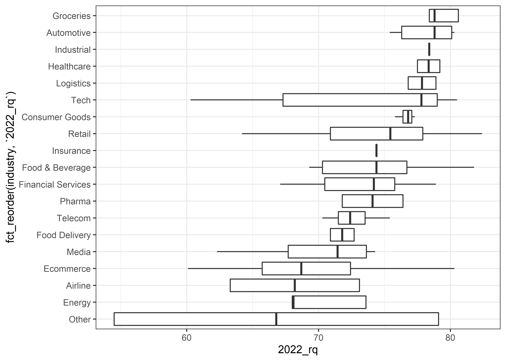
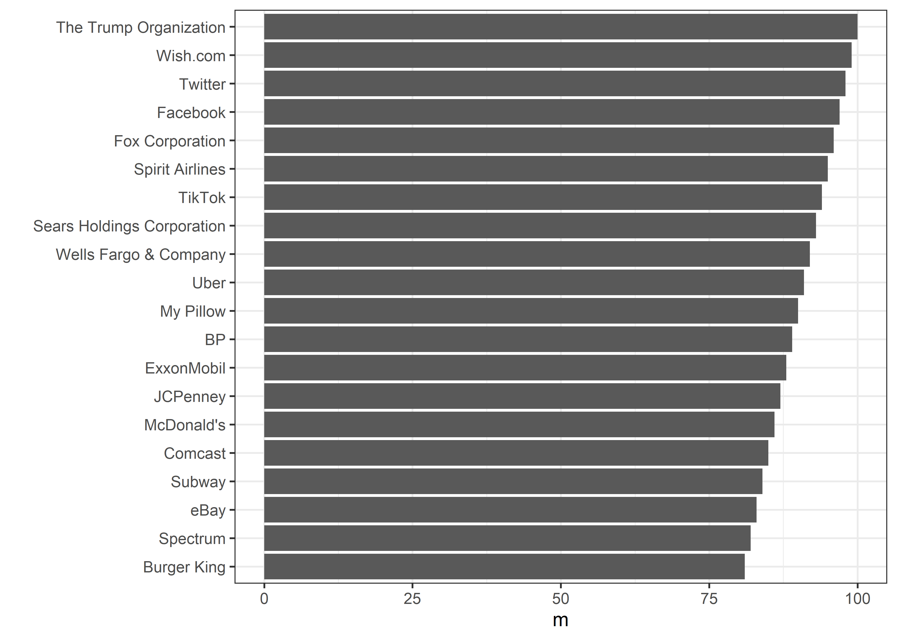
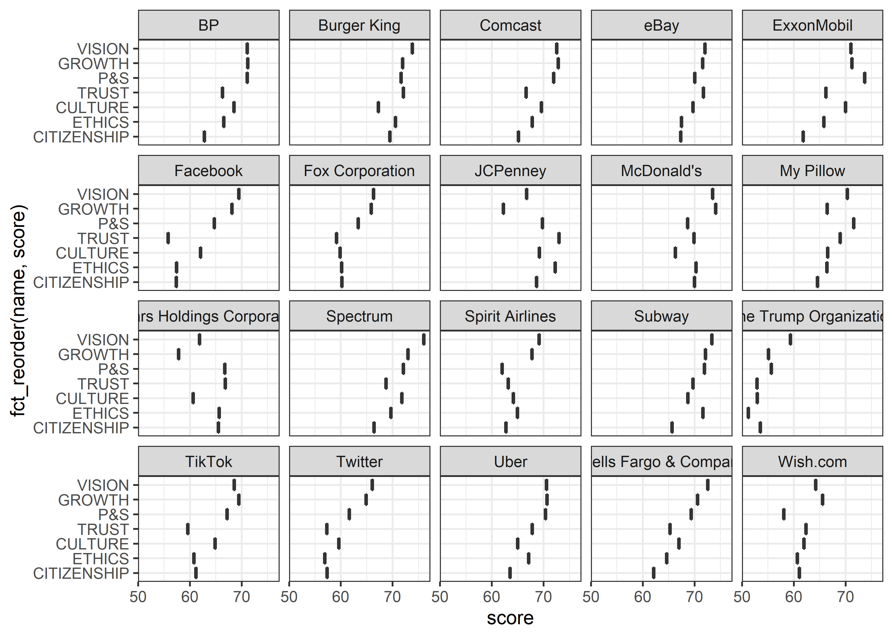
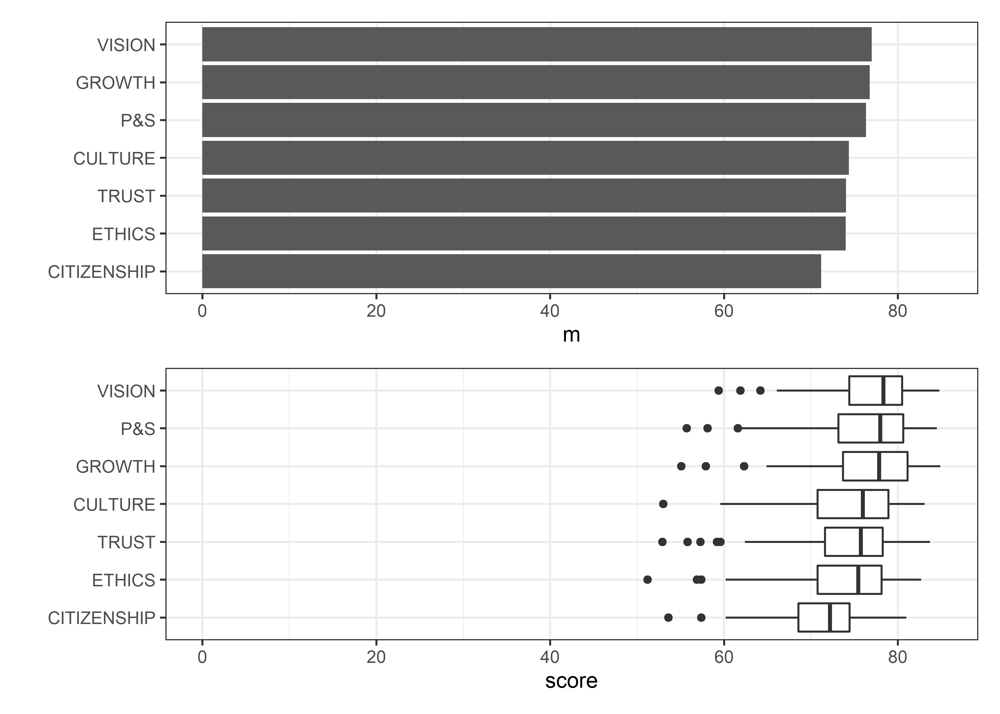

Company Reputation Poll
================
Matthew Hondrakis
2022-05-31

``` r
poll <- readr::read_csv('https://raw.githubusercontent.com/rfordatascience/tidytuesday/master/data/2022/2022-05-31/poll.csv')
```

    ## Rows: 500 Columns: 8
    ## -- Column specification --------------------------------------------------------
    ## Delimiter: ","
    ## chr (2): company, industry
    ## dbl (6): 2022_rank, 2022_rq, change, year, rank, rq
    ## 
    ## i Use `spec()` to retrieve the full column specification for this data.
    ## i Specify the column types or set `show_col_types = FALSE` to quiet this message.

``` r
reputation <- readr::read_csv('https://raw.githubusercontent.com/rfordatascience/tidytuesday/master/data/2022/2022-05-31/reputation.csv')
```

    ## Rows: 700 Columns: 5
    ## -- Column specification --------------------------------------------------------
    ## Delimiter: ","
    ## chr (3): company, industry, name
    ## dbl (2): score, rank
    ## 
    ## i Use `spec()` to retrieve the full column specification for this data.
    ## i Specify the column types or set `show_col_types = FALSE` to quiet this message.

``` r
poll %>% 
  distinct(industry)
```

    ## # A tibble: 19 x 1
    ##    industry          
    ##    <chr>             
    ##  1 Retail            
    ##  2 Food & Beverage   
    ##  3 Groceries         
    ##  4 Tech              
    ##  5 Ecommerce         
    ##  6 Automotive        
    ##  7 Healthcare        
    ##  8 Other             
    ##  9 Logistics         
    ## 10 Financial Services
    ## 11 Industrial        
    ## 12 Consumer Goods    
    ## 13 Pharma            
    ## 14 Telecom           
    ## 15 Insurance         
    ## 16 Media             
    ## 17 Energy            
    ## 18 Airline           
    ## 19 Food Delivery

``` r
poll %>% 
  ggplot(aes(`2022_rq`, fct_reorder(industry, `2022_rq`))) + geom_boxplot()
```

<!-- -->

``` r
x <- poll %>% 
  group_by(company) %>% 
  summarize(m = mean(`2022_rank`)) %>% 
  arrange(desc(m)) %>% 
  head(20) %>% 
  pull(company)

poll %>% 
  group_by(company) %>% 
  summarize(m = mean(`2022_rank`)) %>% 
  arrange(desc(m)) %>% 
  head(20) %>% 
  ggplot(aes(m, fct_reorder(company, m))) + geom_col() +
  labs(y = "")
```

<!-- -->

``` r
reputation %>% 
  filter(company %in% x) %>% 
  group_by(name) %>% 
  ggplot(aes(score, fct_reorder(name, score))) + 
  facet_wrap(~company) +
  geom_boxplot() + theme(legend.position = "none")
```

<!-- -->

``` r
(reputation %>% 
  group_by(name) %>% 
  summarize(m = mean(score)) %>% 
  ggplot(aes(m, fct_reorder(name,m))) + geom_col() +
  xlim(0,85) + labs(y = "")) /
(reputation %>% 
  ggplot(aes(score, fct_reorder(name, score))) + geom_boxplot() +
  xlim(0, 85) + labs(y = ""))
```

<!-- -->
