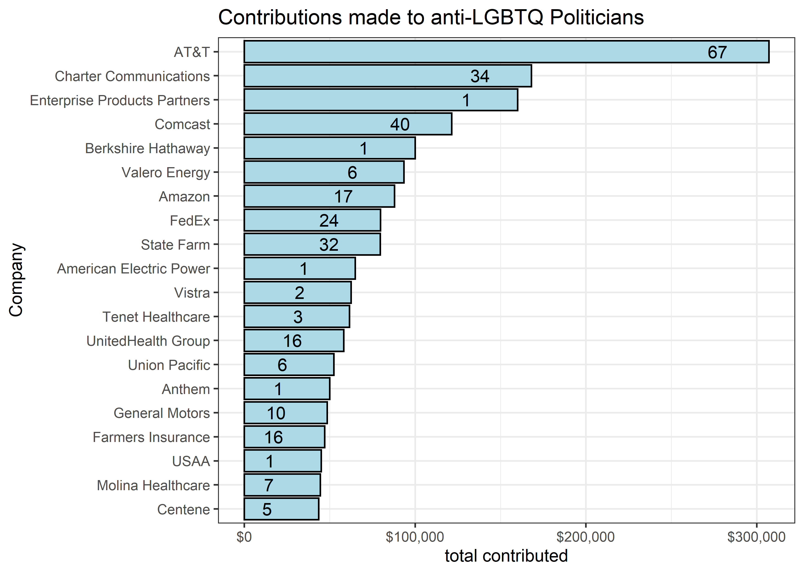
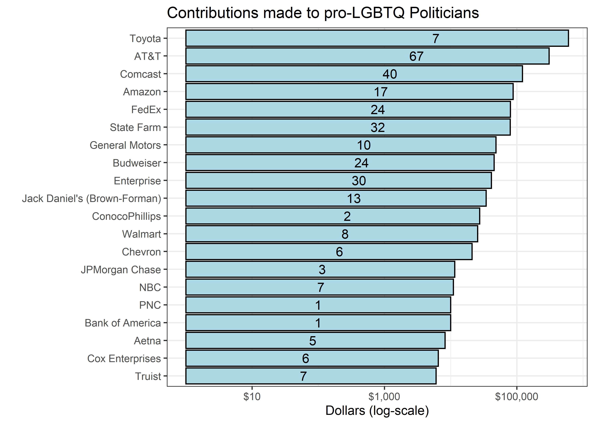
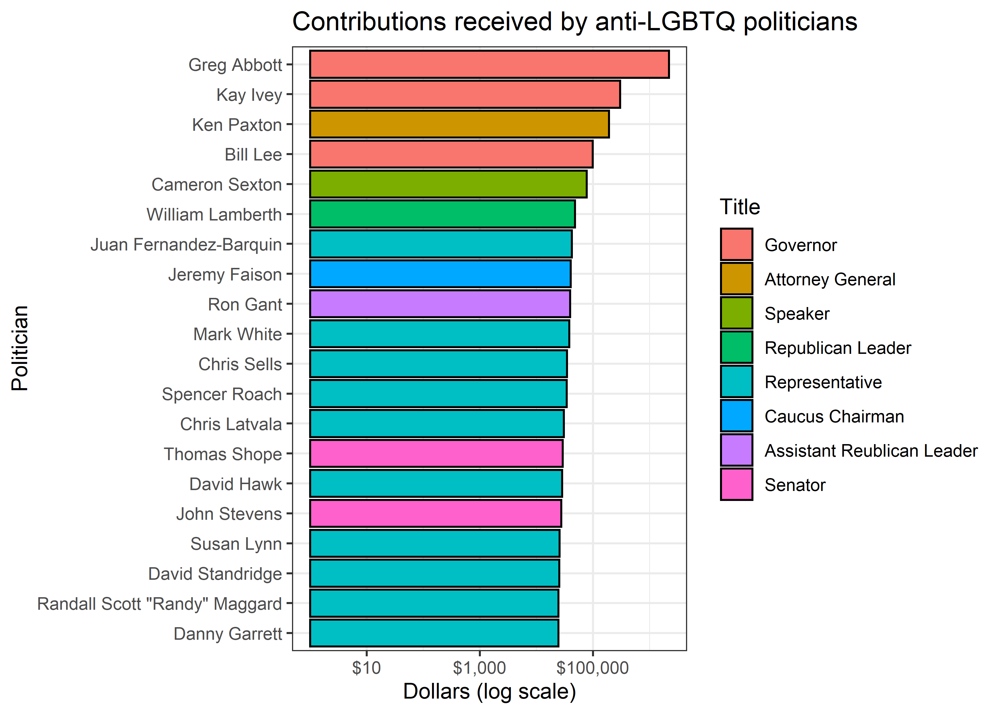

Pride Donations
================
Matthew
2022-06-07

``` r
pride_aggregates <- read_csv('https://raw.githubusercontent.com/rfordatascience/tidytuesday/master/data/2022/2022-06-07/pride_aggregates.csv')
```

    ## Rows: 31 Columns: 4
    ## -- Column specification --------------------------------------------------------
    ## Delimiter: ","
    ## chr (1): Company
    ## dbl (3): Total Contributed, # of Politicians Contributed to, # of States Whe...
    ## 
    ## i Use `spec()` to retrieve the full column specification for this data.
    ## i Specify the column types or set `show_col_types = FALSE` to quiet this message.

``` r
fortune_aggregates <- read_csv('https://raw.githubusercontent.com/rfordatascience/tidytuesday/master/data/2022/2022-06-07/fortune_aggregates.csv')
```

    ## Rows: 117 Columns: 4
    ## -- Column specification --------------------------------------------------------
    ## Delimiter: ","
    ## chr (1): Company
    ## dbl (3): Total Contributed, # of Politicians Contributed to, # of States Whe...
    ## 
    ## i Use `spec()` to retrieve the full column specification for this data.
    ## i Specify the column types or set `show_col_types = FALSE` to quiet this message.

``` r
static_list <- read_csv('https://raw.githubusercontent.com/rfordatascience/tidytuesday/master/data/2022/2022-06-07/static_list.csv')
```

    ## Rows: 126 Columns: 6
    ## -- Column specification --------------------------------------------------------
    ## Delimiter: ","
    ## chr (1): Company
    ## dbl (3): Amount Contributed Across States, # of Politicians Contributed to, ...
    ## lgl (2): Pride?, HRC Business Pledge
    ## 
    ## i Use `spec()` to retrieve the full column specification for this data.
    ## i Specify the column types or set `show_col_types = FALSE` to quiet this message.

``` r
pride_sponsors <- read_csv('https://raw.githubusercontent.com/rfordatascience/tidytuesday/master/data/2022/2022-06-07/pride_sponsors.csv')
```

    ## Rows: 364 Columns: 6
    ## -- Column specification --------------------------------------------------------
    ## Delimiter: ","
    ## chr (5): Company, Pride Event Sponsored, Sponsorship Amount, where available...
    ## dbl (1): Year
    ## 
    ## i Use `spec()` to retrieve the full column specification for this data.
    ## i Specify the column types or set `show_col_types = FALSE` to quiet this message.

``` r
corp_by_politicians <- read_csv('https://raw.githubusercontent.com/rfordatascience/tidytuesday/master/data/2022/2022-06-07/corp_by_politician.csv')
```

    ## Rows: 103 Columns: 4
    ## -- Column specification --------------------------------------------------------
    ## Delimiter: ","
    ## chr (3): Politician, Title, State
    ## dbl (1): SUM of Amount
    ## 
    ## i Use `spec()` to retrieve the full column specification for this data.
    ## i Specify the column types or set `show_col_types = FALSE` to quiet this message.

``` r
donors <- readr::read_csv('https://raw.githubusercontent.com/rfordatascience/tidytuesday/master/data/2022/2022-06-07/donors.csv')
```

    ## Rows: 5497 Columns: 5
    ## -- Column specification --------------------------------------------------------
    ## Delimiter: ","
    ## chr (4): Donor Name, "True" Donor - Pride Sponsor Match Only, Pride and Spon...
    ## lgl (1): "True" Donor - Fortune Match Only
    ## 
    ## i Use `spec()` to retrieve the full column specification for this data.
    ## i Specify the column types or set `show_col_types = FALSE` to quiet this message.

``` r
fortune_aggregates <- fortune_aggregates %>% 
  rename_with(tolower) %>% 
  rename_with(~ sub('# of ', '', .x))

fortune_aggregates %>% 
  arrange(-`total contributed`) %>%
  filter(company != "Grand Total") %>% 
  head(20) %>% 
  ggplot(aes(`total contributed`, 
             fct_reorder(company, `total contributed`),
             label = `politicians contributed to`)) + 
  geom_col(color = "black", fill = "lightblue") + 
  labs(y = "Company", fill = "Politicians",
       title = "Contributions made to anti-LGBTQ Politicians") +
  scale_x_continuous(labels = dollar) + geom_text(nudge_x = -30000)
```

<!-- -->

``` r
static_list %>% 
  filter(`Pride?` == TRUE) %>% 
  arrange(-`Amount Contributed Across States`) %>% 
  head(20) %>% 
  ggplot(aes(`Amount Contributed Across States`, 
             fct_reorder(Company, 
                         `Amount Contributed Across States`),
             label = `# of Politicians Contributed to`)) +
  geom_col(color = "black", fill = "lightblue") + 
  geom_text(nudge_x = -2) + 
  labs(y = "", x = "Dollars (log-scale)",
       title = "Contributions made to pro-LGBTQ Politicians") +
  scale_x_log10(labels = dollar)
```

<!-- -->

``` r
fortune_aggregates %>% 
  filter(grepl("Enterprise", company)) %>% 
  pull(`total contributed`)
```

    ## [1] 160000

``` r
corp_by_politicians %>% 
  arrange(-`SUM of Amount`) %>%
  filter(Politician != "Grand Total") %>%
  head(20) %>% 
  ggplot(aes(`SUM of Amount`, 
             fct_reorder(Politician, `SUM of Amount`), 
             fill = fct_reorder(Title, 
                                `SUM of Amount`, 
                                max, 
                                .desc = TRUE))) + 
  geom_col(color = "black") +
  scale_x_log10(labels = dollar) + 
  labs(y = "Politician",
       x = "Dollars (log scale)", fill = "Title",
       title = "Contributions received by anti-LGBTQ politicians")
```

<!-- -->

# Checking ‘Grand Total’

``` r
fortune_aggregates %>% 
  mutate(grand = ifelse(company == "Grand Total", "Yes", "No")) %>% 
  group_by(grand) %>% 
  summarize(sum(`total contributed`))
```

    ## # A tibble: 2 x 2
    ##   grand `sum(\`total contributed\`)`
    ##   <chr>                        <dbl>
    ## 1 No                        2933719.
    ## 2 Yes                       2933719.
