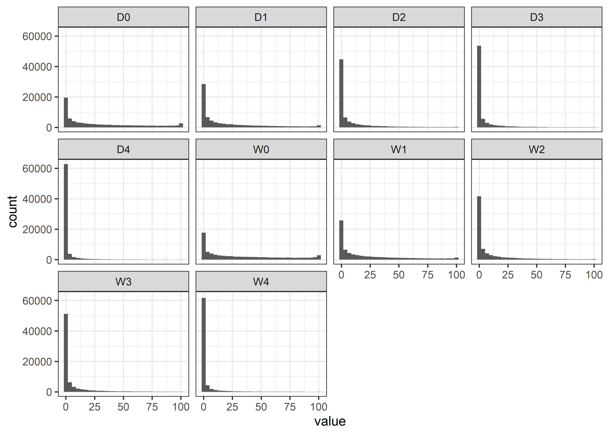
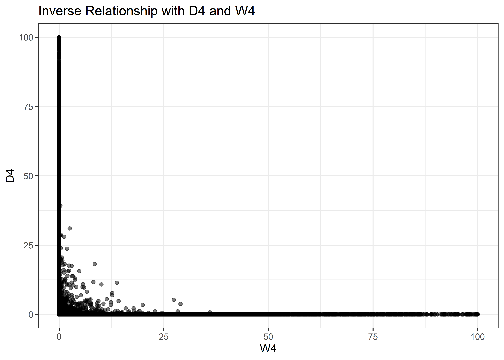

Drought
================
Matthew
2022-06-14

# Read and Process

``` r
drought <- read_csv('https://raw.githubusercontent.com/rfordatascience/tidytuesday/master/data/2022/2022-06-14/drought.csv')
```

    ## Rows: 73344 Columns: 14
    ## -- Column specification --------------------------------------------------------
    ## Delimiter: ","
    ## chr  (2): DATE, state
    ## dbl (12): 0, D0, D1, D2, D3, D4, -9, W0, W1, W2, W3, W4
    ## 
    ## i Use `spec()` to retrieve the full column specification for this data.
    ## i Specify the column types or set `show_col_types = FALSE` to quiet this message.

``` r
drought_fips <- read_csv('https://raw.githubusercontent.com/rfordatascience/tidytuesday/master/data/2022/2022-06-14/drought-fips.csv')
```

    ## Rows: 3771791 Columns: 4
    ## -- Column specification --------------------------------------------------------
    ## Delimiter: ","
    ## chr  (2): State, FIPS
    ## dbl  (1): DSCI
    ## date (1): date
    ## 
    ## i Use `spec()` to retrieve the full column specification for this data.
    ## i Specify the column types or set `show_col_types = FALSE` to quiet this message.

``` r
drought <- drought %>% 
  select(-"-9",-"0")

drought <- drought %>% 
  mutate(DATE = gsub('d_',"", DATE)) %>% 
  rename(date = DATE)

drought <- drought %>% 
  mutate(date = as.Date(date, format = "%Y%m%d"),   #convert to date
         state = str_to_title(state))               #capitalize first letter
```

# EDA

``` r
drought %>% 
  keep(is.numeric) %>% 
  gather() %>% 
  ggplot(aes(value)) + geom_histogram() + facet_wrap(~key)
```

    ## `stat_bin()` using `bins = 30`. Pick better value with `binwidth`.

<!-- -->

``` r
drought %>% 
  arrange(-D4) %>% 
  select(date, D4, state)
```

    ## # A tibble: 73,344 x 3
    ##    date          D4 state      
    ##    <date>     <dbl> <chr>      
    ##  1 1985-04-01   100 Connecticut
    ##  2 1930-11-01   100 Delaware   
    ##  3 1931-02-01   100 Delaware   
    ##  4 1985-04-01   100 Delaware   
    ##  5 1941-05-01   100 Kentucky   
    ##  6 1930-09-01   100 Maryland   
    ##  7 1930-10-01   100 Maryland   
    ##  8 1930-11-01   100 Maryland   
    ##  9 1930-12-01   100 Maryland   
    ## 10 1931-01-01   100 Maryland   
    ## # ... with 73,334 more rows

``` r
drought %>% 
  group_by(state) %>% 
  summarize_if(is.numeric, mean) %>% 
  arrange(-D4)
```

    ## # A tibble: 48 x 11
    ##    state           D0    D1    D2    D3    D4    W0    W1    W2    W3    W4
    ##    <chr>        <dbl> <dbl> <dbl> <dbl> <dbl> <dbl> <dbl> <dbl> <dbl> <dbl>
    ##  1 North-Dakota  28.9  19.9  9.83  6.16  3.13  32.6  22.5 10.3   5.63  2.05
    ##  2 Colorado      31.0  21.7 10.3   6.11  2.84  31.3  21.3  9.25  5.05  1.94
    ##  3 Utah          31.2  21.7 10.2   6.05  2.81  31.6  21.7  9.57  5.12  1.89
    ##  4 Arizona       31.4  21.6 10.2   6.07  2.79  30.4  20.7  9.15  5.07  2.08
    ##  5 Minnesota     28.8  20.0  9.51  5.75  2.78  33.3  23.2 10.5   5.73  2.19
    ##  6 New-Mexico    31.0  21.8 10.7   6.35  2.76  30.6  20.5  8.98  4.90  1.94
    ##  7 Indiana       27.4  19.2  9.38  5.67  2.63  34.7  23.8 10.5   5.69  2.12
    ##  8 Texas         30.5  21.1  9.83  5.73  2.60  31.9  22.0 10.1   5.73  2.29
    ##  9 Nevada        31.3  21.7 10.1   5.85  2.60  30.8  21.3  9.55  5.28  2.09
    ## 10 Montana       30.1  20.7  9.88  5.85  2.58  31.7  22.0 10.2   5.76  2.25
    ## # ... with 38 more rows

## Comparison of D4 and w4

``` r
drought %>% 
  ggplot(aes(W4, D4)) + geom_point(alpha = 0.2) +
  labs(title = "Inverse Relationship with D4 and W4")
```

<!-- -->
