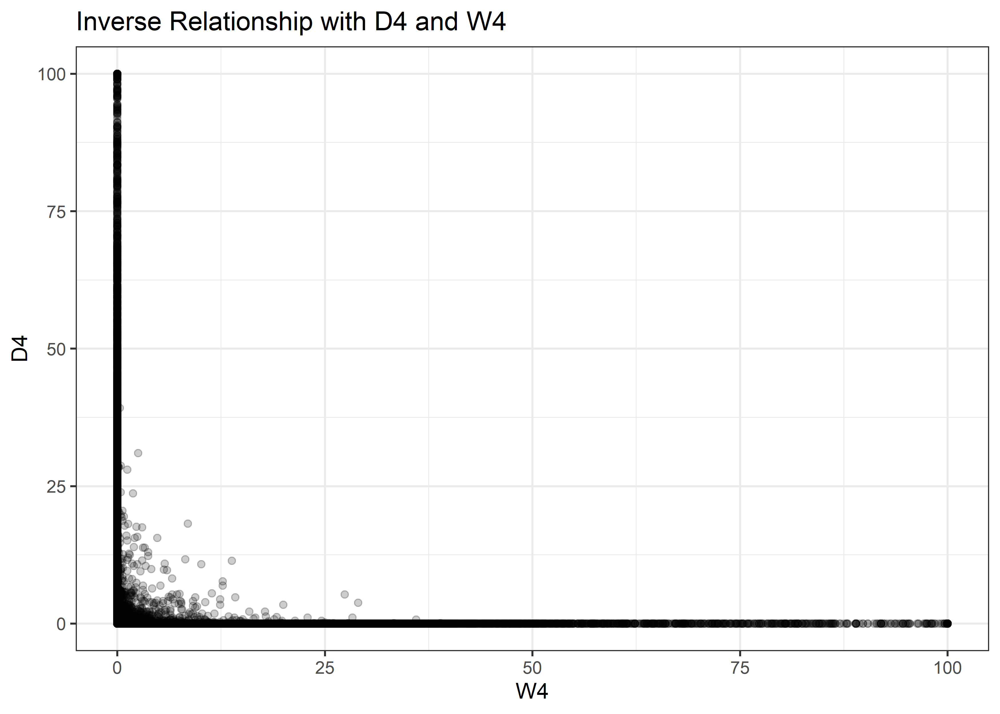
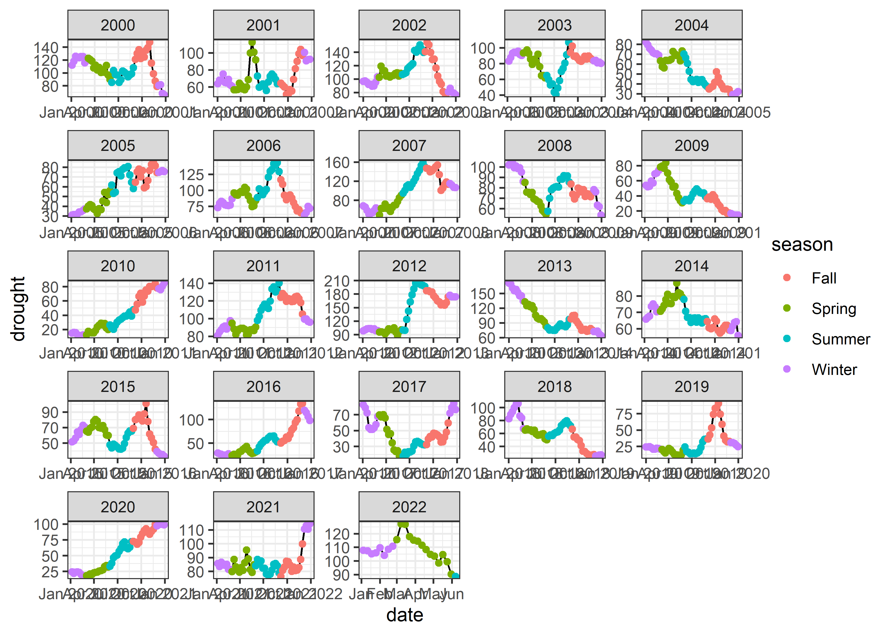

Drought
================
Matthew
2022-06-14

# Read and Process

``` r
drought <- read_csv('https://raw.githubusercontent.com/rfordatascience/tidytuesday/master/data/2022/2022-06-14/drought.csv')
```

    ## Rows: 73344 Columns: 14
    ## -- Column specification --------------------------------------------------------
    ## Delimiter: ","
    ## chr  (2): DATE, state
    ## dbl (12): 0, D0, D1, D2, D3, D4, -9, W0, W1, W2, W3, W4
    ## 
    ## i Use `spec()` to retrieve the full column specification for this data.
    ## i Specify the column types or set `show_col_types = FALSE` to quiet this message.

``` r
drought_fips <- read_csv('https://raw.githubusercontent.com/rfordatascience/tidytuesday/master/data/2022/2022-06-14/drought-fips.csv')
```

    ## Rows: 3771791 Columns: 4
    ## -- Column specification --------------------------------------------------------
    ## Delimiter: ","
    ## chr  (2): State, FIPS
    ## dbl  (1): DSCI
    ## date (1): date
    ## 
    ## i Use `spec()` to retrieve the full column specification for this data.
    ## i Specify the column types or set `show_col_types = FALSE` to quiet this message.

``` r
drought <- drought %>% 
  select(-"-9",-"0")

drought <- drought %>% 
  mutate(DATE = gsub('d_',"", DATE)) %>% 
  rename(date = DATE)

drought <- drought %>% 
  mutate(date = as.Date(date, format = "%Y%m%d"),   #convert to date
         state = str_to_title(state))               #capitalize first letter
```

# EDA

``` r
drought %>% 
  keep(is.numeric) %>% 
  gather() %>% 
  ggplot(aes(value)) + geom_histogram() + facet_wrap(~key)
```

    ## `stat_bin()` using `bins = 30`. Pick better value with `binwidth`.

<!-- -->

``` r
drought %>% 
  arrange(-D4) %>% 
  select(date, D4, state)
```

    ## # A tibble: 73,344 x 3
    ##    date          D4 state      
    ##    <date>     <dbl> <chr>      
    ##  1 1985-04-01   100 Connecticut
    ##  2 1930-11-01   100 Delaware   
    ##  3 1931-02-01   100 Delaware   
    ##  4 1985-04-01   100 Delaware   
    ##  5 1941-05-01   100 Kentucky   
    ##  6 1930-09-01   100 Maryland   
    ##  7 1930-10-01   100 Maryland   
    ##  8 1930-11-01   100 Maryland   
    ##  9 1930-12-01   100 Maryland   
    ## 10 1931-01-01   100 Maryland   
    ## # ... with 73,334 more rows

``` r
drought %>% 
  group_by(state) %>% 
  summarize_if(is.numeric, mean) %>% 
  arrange(-D4)
```

    ## # A tibble: 48 x 11
    ##    state           D0    D1    D2    D3    D4    W0    W1    W2    W3    W4
    ##    <chr>        <dbl> <dbl> <dbl> <dbl> <dbl> <dbl> <dbl> <dbl> <dbl> <dbl>
    ##  1 North-Dakota  28.9  19.9  9.83  6.16  3.13  32.6  22.5 10.3   5.63  2.05
    ##  2 Colorado      31.0  21.7 10.3   6.11  2.84  31.3  21.3  9.25  5.05  1.94
    ##  3 Utah          31.2  21.7 10.2   6.05  2.81  31.6  21.7  9.57  5.12  1.89
    ##  4 Arizona       31.4  21.6 10.2   6.07  2.79  30.4  20.7  9.15  5.07  2.08
    ##  5 Minnesota     28.8  20.0  9.51  5.75  2.78  33.3  23.2 10.5   5.73  2.19
    ##  6 New-Mexico    31.0  21.8 10.7   6.35  2.76  30.6  20.5  8.98  4.90  1.94
    ##  7 Indiana       27.4  19.2  9.38  5.67  2.63  34.7  23.8 10.5   5.69  2.12
    ##  8 Texas         30.5  21.1  9.83  5.73  2.60  31.9  22.0 10.1   5.73  2.29
    ##  9 Nevada        31.3  21.7 10.1   5.85  2.60  30.8  21.3  9.55  5.28  2.09
    ## 10 Montana       30.1  20.7  9.88  5.85  2.58  31.7  22.0 10.2   5.76  2.25
    ## # ... with 38 more rows

## Comparison of D4 and w4

``` r
drought %>% 
  ggplot(aes(W4, D4)) + geom_point(alpha = 0.2) +
  labs(title = "Inverse Relationship with D4 and W4")
```

<!-- -->

## Drought by State

``` r
drought_fips %>% 
  group_by(State) %>% 
  summarize(m = median(DSCI)) %>% 
  arrange(-m) %>% 
  head(15) %>% 
  ggplot(aes(m, fct_reorder(State,m))) + geom_col(color = "black", fill = "lightblue") +
  labs(y = "", x = "Median Drought", 
       title = "Top 15 States with Most Severe Drought", subtitle = "Drought Scale goes from 0 to 500")  +
  theme(plot.title = element_text(hjust = 0.5), 
        plot.subtitle = element_text(hjust = 0.5))
```

<!-- -->

``` r
avg_drought <- drought_fips %>% 
  group_by(date) %>% 
  summarize(drought = mean(DSCI)) %>% 
  mutate(month = month(date, label = TRUE),
         season = case_when(grepl("Dec|Jan|Feb", month) ~ "Winter",
                            grepl("Mar|Apr|May", month) ~ "Spring",
                            grepl("Jun|Jul|Aug", month) ~ "Summer",
                            grepl("Sep|Oct|Nov", month) ~ "Fall"))

avg_drought %>% 
  ggplot(aes(date, drought)) + geom_line() + 
  geom_point(aes(color = season)) + facet_wrap(~year(date), scales = "free")
```

<!-- -->

``` r
avg_drought %>% 
  ggplot(aes(date, drought)) + geom_line() + 
  geom_point(aes(color = season))
```

<!-- -->

``` r
(avg_drought %>% 
  ggplot(aes(drought, fct_rev(month), fill = season)) + geom_col() +
  labs(y = "", fill = "")) /
(avg_drought %>% 
   ggplot(aes(drought, season, fill = season)) + geom_boxplot() +
   labs(y = "", fill = "") + theme(legend.position = "none")) + plot_layout(guides = 'collect')
```

<!-- -->

``` r
anova(aov(drought ~ season, avg_drought))
```

    ## Analysis of Variance Table
    ## 
    ## Response: drought
    ##             Df  Sum Sq Mean Sq F value    Pr(>F)    
    ## season       3   23097  7699.2   6.289 0.0003117 ***
    ## Residuals 1167 1428664  1224.2                      
    ## ---
    ## Signif. codes:  0 '***' 0.001 '**' 0.01 '*' 0.05 '.' 0.1 ' ' 1

# Fitting an AR model on the timeseries

``` r
library(astsa)
timeseries <- ts(avg_drought$drought, start = c(2000, 1), freq = 52)

plot(timeseries)
```

<!-- -->

``` r
acf2(timeseries)
```

<!-- -->

    ##      [,1]  [,2]  [,3] [,4]  [,5] [,6]  [,7]  [,8] [,9] [,10] [,11] [,12] [,13]
    ## ACF  0.98  0.96  0.93 0.90  0.88 0.85  0.82  0.79 0.76  0.73  0.71  0.69  0.67
    ## PACF 0.98 -0.29 -0.08 0.02 -0.02 0.00 -0.05 -0.01 0.02  0.01  0.04  0.02  0.03
    ##      [,14] [,15] [,16] [,17] [,18] [,19] [,20] [,21] [,22] [,23] [,24] [,25]
    ## ACF   0.65  0.63  0.61  0.60  0.58  0.56  0.54  0.53  0.51  0.49  0.48  0.46
    ## PACF  0.00  0.02  0.01 -0.03 -0.08 -0.02 -0.01  0.05  0.01 -0.02  0.00  0.02
    ##      [,26] [,27] [,28] [,29] [,30] [,31] [,32] [,33] [,34] [,35] [,36] [,37]
    ## ACF   0.45  0.43  0.42  0.40  0.39  0.37  0.36  0.35  0.34  0.33  0.31  0.30
    ## PACF  0.03  0.00 -0.04 -0.06  0.03 -0.02  0.04 -0.01  0.01 -0.03 -0.03  0.03
    ##      [,38] [,39] [,40] [,41] [,42] [,43] [,44] [,45] [,46] [,47] [,48] [,49]
    ## ACF   0.29  0.28  0.27  0.26  0.25  0.24  0.24  0.23  0.23  0.23  0.23  0.23
    ## PACF  0.01  0.00 -0.01  0.03  0.02  0.00  0.00  0.06  0.01  0.04  0.05  0.00
    ##      [,50] [,51] [,52] [,53] [,54] [,55] [,56] [,57] [,58] [,59] [,60] [,61]
    ## ACF   0.23  0.24  0.24  0.25  0.25  0.26  0.26  0.26  0.26  0.25  0.25  0.24
    ## PACF  0.02  0.05 -0.01 -0.01  0.01 -0.02 -0.07  0.05 -0.06 -0.04 -0.05 -0.04
    ##      [,62] [,63] [,64] [,65] [,66] [,67] [,68] [,69] [,70] [,71] [,72] [,73]
    ## ACF   0.23  0.22  0.20  0.19  0.17  0.16  0.15  0.14  0.13  0.12  0.11   0.1
    ## PACF -0.06 -0.02 -0.03  0.05 -0.02  0.05 -0.01 -0.01 -0.02 -0.04  0.00   0.0
    ##      [,74] [,75] [,76] [,77] [,78] [,79] [,80] [,81] [,82] [,83] [,84] [,85]
    ## ACF   0.09  0.09  0.08  0.07  0.06  0.05  0.04  0.03  0.02  0.01  0.01  0.00
    ## PACF  0.00  0.01 -0.08  0.04  0.00  0.00  0.03 -0.04 -0.02  0.03  0.04 -0.02
    ##      [,86] [,87] [,88] [,89] [,90] [,91] [,92] [,93] [,94] [,95] [,96] [,97]
    ## ACF  -0.01 -0.01 -0.02 -0.02 -0.03 -0.04 -0.05 -0.06 -0.06 -0.07 -0.08 -0.09
    ## PACF  0.00  0.00 -0.01 -0.01 -0.03  0.02 -0.01 -0.03  0.03  0.00 -0.06 -0.04
    ##      [,98] [,99] [,100] [,101] [,102] [,103] [,104] [,105] [,106] [,107] [,108]
    ## ACF   -0.1 -0.11  -0.12  -0.13  -0.14  -0.15  -0.16  -0.16  -0.17  -0.18  -0.19
    ## PACF   0.0  0.02   0.00  -0.06  -0.03   0.02  -0.03  -0.02  -0.04  -0.05  -0.01
    ##      [,109] [,110] [,111] [,112] [,113] [,114] [,115] [,116] [,117] [,118]
    ## ACF   -0.20  -0.21  -0.21  -0.22  -0.22  -0.22  -0.23  -0.23  -0.23  -0.24
    ## PACF  -0.01   0.05  -0.02   0.04  -0.02   0.02   0.01  -0.02  -0.04  -0.02
    ##      [,119] [,120] [,121] [,122] [,123] [,124] [,125] [,126] [,127] [,128]
    ## ACF   -0.24  -0.25  -0.26  -0.26  -0.26  -0.27  -0.27  -0.27  -0.28  -0.28
    ## PACF   0.02  -0.03   0.00   0.03   0.03   0.04  -0.02   0.01  -0.01  -0.02
    ##      [,129] [,130] [,131] [,132] [,133] [,134] [,135] [,136] [,137] [,138]
    ## ACF   -0.28  -0.28  -0.28  -0.28  -0.28  -0.28  -0.28  -0.28  -0.29  -0.29
    ## PACF   0.02  -0.01   0.01   0.00  -0.03  -0.03  -0.02  -0.01   0.00  -0.04
    ##      [,139] [,140] [,141] [,142] [,143] [,144] [,145] [,146] [,147] [,148]
    ## ACF   -0.29  -0.30  -0.30  -0.30  -0.29  -0.29  -0.28  -0.28  -0.27  -0.27
    ## PACF   0.01   0.01   0.06   0.04  -0.02  -0.01   0.00   0.00   0.02  -0.03
    ##      [,149] [,150] [,151] [,152] [,153] [,154] [,155] [,156] [,157] [,158]
    ## ACF   -0.26  -0.26  -0.26  -0.25  -0.25  -0.25  -0.25  -0.25  -0.25  -0.25
    ## PACF  -0.01  -0.04  -0.02   0.05   0.00  -0.05   0.01   0.05  -0.05   0.01
    ##      [,159] [,160] [,161] [,162] [,163] [,164] [,165] [,166] [,167] [,168]
    ## ACF   -0.26  -0.26  -0.26  -0.26  -0.26  -0.25  -0.25  -0.25  -0.24  -0.24
    ## PACF  -0.02   0.01   0.05   0.01   0.00   0.03   0.00   0.01   0.00   0.00
    ##      [,169] [,170] [,171] [,172] [,173] [,174] [,175] [,176] [,177] [,178]
    ## ACF   -0.24  -0.23  -0.23  -0.23  -0.22  -0.22  -0.21  -0.21   -0.2  -0.20
    ## PACF  -0.02   0.00   0.01  -0.03   0.08  -0.02  -0.02   0.01    0.0   0.02
    ##      [,179] [,180] [,181] [,182] [,183] [,184] [,185] [,186] [,187] [,188]
    ## ACF   -0.19  -0.19  -0.18  -0.17  -0.16  -0.15  -0.14  -0.13  -0.12  -0.11
    ## PACF   0.03   0.08   0.02  -0.05   0.00   0.01  -0.01   0.02  -0.02   0.03
    ##      [,189] [,190] [,191] [,192] [,193] [,194] [,195] [,196] [,197] [,198]
    ## ACF   -0.10  -0.09  -0.08  -0.08  -0.07  -0.06  -0.05  -0.04  -0.04  -0.03
    ## PACF   0.04  -0.04   0.04   0.02   0.00   0.03   0.00   0.03   0.01   0.02
    ##      [,199] [,200] [,201] [,202] [,203] [,204] [,205] [,206] [,207] [,208]
    ## ACF   -0.02  -0.01   0.01   0.02   0.03   0.04   0.05   0.05   0.06   0.07
    ## PACF   0.02   0.00  -0.04  -0.02   0.02   0.00  -0.01  -0.01  -0.06   0.00

``` r
sarima(timeseries, 3, 0, 0)
```

    ## initial  value 3.560632 
    ## iter   2 value 2.797719
    ## iter   3 value 2.376154
    ## iter   4 value 2.175328
    ## iter   5 value 1.888586
    ## iter   6 value 1.771550
    ## iter   7 value 1.759975
    ## iter   8 value 1.750926
    ## iter   9 value 1.744016
    ## iter  10 value 1.743581
    ## iter  11 value 1.743574
    ## iter  12 value 1.743574
    ## iter  12 value 1.743574
    ## final  value 1.743574 
    ## converged
    ## initial  value 1.745521 
    ## iter   2 value 1.745520
    ## iter   3 value 1.745520
    ## iter   4 value 1.745519
    ## iter   5 value 1.745518
    ## iter   6 value 1.745518
    ## iter   7 value 1.745518
    ## iter   8 value 1.745518
    ## iter   9 value 1.745517
    ## iter  10 value 1.745517
    ## iter  11 value 1.745517
    ## iter  12 value 1.745517
    ## iter  13 value 1.745517
    ## iter  14 value 1.745517
    ## iter  15 value 1.745516
    ## iter  16 value 1.745515
    ## iter  17 value 1.745514
    ## iter  18 value 1.745512
    ## iter  19 value 1.745511
    ## iter  20 value 1.745511
    ## iter  21 value 1.745510
    ## iter  22 value 1.745510
    ## iter  23 value 1.745510
    ## iter  24 value 1.745510
    ## iter  24 value 1.745510
    ## iter  24 value 1.745510
    ## final  value 1.745510 
    ## converged

<!-- -->

    ## $fit
    ## 
    ## Call:
    ## arima(x = xdata, order = c(p, d, q), seasonal = list(order = c(P, D, Q), period = S), 
    ##     xreg = xmean, include.mean = FALSE, transform.pars = trans, fixed = fixed, 
    ##     optim.control = list(trace = trc, REPORT = 1, reltol = tol))
    ## 
    ## Coefficients:
    ##          ar1      ar2      ar3    xmean
    ##       1.2529  -0.2005  -0.0730  76.1937
    ## s.e.  0.0291   0.0465   0.0292   7.9179
    ## 
    ## sigma^2 estimated as 32.72:  log likelihood = -3705.57,  aic = 7421.14
    ## 
    ## $degrees_of_freedom
    ## [1] 1167
    ## 
    ## $ttable
    ##       Estimate     SE t.value p.value
    ## ar1     1.2529 0.0291 43.0132  0.0000
    ## ar2    -0.2005 0.0465 -4.3165  0.0000
    ## ar3    -0.0730 0.0292 -2.4998  0.0126
    ## xmean  76.1937 7.9179  9.6229  0.0000
    ## 
    ## $AIC
    ## [1] 6.337436
    ## 
    ## $AICc
    ## [1] 6.337465
    ## 
    ## $BIC
    ## [1] 6.359066

``` r
sarima.for(timeseries, 52, 3, 0, 0)
```

    ## $pred
    ## Time Series:
    ## Start = c(2022, 28) 
    ## End = c(2023, 27) 
    ## Frequency = 52 
    ##  [1] 87.30162 86.56928 86.05400 85.65665 85.31558 85.00553 84.71446 84.43682
    ##  [9] 84.16997 83.91253 83.66376 83.42316 83.19039 82.96514 82.74716 82.53621
    ## [17] 82.33205 82.13446 81.94323 81.75816 81.57904 81.40569 81.23792 81.07555
    ## [25] 80.91841 80.76633 80.61914 80.47669 80.33882 80.20539 80.07626 79.95128
    ## [33] 79.83033 79.71327 79.59998 79.49033 79.38422 79.28152 79.18212 79.08593
    ## [41] 78.99283 78.90273 78.81553 78.73113 78.64946 78.57041 78.49390 78.41986
    ## [49] 78.34820 78.27885 78.21173 78.14677
    ## 
    ## $se
    ## Time Series:
    ## Start = c(2022, 28) 
    ## End = c(2023, 27) 
    ## Frequency = 52 
    ##  [1]  5.719724  9.169136 12.058747 14.448171 16.456255 18.169767 19.653165
    ##  [8] 20.953113 22.103795 23.130696 24.053226 24.886496 25.642510 26.330987
    ## [15] 26.959926 27.536006 28.064876 28.551363 28.999634 29.413315 29.795583
    ## [22] 30.149243 30.476778 30.780406 31.062110 31.323672 31.566701 31.792651
    ## [29] 32.002842 32.198474 32.380643 32.550347 32.708504 32.855953 32.993464
    ## [36] 33.121747 33.241455 33.353191 33.457511 33.554929 33.645921 33.730926
    ## [43] 33.810353 33.884580 33.953958 34.018813 34.079449 34.136145 34.189166
    ## [50] 34.238753 34.285134 34.328521

``` r
title(main = "One year forcast")
```

<!-- -->
