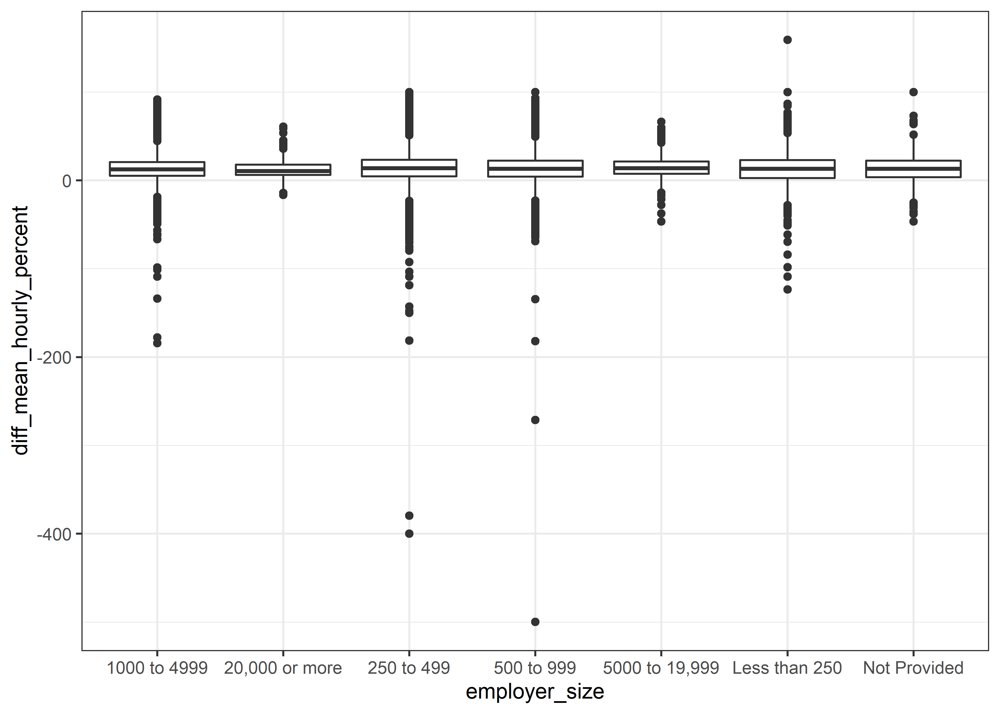
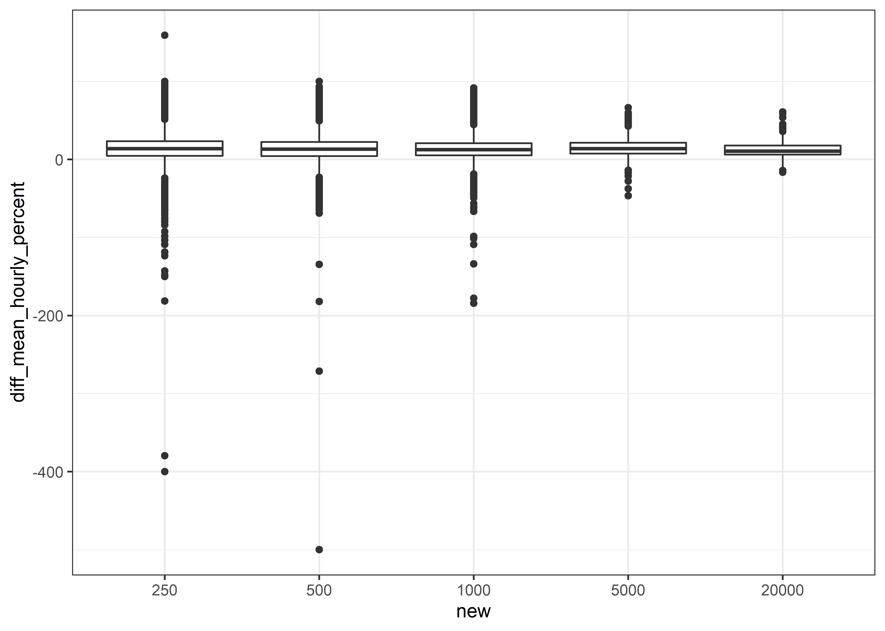
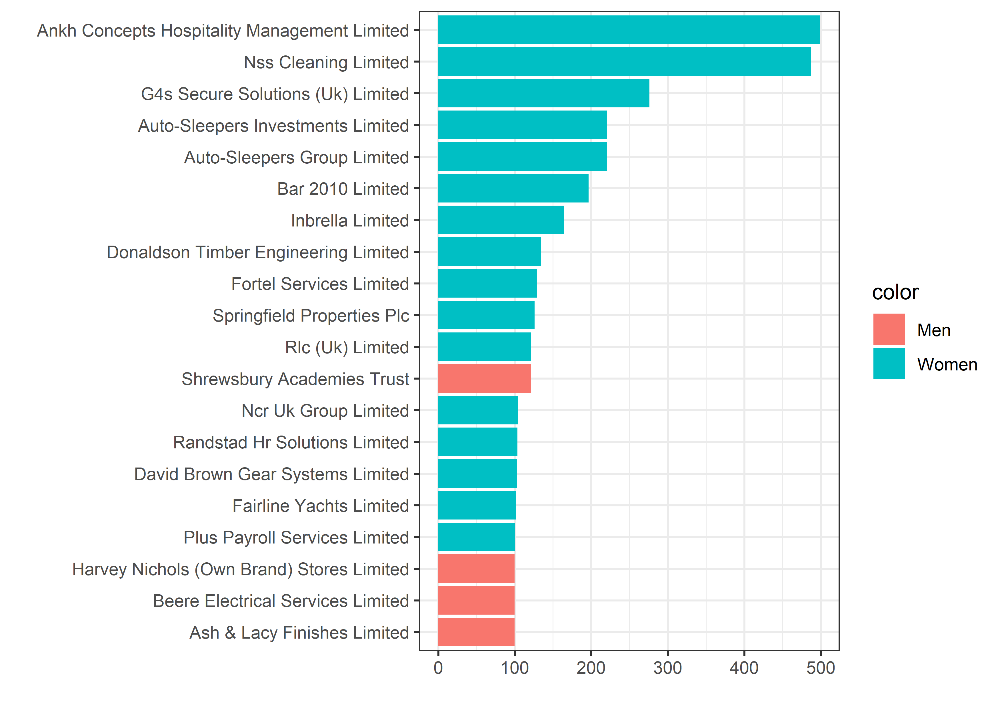
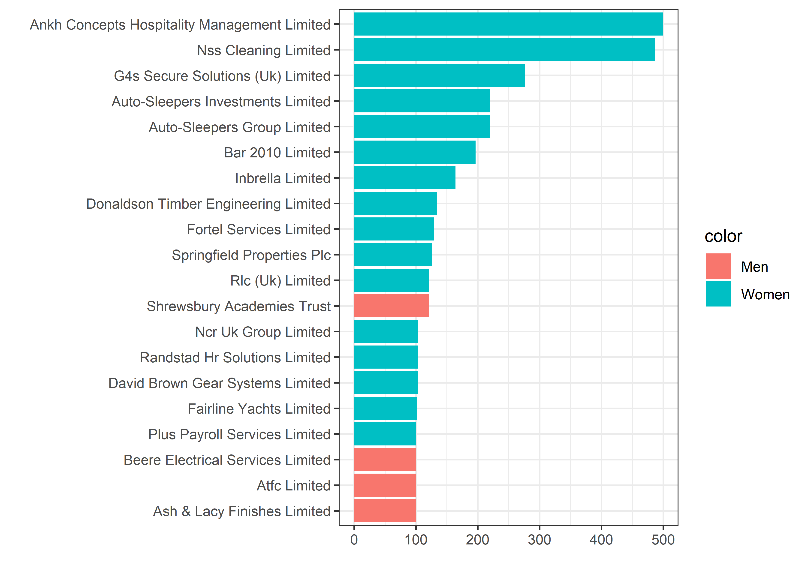
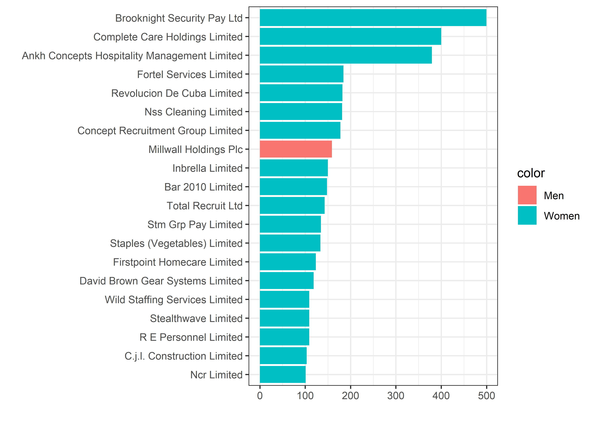

UK Paygap
================
Matthew Hondrakis
2022-06-29

``` r
paygap <- read_csv('https://raw.githubusercontent.com/rfordatascience/tidytuesday/master/data/2022/2022-06-28/paygap.csv')
```

    ## Rows: 48711 Columns: 27
    ## -- Column specification --------------------------------------------------------
    ## Delimiter: ","
    ## chr   (9): employer_name, address, post_code, company_number, sic_codes, com...
    ## dbl  (15): employer_id, diff_mean_hourly_percent, diff_median_hourly_percent...
    ## lgl   (1): submitted_after_the_deadline
    ## dttm  (2): due_date, date_submitted
    ## 
    ## i Use `spec()` to retrieve the full column specification for this data.
    ## i Specify the column types or set `show_col_types = FALSE` to quiet this message.

``` r
paygap %>% 
  arrange(-abs(diff_mean_hourly_percent)) %>% 
  select(employer_name, diff_mean_hourly_percent, employer_size)
```

    ## # A tibble: 48,711 x 3
    ##    employer_name                                diff_mean_hourly_~ employer_size
    ##    <chr>                                                     <dbl> <chr>        
    ##  1 BROOKNIGHT SECURITY PAY LTD                               -500. 500 to 999   
    ##  2 COMPLETE CARE HOLDINGS LIMITED                            -400  250 to 499   
    ##  3 ANKH CONCEPTS HOSPITALITY MANAGEMENT LIMITED              -380. 250 to 499   
    ##  4 COMPLETE CARE HOLDINGS LIMITED                            -271. 500 to 999   
    ##  5 FORTEL SERVICES LIMITED                                   -184. 1000 to 4999 
    ##  6 REVOLUCION DE CUBA LIMITED                                -182  500 to 999   
    ##  7 NSS CLEANING LIMITED                                      -181. 250 to 499   
    ##  8 CONCEPT RECRUITMENT GROUP LIMITED                         -178. 1000 to 4999 
    ##  9 MILLWALL HOLDINGS PLC                                      159  Less than 250
    ## 10 INBRELLA LIMITED                                          -150  250 to 499   
    ## # ... with 48,701 more rows

``` r
paygap %>% 
  arrange(-abs(diff_median_hourly_percent)) %>% 
  select(employer_name, diff_median_hourly_percent, employer_size)
```

    ## # A tibble: 48,711 x 3
    ##    employer_name                                diff_median_hourl~ employer_size
    ##    <chr>                                                     <dbl> <chr>        
    ##  1 ANKH CONCEPTS HOSPITALITY MANAGEMENT LIMITED              -500. 250 to 499   
    ##  2 NSS CLEANING LIMITED                                      -487. 250 to 499   
    ##  3 G4S SECURE SOLUTIONS (UK) LIMITED                         -276. 5000 to 19,9~
    ##  4 AUTO-SLEEPERS GROUP LIMITED                               -220. 250 to 499   
    ##  5 AUTO-SLEEPERS INVESTMENTS LIMITED                         -220. 250 to 499   
    ##  6 BAR 2010 LIMITED                                          -196. 250 to 499   
    ##  7 INBRELLA LIMITED                                          -164  250 to 499   
    ##  8 DONALDSON TIMBER ENGINEERING LIMITED                      -134  250 to 499   
    ##  9 FORTEL SERVICES LIMITED                                   -129. 1000 to 4999 
    ## 10 SPRINGFIELD PROPERTIES PLC                                -126. 500 to 999   
    ## # ... with 48,701 more rows

``` r
paygap %>% 
  ggplot(aes(employer_size, diff_mean_hourly_percent)) +
  geom_boxplot()
```

<!-- -->

``` r
paygap %>% 
  filter(employer_size != "Not Provided") %>% 
  mutate(new = as.factor(parse_number(employer_size))) %>% 
  ggplot(aes(new, diff_mean_hourly_percent)) + geom_boxplot()
```

<!-- -->

``` r
test_data <- paygap %>% 
  filter(employer_size != "Not Provided") %>% 
  mutate(new = as.factor(parse_number(employer_size)))

summary(aov(diff_mean_hourly_percent ~ new, test_data))
```

    ##                Df   Sum Sq Mean Sq F value   Pr(>F)    
    ## new             4     4391  1097.9   4.871 0.000632 ***
    ## Residuals   47951 10807579   225.4                     
    ## ---
    ## Signif. codes:  0 '***' 0.001 '**' 0.01 '*' 0.05 '.' 0.1 ' ' 1

``` r
pairwise.t.test(paygap$diff_mean_hourly_percent, paygap$employer_size)
```

    ## 
    ##  Pairwise comparisons using t tests with pooled SD 
    ## 
    ## data:  paygap$diff_mean_hourly_percent and paygap$employer_size 
    ## 
    ##                1000 to 4999 20,000 or more 250 to 499 500 to 999 5000 to 19,999
    ## 20,000 or more 1.00000      -              -          -          -             
    ## 250 to 499     0.00093      1.00000        -          -          -             
    ## 500 to 999     0.29531      1.00000        1.00000    -          -             
    ## 5000 to 19,999 0.03635      1.00000        1.00000    1.00000    -             
    ## Less than 250  1.00000      1.00000        0.68558    1.00000    0.34977       
    ## Not Provided   1.00000      1.00000        1.00000    1.00000    0.73013       
    ##                Less than 250
    ## 20,000 or more -            
    ## 250 to 499     -            
    ## 500 to 999     -            
    ## 5000 to 19,999 -            
    ## Less than 250  -            
    ## Not Provided   1.00000      
    ## 
    ## P value adjustment method: holm

``` r
paygap %>% 
  mutate(color = ifelse(diff_median_hourly_percent > 0, "Men", "Women"),
         diff = abs(diff_median_hourly_percent)) %>% 
  group_by(employer_name) %>% 
  arrange(-abs(diff_median_hourly_percent)) %>% 
  head(20) %>% 
  ggplot(aes(diff, 
             fct_reorder(str_to_title(employer_name), diff),
             fill = color)) + 
  geom_col() +
  labs(y = "", x = "")
```

<!-- -->

``` r
gplot <- function(x){
  paygap %>% 
    mutate(color = ifelse({{x}} > 0, "Men", "Women"),
           diff = abs({{x}})) %>% 
    group_by(employer_name, color) %>% 
    summarize(diff = max(diff)) %>% 
    arrange(-abs(diff)) %>% 
    head(20) %>% 
    ggplot(aes(diff, 
               fct_reorder(str_to_title(employer_name), diff),
               fill = color)) + 
    geom_col() +
    labs(y = "", x = "")
}
gplot(diff_median_hourly_percent)
```

    ## `summarise()` has grouped output by 'employer_name'. You can override using the
    ## `.groups` argument.

<!-- -->

``` r
gplot(diff_mean_hourly_percent)
```

    ## `summarise()` has grouped output by 'employer_name'. You can override using the
    ## `.groups` argument.

<!-- -->
