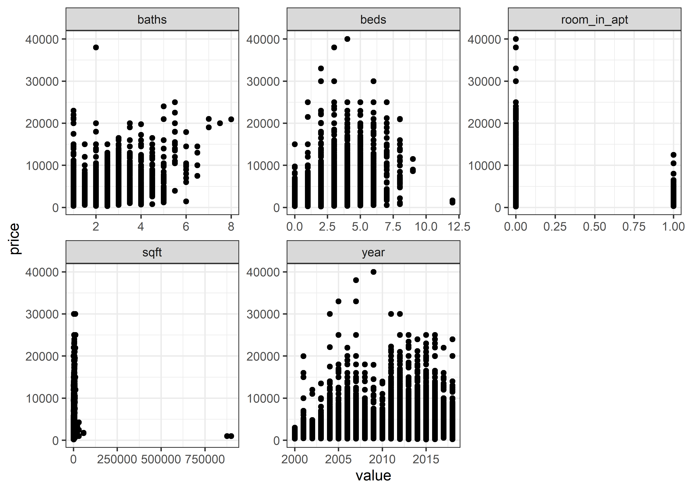
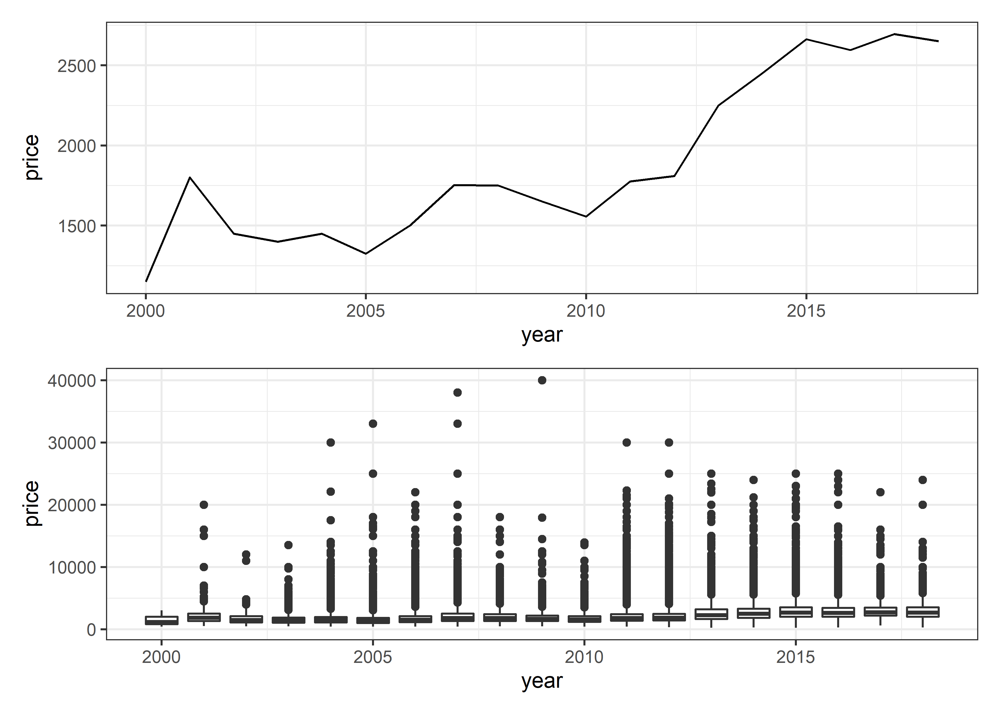
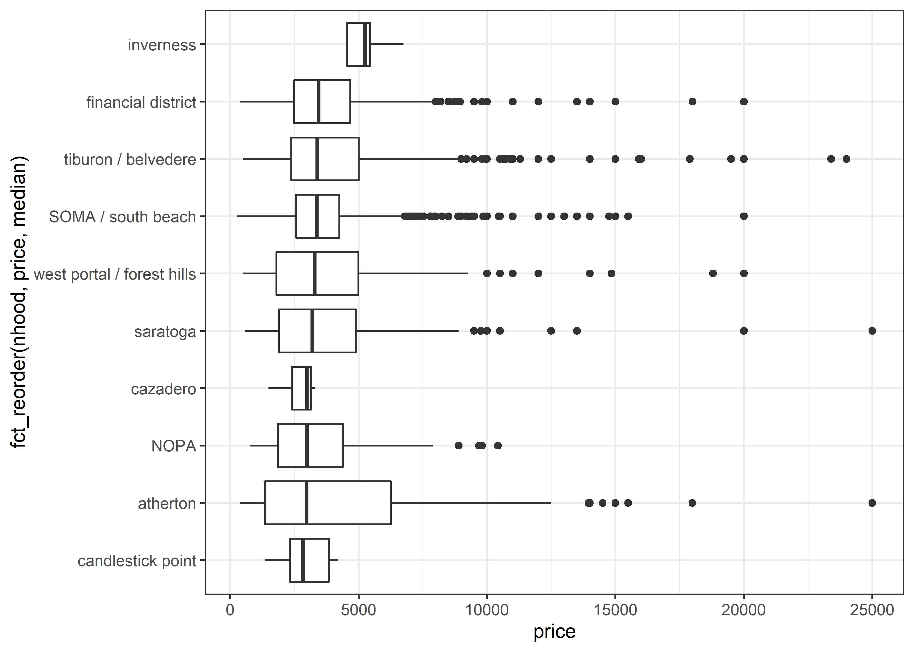
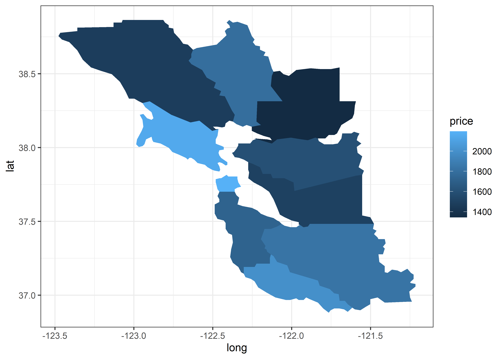
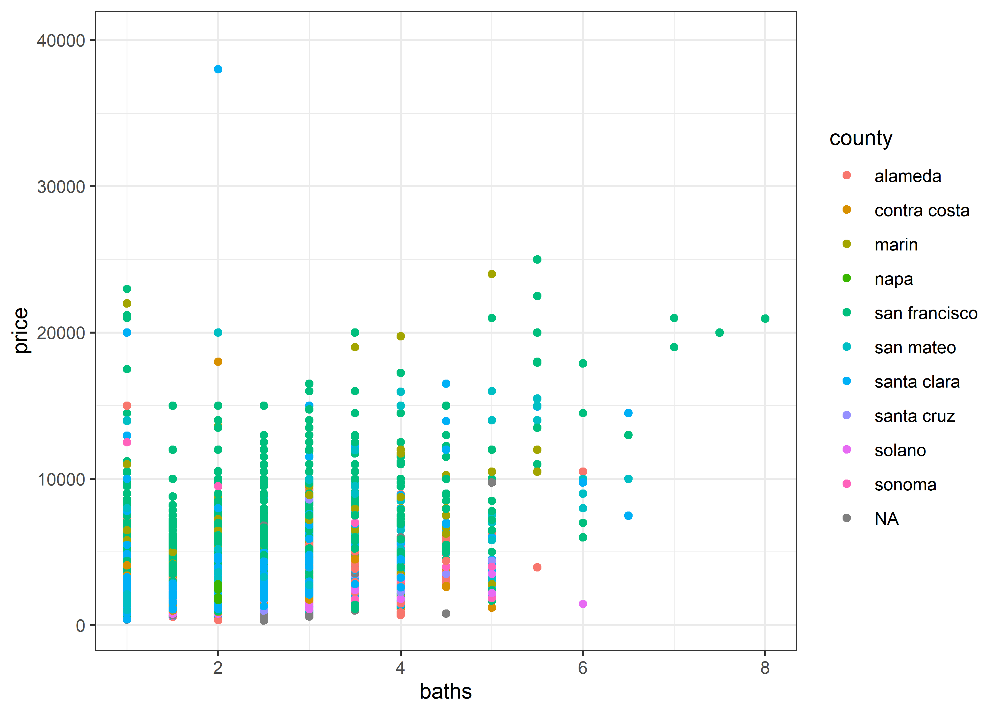
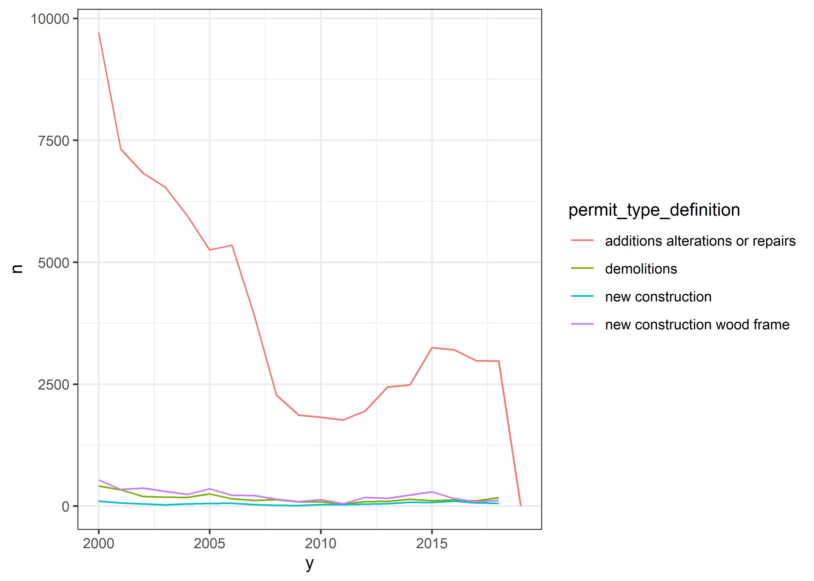

San Francisco Rentals
================
Matthew
2022-07-06

``` r
rent <- read_csv('https://raw.githubusercontent.com/rfordatascience/tidytuesday/master/data/2022/2022-07-05/rent.csv')
```

    ## Rows: 200796 Columns: 17
    ## -- Column specification --------------------------------------------------------
    ## Delimiter: ","
    ## chr (8): post_id, nhood, city, county, address, title, descr, details
    ## dbl (9): date, year, price, beds, baths, sqft, room_in_apt, lat, lon
    ## 
    ## i Use `spec()` to retrieve the full column specification for this data.
    ## i Specify the column types or set `show_col_types = FALSE` to quiet this message.

``` r
permits <- read_csv('https://raw.githubusercontent.com/rfordatascience/tidytuesday/master/data/2022/2022-07-05/sf_permits.csv')
```

    ## Rows: 86103 Columns: 44
    ## -- Column specification --------------------------------------------------------
    ## Delimiter: ","
    ## chr  (19): permit_type_definition, block, lot, street_number_suffix, street_...
    ## dbl  (16): permit_number, permit_type, street_number, unit, number_of_existi...
    ## lgl   (1): tidf_compliance
    ## dttm  (7): permit_creation_date, status_date, filed_date, issued_date, compl...
    ## date  (1): date
    ## 
    ## i Use `spec()` to retrieve the full column specification for this data.
    ## i Specify the column types or set `show_col_types = FALSE` to quiet this message.

``` r
new_construction <- read_csv('https://raw.githubusercontent.com/rfordatascience/tidytuesday/master/data/2022/2022-07-05/new_construction.csv')
```

    ## Rows: 261 Columns: 10
    ## -- Column specification --------------------------------------------------------
    ## Delimiter: ","
    ## chr (2): county, source
    ## dbl (6): cartodb_id, year, totalproduction, sfproduction, mfproduction, mhpr...
    ## lgl (2): the_geom, the_geom_webmercator
    ## 
    ## i Use `spec()` to retrieve the full column specification for this data.
    ## i Specify the column types or set `show_col_types = FALSE` to quiet this message.

``` r
skimr::skim(rent)
```

|                                                  |        |
|:-------------------------------------------------|:-------|
| Name                                             | rent   |
| Number of rows                                   | 200796 |
| Number of columns                                | 17     |
| \_\_\_\_\_\_\_\_\_\_\_\_\_\_\_\_\_\_\_\_\_\_\_   |        |
| Column type frequency:                           |        |
| character                                        | 8      |
| numeric                                          | 9      |
| \_\_\_\_\_\_\_\_\_\_\_\_\_\_\_\_\_\_\_\_\_\_\_\_ |        |
| Group variables                                  | None   |

Data summary

**Variable type: character**

| skim_variable | n_missing | complete_rate | min |   max | empty | n_unique | whitespace |
|:--------------|----------:|--------------:|----:|------:|------:|---------:|-----------:|
| post_id       |         0 |          1.00 |   9 |    14 |     0 |   200796 |          0 |
| nhood         |         0 |          1.00 |   4 |    43 |     0 |      167 |          0 |
| city          |         0 |          1.00 |   5 |    19 |     0 |      104 |          0 |
| county        |      1394 |          0.99 |   4 |    13 |     0 |       10 |          0 |
| address       |    196888 |          0.02 |   1 |    38 |     0 |     2869 |          0 |
| title         |      2517 |          0.99 |   2 |   298 |     0 |   184961 |          0 |
| descr         |    197542 |          0.02 |  13 | 16975 |     0 |     3025 |          0 |
| details       |    192780 |          0.04 |   4 |   595 |     0 |     7667 |          0 |

**Variable type: numeric**

| skim_variable | n_missing | complete_rate |        mean |       sd |          p0 |         p25 |         p50 |        p75 |        p100 | hist  |
|:--------------|----------:|--------------:|------------:|---------:|------------:|------------:|------------:|-----------:|------------:|:------|
| date          |         0 |          1.00 | 20095718.38 | 44694.07 | 20000902.00 | 20050227.00 | 20110924.00 | 20120805.0 | 20180717.00 | ▁▇▁▆▃ |
| year          |         0 |          1.00 |     2009.51 |     4.48 |     2000.00 |     2005.00 |     2011.00 |     2012.0 |     2018.00 | ▁▇▁▆▃ |
| price         |         0 |          1.00 |     2135.36 |  1427.75 |      220.00 |     1295.00 |     1800.00 |     2505.0 |    40000.00 | ▇▁▁▁▁ |
| beds          |      6608 |          0.97 |        1.89 |     1.08 |        0.00 |        1.00 |        2.00 |        3.0 |       12.00 | ▇▂▁▁▁ |
| baths         |    158121 |          0.21 |        1.68 |     0.69 |        1.00 |        1.00 |        2.00 |        2.0 |        8.00 | ▇▁▁▁▁ |
| sqft          |    136117 |          0.32 |     1201.83 |  5000.22 |       80.00 |      750.00 |     1000.00 |     1360.0 |   900000.00 | ▇▁▁▁▁ |
| room_in_apt   |         0 |          1.00 |        0.00 |     0.04 |        0.00 |        0.00 |        0.00 |        0.0 |        1.00 | ▇▁▁▁▁ |
| lat           |    193145 |          0.04 |       37.67 |     0.35 |       33.57 |       37.40 |       37.76 |       37.8 |       40.43 | ▁▁▅▇▁ |
| lon           |    196484 |          0.02 |     -122.21 |     0.78 |     -123.20 |     -122.42 |     -122.26 |     -122.0 |      -74.20 | ▇▁▁▁▁ |

``` r
rent %>% 
  keep(is.numeric) %>% 
  select(-date, -lat, -lon) %>% 
  pivot_longer(-price) %>% 
  ggplot(aes(value, price)) + geom_point() + facet_wrap(~name, scales = "free")
```

<!-- -->

``` r
(rent %>% 
  group_by(year) %>% 
  summarize(price = median(price)) %>% 
  ggplot(aes(year, price)) + geom_line()) /
(rent %>% 
   group_by(year) %>% 
   ggplot(aes(year, price, group = year)) + geom_boxplot())
```

<!-- -->

``` r
rent %>% 
  filter(!is.na(county)) %>% 
  group_by(county) %>% 
  mutate(med = median(price),
         county = str_to_title(county)) %>% 
  ggplot(aes(fct_reorder(county, med), price)) + geom_boxplot()
```

<!-- -->

``` r
lm(price ~ 0 + ., 
   rent %>% 
    keep(is.numeric) %>% 
    drop_na()) %>% broom::tidy() %>% 
  arrange(-abs(estimate))
```

    ## # A tibble: 8 x 5
    ##   term          estimate std.error statistic   p.value
    ##   <chr>            <dbl>     <dbl>     <dbl>     <dbl>
    ## 1 lon         -2897.      154.       -18.8   1.06e- 72
    ## 2 lat         -2306.      127.       -18.1   5.11e- 68
    ## 3 year          354.      741.         0.478 6.33e-  1
    ## 4 room_in_apt  -206.      327.        -0.631 5.28e-  1
    ## 5 beds         -125.       39.5       -3.17  1.54e-  3
    ## 6 baths          11.8      53.3        0.222 8.25e-  1
    ## 7 sqft            2.09      0.0656    31.8   3.96e-180
    ## 8 date           -0.0486    0.0742    -0.655 5.12e-  1

``` r
hoods <- rent %>% 
  group_by(nhood) %>%
  mutate(medianp = median(price)) %>%
  distinct(medianp) %>% 
  arrange(-medianp) %>% 
  head(10) %>% pull(nhood)

rent %>% 
  filter(nhood %in% hoods) %>% 
  ggplot(aes(price, fct_reorder(nhood, price, median))) + geom_boxplot()
```

<!-- -->

``` r
rent %>% 
  ggplot(aes(lon, lat, color = log(price))) + geom_point() +
  xlim(-125, -120) + ylim(36, 39)
```

<!-- -->

``` r
sfmap <- map_data("county", region = "California")

sfmap_joined <- rent %>% 
  group_by(county) %>% 
  summarize(price = median(price)) %>% 
  left_join(sfmap, by = c("county" = "subregion"))
```

``` r
sfmap_joined %>% 
  ggplot(aes(long, lat, group = group, fill = price)) + geom_polygon()
```

<!-- -->

``` r
rent %>% 
  ggplot(aes(baths, price, color = county)) + geom_point()
```

<!-- -->

``` r
rent %>% 
  filter(baths == 1) %>% 
  arrange(-price) %>% 
  select(price, year, county, sqft)
```

    ## # A tibble: 17,644 x 4
    ##    price  year county         sqft
    ##    <dbl> <dbl> <chr>         <dbl>
    ##  1 22985  2015 san francisco  4000
    ##  2 22000  2015 marin          4700
    ##  3 21200  2014 san francisco    NA
    ##  4 20990  2015 san francisco    NA
    ##  5 20000  2014 santa clara    5300
    ##  6 17500  2014 san francisco  6194
    ##  7 15000  2011 alameda          NA
    ##  8 14500  2017 san mateo      2342
    ##  9 14500  2014 san francisco  3045
    ## 10 14000  2004 san mateo        NA
    ## # ... with 17,634 more rows

``` r
permits %>% 
  group_by(y = year(filed_date)) %>% 
  count(permit_type_definition, sort = TRUE) %>% 
  ggplot(aes(y, n, color = permit_type_definition)) + geom_line()
```

<!-- -->

``` r
permits %>% 
  count(proposed_use, sort = TRUE)
```

    ## # A tibble: 92 x 2
    ##    proposed_use             n
    ##    <chr>                <int>
    ##  1 1 family dwelling    18614
    ##  2 office               18238
    ##  3 apartments           17546
    ##  4 2 family dwelling    12514
    ##  5 retail sales          4476
    ##  6 <NA>                  3175
    ##  7 food/beverage hndlng  2845
    ##  8 tourist hotel/motel   1194
    ##  9 school                 665
    ## 10 warehouse,no frnitur   449
    ## # ... with 82 more rows
