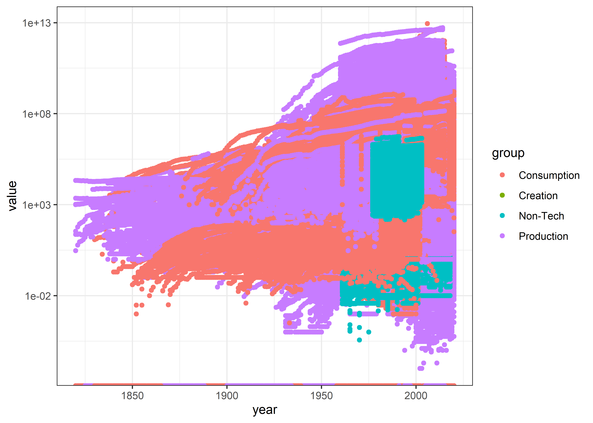

Technology Adoption
================
Matthew
2022-07-19

``` r
technology <- read_csv('https://raw.githubusercontent.com/rfordatascience/tidytuesday/master/data/2022/2022-07-19/technology.csv')
```

    ## Rows: 491636 Columns: 7
    ## -- Column specification --------------------------------------------------------
    ## Delimiter: ","
    ## chr (5): variable, label, iso3c, group, category
    ## dbl (2): year, value
    ## 
    ## i Use `spec()` to retrieve the full column specification for this data.
    ## i Specify the column types or set `show_col_types = FALSE` to quiet this message.

``` r
skimr::skim(technology)
```

|                                                  |            |
|:-------------------------------------------------|:-----------|
| Name                                             | technology |
| Number of rows                                   | 491636     |
| Number of columns                                | 7          |
| \_\_\_\_\_\_\_\_\_\_\_\_\_\_\_\_\_\_\_\_\_\_\_   |            |
| Column type frequency:                           |            |
| character                                        | 5          |
| numeric                                          | 2          |
| \_\_\_\_\_\_\_\_\_\_\_\_\_\_\_\_\_\_\_\_\_\_\_\_ |            |
| Group variables                                  | None       |

Data summary

**Variable type: character**

| skim_variable | n_missing | complete_rate | min | max | empty | n_unique | whitespace |
|:--------------|----------:|--------------:|----:|----:|------:|---------:|-----------:|
| variable      |         0 |             1 |   2 |  23 |     0 |      195 |          0 |
| label         |         0 |             1 |   4 |  95 |     0 |      194 |          0 |
| iso3c         |         0 |             1 |   3 |   3 |     0 |      240 |          0 |
| group         |         0 |             1 |   8 |  11 |     0 |        4 |          0 |
| category      |         0 |             1 |   5 |  27 |     0 |        9 |          0 |

**Variable type: numeric**

| skim_variable | n_missing | complete_rate |         mean |           sd |   p0 |    p25 |  p50 |      p75 |        p100 | hist  |
|:--------------|----------:|--------------:|-------------:|-------------:|-----:|-------:|-----:|---------:|------------:|:------|
| year          |         0 |             1 | 1.983080e+03 | 3.471000e+01 | 1820 | 1972.0 | 1993 |  2007.00 | 2.02000e+03 | ▁▁▁▃▇ |
| value         |         0 |             1 | 1.310453e+09 | 4.432262e+10 |    0 |   23.1 |  550 | 39779.25 | 8.82194e+12 | ▇▁▁▁▁ |

``` r
technology %>% 
  ggplot(aes(year, value, color = group)) + geom_point() + scale_y_log10()
```

<!-- -->

``` r
technology %>% 
  filter(value == 0) %>% 
  group_by(group) %>% 
  summarize(n = n())
```

    ## # A tibble: 3 x 2
    ##   group           n
    ##   <chr>       <int>
    ## 1 Consumption 10370
    ## 2 Non-Tech     1872
    ## 3 Production  38491

``` r
technology %>% 
  count(label, sort = TRUE)
```

    ## # A tibble: 194 x 2
    ##    label                                                              n
    ##    <chr>                                                          <int>
    ##  1 Fixed telephone subscriptions                                  18440
    ##  2 Geographical/route lengths of line open at the end of the year 12324
    ##  3 Gross output of electric energy (TWH)                          12140
    ##  4 Land agricultural land area 1000 ha                            11945
    ##  5 Aluminum primary production, in metric tons                    11736
    ##  6 % Arable land share in agricultural land                       11581
    ##  7 Land arable land area 1000 ha                                  11581
    ##  8 Radios                                                         10344
    ##  9 Passenger car vehicles                                          8646
    ## 10 Civil aviation ton-KM of cargo carried                          8477
    ## # ... with 184 more rows

``` r
technology %>% 
  count(category, sort = TRUE)
```

    ## # A tibble: 9 x 2
    ##   category                         n
    ##   <chr>                        <int>
    ## 1 Agriculture                 120282
    ## 2 Transport                   112845
    ## 3 Communications               70858
    ## 4 Energy                       66748
    ## 5 Vaccines                     60863
    ## 6 Industry                     26467
    ## 7 Hospital (non-drug medical)  14677
    ## 8 Other                        12292
    ## 9 Financial                     6604
