Technology Adoption
================
Matthew
2022-07-19

-   <a href="#eda" id="toc-eda">EDA</a>
-   <a href="#vaccines" id="toc-vaccines">Vaccines</a>
-   <a href="#transport" id="toc-transport">Transport</a>
    -   <a href="#vehicles" id="toc-vehicles">Vehicles</a>
    -   <a href="#routes" id="toc-routes">Routes</a>
-   <a href="#hospital" id="toc-hospital">Hospital</a>
    -   <a href="#transplants" id="toc-transplants">Transplants</a>
    -   <a href="#tomography" id="toc-tomography">Tomography</a>
-   <a href="#country" id="toc-country">Country</a>
    -   <a href="#dialysis" id="toc-dialysis">Dialysis</a>
-   <a href="#nested-country-model" id="toc-nested-country-model">Nested
    Country Model</a>
    -   <a href="#dialysis-1" id="toc-dialysis-1">Dialysis</a>
-   <a href="#internet" id="toc-internet">Internet</a>

``` r
technology <- read_csv('https://raw.githubusercontent.com/rfordatascience/tidytuesday/master/data/2022/2022-07-19/technology.csv')
```

    ## Rows: 491636 Columns: 7
    ## -- Column specification --------------------------------------------------------
    ## Delimiter: ","
    ## chr (5): variable, label, iso3c, group, category
    ## dbl (2): year, value
    ## 
    ## i Use `spec()` to retrieve the full column specification for this data.
    ## i Specify the column types or set `show_col_types = FALSE` to quiet this message.

``` r
technology <- technology %>% 
  bind_cols(country = countrycode(technology$iso3c, origin = 'iso3c', destination = 'country.name'),
            continent = countrycode(technology$iso3c, origin = 'iso3c', destination = 'continent'))
```

``` r
skimr::skim(technology)
```

|                                                  |            |
|:-------------------------------------------------|:-----------|
| Name                                             | technology |
| Number of rows                                   | 491636     |
| Number of columns                                | 9          |
| \_\_\_\_\_\_\_\_\_\_\_\_\_\_\_\_\_\_\_\_\_\_\_   |            |
| Column type frequency:                           |            |
| character                                        | 7          |
| numeric                                          | 2          |
| \_\_\_\_\_\_\_\_\_\_\_\_\_\_\_\_\_\_\_\_\_\_\_\_ |            |
| Group variables                                  | None       |

Data summary

**Variable type: character**

| skim_variable | n_missing | complete_rate | min | max | empty | n_unique | whitespace |
|:--------------|----------:|--------------:|----:|----:|------:|---------:|-----------:|
| variable      |         0 |             1 |   2 |  23 |     0 |      195 |          0 |
| label         |         0 |             1 |   4 |  95 |     0 |      194 |          0 |
| iso3c         |         0 |             1 |   3 |   3 |     0 |      240 |          0 |
| group         |         0 |             1 |   8 |  11 |     0 |        4 |          0 |
| category      |         0 |             1 |   5 |  27 |     0 |        9 |          0 |
| country       |      1327 |             1 |   4 |  32 |     0 |      235 |          0 |
| continent     |      1507 |             1 |   4 |   8 |     0 |        5 |          0 |

**Variable type: numeric**

| skim_variable | n_missing | complete_rate |         mean |           sd |   p0 |    p25 |  p50 |      p75 |        p100 | hist  |
|:--------------|----------:|--------------:|-------------:|-------------:|-----:|-------:|-----:|---------:|------------:|:------|
| year          |         0 |             1 | 1.983080e+03 | 3.471000e+01 | 1820 | 1972.0 | 1993 |  2007.00 | 2.02000e+03 | ▁▁▁▃▇ |
| value         |         0 |             1 | 1.310453e+09 | 4.432262e+10 |    0 |   23.1 |  550 | 39779.25 | 8.82194e+12 | ▇▁▁▁▁ |

# EDA

``` r
technology %>% 
  count(label, sort = TRUE) 
```

    ## # A tibble: 194 x 2
    ##    label                                                              n
    ##    <chr>                                                          <int>
    ##  1 Fixed telephone subscriptions                                  18440
    ##  2 Geographical/route lengths of line open at the end of the year 12324
    ##  3 Gross output of electric energy (TWH)                          12140
    ##  4 Land agricultural land area 1000 ha                            11945
    ##  5 Aluminum primary production, in metric tons                    11736
    ##  6 % Arable land share in agricultural land                       11581
    ##  7 Land arable land area 1000 ha                                  11581
    ##  8 Radios                                                         10344
    ##  9 Passenger car vehicles                                          8646
    ## 10 Civil aviation ton-KM of cargo carried                          8477
    ## # ... with 184 more rows

``` r
technology %>% 
  count(category, sort = TRUE)
```

    ## # A tibble: 9 x 2
    ##   category                         n
    ##   <chr>                        <int>
    ## 1 Agriculture                 120282
    ## 2 Transport                   112845
    ## 3 Communications               70858
    ## 4 Energy                       66748
    ## 5 Vaccines                     60863
    ## 6 Industry                     26467
    ## 7 Hospital (non-drug medical)  14677
    ## 8 Other                        12292
    ## 9 Financial                     6604

``` r
technology %>% 
  group_by(group) %>% 
  count(category)
```

    ## # A tibble: 15 x 3
    ## # Groups:   group [4]
    ##    group       category                        n
    ##    <chr>       <chr>                       <int>
    ##  1 Consumption Communications              68525
    ##  2 Consumption Financial                    6604
    ##  3 Consumption Hospital (non-drug medical) 10244
    ##  4 Consumption Transport                   27254
    ##  5 Consumption Vaccines                    60863
    ##  6 Creation    Other                        3599
    ##  7 Non-Tech    Agriculture                 54213
    ##  8 Non-Tech    Hospital (non-drug medical)  4433
    ##  9 Non-Tech    Other                        6657
    ## 10 Production  Agriculture                 66069
    ## 11 Production  Communications               2333
    ## 12 Production  Energy                      66748
    ## 13 Production  Industry                    26467
    ## 14 Production  Other                        2036
    ## 15 Production  Transport                   85591

``` r
technology %>%  
  drop_na() %>% 
  group_by(year, continent) %>% 
  summarize(value = mean(value) + 1) %>% 
  ggplot(aes(year, value, color = fct_reorder(continent, value, max, .desc = TRUE))) + geom_line() +
  scale_y_log10() + scale_x_continuous(breaks = seq(1820, 2020, 20)) + 
  labs(title = "Overall Technology use over time", color = "")
```

    ## `summarise()` has grouped output by 'year'. You can override using the
    ## `.groups` argument.

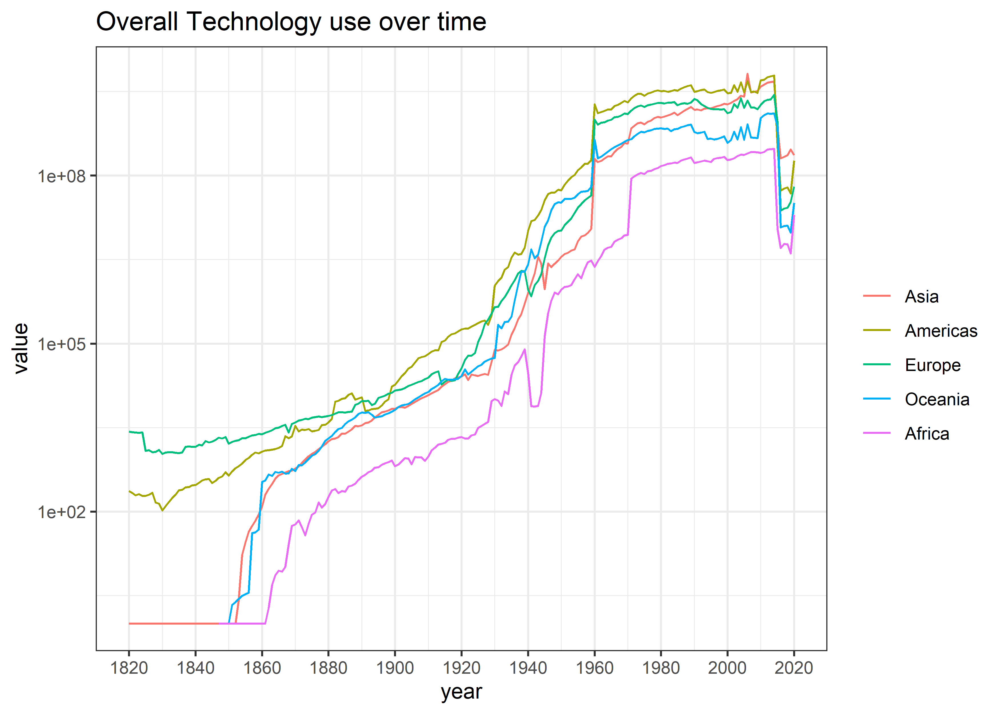<!-- -->

# Vaccines

``` r
names <- technology %>% 
  filter(category == "Vaccines") %>% 
  count(variable, sort = TRUE) %>% 
  head(5) %>% 
  pull(variable)

technology %>% 
  count(iso3c, sort = TRUE)
```

    ## # A tibble: 240 x 2
    ##    iso3c     n
    ##    <chr> <int>
    ##  1 DNK    6132
    ##  2 FRA    5931
    ##  3 DEU    5836
    ##  4 GBR    5771
    ##  5 SWE    5769
    ##  6 FIN    5730
    ##  7 NOR    5706
    ##  8 ESP    5668
    ##  9 NLD    5656
    ## 10 AUS    5555
    ## # ... with 230 more rows

``` r
technology %>%
  group_by(year) %>% 
  summarize(value = mean(value)) %>% 
  ggplot(aes(year, value)) +
  geom_line() + theme(legend.position = "none")
```

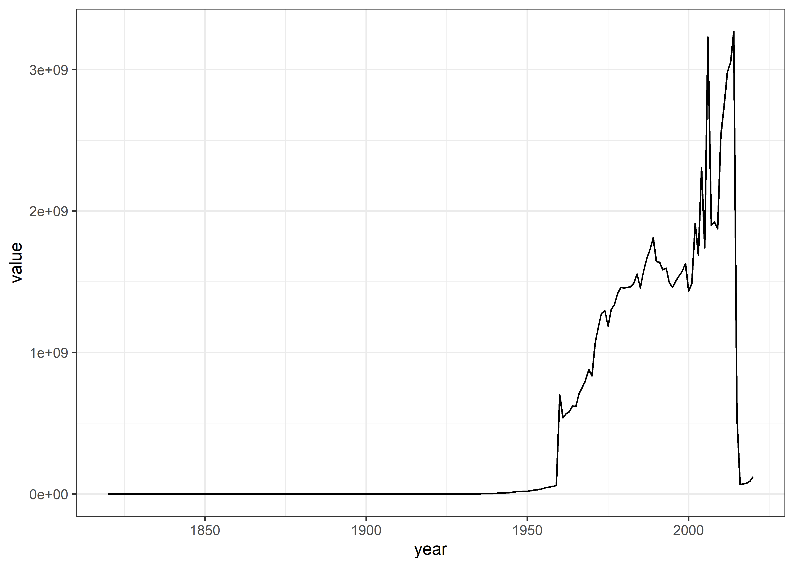<!-- -->

``` r
technology %>%
  filter(variable %in% names) %>% 
  group_by(year) %>% 
  summarize(value = mean(value)) %>% 
  ggplot(aes(year, value)) +
  geom_line() + theme(legend.position = "none")
```

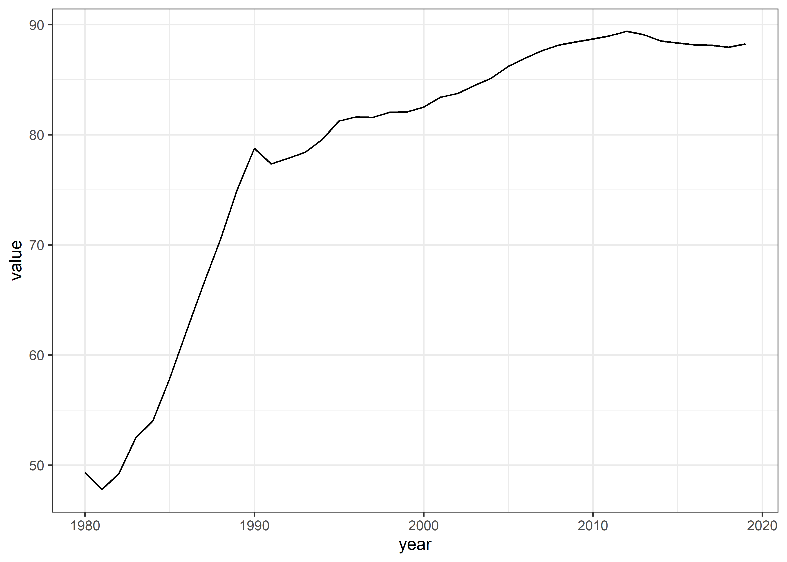<!-- -->

``` r
technology %>%  
  drop_na() %>% 
  filter(category == "Vaccines") %>% 
  group_by(year, continent) %>% 
  summarize(value = mean(value) + 1) %>% 
  ggplot(aes(year, value, color = fct_reorder(continent, value, max, .desc = TRUE))) + geom_line() +
  scale_y_log10() + scale_x_continuous(breaks = seq(1820, 2020, 20)) + 
  labs(title = "Average Vaccination Rate per Continent over time", color = "")
```

    ## `summarise()` has grouped output by 'year'. You can override using the
    ## `.groups` argument.

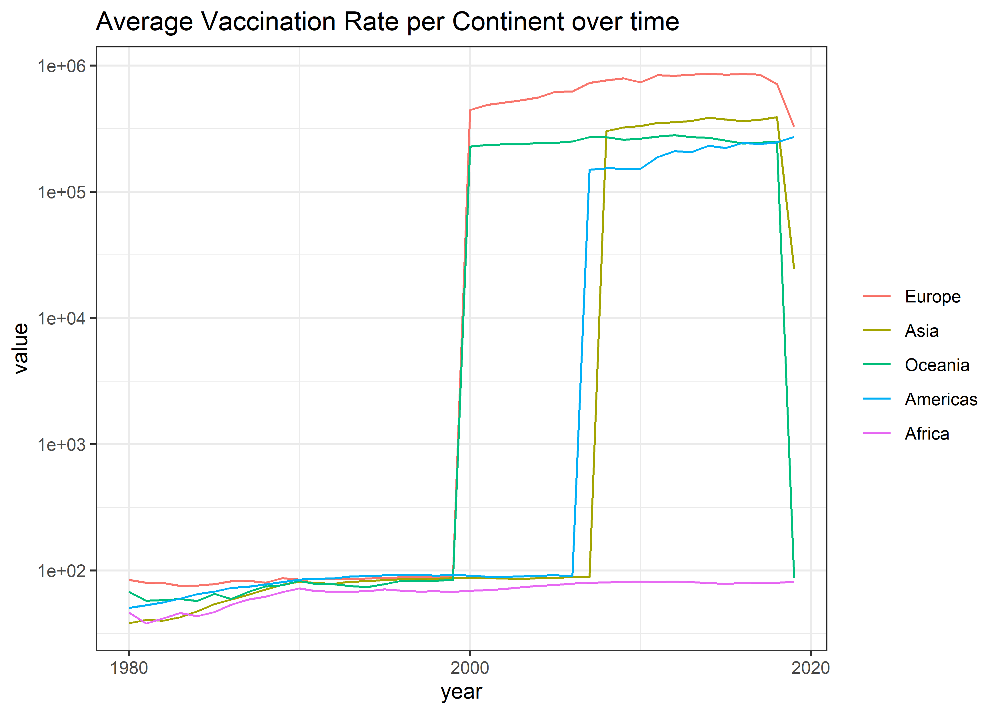<!-- -->

``` r
technology %>% 
  filter(value == 0) %>% 
  group_by(group) %>% 
  summarize(n = n())
```

    ## # A tibble: 3 x 2
    ##   group           n
    ##   <chr>       <int>
    ## 1 Consumption 10370
    ## 2 Non-Tech     1872
    ## 3 Production  38491

# Transport

``` r
technology %>% 
  filter(category == "Transport") %>% 
  count(group, sort = TRUE)
```

    ## # A tibble: 2 x 2
    ##   group           n
    ##   <chr>       <int>
    ## 1 Production  85591
    ## 2 Consumption 27254

``` r
technology %>% 
  filter(category == "Transport") %>% 
  count(label, sort = TRUE)
```

    ## # A tibble: 25 x 2
    ##    label                                                                       n
    ##    <chr>                                                                   <int>
    ##  1 Geographical/route lengths of line open at the end of the year          12324
    ##  2 Passenger car vehicles                                                   8646
    ##  3 Civil aviation ton-KM of cargo carried                                   8477
    ##  4 Freight carried on railways (excluding livestock and passenger baggage~  8290
    ##  5 Passenger journeys by railway (passenger-km)                             7855
    ##  6 Commercial vehicles (bus, taxi)                                          7851
    ##  7 Thousands of passenger journeys by railway                               7842
    ##  8 Metric tons of freight carried on railways (excluding livestock and pa~  7712
    ##  9 Air transport, passengers carried                                        7470
    ## 10 Tonnage of ships of all kinds                                            5007
    ## # ... with 15 more rows

## Vehicles

``` r
gplot <- function(data, x){
  data %>% 
    group_by(continent, year) %>% 
    summarize(value = {{x}}) %>% 
    ggplot(aes(year, value, color = fct_reorder(continent, value, max))) + geom_line() +
    labs(color = "")
}


(technology %>% 
  filter(grepl("vehicle", label)) %>% 
  group_by(continent, year) %>% 
  gplot(mean(value)) + scale_y_log10()) /
(technology %>% 
  filter(grepl("vehicle", label)) %>% 
  gplot(median(value)) + scale_y_log10())
```

    ## `summarise()` has grouped output by 'continent'. You can override using the
    ## `.groups` argument.
    ## `summarise()` has grouped output by 'continent'. You can override using the
    ## `.groups` argument.

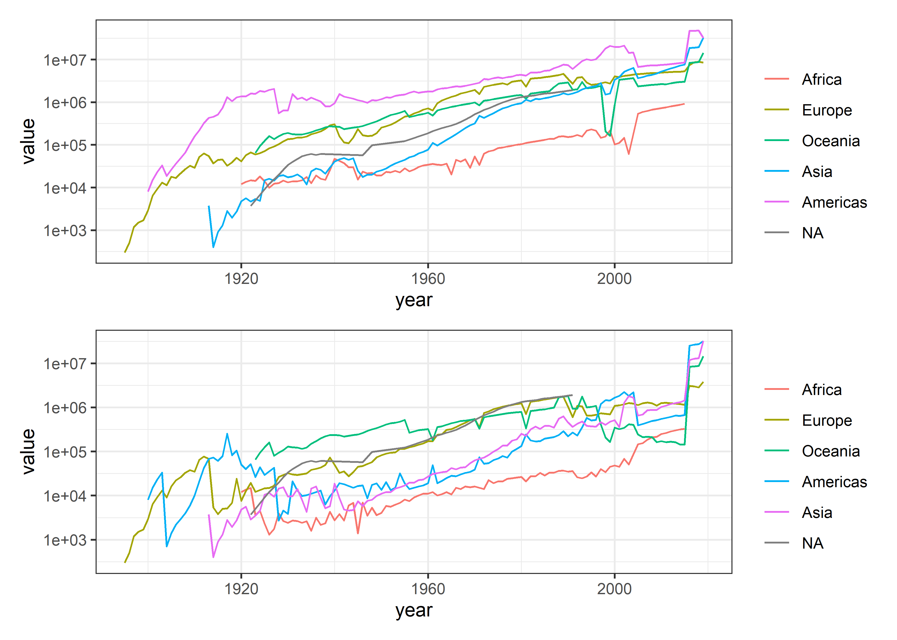<!-- -->

## Routes

``` r
technology %>% 
  filter(grepl("Geographical", label)) %>% 
  gplot(mean(value))
```

    ## `summarise()` has grouped output by 'continent'. You can override using the
    ## `.groups` argument.

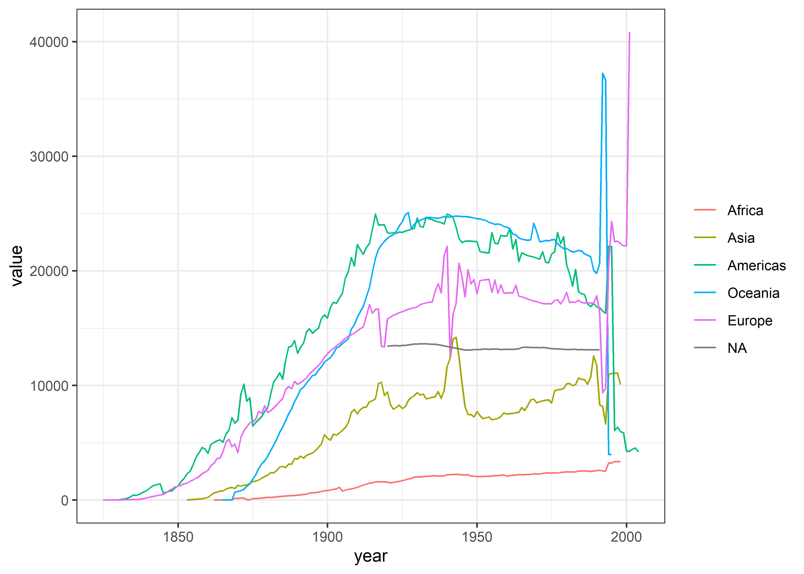<!-- -->

# Hospital

``` r
technology %>% 
  filter(group == "Consumption" & grepl('Hospital', category)) %>% 
  count(label, sort = TRUE) 
```

    ## # A tibble: 47 x 2
    ##    label                                                 n
    ##    <chr>                                             <int>
    ##  1 Kidney transplants                                  834
    ##  2 Total patients receiving dialysis                   702
    ##  3 Total patients receiving home dialysis              598
    ##  4 % Dialysis patients who receive treatment at home   565
    ##  5 Liver transplants                                   417
    ##  6 Heart transplants                                   364
    ##  7 Computed Tomography exams, in hospitals             363
    ##  8 Computed Tomography exams, total                    353
    ##  9 Bone marrow transplants                             340
    ## 10 Magnetic Resonance Imaging exams, in hospitals      339
    ## # ... with 37 more rows

``` r
technology %>% 
  filter(grepl('hospital', label)) %>% 
  group_by(label) %>% 
  summarize(n = mean(value)) %>% 
  arrange(-n)
```

    ## # A tibble: 10 x 2
    ##    label                                                               n
    ##    <chr>                                                           <dbl>
    ##  1 Computed Tomography exams, in hospitals                  4616845.    
    ##  2 Magnetic Resonance Imaging exams, in hospitals           1503054.    
    ##  3 Beds in hospitals                                         163754.    
    ##  4 Positron Emission Tomography (PET) exams, in hospitals    101591.    
    ##  5 % Cataract surgeries without a hospital stay                   0.470 
    ##  6 % Varicose veins procedures without a hospital stay            0.299 
    ##  7 % Hernia procedures without a hospital stay                    0.273 
    ##  8 % Tonsillectomies without a hospital stay                      0.192 
    ##  9 % Laparoscopic cholecystectomies without a hospital stay       0.0451
    ## 10 % Cholecystectomies without a hospital stay                    0.0252

## Transplants

``` r
technology %>% 
  filter(grepl('Hospital', category)) %>% 
  filter(grepl('transplants', label)) %>% 
  mutate(label = str_replace(label, 'transplants', "")) %>% 
  group_by(label, year, continent) %>% 
  summarize(value = mean(value)) %>% 
  ggplot(aes(year, value, color = label)) + geom_line() +
  facet_wrap(~continent) +
  labs(color = "", title = "Type of Transplants over time")
```

    ## `summarise()` has grouped output by 'label', 'year'. You can override using the
    ## `.groups` argument.

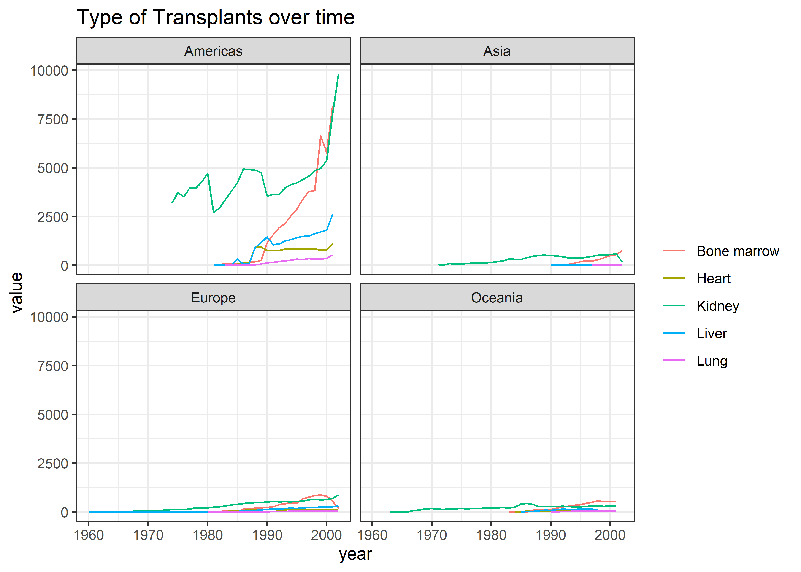<!-- -->

``` r
technology %>% 
  filter(grepl("dialysis", label)) %>% 
  gplot(mean(value))
```

    ## `summarise()` has grouped output by 'continent'. You can override using the
    ## `.groups` argument.

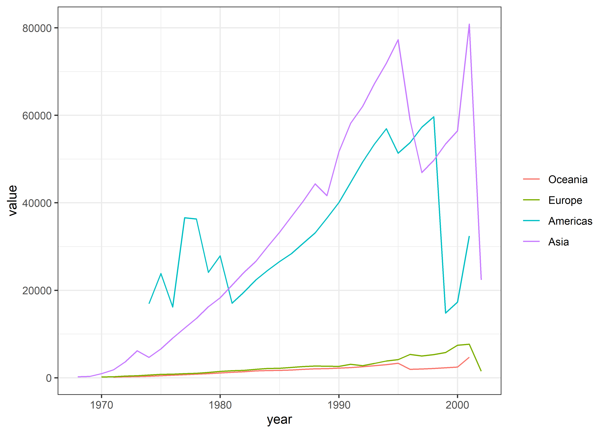<!-- -->

``` r
technology %>% 
  filter(grepl("dialysis", label)) %>% 
  mutate(label = ifelse(grepl("home", label), "home", "hospital")) %>% 
  group_by(label, year) %>% 
  summarize(value = mean(value)) %>% 
  ggplot(aes(year, value, color = label)) + geom_line() +
  labs(color = "", title = "Dialysis at Home or Hopsital", 
       caption = "Data goes from 1968 to 2002") + 
  theme(plot.caption = element_text(hjust = 0.5)) +
  scale_x_continuous(breaks = c(1968, seq(1974, 2002, 4)))
```

    ## `summarise()` has grouped output by 'label'. You can override using the
    ## `.groups` argument.

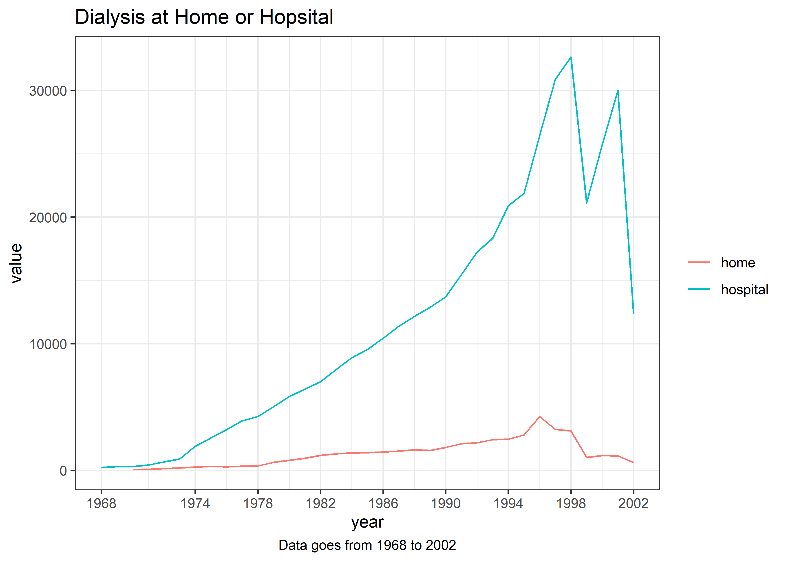<!-- -->

## Tomography

``` r
technology %>% 
  filter(grepl("Tomography", label) & grepl("total", label)) %>% 
  group_by(label, year) %>% 
  summarize(value = mean(value)) %>% 
  ggplot(aes(year, value, color = label)) + geom_line() +
  scale_y_log10(label = comma)
```

    ## `summarise()` has grouped output by 'label'. You can override using the
    ## `.groups` argument.

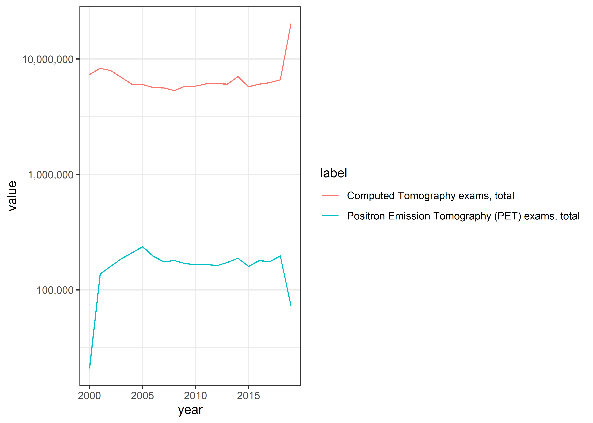<!-- -->

``` r
technology %>% 
  filter(grepl("Tomography", label) & grepl("total", label)) %>% 
  gplot(mean(value))
```

    ## `summarise()` has grouped output by 'continent'. You can override using the
    ## `.groups` argument.

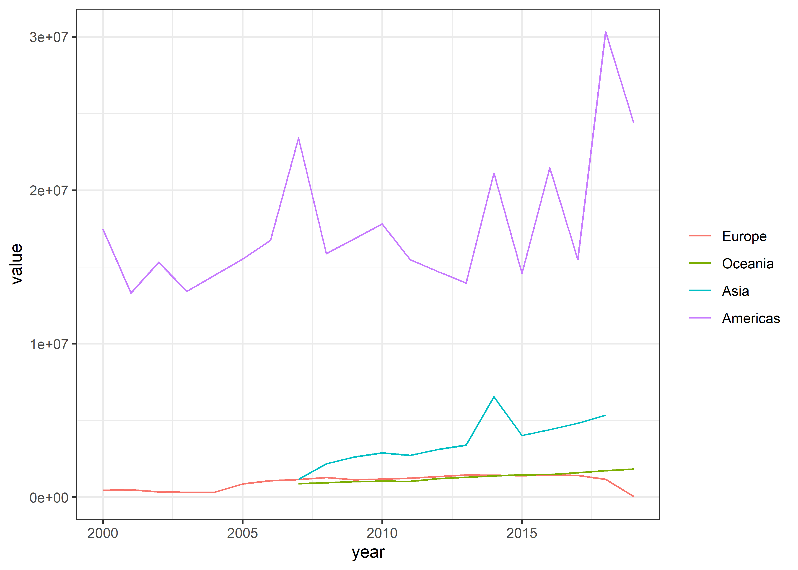<!-- -->

# Country

## Dialysis

``` r
technology %>% 
  filter(grepl("dialysis", label)) %>% 
  mutate(temp_country = ifelse(grepl("United States", country), country, "All Other")) %>%
  group_by(year, temp_country) %>% 
  summarize(value = mean(value)) %>% 
  ggplot(aes(year, value, color = temp_country)) + geom_line()
```

    ## `summarise()` has grouped output by 'year'. You can override using the
    ## `.groups` argument.

<!-- -->

``` r
technology %>% 
  filter(grepl("Geographical", label)) %>%  
  mutate(continent = ifelse(grepl("United States", country), country, "All Other")) %>%
  gplot(sum(value))
```

    ## `summarise()` has grouped output by 'continent'. You can override using the
    ## `.groups` argument.

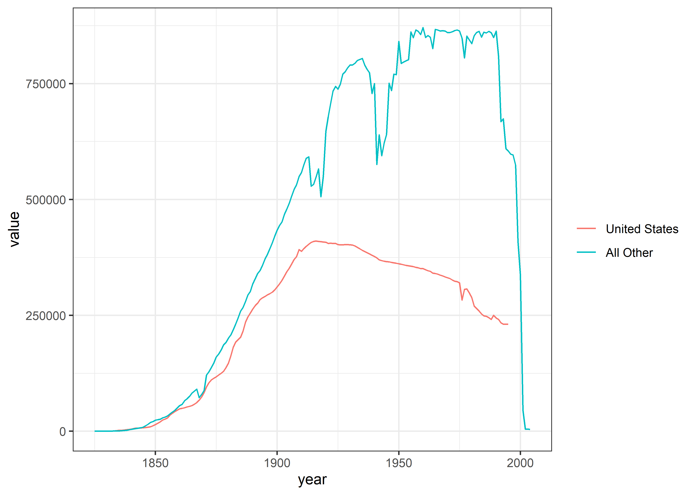<!-- -->

# Nested Country Model

## Dialysis

``` r
tidy_tech <- technology %>% 
  filter(grepl("dialysis", label)) %>% 
  group_by(country, year) %>% 
  summarize(value = mean(value)) %>% 
  nest(-country) %>% 
  mutate(model = map(data, ~lm(value ~ year, .)),
         tidy = map(model, broom::tidy)) %>% 
  unnest(tidy)
```

    ## `summarise()` has grouped output by 'country'. You can override using the
    ## `.groups` argument.

``` r
tidy_tech %>% 
  filter(term == "year" & p.value < 0.05) %>% 
  arrange(-abs(estimate))
```

    ## # A tibble: 28 x 8
    ## # Groups:   country [28]
    ##    country        data     model  term  estimate std.error statistic  p.value
    ##    <chr>          <list>   <list> <chr>    <dbl>     <dbl>     <dbl>    <dbl>
    ##  1 United States  <tibble> <lm>   year     4714.     266.      17.7  6.43e-15
    ##  2 Japan          <tibble> <lm>   year     3906.     389.      10.0  2.02e-11
    ##  3 Mexico         <tibble> <lm>   year     3755.     404.       9.29 2.43e- 4
    ##  4 Germany        <tibble> <lm>   year      871.      58.8     14.8  2.40e-15
    ##  5 Poland         <tibble> <lm>   year      794.     224.       3.55 2.02e- 3
    ##  6 Spain          <tibble> <lm>   year      550.      47.9     11.5  4.23e-12
    ##  7 Italy          <tibble> <lm>   year      447.      19.1     23.4  5.01e-18
    ##  8 France         <tibble> <lm>   year      416.      22.7     18.3  1.35e-15
    ##  9 Canada         <tibble> <lm>   year      366.      22.7     16.1  1.51e-12
    ## 10 United Kingdom <tibble> <lm>   year      362.      32.5     11.1  5.80e-11
    ## # ... with 18 more rows

``` r
tidy_tech %>% 
  filter(term == "year" & p.value > 0.05) %>% 
  arrange(-abs(estimate)) 
```

    ## # A tibble: 1 x 8
    ## # Groups:   country [1]
    ##   country data             model  term  estimate std.error statistic p.value
    ##   <chr>   <list>           <list> <chr>    <dbl>     <dbl>     <dbl>   <dbl>
    ## 1 Turkey  <tibble [7 x 2]> <lm>   year     1906.      770.      2.48  0.0561

``` r
tidy_tech_joined <- tidy_tech %>% 
  filter(term == "year") %>% 
  inner_join(technology %>% distinct(country, continent)) 
```

    ## Joining, by = "country"

``` r
tidy_tech_joined %>% 
  filter(country != "Iceland") %>% 
  ggplot(aes(estimate, fct_reorder(country, estimate))) +
  geom_col(aes(fill = continent)) + 
  geom_errorbarh(aes(xmin = estimate - std.error, xmax = estimate + std.error)) +
  labs(y = "") + scale_x_log10(limits = c(1, 10000), labels = comma)
```

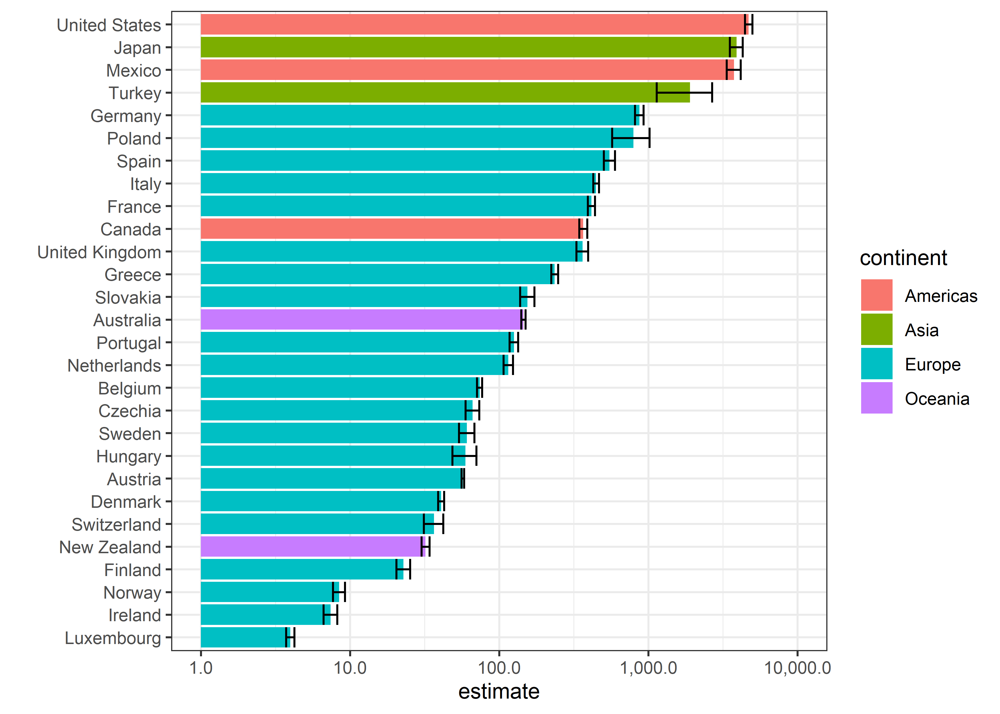<!-- -->

``` r
tidy_names <- tidy_tech_joined %>% 
  arrange(desc(estimate)) %>% 
  head(10) %>% 
  pull(country)

technology %>% 
  filter(grepl("dialysis", label) & country %in% tidy_names) %>% 
  group_by(country, year) %>% 
  summarize(value = mean(value)) %>% 
  ggplot(aes(year, value)) + geom_line() + geom_smooth(method = "lm", se = FALSE) +
  facet_wrap(~country, scales = "free")
```

    ## `summarise()` has grouped output by 'country'. You can override using the
    ## `.groups` argument.
    ## `geom_smooth()` using formula 'y ~ x'

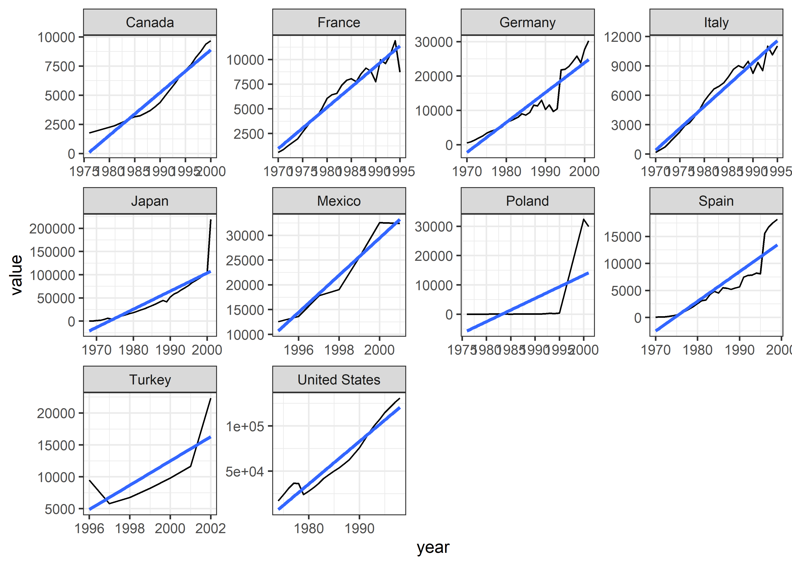<!-- -->

# Internet

``` r
technology %>% 
  filter(grepl("internet", label)) %>% 
  count(label, sort = TRUE)
```

    ## # A tibble: 2 x 2
    ##   label                           n
    ##   <chr>                       <int>
    ## 1 People with internet access  4883
    ## 2 Secure internet servers      2333

``` r
internet <- technology %>% 
  filter(grepl("internet", label))
```

``` r
internet %>% 
  gplot(mean(value))
```

    ## `summarise()` has grouped output by 'continent'. You can override using the
    ## `.groups` argument.

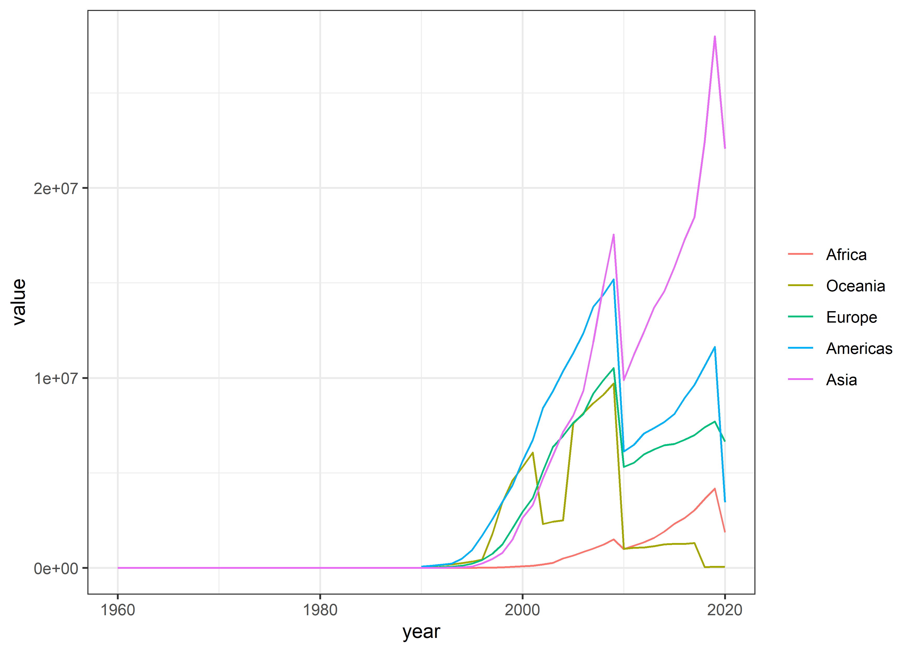<!-- -->

``` r
(internet %>% 
  filter(grepl("People", label)) %>% 
  ggplot(aes(year, value, color = country)) +
  geom_line() + theme(legend.position = "none") +
  gghighlight(max(value), max_highlight = 5L) +
  labs(title = "People with internet access", subtitle = "Not per capita")) +
(internet %>% 
  filter(!grepl("People", label)) %>% 
  ggplot(aes(year, value, color = country)) +
  geom_line() + theme(legend.position = "none") +
  gghighlight(max(value), max_highlight = 5L) +
  labs(title = "Secure Internet Servers") + scale_x_continuous(breaks = seq(2010, 2020, 2)))
```

    ## label_key: country
    ## label_key: country

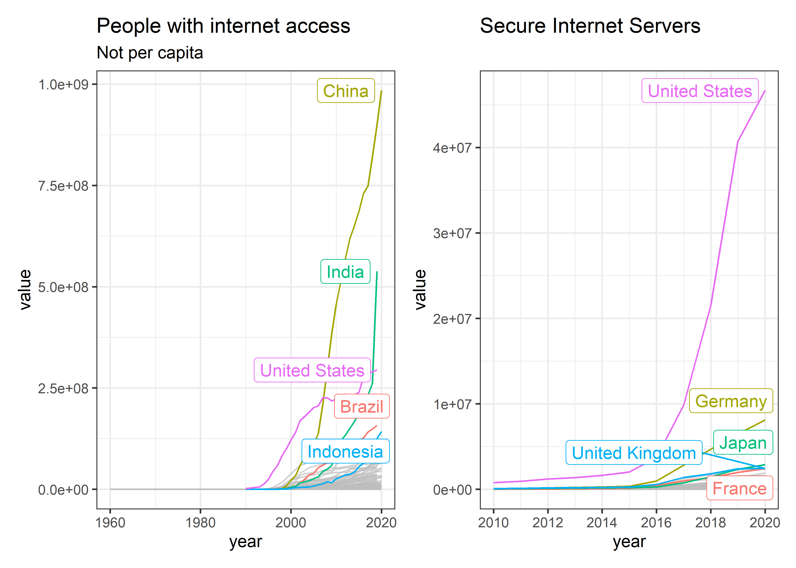<!-- -->

``` r
technology %>% 
  filter(country == "United States") %>% 
  ggplot(aes(year, value, color = label)) +
  geom_line() + gghighlight(max(value), max_highlight = 5L) +
  scale_y_log10()
```

    ## label_key: label

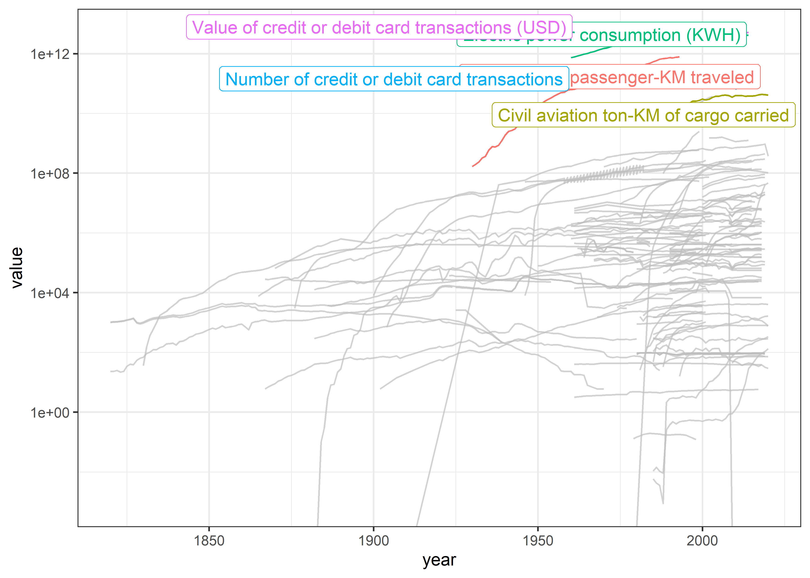<!-- -->
