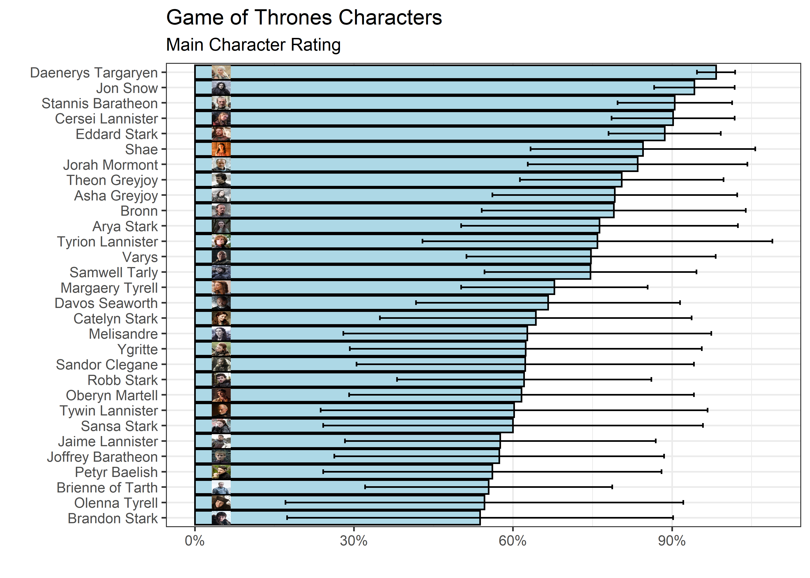
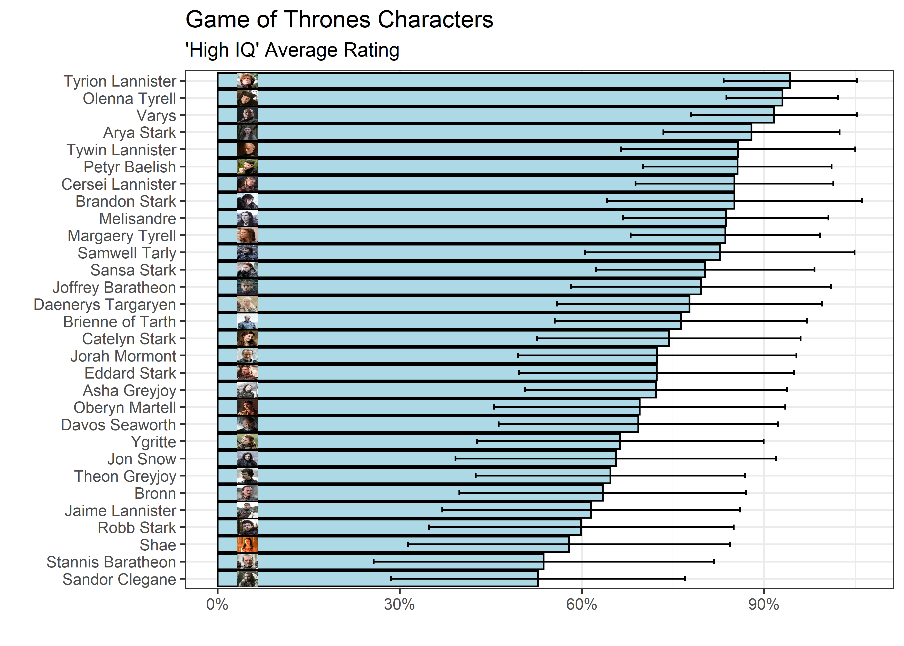
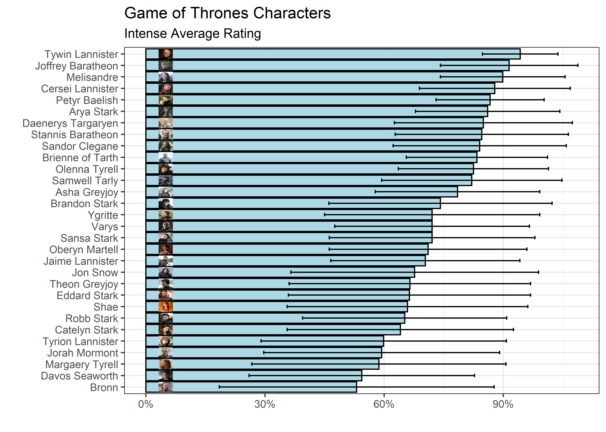
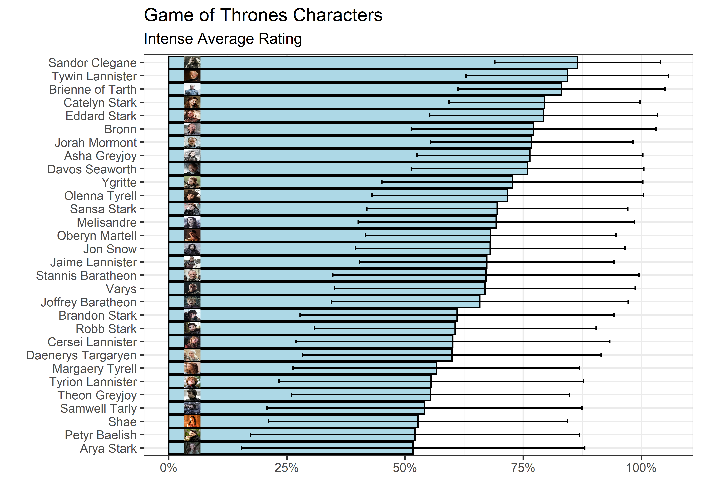
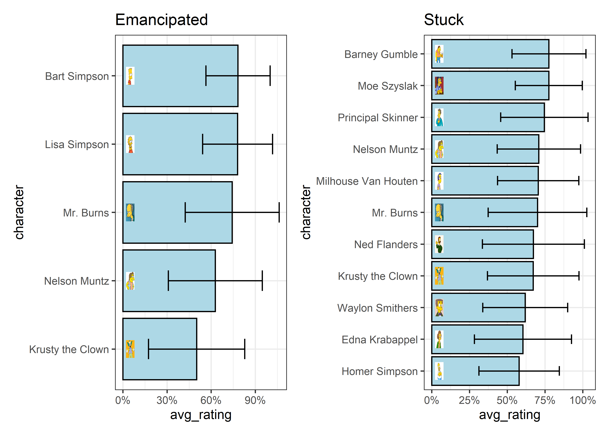

Open Psychometrics
================
Matthew
2022-08-16

-   <a href="#web-scraping-code-derived-from-tanya-shapiro"
    id="toc-web-scraping-code-derived-from-tanya-shapiro">Web-scraping (code
    derived from Tanya Shapiro)</a>
-   <a href="#game-of-thrones-characters"
    id="toc-game-of-thrones-characters">Game of Thrones Characters</a>
    -   <a href="#trait-plot-function" id="toc-trait-plot-function">Trait Plot
        Function</a>
    -   <a href="#plots" id="toc-plots">Plots</a>
-   <a href="#simpsons" id="toc-simpsons">Simpsons</a>
    -   <a href="#plot-2-random-traits" id="toc-plot-2-random-traits">Plot 2
        random traits</a>

``` r
characters <- read_csv('https://raw.githubusercontent.com/rfordatascience/tidytuesday/master/data/2022/2022-08-16/characters.csv')
```

    ## Rows: 889 Columns: 7
    ## -- Column specification --------------------------------------------------------
    ## Delimiter: ","
    ## chr (6): id, name, uni_id, uni_name, link, image_link
    ## dbl (1): notability
    ## 
    ## i Use `spec()` to retrieve the full column specification for this data.
    ## i Specify the column types or set `show_col_types = FALSE` to quiet this message.

``` r
head(characters)
```

    ## # A tibble: 6 x 7
    ##   id    name           uni_id uni_name notability link                image_link
    ##   <chr> <chr>          <chr>  <chr>         <dbl> <chr>               <chr>     
    ## 1 F2    Monica Geller  F      Friends        79.7 https://openpsycho~ https://o~
    ## 2 F1    Rachel Green   F      Friends        76.7 https://openpsycho~ https://o~
    ## 3 F5    Chandler Bing  F      Friends        74.4 https://openpsycho~ https://o~
    ## 4 F4    Joey Tribbiani F      Friends        74.3 https://openpsycho~ https://o~
    ## 5 F3    Phoebe Buffay  F      Friends        72.6 https://openpsycho~ https://o~
    ## 6 F6    Ross Geller    F      Friends        51.6 https://openpsycho~ https://o~

``` r
skimr::skim(characters)
```

|                                                  |            |
|:-------------------------------------------------|:-----------|
| Name                                             | characters |
| Number of rows                                   | 889        |
| Number of columns                                | 7          |
| \_\_\_\_\_\_\_\_\_\_\_\_\_\_\_\_\_\_\_\_\_\_\_   |            |
| Column type frequency:                           |            |
| character                                        | 6          |
| numeric                                          | 1          |
| \_\_\_\_\_\_\_\_\_\_\_\_\_\_\_\_\_\_\_\_\_\_\_\_ |            |
| Group variables                                  | None       |

Data summary

**Variable type: character**

| skim_variable | n_missing | complete_rate | min | max | empty | n_unique | whitespace |
|:--------------|----------:|--------------:|----:|----:|------:|---------:|-----------:|
| id            |         0 |             1 |   2 |   7 |     0 |      889 |          0 |
| name          |         0 |             1 |   2 |  44 |     0 |      885 |          0 |
| uni_id        |         0 |             1 |   1 |   6 |     0 |      100 |          0 |
| uni_name      |         0 |             1 |   2 |  33 |     0 |      100 |          0 |
| link          |         0 |             1 |  56 |  61 |     0 |      889 |          0 |
| image_link    |         0 |             1 |  74 |  79 |     0 |      889 |          0 |

**Variable type: numeric**

| skim_variable | n_missing | complete_rate |  mean |    sd |   p0 |  p25 |  p50 | p75 | p100 | hist  |
|:--------------|----------:|--------------:|------:|------:|-----:|-----:|-----:|----:|-----:|:------|
| notability    |         0 |             1 | 67.63 | 17.39 | 18.4 | 55.6 | 71.7 |  81 | 96.9 | ▁▃▅▇▆ |

``` r
characters %>% 
  group_by(uni_name) %>% 
  summarize(m = mean(notability)) %>% 
  arrange(-m) %>%
  mutate(uni_name = fct_reorder(uni_name, m)) %>% 
  slice(c(1:10, 91:100)) %>% 
  ggplot(aes(m, uni_name, fill = 60 > m)) + geom_col(color = "black") +
  labs(y = "", x = "Average Notability", title = "Average Notability of Characters in Shows") +
  theme(plot.title = element_text(hjust = 0.5), legend.position = "none") + 
  scale_fill_manual(values = c("lightblue", "darkred"))
```

<!-- -->

# Web-scraping (code derived from Tanya Shapiro)

``` r
got_profiles <- read_csv("got_profiles.csv")
```

    ## Rows: 12030 Columns: 6
    ## -- Column specification --------------------------------------------------------
    ## Delimiter: ","
    ## chr (2): trait, character
    ## dbl (4): avg_rating, rank, rating_sd, number_ratings
    ## 
    ## i Use `spec()` to retrieve the full column specification for this data.
    ## i Specify the column types or set `show_col_types = FALSE` to quiet this message.

``` r
got_profiles <- got_profiles %>%  
    left_join(characters %>% select(character = name, image_link))
```

    ## Joining, by = "character"

# Game of Thrones Characters

## Trait Plot Function

``` r
gplot <- function(x){
  got_profiles %>% 
    filter(str_detect(trait, {{x}})) %>% 
    mutate(character = fct_reorder(character, avg_rating)) %>% 
    ggplot(aes(avg_rating, character)) + geom_col(color = "black", fill = "lightblue") +
    geom_image(aes(image = image_link, x = 5), size = 0.03) + 
    geom_errorbarh(aes(xmax = avg_rating+rating_sd, xmin = avg_rating-rating_sd, height = 0.3)) +
    scale_x_continuous(label = percent_format(scale = 1))
}
```

## Plots

``` r
gplot("main character") + labs(y = "", x = "", title = "Game of Thrones Characters",
                               subtitle = "Main Character Rating")
```

<!-- -->

``` r
gplot("high IQ") + labs(y = "", x = "", title = "Game of Thrones Characters", 
                        subtitle = "'High IQ' Average Rating")
```

<!-- -->

``` r
gplot("intense") + labs(y = "", x = "", title = "Game of Thrones Characters", 
                        subtitle = "Intense Average Rating")
```

<!-- -->

``` r
gplot("practical") + labs(y = "", x = "", title = "Game of Thrones Characters", 
                        subtitle = "Intense Average Rating")
```

<!-- -->

# Simpsons

``` r
#scrape personality details
get_personality<-function(url){
  html = url%>%read_html()
  
  character = html%>%
    html_elements("h3")%>%
    head(1)%>%
    html_text()
  
  data= html%>%
    html_elements("table.zui-table")%>%
    html_table()%>%
    .[[1]]
  
  names(data)=c("item","avg_rating","rank","rating_sd","number_ratings")
  data$character = str_replace(character," Descriptive Personality Statistics","")
  
  data
}

base_url<-'https://openpsychometrics.org/tests/characters/stats/S/'

simpsons_profiles<-data.frame()
#create a loop to scrape all characters, there are a total of 15 characters profiled, use range 1:16
for(i in 1:16){
  url<-paste0(base_url, i)
  temp_data<-get_personality(url)
  simpsons_profiles<-rbind(simpsons_profiles,temp_data)
}

write_csv(simpsons_profiles, "08-16-22/simpsons_profiles.csv")
```

``` r
simpsons_profiles <- read_csv("simpsons_profiles.csv")
```

    ## Rows: 6015 Columns: 6
    ## -- Column specification --------------------------------------------------------
    ## Delimiter: ","
    ## chr (2): item, character
    ## dbl (4): avg_rating, rank, rating_sd, number_ratings
    ## 
    ## i Use `spec()` to retrieve the full column specification for this data.
    ## i Specify the column types or set `show_col_types = FALSE` to quiet this message.

``` r
simpsons_profiles <- simpsons_profiles %>% 
  left_join(characters %>% select(character = name, image_link))
```

    ## Joining, by = "character"

``` r
simpsons_profiles %>% 
  distinct(item)
```

    ## # A tibble: 799 x 1
    ##    item                                 
    ##    <chr>                                
    ##  1 "disorganized (not self-disciplined)"
    ##  2 "impulsive (not cautious)"           
    ##  3 "messy (not neat)"                   
    ##  4 "\U0001f6cc (not \U0001f9d7)"        
    ##  5 "loud (not quiet)"                   
    ##  6 "goof-off (not studious)"            
    ##  7 "lazy (not diligent)"                
    ##  8 "chaotic (not orderly)"              
    ##  9 "clumsy (not coordinated)"           
    ## 10 "cannibal (not vegan)"               
    ## # ... with 789 more rows

``` r
mutated_items <- simpsons_profiles %>% 
  mutate(item = str_replace(item, "\\(.*","")) %>% 
  pull(item)
```

``` r
gplot2 <- function(data, x){
  data %>% 
    filter(str_detect(item, {{x}})) %>%  
    mutate(character = fct_reorder(character, avg_rating)) %>% 
    ggplot(aes(avg_rating, character)) + geom_col(color = "black", fill = "lightblue") +
    geom_image(aes(image = image_link, x = 5)) + 
    geom_errorbarh(aes(xmax = avg_rating+rating_sd, xmin = avg_rating-rating_sd, height = 0.3)) +
    scale_x_continuous(label = percent_format(scale = 1)) + labs(title = str_to_title(x))
}
```

## Plot 2 random traits

``` r
names <- sample(mutated_items, 2)

for(i in 1:2){
  x <- names[i]
  if(i == 1){
    plot1 <- gplot2(simpsons_profiles, x)
  } else{
    plot2 <- gplot2(simpsons_profiles, x)}
}

plot1 + plot2
```

<!-- -->
