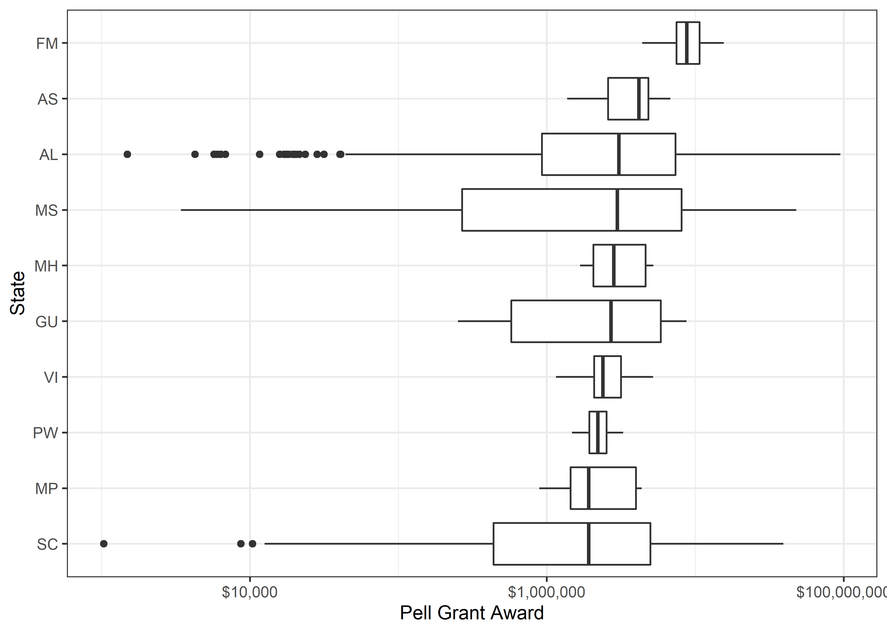

Pell Grant
================
Matthew
2022-08-30

-   <a href="#eda" id="toc-eda">EDA</a>

# EDA

``` r
pell %>% 
  ggplot(aes(award)) + geom_histogram() +
  scale_x_log10()
```

    ## `stat_bin()` using `bins = 30`. Pick better value with `binwidth`.

<!-- -->

``` r
pell %>% 
  group_by(state) %>% 
  mutate(median = median(award)) %>% 
  filter(median >= 1918842) %>% 
  ggplot(aes(award, fct_reorder(state, award))) + geom_boxplot() +
  scale_x_log10(label = dollar) + labs(y = "State", x = "Pell Grant Award")
```

<!-- -->
