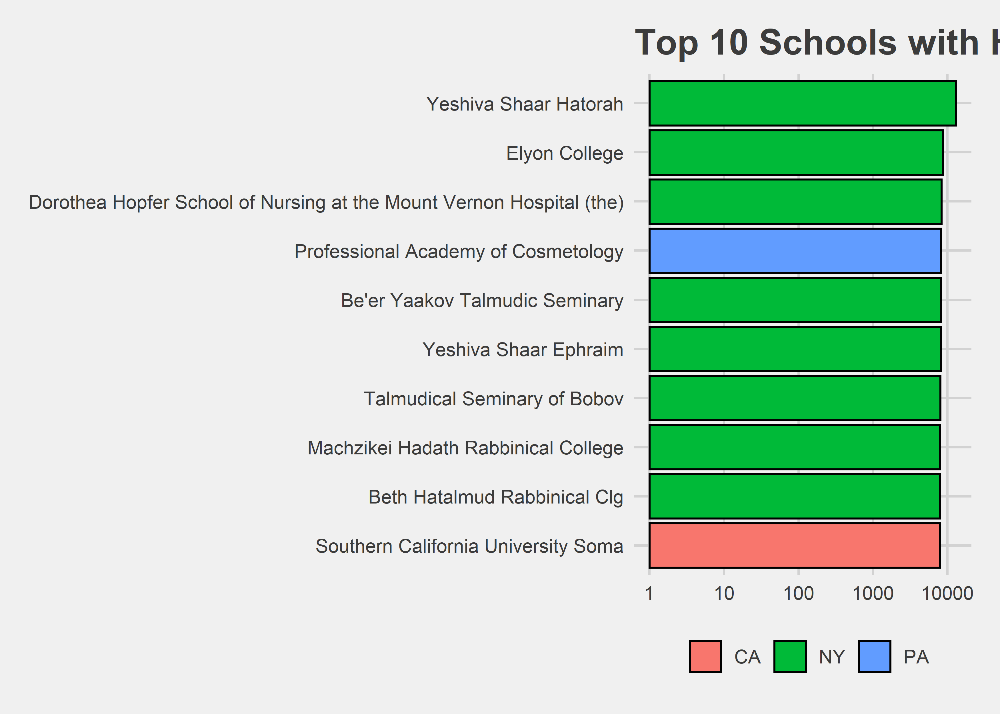
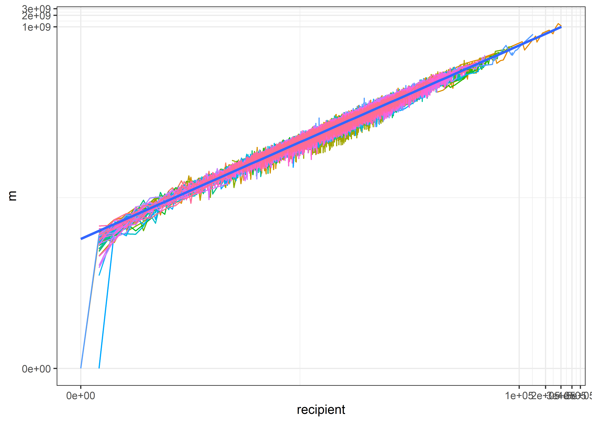
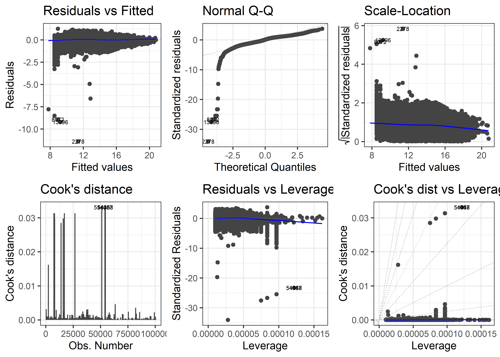
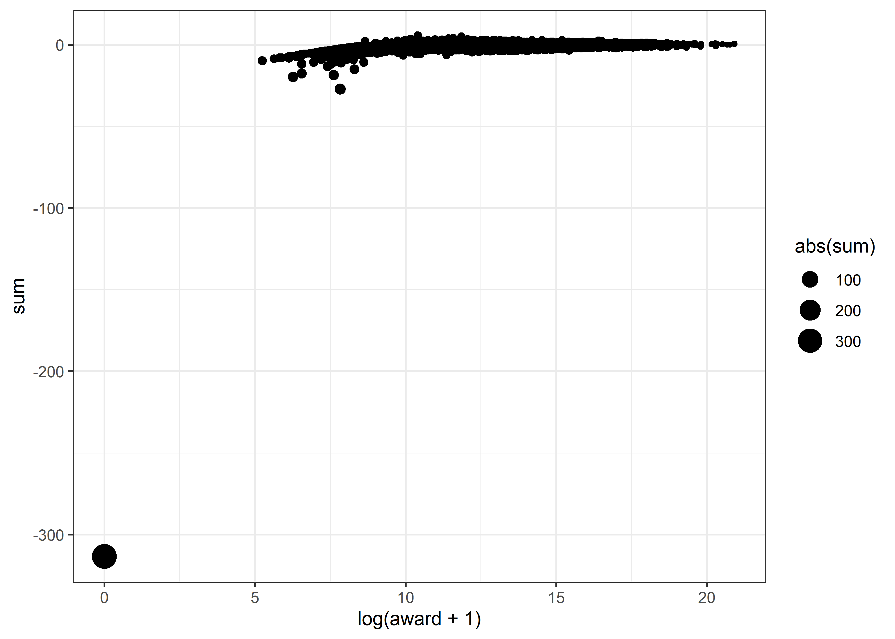

Pell Grant
================
Matthew
2022-08-30

-   <a href="#clean-data" id="toc-clean-data">Clean Data</a>
-   <a href="#eda" id="toc-eda">EDA</a>
    -   <a href="#map" id="toc-map">Map</a>
    -   <a href="#top-pell-grant-recipients"
        id="toc-top-pell-grant-recipients">Top Pell Grant Recipients</a>
    -   <a href="#pell-grants-per-recipients"
        id="toc-pell-grants-per-recipients">Pell Grants per Recipients</a>
    -   <a href="#award-by-recipient" id="toc-award-by-recipient">Award by
        recipient</a>
-   <a href="#model" id="toc-model">Model</a>

# Clean Data

``` r
names(pell) <- names(pell) %>% tolower()

tbjoin <- as_tibble(cbind(state_name = state.name, state = state.abb))

pell <- pell %>% 
  left_join(tbjoin)
```

    ## Joining, by = "state"

``` r
pell %>% filter(is.na(state_name)) %>% count(state, sort = TRUE)
```

    ## # A tibble: 9 x 2
    ##   state     n
    ##   <chr> <int>
    ## 1 PR     1925
    ## 2 DC      318
    ## 3 GU       56
    ## 4 VI       28
    ## 5 AS       19
    ## 6 FM       19
    ## 7 MH       19
    ## 8 MP       19
    ## 9 PW       19

``` r
pell <- pell %>% 
  mutate(state_name = case_when(state == "PR" ~ "Puerto Rico",
                                state == "DC" ~ "District of Columbia",
                                state == "GU" ~ "Guam",
                                state == "VI" ~ "Virgin Islands",
                                state == "AS" ~ "American Samoa",
                                state == "FM" ~ "Federated States of Micronesia",
                                state == "MH" ~ "Marshall Islands",
                                state == "MP" ~ "Northern Mariana Islands",
                                state == "PW" ~ "Palau",
                                TRUE ~ as.character(state_name)))
```

# EDA

``` r
pell %>% 
  ggplot(aes(award)) + geom_histogram() +
  scale_x_log10()
```

    ## `stat_bin()` using `bins = 30`. Pick better value with `binwidth`.

<!-- -->

``` r
pell %>% 
  group_by(state_name) %>% 
  mutate(median = median(award, na.rm = TRUE)) %>% 
  filter(median >= 1920043) %>% 
  ggplot(aes(award, fct_reorder(state_name, median))) + geom_boxplot() +
  scale_x_log10(label = dollar) + labs(y = "State", x = "Pell Grant Award")
```

<!-- -->

``` r
pell %>% 
  group_by(year) %>% 
  summarize(award = median(award, na.rm = TRUE)) %>% 
  ggplot(aes(year, award)) + geom_line()
```

<!-- -->

## Map

``` r
plot_usmap(data = pell %>% 
             filter(year == max(year)) %>% 
             group_by(state) %>% 
             summarize(award = median(award, na.rm = TRUE)), 
           values = "award") +
  theme(legend.position = "right")
```

<!-- -->

## Top Pell Grant Recipients

``` r
pell %>% 
  group_by(name, state_name) %>% 
  summarize(award = max(award)) %>% 
  head(10) %>% 
  mutate(name = str_remove_all(name, "\""),
         name = ifelse(grepl("Art Institute", name), 
                       "Art Institute of Pittsburgh", name)) %>% 
  ggplot(aes(award, fct_reorder(name, award))) + 
  geom_col(color = "black", aes(fill = state_name)) +
  scale_x_log10(labels = dollar, breaks = c(1e3, 1e5, 1e7)) + 
  ggthemes::theme_fivethirtyeight() +
  labs(fill = "")
```

    ## `summarise()` has grouped output by 'name'. You can override using the
    ## `.groups` argument.

<!-- -->

## Pell Grants per Recipients

``` r
pell %>% 
  mutate(per = award/recipient) %>% 
  arrange(-per) %>% 
  head(10) %>% 
  ggplot(aes(per, fct_reorder(name, per))) + 
  geom_col(color = "black", aes(fill = state)) + 
  scale_x_log10() + theme_fivethirtyeight() +
  labs(fill = "", x = "Average award per recipient", 
       y = "School", title = "Top 10 Schools with Highest Pell Grants per Recipient")
```

<!-- -->

## Award by recipient

``` r
pell %>% 
  group_by(recipient, state) %>% 
  summarize(m = median(award)) %>% 
  ggplot(aes(recipient, m)) + geom_line(aes(color = state)) +
  theme(legend.position = "none") + geom_smooth(method = "lm", se = FALSE) +
  scale_x_continuous(trans=scales::pseudo_log_trans(base = 10)) +
  scale_y_continuous(trans=scales::pseudo_log_trans(base = 10))
```

    ## `summarise()` has grouped output by 'recipient'. You can override using the
    ## `.groups` argument.
    ## `geom_smooth()` using formula 'y ~ x'

<!-- -->

# Model

``` r
model <- lm(log(award + 1) ~ log(recipient + 1), pell) 

model %>% summary()
```

    ## 
    ## Call:
    ## lm(formula = log(award + 1) ~ log(recipient + 1), data = pell)
    ## 
    ## Residuals:
    ##      Min       1Q   Median       3Q      Max 
    ## -11.3877  -0.2284   0.0282   0.2630   1.2466 
    ## 
    ## Coefficients:
    ##                     Estimate Std. Error t value Pr(>|t|)    
    ## (Intercept)        7.7939042  0.0036888    2113   <2e-16 ***
    ## log(recipient + 1) 1.0278338  0.0006061    1696   <2e-16 ***
    ## ---
    ## Signif. codes:  0 '***' 0.001 '**' 0.01 '*' 0.05 '.' 0.1 ' ' 1
    ## 
    ## Residual standard error: 0.3343 on 100468 degrees of freedom
    ##   (4 observations deleted due to missingness)
    ## Multiple R-squared:  0.9662, Adjusted R-squared:  0.9662 
    ## F-statistic: 2.876e+06 on 1 and 100468 DF,  p-value: < 2.2e-16

``` r
autoplot(model, which = 1:6, ncol = 3, label.size = 2)
```

<!-- -->

``` r
model %>% broom::augment() %>% 
  arrange(desc(abs(.std.resid))) %>%
  group_by(`log(award + 1)`) %>% 
  summarize(sum = sum(.std.resid)) %>% 
  ggplot(aes(`log(award + 1)`, sum)) + geom_point(aes(size = abs(sum)))
```

<!-- -->

The overwhelming majority of the error comes from instances where the
award is 0.
