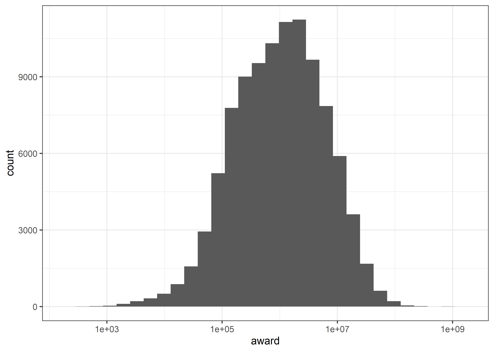
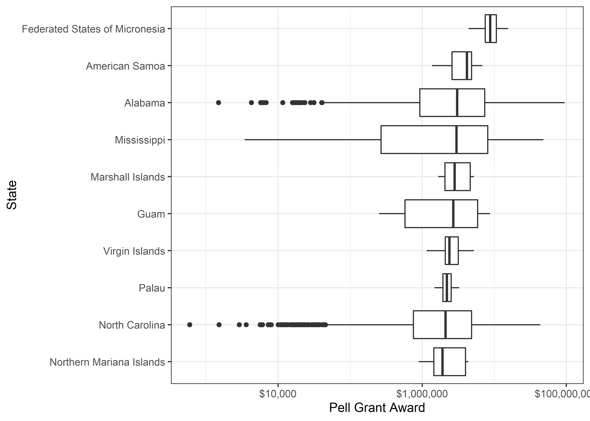
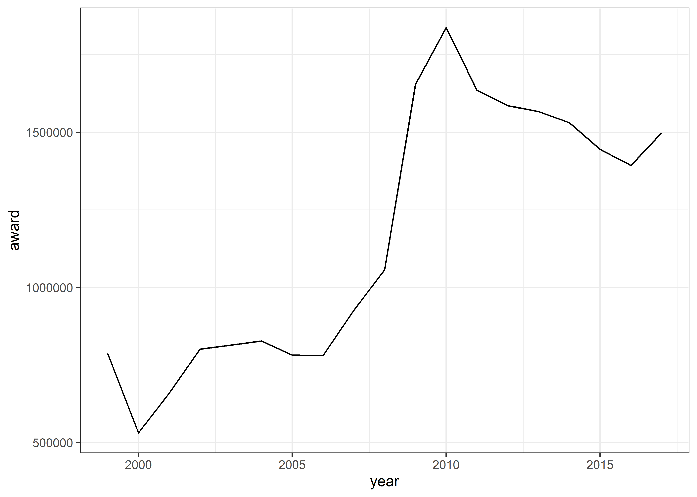
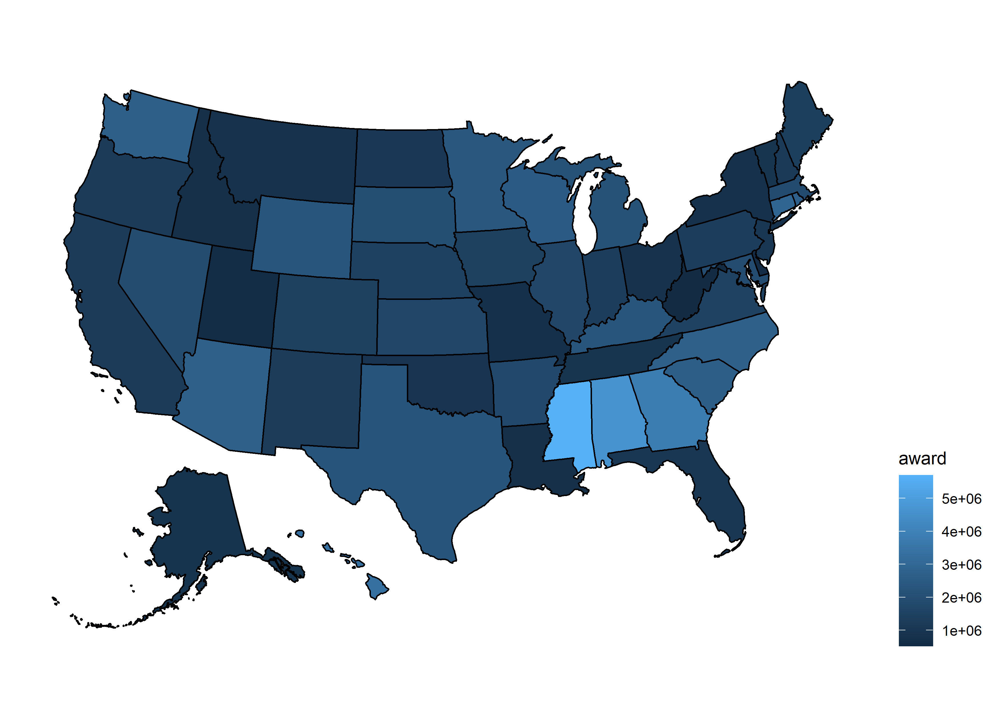
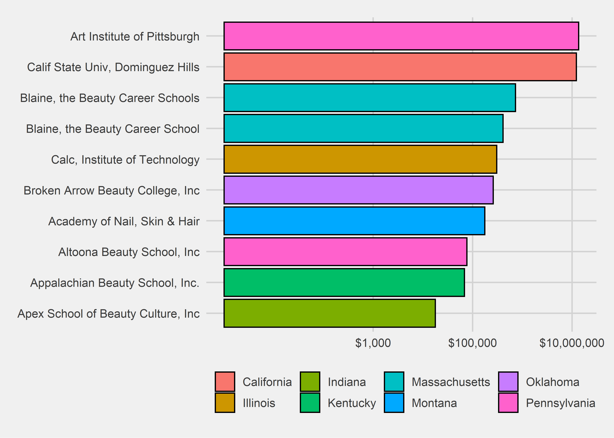

Pell Grant
================
Matthew
2022-08-30

-   <a href="#eda" id="toc-eda">EDA</a>
    -   <a href="#map" id="toc-map">Map</a>

\#Clean Data

``` r
names(pell) <- names(pell) %>% tolower()

tbjoin <- as_tibble(cbind(state_name = state.name, state = state.abb))

pell <- pell %>% 
  left_join(tbjoin)
```

    ## Joining, by = "state"

``` r
pell %>% filter(is.na(state_name)) %>% count(state, sort = TRUE)
```

    ## # A tibble: 9 x 2
    ##   state     n
    ##   <chr> <int>
    ## 1 PR     1925
    ## 2 DC      318
    ## 3 GU       56
    ## 4 VI       28
    ## 5 AS       19
    ## 6 FM       19
    ## 7 MH       19
    ## 8 MP       19
    ## 9 PW       19

``` r
pell <- pell %>% 
  mutate(state_name = case_when(state == "PR" ~ "Puerto Rico",
                                state == "DC" ~ "District of Columbia",
                                state == "GU" ~ "Guam",
                                state == "VI" ~ "Virgin Islands",
                                state == "AS" ~ "American Samoa",
                                state == "FM" ~ "Federated States of Micronesia",
                                state == "MH" ~ "Marshall Islands",
                                state == "MP" ~ "Northern Mariana Islands",
                                state == "PW" ~ "Palau",
                                TRUE ~ as.character(state_name)))
```

# EDA

``` r
pell %>% 
  ggplot(aes(award)) + geom_histogram() +
  scale_x_log10()
```

    ## `stat_bin()` using `bins = 30`. Pick better value with `binwidth`.

<!-- -->

``` r
pell %>% 
  group_by(state_name) %>% 
  mutate(median = median(award, na.rm = TRUE)) %>% 
  filter(median >= 1920043) %>% 
  ggplot(aes(award, fct_reorder(state_name, median))) + geom_boxplot() +
  scale_x_log10(label = dollar) + labs(y = "State", x = "Pell Grant Award")
```

<!-- -->

``` r
pell %>% 
  group_by(year) %>% 
  summarize(award = median(award, na.rm = TRUE)) %>% 
  ggplot(aes(year, award)) + geom_line()
```

<!-- -->

## Map

``` r
plot_usmap(data = pell %>% 
             filter(year == max(year)) %>% 
             group_by(state) %>% 
             summarize(award = median(award, na.rm = TRUE)), 
           values = "award") +
  theme(legend.position = "right")
```

<!-- -->

\##Top Pell Grant Recipients

``` r
pell %>% 
  group_by(name, state_name) %>% 
  summarize(award = max(award)) %>% 
  head(10) %>% 
  mutate(name = str_remove_all(name, "\""),
         name = ifelse(grepl("Art Institute", name), 
                       "Art Institute of Pittsburgh", name)) %>% 
  ggplot(aes(award, fct_reorder(name, award))) + 
  geom_col(color = "black", aes(fill = state_name)) +
  scale_x_log10(labels = dollar, breaks = c(1e3, 1e5, 1e7)) + 
  ggthemes::theme_fivethirtyeight() +
  labs(fill = "")
```

    ## `summarise()` has grouped output by 'name'. You can override using the
    ## `.groups` argument.

<!-- -->
