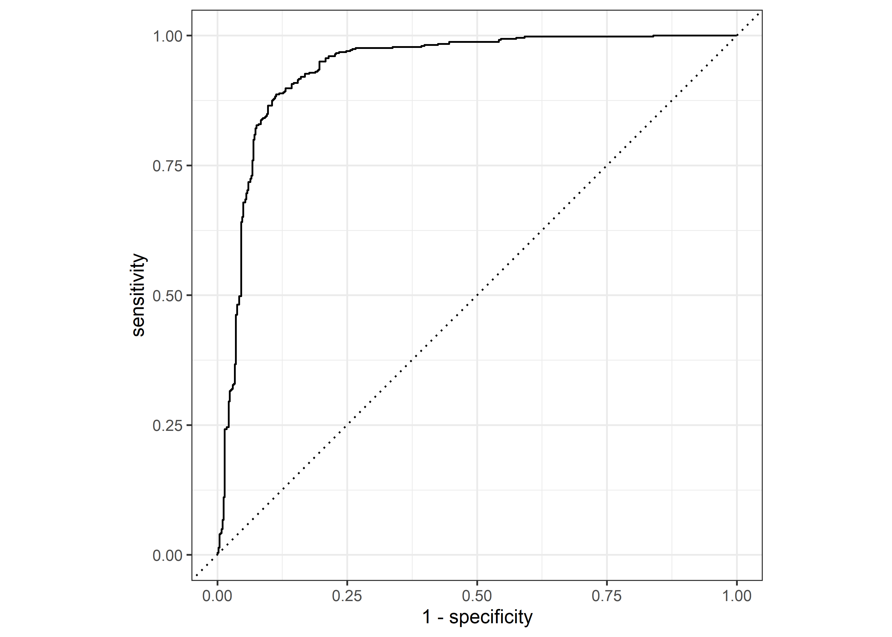
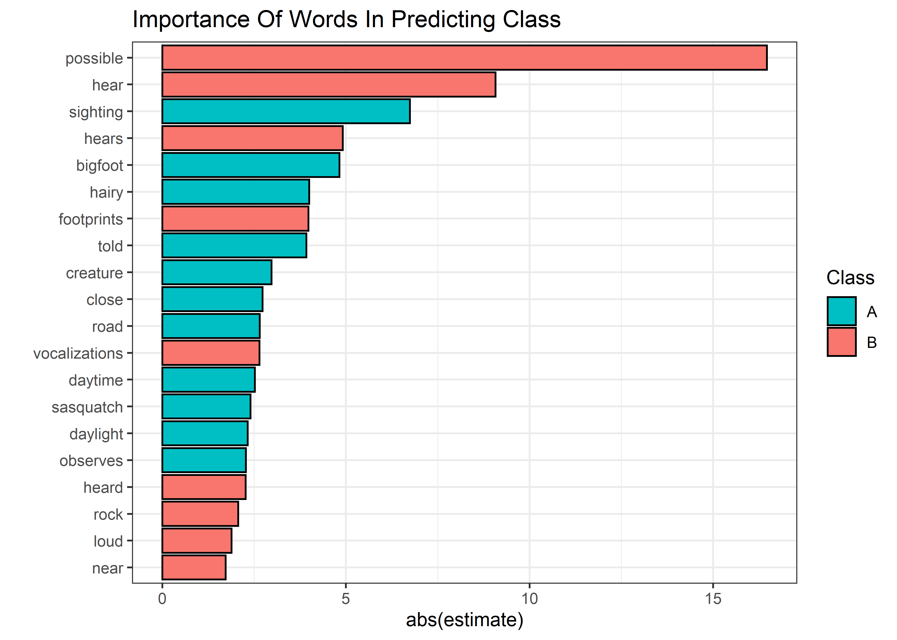

Bigfoot
================
Matthew
2022-09-13

-   <a href="#eda" id="toc-eda">EDA</a>
    -   <a href="#text-analysis" id="toc-text-analysis">Text Analysis</a>
-   <a href="#model" id="toc-model">Model</a>
    -   <a href="#preprocess" id="toc-preprocess">Preprocess</a>
    -   <a href="#fitting" id="toc-fitting">Fitting</a>
    -   <a href="#metrics" id="toc-metrics">Metrics</a>

# EDA

``` r
skimr::skim(bigfoot)
```

|                                                  |         |
|:-------------------------------------------------|:--------|
| Name                                             | bigfoot |
| Number of rows                                   | 5021    |
| Number of columns                                | 28      |
| \_\_\_\_\_\_\_\_\_\_\_\_\_\_\_\_\_\_\_\_\_\_\_   |         |
| Column type frequency:                           |         |
| character                                        | 10      |
| Date                                             | 1       |
| numeric                                          | 17      |
| \_\_\_\_\_\_\_\_\_\_\_\_\_\_\_\_\_\_\_\_\_\_\_\_ |         |
| Group variables                                  | None    |

Data summary

**Variable type: character**

| skim_variable    | n_missing | complete_rate | min |   max | empty | n_unique | whitespace |
|:-----------------|----------:|--------------:|----:|------:|------:|---------:|-----------:|
| observed         |        38 |          0.99 |   1 | 30374 |     0 |     4982 |          0 |
| location_details |       758 |          0.85 |   1 |  3876 |     0 |     4196 |          0 |
| county           |         0 |          1.00 |  10 |    30 |     0 |     1037 |          0 |
| state            |         0 |          1.00 |   4 |    14 |     0 |       49 |          0 |
| season           |         0 |          1.00 |   4 |     7 |     0 |        5 |          0 |
| title            |       976 |          0.81 |  23 |   235 |     0 |     4045 |          0 |
| classification   |         0 |          1.00 |   7 |     7 |     0 |        3 |          0 |
| geohash          |       976 |          0.81 |  10 |    10 |     0 |     4001 |          0 |
| precip_type      |      3298 |          0.34 |   4 |     4 |     0 |        2 |          0 |
| summary          |      1655 |          0.67 |  15 |   103 |     0 |      321 |          0 |

**Variable type: Date**

| skim_variable | n_missing | complete_rate | min        | max        | median     | n_unique |
|:--------------|----------:|--------------:|:-----------|:-----------|:-----------|---------:|
| date          |       976 |          0.81 | 1869-11-10 | 2021-11-27 | 2003-11-16 |     3111 |

**Variable type: numeric**

| skim_variable      | n_missing | complete_rate |     mean |       sd |      p0 |     p25 |      p50 |      p75 |     p100 | hist  |
|:-------------------|----------:|--------------:|---------:|---------:|--------:|--------:|---------:|---------:|---------:|:------|
| latitude           |       976 |          0.81 |    39.36 |     5.68 |   25.14 |   35.35 |    39.30 |    43.93 |    64.89 | ▂▇▆▁▁ |
| longitude          |       976 |          0.81 |   -97.42 |    16.73 | -167.13 | -117.06 |   -91.77 |   -83.07 |   -68.23 | ▁▁▆▆▇ |
| number             |         0 |          1.00 | 21520.23 | 19259.15 |   60.00 | 4595.00 | 15473.00 | 33979.00 | 71997.00 | ▇▃▂▂▁ |
| temperature_high   |      1683 |          0.66 |    67.12 |    17.78 |   -0.62 |   55.14 |    69.97 |    81.10 |   106.51 | ▁▂▅▇▃ |
| temperature_mid    |      1835 |          0.63 |    57.84 |    16.40 |   -8.46 |   46.77 |    59.36 |    70.38 |    94.03 | ▁▁▆▇▃ |
| temperature_low    |      1832 |          0.64 |    48.64 |    15.94 |  -22.78 |   37.50 |    49.40 |    60.66 |    84.34 | ▁▁▅▇▃ |
| dew_point          |      1648 |          0.67 |    46.23 |    16.44 |  -11.21 |   34.77 |    46.69 |    59.00 |    77.40 | ▁▂▆▇▅ |
| humidity           |      1648 |          0.67 |     0.71 |     0.16 |    0.08 |    0.62 |     0.73 |     0.82 |     1.00 | ▁▁▃▇▅ |
| cloud_cover        |      1937 |          0.61 |     0.44 |     0.33 |    0.00 |    0.12 |     0.40 |     0.73 |     1.00 | ▇▅▃▃▅ |
| moon_phase         |      1625 |          0.68 |     0.50 |     0.29 |    0.00 |    0.25 |     0.49 |     0.75 |     1.00 | ▇▇▇▇▇ |
| precip_intensity   |      2309 |          0.54 |     0.01 |     0.05 |    0.00 |    0.00 |     0.00 |     0.00 |     2.07 | ▇▁▁▁▁ |
| precip_probability |      2311 |          0.54 |     0.30 |     0.42 |    0.00 |    0.00 |     0.00 |     0.73 |     1.00 | ▇▁▁▁▃ |
| pressure           |      2402 |          0.52 |  1017.08 |     6.14 |  980.34 | 1013.42 |  1016.96 |  1020.64 |  1042.41 | ▁▁▇▆▁ |
| uv_index           |      1629 |          0.68 |     5.16 |     3.14 |    0.00 |    3.00 |     5.00 |     8.00 |    13.00 | ▆▇▅▆▁ |
| visibility         |      1972 |          0.61 |     8.49 |     2.06 |    0.74 |    7.66 |     9.45 |    10.00 |    10.00 | ▁▁▁▂▇ |
| wind_bearing       |      1634 |          0.67 |   196.57 |    96.38 |    0.00 |  128.00 |   203.00 |   273.00 |   359.00 | ▅▅▇▇▆ |
| wind_speed         |      1632 |          0.67 |     3.87 |     3.28 |    0.00 |    1.34 |     2.93 |     5.56 |    23.94 | ▇▃▁▁▁ |

``` r
bigfoot %>% 
  keep(is.numeric) %>% 
  gather() %>% 
  ggplot(aes(value)) + geom_histogram() +
  facet_wrap(~key, scales = "free")
```

    ## `stat_bin()` using `bins = 30`. Pick better value with `binwidth`.

<!-- -->

## Text Analysis

``` r
bigfoot %>% 
  unnest_tokens(word, summary) %>% 
  anti_join(stop_words) %>%
  group_by(classification) %>% 
  count(word, sort = TRUE) %>% 
  filter(!is.na(word)) %>% 
  head(15) %>% 
  mutate(word = fct_reorder(word, n)) %>% 
  ggplot(aes(n, word)) + geom_col(color = "black", position = position_dodge2(preserve = "single"), aes(fill = classification)) + 
  ggtitle(str_to_title("Most common words describing the day"))
```

    ## Joining, by = "word"

<!-- -->

``` r
bigfoot %>% 
  unnest_tokens(word, observed) %>% 
  anti_join(stop_words) %>%
  group_by(classification) %>% 
  count(word, sort = TRUE) %>% 
  filter(!is.na(word)) %>% 
  head(20) %>% 
  ungroup() %>% 
  mutate(word = fct_reorder(word, n, sum)) %>% 
  ggplot(aes(n, word)) + geom_col(color = "black", position = position_dodge2(preserve = "single"), aes(fill = classification)) + 
  ggtitle(str_to_title("Most common words describing the story"))
```

    ## Joining, by = "word"

<!-- -->

``` r
bigfoot %>% 
  unnest_tokens(word, title) %>% 
  anti_join(stop_words) %>%
  group_by(classification) %>% 
  count(word, sort = TRUE) %>% 
  filter(!is.na(word)) %>% 
  head(20) %>% 
  ungroup() %>% 
  mutate(word = fct_reorder(word, n, sum)) %>% 
  ggplot(aes(n, word)) + geom_col(color = "black", position = position_dodge2(preserve = "single"), aes(fill = classification)) + 
  ggtitle(str_to_title("Most common words describing the story"))
```

    ## Joining, by = "word"

<!-- -->

# Model

## Preprocess

``` r
library(tidymodels)
```

    ## Registered S3 method overwritten by 'tune':
    ##   method                   from   
    ##   required_pkgs.model_spec parsnip

    ## -- Attaching packages -------------------------------------- tidymodels 0.1.4 --

    ## v broom        0.7.12     v rsample      0.1.1 
    ## v dials        0.1.0      v tune         0.1.6 
    ## v infer        1.0.0      v workflows    0.2.4 
    ## v modeldata    0.1.1      v workflowsets 0.2.1 
    ## v parsnip      0.2.0      v yardstick    0.0.9 
    ## v recipes      0.2.0

    ## -- Conflicts ----------------------------------------- tidymodels_conflicts() --
    ## x scales::discard() masks purrr::discard()
    ## x dplyr::filter()   masks stats::filter()
    ## x recipes::fixed()  masks stringr::fixed()
    ## x dplyr::lag()      masks stats::lag()
    ## x yardstick::spec() masks readr::spec()
    ## x recipes::step()   masks stats::step()
    ## x tune::tune()      masks parsnip::tune()
    ## * Dig deeper into tidy modeling with R at https://www.tmwr.org

``` r
set.seed(123)

bigfoot_split <- initial_split(bigfoot %>% 
                                  filter(classification != "Class C",!is.na(title)) %>%
                                  mutate(title = str_remove_all(title, ".*\\:")) %>%
                                  unnest_tokens(title, title) %>% 
                                  anti_join(stop_words, by = c("title" = "word")) %>% 
                                  select(class = classification, title) %>% 
                                  mutate(class = as.factor(class)) %>% 
                                  filter(fct_lump(title, prop = 0.005) != "Other"),
                                strata = class)
```

## Fitting

``` r
glm_workflow <- 
  recipe(formula = class ~ title, data = training(bigfoot_split)) %>% 
  step_novel(all_nominal_predictors()) %>% 
  step_dummy(all_nominal_predictors()) %>% 
  workflow(logistic_reg(mode = "classification", engine = "glm"))


glm_fit <- glm_workflow %>% last_fit(bigfoot_split)
```

    ## ! train/test split: preprocessor 1/1, model 1/1 (predictions): prediction from a rank-defici...

## Metrics

``` r
glm_fit %>% 
  collect_metrics()
```

    ## # A tibble: 2 x 4
    ##   .metric  .estimator .estimate .config             
    ##   <chr>    <chr>          <dbl> <chr>               
    ## 1 accuracy binary         0.718 Preprocessor1_Model1
    ## 2 roc_auc  binary         0.792 Preprocessor1_Model1

``` r
glm_fit %>% 
  collect_predictions() %>% 
  roc_curve(as.factor(class), `.pred_Class A`) %>% 
  autoplot()
```

<!-- -->

``` r
glm_fit %>% 
  extract_fit_parsnip() %>% 
  broom::tidy() %>% 
  filter(p.value < 0.05 & term != "(Intercept)") %>% 
  mutate(term = str_remove(term, "title_")) %>%
  ggplot(aes(abs(estimate), fct_reorder(term, abs(estimate)), fill = ifelse(estimate > 0, "A", "B"))) + geom_col(color = "black") +
  scale_fill_discrete(direction = -1) +
  labs(fill = "Class", y = "Words", title = str_to_title("Importance in predicting class"))
```

<!-- -->
