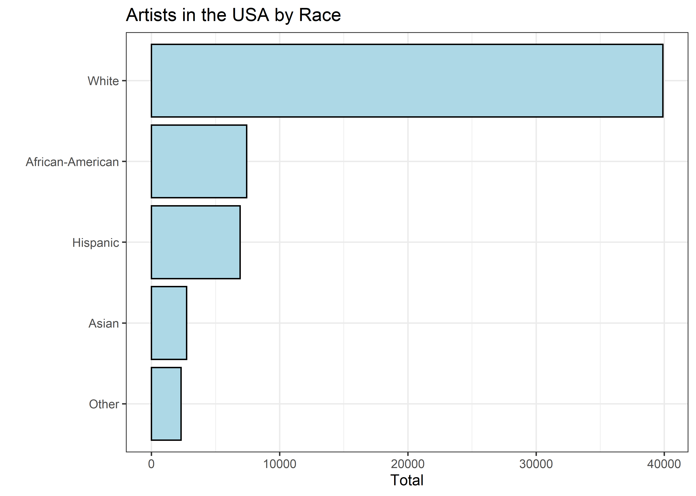

Artists
================
Matthew
2022-09-27

-   <a href="#eda" id="toc-eda">EDA</a>
    -   <a href="#summarize-function" id="toc-summarize-function">Summarize
        Function</a>

``` r
artists <- read_csv('https://raw.githubusercontent.com/rfordatascience/tidytuesday/master/data/2022/2022-09-27/artists.csv')
```

    ## Rows: 3380 Columns: 7
    ## -- Column specification --------------------------------------------------------
    ## Delimiter: ","
    ## chr (3): state, race, type
    ## dbl (4): all_workers_n, artists_n, artists_share, location_quotient
    ## 
    ## i Use `spec()` to retrieve the full column specification for this data.
    ## i Specify the column types or set `show_col_types = FALSE` to quiet this message.

# EDA

``` r
artists %>% 
  head(15)
```

    ## # A tibble: 15 x 7
    ##    state      race  type  all_workers_n artists_n artists_share location_quotie~
    ##    <chr>      <chr> <chr>         <dbl>     <dbl>         <dbl>            <dbl>
    ##  1 Alabama    Hisp~ Arch~         88165        45      0.000510            0.875
    ##  2 Alaska     Hisp~ Arch~         26875        15      0.000558            0.957
    ##  3 Arizona    Hisp~ Arch~       1033370       270      0.000261            0.448
    ##  4 Arkansas   Hisp~ Arch~        101405        NA     NA                  NA    
    ##  5 California Hisp~ Arch~       7470730      3870      0.000518            0.888
    ##  6 Colorado   Hisp~ Arch~        594525       200      0.000336            0.577
    ##  7 Connectic~ Hisp~ Arch~        288845       150      0.000519            0.891
    ##  8 Delaware   Hisp~ Arch~         41365         0     NA                  NA    
    ##  9 District ~ Hisp~ Arch~         44885       185      0.00412             7.07 
    ## 10 Florida    Hisp~ Arch~       2752995      2900      0.00105             1.81 
    ## 11 Georgia    Hisp~ Arch~        467240       370      0.000792            1.36 
    ## 12 Hawaii     Hisp~ Arch~         69470        40      0.000576            0.987
    ## 13 Idaho      Hisp~ Arch~        101285         0     NA                  NA    
    ## 14 Illinois   Hisp~ Arch~       1100445       700      0.000636            1.09 
    ## 15 Indiana    Hisp~ Arch~        212120        75      0.000354            0.606

``` r
skimr::skim(artists)
```

|                                                  |         |
|:-------------------------------------------------|:--------|
| Name                                             | artists |
| Number of rows                                   | 3380    |
| Number of columns                                | 7       |
| \_\_\_\_\_\_\_\_\_\_\_\_\_\_\_\_\_\_\_\_\_\_\_   |         |
| Column type frequency:                           |         |
| character                                        | 3       |
| numeric                                          | 4       |
| \_\_\_\_\_\_\_\_\_\_\_\_\_\_\_\_\_\_\_\_\_\_\_\_ |         |
| Group variables                                  | None    |

Data summary

**Variable type: character**

| skim_variable | n_missing | complete_rate | min | max | empty | n_unique | whitespace |
|:--------------|----------:|--------------:|----:|----:|------:|---------:|-----------:|
| state         |         0 |             1 |   4 |  20 |     0 |       52 |          0 |
| race          |         0 |             1 |   5 |  16 |     0 |        5 |          0 |
| type          |         0 |             1 |   6 |  42 |     0 |       13 |          0 |

**Variable type: numeric**

| skim_variable     | n_missing | complete_rate |      mean |         sd |   p0 |      p25 |       p50 |       p75 |       p100 | hist  |
|:------------------|----------:|--------------:|----------:|-----------:|-----:|---------:|----------:|----------:|-----------:|:------|
| all_workers_n     |         0 |          1.00 | 637910.62 | 1217325.01 | 1335 | 40325.00 | 149612.50 | 627290.00 | 7686845.00 | ▇▁▁▁▁ |
| artists_n         |       699 |          0.79 |    892.33 |    3407.91 |    0 |     0.00 |    110.00 |    470.00 |   83575.00 | ▇▁▁▁▁ |
| artists_share     |      1454 |          0.57 |      0.00 |       0.00 |    0 |     0.00 |      0.00 |      0.00 |       0.02 | ▇▁▁▁▁ |
| location_quotient |      1471 |          0.56 |      1.07 |       0.94 |    0 |     0.61 |      0.86 |      1.19 |      15.63 | ▇▁▁▁▁ |

Is artists share = artists_n/all_workers_n?

``` r
artists %>% 
  mutate(new = artists_n/all_workers_n) %>% 
  select(artists_share, new)
```

    ## # A tibble: 3,380 x 2
    ##    artists_share       new
    ##            <dbl>     <dbl>
    ##  1      0.000510  0.000510
    ##  2      0.000558  0.000558
    ##  3      0.000261  0.000261
    ##  4     NA        NA       
    ##  5      0.000518  0.000518
    ##  6      0.000336  0.000336
    ##  7      0.000519  0.000519
    ##  8     NA         0       
    ##  9      0.00412   0.00412 
    ## 10      0.00105   0.00105 
    ## # ... with 3,370 more rows

``` r
artists %>% 
  mutate(new = artists_n/all_workers_n) %>% 
  select(artists_share, new) %>% 
  summarize(mean(artists_share == new, na.rm = TRUE))
```

    ## # A tibble: 1 x 1
    ##   `mean(artists_share == new, na.rm = TRUE)`
    ##                                        <dbl>
    ## 1                                      0.475

``` r
artists %>% 
  mutate(new = artists_n/all_workers_n) %>% 
  filter(new != artists_share) %>% 
  select(-location_quotient)
```

    ## # A tibble: 1,012 x 7
    ##    state        race     type      all_workers_n artists_n artists_share     new
    ##    <chr>        <chr>    <chr>             <dbl>     <dbl>         <dbl>   <dbl>
    ##  1 Florida      Hispanic Architec~       2752995      2900      0.00105  1.05e-3
    ##  2 Georgia      Hispanic Architec~        467240       370      0.000792 7.92e-4
    ##  3 New York     Hispanic Architec~       1819490      1830      0.00101  1.01e-3
    ##  4 Ohio         Hispanic Architec~        204545       225      0.00110  1.10e-3
    ##  5 Pennsylvania Hispanic Architec~        423215       185      0.000437 4.37e-4
    ##  6 Tennessee    Hispanic Architec~        167595        20      0.000119 1.19e-4
    ##  7 Arizona      White    Architec~       1857110      2420      0.00130  1.30e-3
    ##  8 California   White    Architec~       7686845     15935      0.00207  2.07e-3
    ##  9 Colorado     White    Architec~       2172170      4625      0.00213  2.13e-3
    ## 10 Connecticut  White    Architec~       1329540      2670      0.00201  2.01e-3
    ## # ... with 1,002 more rows

``` r
artists %>% 
  mutate(new = artists_n/all_workers_n) %>% 
  filter(new != artists_share) %>% 
  summarize(difference = sum(artists_share - new),
            avg = mean(artists_share - new, na.rm = TRUE))
```

    ## # A tibble: 1 x 2
    ##   difference        avg
    ##        <dbl>      <dbl>
    ## 1    0.00113 0.00000112

It appears there may be a minor difference in artists_share and
artists_n/all_workers_n, but its most likely a computational error.

## Summarize Function

``` r
summarize_fun <- function(x, y = NULL){
  artists %>% 
    group_by({{x}}, {{y}}) %>% 
    summarize(sum = sum(artists_n, na.rm = TRUE))
}
```

``` r
summarize_fun(race, type) %>% 
  filter(type == "Actors") %>% 
  ungroup() %>% 
  ggplot(aes(sum, fct_reorder(race, sum))) + geom_col(color = "black", fill = "lightblue") +
  labs(y = "", x = "Total", title = "Artists in the USA by Race")
```

    ## `summarise()` has grouped output by 'race'. You can override using the
    ## `.groups` argument.

<!-- -->
