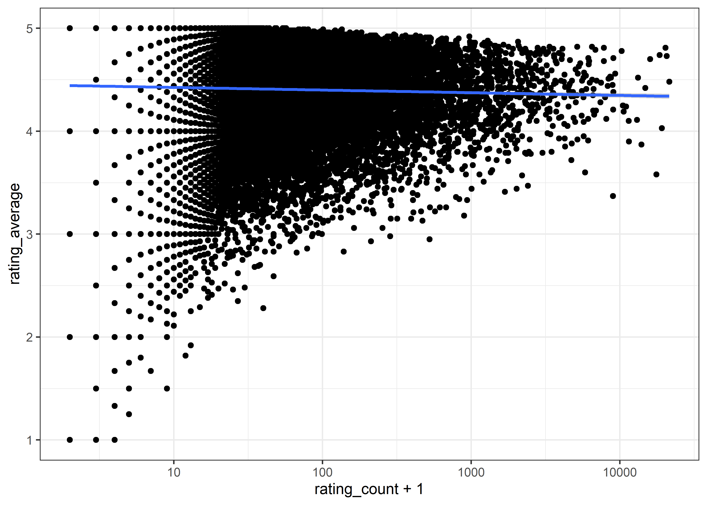

Ravelry Yarn
================
Matthew
2022-10-11

-   <a href="#eda" id="toc-eda">EDA</a>

``` r
yarn <- read_csv('https://raw.githubusercontent.com/rfordatascience/tidytuesday/master/data/2022/2022-10-11/yarn.csv')
```

    ## Rows: 100000 Columns: 24
    ## -- Column specification --------------------------------------------------------
    ## Delimiter: ","
    ## chr  (8): name, permalink, texture, yarn_company_name, yarn_weight_knit_gaug...
    ## dbl (13): gauge_divisor, grams, id, max_gauge, min_gauge, rating_average, ra...
    ## lgl  (3): discontinued, machine_washable, yarn_weight_crochet_gauge
    ## 
    ## i Use `spec()` to retrieve the full column specification for this data.
    ## i Specify the column types or set `show_col_types = FALSE` to quiet this message.

``` r
skimr::skim(yarn)
```

|                                                  |        |
|:-------------------------------------------------|:-------|
| Name                                             | yarn   |
| Number of rows                                   | 100000 |
| Number of columns                                | 24     |
| \_\_\_\_\_\_\_\_\_\_\_\_\_\_\_\_\_\_\_\_\_\_\_   |        |
| Column type frequency:                           |        |
| character                                        | 8      |
| logical                                          | 3      |
| numeric                                          | 13     |
| \_\_\_\_\_\_\_\_\_\_\_\_\_\_\_\_\_\_\_\_\_\_\_\_ |        |
| Group variables                                  | None   |

Data summary

**Variable type: character**

| skim_variable          | n_missing | complete_rate | min | max | empty | n_unique | whitespace |
|:-----------------------|----------:|--------------:|----:|----:|------:|---------:|-----------:|
| name                   |         0 |          1.00 |   1 | 100 |     0 |    72541 |          0 |
| permalink              |         0 |          1.00 |   1 | 128 |     0 |   100000 |          0 |
| texture                |     26691 |          0.73 |   1 |  87 |     0 |     5386 |          0 |
| yarn_company_name      |         0 |          1.00 |   1 |  67 |     0 |    10981 |          0 |
| yarn_weight_knit_gauge |      4762 |          0.95 |   2 |   5 |     0 |       10 |          0 |
| yarn_weight_name       |      2695 |          0.97 |   2 |  19 |     0 |       15 |          0 |
| yarn_weight_wpi        |     18744 |          0.81 |   1 |   3 |     0 |        8 |          0 |
| texture_clean          |     26691 |          0.73 |   1 |  87 |     0 |     4783 |          0 |

**Variable type: logical**

| skim_variable             | n_missing | complete_rate | mean | count                  |
|:--------------------------|----------:|--------------:|-----:|:-----------------------|
| discontinued              |        90 |          1.00 | 0.36 | FAL: 64289, TRU: 35621 |
| machine_washable          |     45792 |          0.54 | 0.67 | TRU: 36502, FAL: 17706 |
| yarn_weight_crochet_gauge |    100000 |          0.00 |  NaN | :                      |

**Variable type: numeric**

| skim_variable   | n_missing | complete_rate |      mean |       sd |  p0 |      p25 |      p50 |      p75 |      p100 | hist  |
|:----------------|----------:|--------------:|----------:|---------:|----:|---------:|---------:|---------:|----------:|:------|
| gauge_divisor   |     29596 |          0.70 |      3.65 |     0.96 |   1 |     4.00 |      4.0 |      4.0 |      4.00 | ▁▁▁▁▇ |
| grams           |      3782 |          0.96 |     92.97 |    73.08 |   0 |    50.00 |    100.0 |    100.0 |   7087.00 | ▇▁▁▁▁ |
| id              |         0 |          1.00 | 102988.04 | 61006.73 |  24 | 51012.25 | 103016.5 | 155435.2 | 218285.00 | ▇▇▇▇▆ |
| max_gauge       |     79630 |          0.20 |     19.16 |    10.17 |   0 |     8.00 |     20.0 |     28.0 |     67.75 | ▇▇▆▁▁ |
| min_gauge       |     29052 |          0.71 |     20.07 |     8.03 |   0 |    15.00 |     22.0 |     28.0 |     99.99 | ▅▇▁▁▁ |
| rating_average  |     10541 |          0.89 |      4.43 |     0.63 |   1 |     4.00 |      4.6 |      5.0 |      5.00 | ▁▁▁▃▇ |
| rating_count    |     10541 |          0.89 |     43.18 |   320.64 |   1 |     2.00 |      5.0 |     17.0 |  21517.00 | ▇▁▁▁▁ |
| rating_total    |     10541 |          0.89 |    189.28 |  1407.03 |   1 |    10.00 |     23.0 |     73.0 |  97630.00 | ▇▁▁▁▁ |
| thread_size     |     99418 |          0.01 |     23.44 |    80.97 |   1 |     8.00 |     10.0 |     20.0 |   1500.00 | ▇▁▁▁▁ |
| wpi             |     96199 |          0.04 |     12.94 |     7.92 |   0 |     9.00 |     12.0 |     14.0 |    127.00 | ▇▁▁▁▁ |
| yardage         |      4266 |          0.96 |    339.04 |   538.96 |   0 |   137.00 |    246.0 |    437.0 |  32839.00 | ▇▁▁▁▁ |
| yarn_weight_id  |      2695 |          0.97 |      7.45 |     3.68 |   1 |     5.00 |      7.0 |     11.0 |     16.00 | ▃▇▂▆▁ |
| yarn_weight_ply |      9380 |          0.91 |      6.39 |     3.18 |   1 |     4.00 |      5.0 |     10.0 |     12.00 | ▃▇▁▃▆ |

# EDA

``` r
yarn %>% 
  ggplot(aes(rating_count + 1, rating_average)) + geom_point() +
  scale_x_log10() + geom_smooth(method = "lm")
```

    ## `geom_smooth()` using formula 'y ~ x'

<!-- -->
