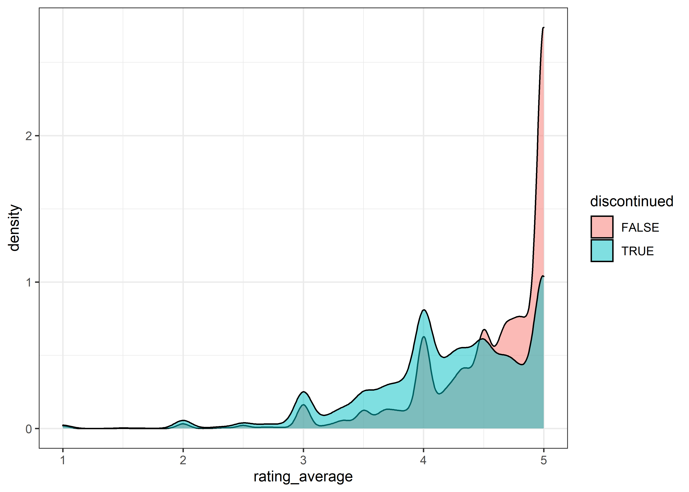
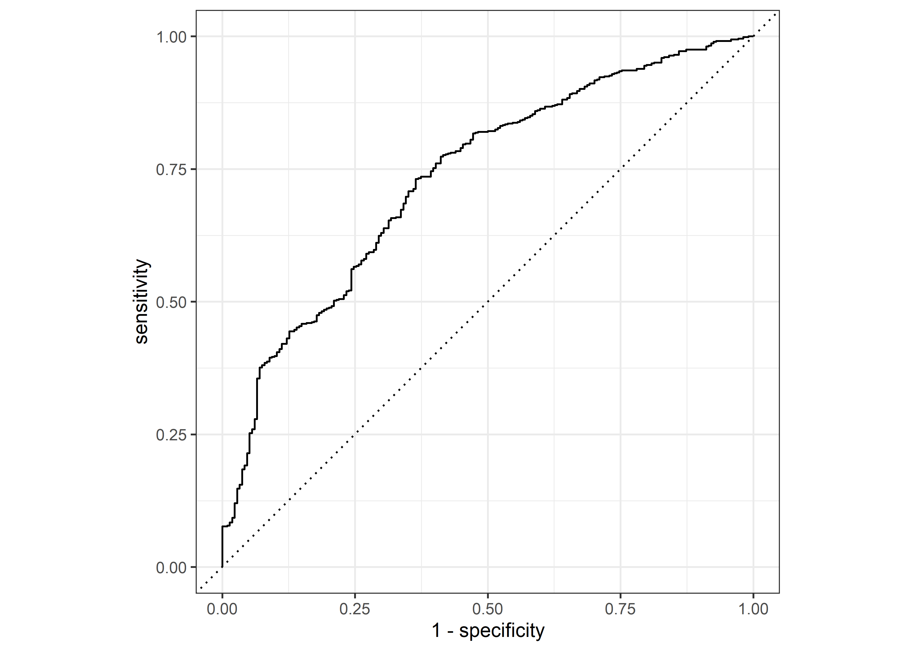

Ravelry Yarn
================
Matthew
2022-10-11

-   <a href="#eda" id="toc-eda">EDA</a>

``` r
yarn <- read_csv('https://raw.githubusercontent.com/rfordatascience/tidytuesday/master/data/2022/2022-10-11/yarn.csv')
```

    ## Rows: 100000 Columns: 24
    ## -- Column specification --------------------------------------------------------
    ## Delimiter: ","
    ## chr  (8): name, permalink, texture, yarn_company_name, yarn_weight_knit_gaug...
    ## dbl (13): gauge_divisor, grams, id, max_gauge, min_gauge, rating_average, ra...
    ## lgl  (3): discontinued, machine_washable, yarn_weight_crochet_gauge
    ## 
    ## i Use `spec()` to retrieve the full column specification for this data.
    ## i Specify the column types or set `show_col_types = FALSE` to quiet this message.

``` r
skimr::skim(yarn)
```

|                                                  |        |
|:-------------------------------------------------|:-------|
| Name                                             | yarn   |
| Number of rows                                   | 100000 |
| Number of columns                                | 24     |
| \_\_\_\_\_\_\_\_\_\_\_\_\_\_\_\_\_\_\_\_\_\_\_   |        |
| Column type frequency:                           |        |
| character                                        | 8      |
| logical                                          | 3      |
| numeric                                          | 13     |
| \_\_\_\_\_\_\_\_\_\_\_\_\_\_\_\_\_\_\_\_\_\_\_\_ |        |
| Group variables                                  | None   |

Data summary

**Variable type: character**

| skim_variable          | n_missing | complete_rate | min | max | empty | n_unique | whitespace |
|:-----------------------|----------:|--------------:|----:|----:|------:|---------:|-----------:|
| name                   |         0 |          1.00 |   1 | 100 |     0 |    72541 |          0 |
| permalink              |         0 |          1.00 |   1 | 128 |     0 |   100000 |          0 |
| texture                |     26691 |          0.73 |   1 |  87 |     0 |     5386 |          0 |
| yarn_company_name      |         0 |          1.00 |   1 |  67 |     0 |    10981 |          0 |
| yarn_weight_knit_gauge |      4762 |          0.95 |   2 |   5 |     0 |       10 |          0 |
| yarn_weight_name       |      2695 |          0.97 |   2 |  19 |     0 |       15 |          0 |
| yarn_weight_wpi        |     18744 |          0.81 |   1 |   3 |     0 |        8 |          0 |
| texture_clean          |     26691 |          0.73 |   1 |  87 |     0 |     4783 |          0 |

**Variable type: logical**

| skim_variable             | n_missing | complete_rate | mean | count                  |
|:--------------------------|----------:|--------------:|-----:|:-----------------------|
| discontinued              |        90 |          1.00 | 0.36 | FAL: 64289, TRU: 35621 |
| machine_washable          |     45792 |          0.54 | 0.67 | TRU: 36502, FAL: 17706 |
| yarn_weight_crochet_gauge |    100000 |          0.00 |  NaN | :                      |

**Variable type: numeric**

| skim_variable   | n_missing | complete_rate |      mean |       sd |  p0 |      p25 |      p50 |      p75 |      p100 | hist  |
|:----------------|----------:|--------------:|----------:|---------:|----:|---------:|---------:|---------:|----------:|:------|
| gauge_divisor   |     29596 |          0.70 |      3.65 |     0.96 |   1 |     4.00 |      4.0 |      4.0 |      4.00 | ▁▁▁▁▇ |
| grams           |      3782 |          0.96 |     92.97 |    73.08 |   0 |    50.00 |    100.0 |    100.0 |   7087.00 | ▇▁▁▁▁ |
| id              |         0 |          1.00 | 102988.04 | 61006.73 |  24 | 51012.25 | 103016.5 | 155435.2 | 218285.00 | ▇▇▇▇▆ |
| max_gauge       |     79630 |          0.20 |     19.16 |    10.17 |   0 |     8.00 |     20.0 |     28.0 |     67.75 | ▇▇▆▁▁ |
| min_gauge       |     29052 |          0.71 |     20.07 |     8.03 |   0 |    15.00 |     22.0 |     28.0 |     99.99 | ▅▇▁▁▁ |
| rating_average  |     10541 |          0.89 |      4.43 |     0.63 |   1 |     4.00 |      4.6 |      5.0 |      5.00 | ▁▁▁▃▇ |
| rating_count    |     10541 |          0.89 |     43.18 |   320.64 |   1 |     2.00 |      5.0 |     17.0 |  21517.00 | ▇▁▁▁▁ |
| rating_total    |     10541 |          0.89 |    189.28 |  1407.03 |   1 |    10.00 |     23.0 |     73.0 |  97630.00 | ▇▁▁▁▁ |
| thread_size     |     99418 |          0.01 |     23.44 |    80.97 |   1 |     8.00 |     10.0 |     20.0 |   1500.00 | ▇▁▁▁▁ |
| wpi             |     96199 |          0.04 |     12.94 |     7.92 |   0 |     9.00 |     12.0 |     14.0 |    127.00 | ▇▁▁▁▁ |
| yardage         |      4266 |          0.96 |    339.04 |   538.96 |   0 |   137.00 |    246.0 |    437.0 |  32839.00 | ▇▁▁▁▁ |
| yarn_weight_id  |      2695 |          0.97 |      7.45 |     3.68 |   1 |     5.00 |      7.0 |     11.0 |     16.00 | ▃▇▂▆▁ |
| yarn_weight_ply |      9380 |          0.91 |      6.39 |     3.18 |   1 |     4.00 |      5.0 |     10.0 |     12.00 | ▃▇▁▃▆ |

# EDA

``` r
yarn %>% 
  keep(is.numeric) %>% 
  select(-thread_size, -rating_total) %>% 
  cor(use = "complete.obs", method = "spearman") %>% 
  as.data.frame() %>% 
  rownames_to_column(var = "item1") %>% 
  gather(key = item2, value = corr, -item1) %>% 
  filter(item1 > item2) %>% 
  arrange(-abs(corr))
```

    ##              item1          item2         corr
    ## 1        min_gauge      max_gauge  0.958119050
    ## 2  yarn_weight_ply            wpi -0.807784423
    ## 3        min_gauge  gauge_divisor  0.750924737
    ## 4        max_gauge  gauge_divisor  0.748413244
    ## 5  yarn_weight_ply        yardage -0.653893101
    ## 6          yardage          grams  0.583060616
    ## 7          yardage            wpi  0.540114862
    ## 8  yarn_weight_ply      max_gauge -0.502575917
    ## 9  yarn_weight_ply      min_gauge -0.499841620
    ## 10             wpi      min_gauge  0.427635750
    ## 11             wpi      max_gauge  0.420301648
    ## 12         yardage      min_gauge  0.301975010
    ## 13         yardage      max_gauge  0.301464464
    ## 14    rating_count rating_average -0.288587029
    ## 15  rating_average          grams  0.259075765
    ## 16         yardage rating_average  0.245225327
    ## 17  rating_average             id  0.229051577
    ## 18    rating_count             id -0.190763602
    ## 19           grams  gauge_divisor -0.181351984
    ## 20 yarn_weight_ply rating_average -0.146512626
    ## 21  rating_average  gauge_divisor -0.146169232
    ## 22 yarn_weight_ply yarn_weight_id -0.133522140
    ## 23       max_gauge          grams -0.125006900
    ## 24             wpi rating_average  0.119145932
    ## 25  yarn_weight_id            wpi  0.117928233
    ## 26       min_gauge          grams -0.116659192
    ## 27       min_gauge             id  0.103032461
    ## 28         yardage  gauge_divisor -0.100755971
    ## 29       max_gauge             id  0.100275731
    ## 30    rating_count          grams -0.080756792
    ## 31         yardage             id  0.064688816
    ## 32             wpi   rating_count  0.060208448
    ## 33              id  gauge_divisor  0.059264778
    ## 34  yarn_weight_id rating_average  0.053276729
    ## 35  yarn_weight_id        yardage  0.052047514
    ## 36             wpi  gauge_divisor -0.048382414
    ## 37  yarn_weight_id   rating_count  0.047857184
    ## 38    rating_count      min_gauge  0.045013106
    ## 39 yarn_weight_ply  gauge_divisor  0.043976013
    ## 40  yarn_weight_id          grams -0.038292714
    ## 41  yarn_weight_id      max_gauge  0.035723081
    ## 42 yarn_weight_ply             id -0.033265967
    ## 43  yarn_weight_id      min_gauge  0.031898290
    ## 44  yarn_weight_id             id  0.030701551
    ## 45              id          grams  0.030041075
    ## 46             wpi             id  0.027810170
    ## 47 yarn_weight_ply   rating_count -0.024738929
    ## 48         yardage   rating_count -0.024215706
    ## 49             wpi          grams -0.022966504
    ## 50  yarn_weight_id  gauge_divisor -0.020108499
    ## 51    rating_count  gauge_divisor  0.017529065
    ## 52    rating_count      max_gauge  0.014356060
    ## 53  rating_average      max_gauge -0.009876351
    ## 54  rating_average      min_gauge -0.007937654
    ## 55 yarn_weight_ply          grams  0.005926895

``` r
yarn %>% 
  filter(!is.na(discontinued)) %>% 
  ggplot(aes(rating_average, fill = discontinued)) + geom_density(alpha = 0.5)
```

<!-- -->

``` r
mod_data <- yarn %>% 
  select(contains("discontinued"), where(is.numeric)) %>% 
  select(-thread_size, -rating_total) %>% 
  mutate(discontinued = factor(discontinued))

quickmod <- glm(discontinued ~., mod_data, family = binomial())

summary(quickmod)
```

    ## 
    ## Call:
    ## glm(formula = discontinued ~ ., family = binomial(), data = mod_data)
    ## 
    ## Deviance Residuals: 
    ##     Min       1Q   Median       3Q      Max  
    ## -1.7032  -0.7345  -0.5349  -0.1327   2.3299  
    ## 
    ## Coefficients:
    ##                   Estimate Std. Error z value Pr(>|z|)    
    ## (Intercept)      2.921e+00  9.554e-01   3.058  0.00223 ** 
    ## gauge_divisor   -2.596e-01  1.602e-01  -1.621  0.10504    
    ## grams            5.802e-04  2.236e-03   0.259  0.79525    
    ## id              -1.415e-05  1.953e-06  -7.247 4.27e-13 ***
    ## max_gauge       -3.645e-02  3.560e-02  -1.024  0.30591    
    ## min_gauge        9.943e-02  4.353e-02   2.284  0.02237 *  
    ## rating_average  -3.946e-01  1.364e-01  -2.892  0.00383 ** 
    ## rating_count    -4.824e-03  1.645e-03  -2.932  0.00337 ** 
    ## wpi             -4.937e-02  2.835e-02  -1.742  0.08158 .  
    ## yardage         -1.125e-03  8.755e-04  -1.284  0.19898    
    ## yarn_weight_id  -2.911e-02  2.175e-02  -1.338  0.18076    
    ## yarn_weight_ply  5.926e-02  5.232e-02   1.133  0.25741    
    ## ---
    ## Signif. codes:  0 '***' 0.001 '**' 0.01 '*' 0.05 '.' 0.1 ' ' 1
    ## 
    ## (Dispersion parameter for binomial family taken to be 1)
    ## 
    ##     Null deviance: 988.93  on 902  degrees of freedom
    ## Residual deviance: 873.68  on 891  degrees of freedom
    ##   (99097 observations deleted due to missingness)
    ## AIC: 897.68
    ## 
    ## Number of Fisher Scoring iterations: 8

``` r
mod_data %>% 
  mutate(predictions = 1 - predict(quickmod, mod_data, type = "response")) %>% 
  yardstick::roc_curve(discontinued, predictions) %>% 
  autoplot()
```

<!-- -->

``` r
mod_data %>% 
  mutate(predictions = 1 - predict(quickmod, mod_data, type = "response")) %>% 
  yardstick::roc_auc(discontinued, predictions)
```

    ## # A tibble: 1 x 3
    ##   .metric .estimator .estimate
    ##   <chr>   <chr>          <dbl>
    ## 1 roc_auc binary         0.734
