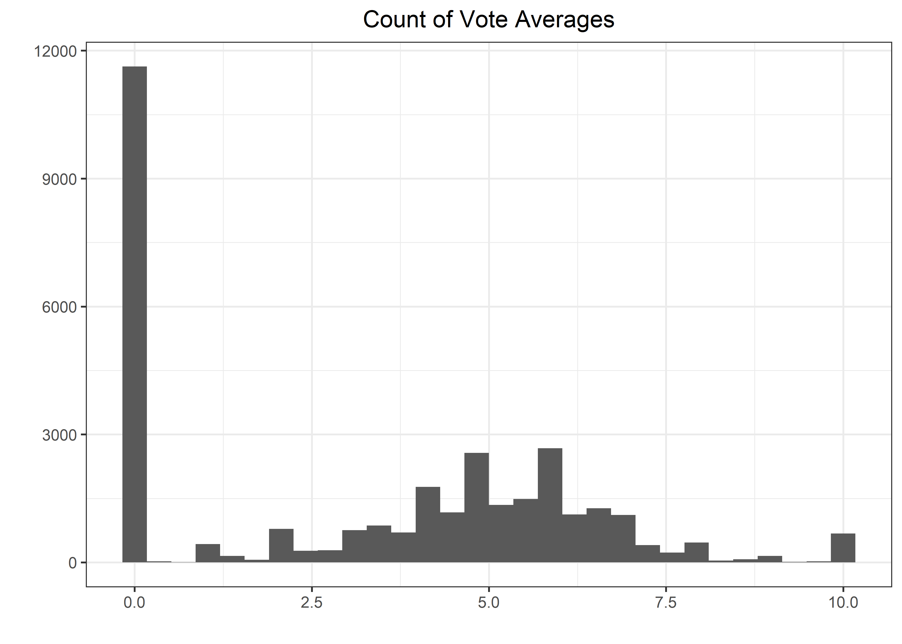
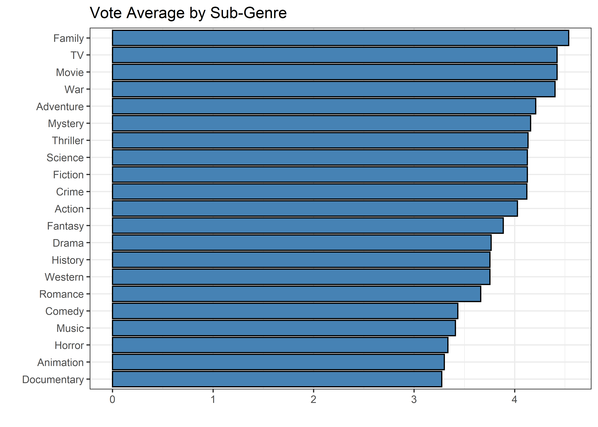

Horror Movies
================
Matthew
2022-11-01

-   <a href="#eda" id="toc-eda">EDA</a>

``` r
horror_movies <- read_csv('https://raw.githubusercontent.com/rfordatascience/tidytuesday/master/data/2022/2022-11-01/horror_movies.csv')
```

    ## Rows: 32540 Columns: 20
    ## -- Column specification --------------------------------------------------------
    ## Delimiter: ","
    ## chr  (10): original_title, title, original_language, overview, tagline, post...
    ## dbl   (8): id, popularity, vote_count, vote_average, budget, revenue, runtim...
    ## lgl   (1): adult
    ## date  (1): release_date
    ## 
    ## i Use `spec()` to retrieve the full column specification for this data.
    ## i Specify the column types or set `show_col_types = FALSE` to quiet this message.

# EDA

``` r
horror_movies %>% 
  separate_rows(genre_names, sep = ", ") %>% 
  group_by(genre_names) %>% 
  summarize(avg = mean(vote_average)) %>% 
  ggplot(aes(avg, fct_reorder(genre_names, avg))) + geom_col(fill = "steelblue", color = "black") +
  labs(y = "", x = "", title = "Vote Average by Sub-Genre")
```

<!-- -->

``` r
horror_movies %>% 
  separate_rows(genre_names, sep = ", ") %>% 
  mutate(genre_names = fct_lump(genre_names, 10),
         genre_names = ifelse(genre_names == "Horror", "All Horrors", as.character(genre_names))) %>% 
  filter(genre_names != "Other") %>% 
  group_by(genre_names) %>% 
  summarize(avg = mean(vote_average)) %>% 
  ggplot(aes(avg, fct_reorder(genre_names, avg))) + geom_col(aes(fill = genre_names == "All Horrors"), color = "black") +
  labs(y = "", x = "", title = "Vote Average of 10 Most Common Sub-Genres") + geom_text(aes(label = round(avg, 3)), nudge_x = -0.3) +
  theme(legend.position = "") + scale_fill_manual(values = c("darkorange", "purple"))
```

<!-- -->
