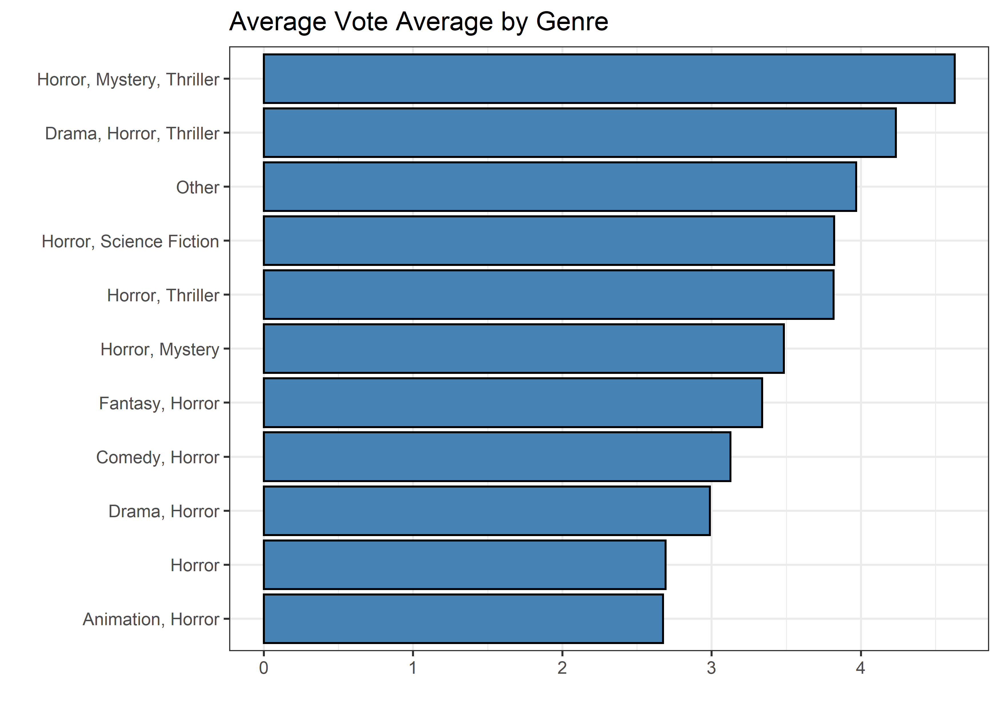
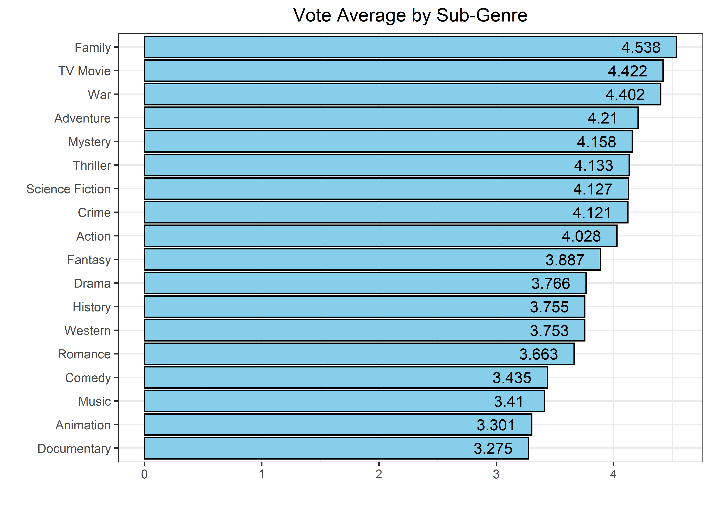
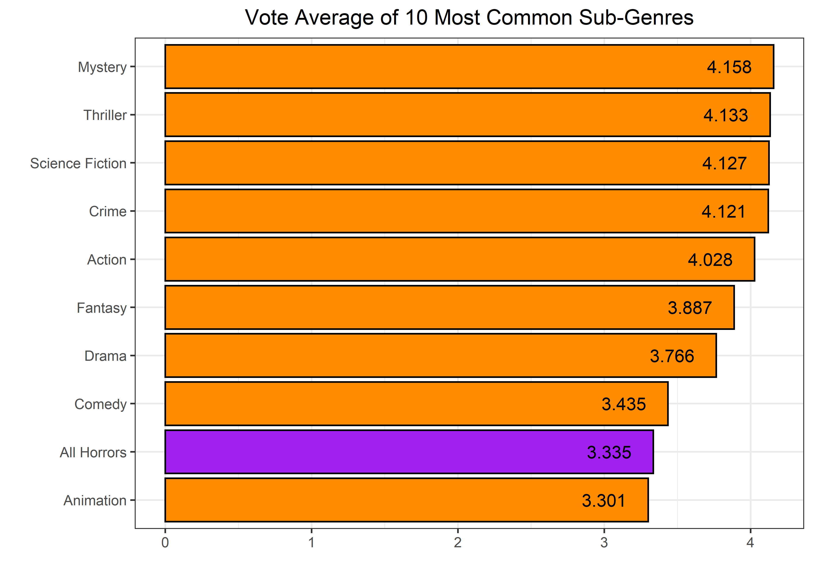
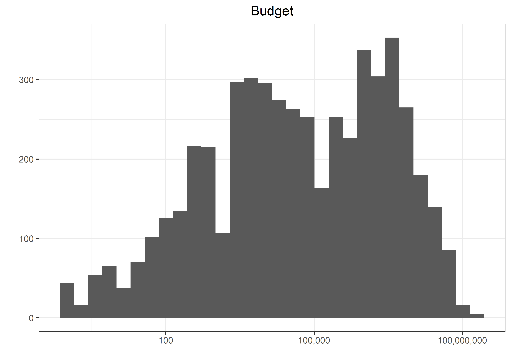
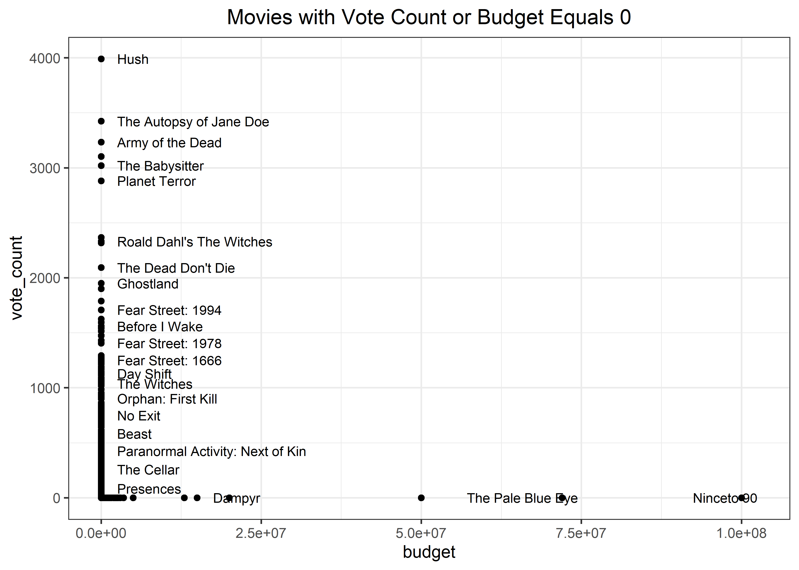
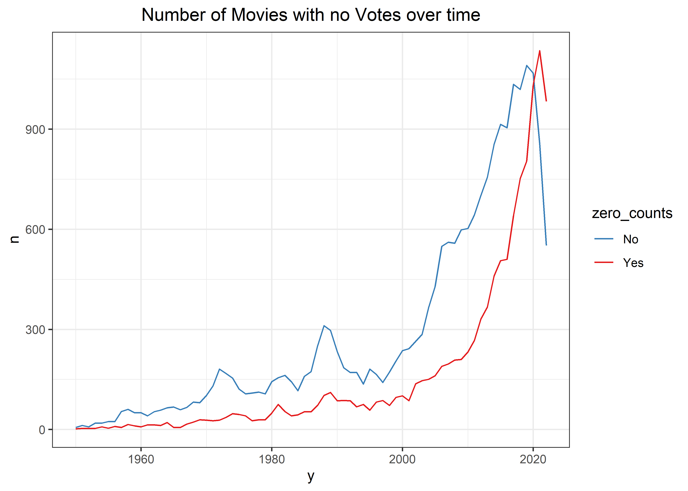
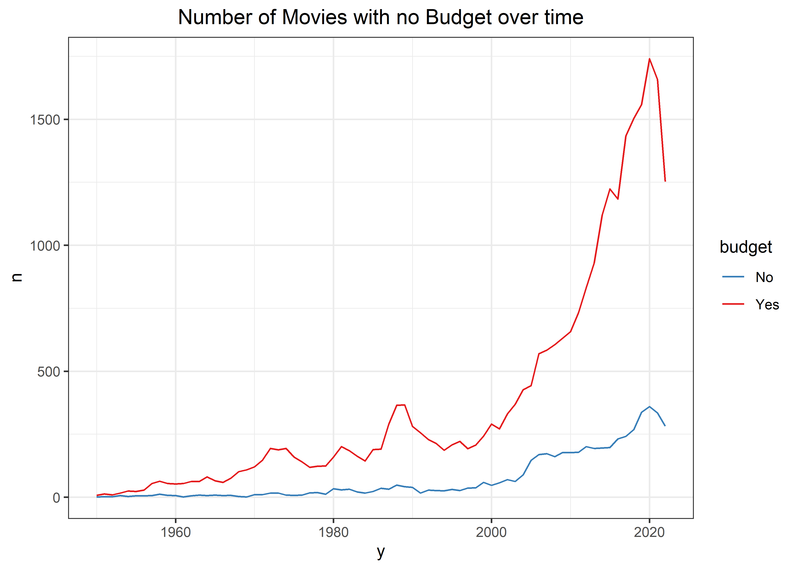
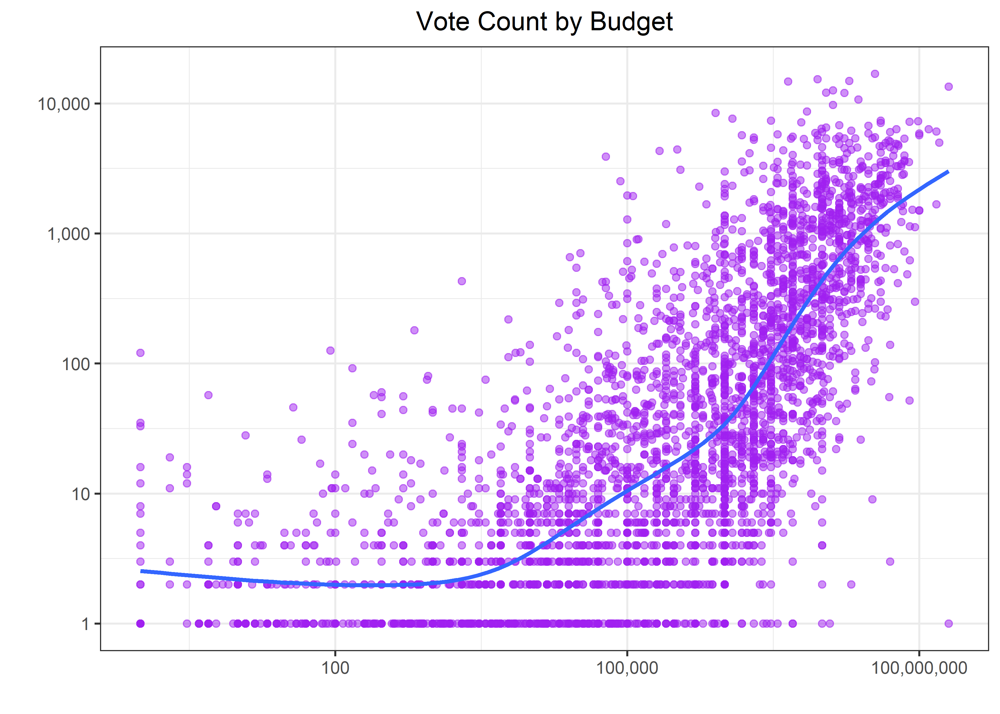

Horror Movies
================
Matthew
2022-11-01

-   <a href="#eda" id="toc-eda">EDA</a>
    -   <a href="#vote-average" id="toc-vote-average">Vote Average</a>
        -   <a href="#films-with-0-vote-average"
            id="toc-films-with-0-vote-average">Films with 0 Vote Average</a>
    -   <a href="#budget" id="toc-budget">Budget</a>

``` r
horror_movies <- read_csv('https://raw.githubusercontent.com/rfordatascience/tidytuesday/master/data/2022/2022-11-01/horror_movies.csv')
```

    ## Rows: 32540 Columns: 20
    ## -- Column specification --------------------------------------------------------
    ## Delimiter: ","
    ## chr  (10): original_title, title, original_language, overview, tagline, post...
    ## dbl   (8): id, popularity, vote_count, vote_average, budget, revenue, runtim...
    ## lgl   (1): adult
    ## date  (1): release_date
    ## 
    ## i Use `spec()` to retrieve the full column specification for this data.
    ## i Specify the column types or set `show_col_types = FALSE` to quiet this message.

# EDA

``` r
horror_movies %>% 
  count(adult, sort = TRUE)
```

    ## # A tibble: 1 x 2
    ##   adult     n
    ##   <lgl> <int>
    ## 1 FALSE 32540

The adult variable only contains on distinct outcome (*FALSE*) and thus
provides no information.

``` r
horror_movies <- 
  horror_movies %>% 
    select(-adult)
```

## Vote Average

``` r
horror_movies %>% 
  ggplot(aes(vote_average)) + geom_histogram() +
  labs(title = "Count of Vote Averages", y = "", x = "")
```

    ## `stat_bin()` using `bins = 30`. Pick better value with `binwidth`.

<!-- -->

``` r
horror_movies %>% 
  separate_rows(genre_names, sep = ", ") %>% 
  filter(genre_names != "Horror") %>% 
  group_by(genre_names) %>% 
  summarize(avg = mean(vote_average)) %>% 
  ggplot(aes(avg, fct_reorder(genre_names, avg))) + geom_col(fill = "skyblue", color = "black") +
  labs(y = "", x = "", title = "Vote Average by Sub-Genre") + geom_text(aes(label = round(avg, 3)), nudge_x = -0.3)
```

<!-- -->

``` r
horror_movies %>% 
  separate_rows(genre_names, sep = ", ") %>% 
  mutate(genre_names = fct_lump(genre_names, 10),
         genre_names = ifelse(genre_names == "Horror", "All Horrors", as.character(genre_names))) %>% 
  filter(genre_names != "Other") %>% 
  group_by(genre_names) %>% 
  summarize(avg = mean(vote_average)) %>% 
  ggplot(aes(avg, fct_reorder(genre_names, avg))) + geom_col(aes(fill = genre_names == "All Horrors"), color = "black") +
  labs(y = "", x = "", title = "Vote Average of 10 Most Common Sub-Genres") + geom_text(aes(label = round(avg, 3)), nudge_x = -0.3) +
  theme(legend.position = "") + scale_fill_manual(values = c("darkorange", "purple"))
```

<!-- -->

### Films with 0 Vote Average

``` r
horror_movies %>% 
  filter(vote_average == 0) %>% 
  count(vote_count, sort = TRUE)
```

    ## # A tibble: 3 x 2
    ##   vote_count     n
    ##        <dbl> <int>
    ## 1          0 11590
    ## 2          1    36
    ## 3          2     3

Majority of films with a *vote_average* of 0 have very few votes, with
the overwhelming majority being 0 votes.

## Budget

``` r
horror_movies %>% 
  ggplot(aes(budget)) + geom_histogram() + scale_x_log10(labels = comma_format()) +
  labs(title = "Budget", y = "", x = "")
```

    ## `stat_bin()` using `bins = 30`. Pick better value with `binwidth`.

<!-- -->

``` r
horror_movies %>% 
  count(budget, sort = TRUE)
```

    ## # A tibble: 783 x 2
    ##     budget     n
    ##      <dbl> <int>
    ##  1       0 27339
    ##  2 1000000   172
    ##  3   10000   161
    ##  4    5000   156
    ##  5    1000   116
    ##  6  500000   116
    ##  7    2000   113
    ##  8  100000   109
    ##  9     500    98
    ## 10 2000000    98
    ## # ... with 773 more rows

As is the case with vote count, *budget* also has many 0’s.

``` r
horror_movies %>% 
  filter(budget == 0 & vote_count == 0) %>% 
  summarize(n())
```

    ## # A tibble: 1 x 1
    ##   `n()`
    ##   <int>
    ## 1 10164

Over **10,000** rows of data contain both a *budget* of 0 and
*vote_count* of 0. This leads me to believe a lot of the data is
actually missing.

``` r
horror_movies %>% 
  filter(budget == 0 | vote_count == 0) %>% 
  ggplot(aes(budget, vote_count)) + geom_point() +
  geom_text(aes(label = title), check_overlap = TRUE, size = 3, hjust = "inward", nudge_x = 2.5e6,
            data = horror_movies %>% filter((budget > 0 & vote_count == 0) | (budget == 0 & vote_count > 0))) + 
  labs(title = "Movies with Vote Count or Budget Equals 0") 
```

<!-- -->

``` r
horror_movies %>% 
  mutate(zero_counts = ifelse(vote_count == 0, "Yes", "No")) %>% 
  group_by(y = year(release_date)) %>% 
  count(zero_counts) %>% 
  ggplot(aes(y, n, color = zero_counts)) + geom_line() + scale_color_brewer(palette = "Set1", direction = -1) +
  labs(title = "Number of Movies with no Votes over time")
```

<!-- -->

``` r
horror_movies %>% 
  mutate(budget = ifelse(budget == 0, "Yes", "No")) %>% 
  group_by(y = year(release_date)) %>% 
  count(budget) %>% 
  ggplot(aes(y, n, color = budget)) + geom_line() + scale_color_brewer(palette = "Set1", direction = -1) +
  labs(title = "Number of Movies with no Budget over time")
```

<!-- -->

``` r
horror_movies %>% 
  filter(vote_count != 0, budget != 0) %>% 
  ggplot(aes(budget, vote_count)) + geom_point(alpha = 0.5, color = "purple") + geom_smooth(se = FALSE) +
  scale_x_log10(labels = comma_format()) + scale_y_log10(labels = comma_format(accuracy = 1)) + 
  labs(y = "", x = "", title = "Vote Count by Budget")
```

    ## `geom_smooth()` using method = 'gam' and formula 'y ~ s(x, bs = "cs")'

<!-- -->
