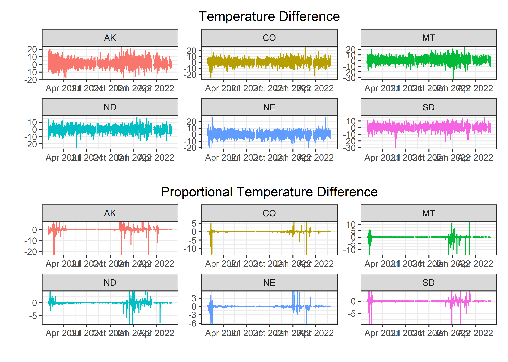
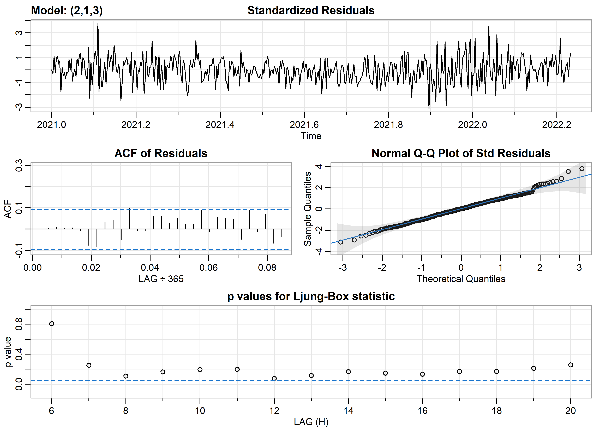
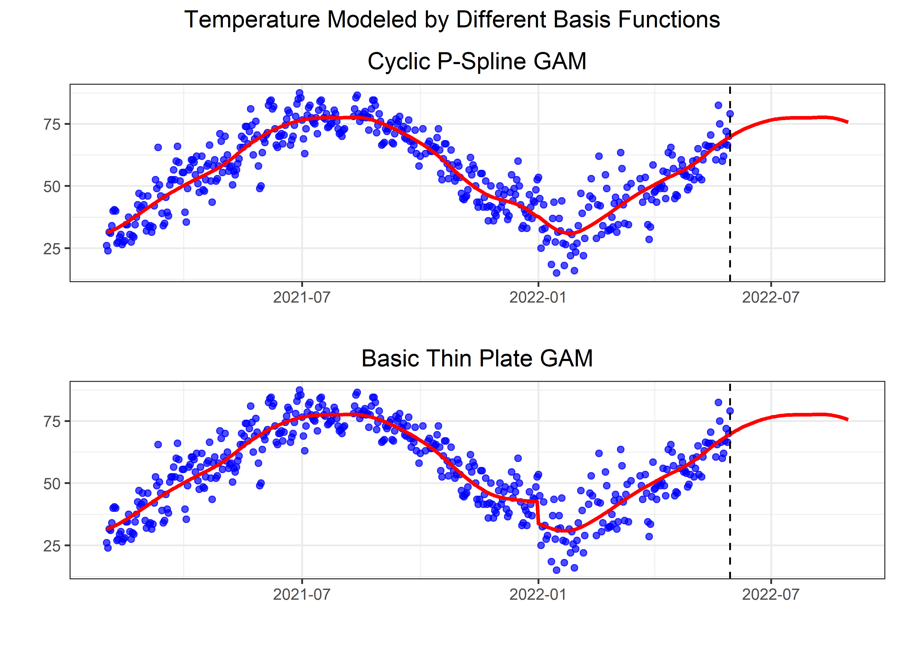

Weather Forcasts
================
Matthew
2022-12-20

-   <a href="#data-cleaning" id="toc-data-cleaning">Data Cleaning</a>
    -   <a href="#data-view" id="toc-data-view">Data View</a>
    -   <a href="#missing-values" id="toc-missing-values">Missing Values</a>
    -   <a href="#outliers" id="toc-outliers">Outliers</a>
-   <a href="#exploratory-data-analysis"
    id="toc-exploratory-data-analysis">Exploratory Data Analysis</a>
    -   <a href="#temperature-difference"
        id="toc-temperature-difference">Temperature Difference</a>
        -   <a href="#states" id="toc-states">States</a>
-   <a href="#time-series" id="toc-time-series">Time Series</a>
    -   <a href="#nyc-temperature" id="toc-nyc-temperature">NYC Temperature</a>
        -   <a href="#arima" id="toc-arima">ARIMA</a>
        -   <a href="#gam" id="toc-gam">GAM</a>
        -   <a href="#polynomial-model" id="toc-polynomial-model">Polynomial
            Model</a>

# Data Cleaning

``` r
weather_forecasts <- weather_forecasts %>% 
  left_join(outlook_meanings)  
```

    ## Joining, by = "forecast_outlook"

The *weather forecasts* dataset contains abbreviated weather outlooks,
while the *outlook meanings* dataset contains non-abbreviated weather
outlooks. The *weather forecasts* dataset and the *outlook meanings*
dataset were joined together using the “forecast_outlook” column as a
common key. This resulted in a combined dataset that includes both the
abbreviated and non-abbreviated weather outlooks from the two datasets.

``` r
weather_forecasts %>% 
  count(meaning, sort = TRUE)
```

    ## # A tibble: 24 x 2
    ##    meaning            n
    ##    <chr>          <int>
    ##  1 Sunny         173769
    ##  2 Partly Cloudy 104907
    ##  3 Rain Showers   95671
    ##  4 Mostly Cloudy  80178
    ##  5 Thunderstorms  72927
    ##  6 <NA>           37875
    ##  7 Rain           24198
    ##  8 Snow           14240
    ##  9 Windy          13368
    ## 10 Snow Showers    7924
    ## # ... with 14 more rows

## Data View

``` r
weather_forecasts %>% 
  head(n = 10) %>% 
  knitr::kable()
```

| date       | city         | state | high_or_low | forecast_hours_before | observed_temp | forecast_temp | observed_precip | forecast_outlook | possible_error | meaning |
|:-----------|:-------------|:------|:------------|----------------------:|--------------:|--------------:|----------------:|:-----------------|:---------------|:--------|
| 2021-01-30 | ABILENE      | TX    | high        |                    48 |            70 |            NA |            0.00 | NA               | none           | NA      |
| 2021-01-30 | ABILENE      | TX    | high        |                    36 |            70 |            NA |            0.00 | NA               | none           | NA      |
| 2021-01-30 | ABILENE      | TX    | high        |                    24 |            70 |            NA |            0.00 | NA               | none           | NA      |
| 2021-01-30 | ABILENE      | TX    | high        |                    12 |            70 |            70 |            0.00 | DUST             | none           | Dust    |
| 2021-01-30 | ABILENE      | TX    | low         |                    48 |            42 |            NA |            0.00 | NA               | none           | NA      |
| 2021-01-30 | ABILENE      | TX    | low         |                    36 |            42 |            NA |            0.00 | NA               | none           | NA      |
| 2021-01-30 | ABILENE      | TX    | low         |                    24 |            42 |            39 |            0.00 | DUST             | none           | Dust    |
| 2021-01-30 | ABILENE      | TX    | low         |                    12 |            42 |            38 |            0.00 | SUNNY            | none           | Sunny   |
| 2021-01-30 | AKRON_CANTON | OH    | high        |                    48 |            29 |            NA |            0.09 | NA               | none           | NA      |
| 2021-01-30 | AKRON_CANTON | OH    | high        |                    36 |            29 |            NA |            0.09 | NA               | none           | NA      |

## Missing Values

``` r
skimr::skim(weather_forecasts) %>% select(skim_type, skim_variable, n_missing)
```

|                                                  |                   |
|:-------------------------------------------------|:------------------|
| Name                                             | weather_forecasts |
| Number of rows                                   | 651968            |
| Number of columns                                | 11                |
| \_\_\_\_\_\_\_\_\_\_\_\_\_\_\_\_\_\_\_\_\_\_\_   |                   |
| Column type frequency:                           |                   |
| character                                        | 6                 |
| Date                                             | 1                 |
| numeric                                          | 4                 |
| \_\_\_\_\_\_\_\_\_\_\_\_\_\_\_\_\_\_\_\_\_\_\_\_ |                   |
| Group variables                                  | None              |

Data summary

**Variable type: character**

| skim_variable    | n_missing |
|:-----------------|----------:|
| city             |         0 |
| state            |         0 |
| high_or_low      |         0 |
| forecast_outlook |     37875 |
| possible_error   |         0 |
| meaning          |     37875 |

**Variable type: Date**

| skim_variable | n_missing |
|:--------------|----------:|
| date          |         0 |

**Variable type: numeric**

| skim_variable         | n_missing |
|:----------------------|----------:|
| forecast_hours_before |         0 |
| observed_temp         |     47744 |
| forecast_temp         |     37313 |
| observed_precip       |     50416 |

``` r
weather_forecasts %>% 
  group_by(NA_meaning = is.na(meaning)) %>% 
  summarize(sum(is.na(forecast_temp)))
```

    ## # A tibble: 2 x 2
    ##   NA_meaning `sum(is.na(forecast_temp))`
    ##   <lgl>                            <int>
    ## 1 FALSE                                4
    ## 2 TRUE                             37309

``` r
weather_forecasts %>% 
  group_by(forecast_hours_before) %>% 
  summarize(sum(is.na(forecast_temp)))
```

    ## # A tibble: 4 x 2
    ##   forecast_hours_before `sum(is.na(forecast_temp))`
    ##                   <dbl>                       <int>
    ## 1                    12                        9189
    ## 2                    24                        9319
    ## 3                    36                        9319
    ## 4                    48                        9486

``` r
weather_forecasts %>% 
  group_by(forecast_hours_before) %>% 
  summarize(sum(is.na(forecast_temp)))
```

    ## # A tibble: 4 x 2
    ##   forecast_hours_before `sum(is.na(forecast_temp))`
    ##                   <dbl>                       <int>
    ## 1                    12                        9189
    ## 2                    24                        9319
    ## 3                    36                        9319
    ## 4                    48                        9486

Missing values for *forecast_temp* tend to appear where forecast
*meaning* is also NA. They also slightly increase as the number of hours
before. It is assumed that these missing values are due to there being
no forecast at that time. Thus, these rows will not be dropped.

## Outliers

``` r
weather_forecasts %>% 
  count(possible_error, sort = TRUE)
```

    ## # A tibble: 4 x 2
    ##   possible_error        n
    ##   <chr>             <int>
    ## 1 none             651875
    ## 2 forecast_outlook     77
    ## 3 forecast_temp         8
    ## 4 observed_temp         8

``` r
weather_forecasts %>% 
  filter(possible_error == "observed_temp") %>% 
  select(contains("temp"))
```

    ## # A tibble: 8 x 2
    ##   observed_temp forecast_temp
    ##           <dbl>         <dbl>
    ## 1             0            64
    ## 2             0            64
    ## 3             0            63
    ## 4             0            63
    ## 5           108            46
    ## 6           108            45
    ## 7           108            45
    ## 8           108            45

``` r
weather_forecasts %>% 
  filter(possible_error == "forecast_temp") %>% 
  select(contains("temp"))
```

    ## # A tibble: 8 x 2
    ##   observed_temp forecast_temp
    ##           <dbl>         <dbl>
    ## 1            41           -10
    ## 2            43           -10
    ## 3            73           -10
    ## 4            91           -10
    ## 5            75           -10
    ## 6            97           -10
    ## 7            59           -10
    ## 8            58           -10

Column *possible_error* appears to show what **potentially** is flawed
in that row, instead of inconsistancies between the forecast and
observed. For instance, when *possible_error* equals “forecast_temp”,
all values for *forecast_temp* are **-10** and when it equals
“observed_temp”, values are either **0** or **108**.

# Exploratory Data Analysis

## Temperature Difference

``` r
weather_forecasts <- weather_forecasts %>% 
  mutate(diff_temp = observed_temp - forecast_temp,
         prop_difftemp = diff_temp/observed_temp) 
```

Column of *temperature differences* and *proportional temperature
differences* created above.

### States

``` r
weather_forecasts %>% 
  filter(possible_error == "none") %>% 
  group_by(state) %>% 
  summarize(avg_diff = mean(abs(diff_temp), na.rm = TRUE)) %>% 
  slice_max(avg_diff, n = 10) %>% 
  ggplot(aes(avg_diff, fct_reorder(state, avg_diff), fill = avg_diff)) +
  geom_col(color = "black") + 
  scale_fill_viridis_c() +
  labs(x = "Average Forecast Temperature Error", y = "", 
       title = "Top 10 States with Highest Average Prediction Error") +
  theme(legend.position = "none")
```

<!-- -->

``` r
# Select top 6 states without highest average error
top6states <- weather_forecasts %>% 
  filter(possible_error == "none") %>% 
  group_by(state) %>% 
  summarize(avg_diff = mean(abs(diff_temp), na.rm = TRUE)) %>% 
  slice_max(abs(avg_diff), n = 6) %>% 
  pull(state)
```

``` r
(weather_forecasts %>% 
  filter(state %in% top6states & possible_error == "none") %>% 
  ggplot(aes(date, diff_temp, color = state)) +
  geom_line() + theme(legend.position = "none") +
  labs(title = "Temperature Difference", x = "", y = "") +
  facet_wrap(~state, scales = "free")) /
(weather_forecasts %>% 
  filter(state %in% top6states & possible_error == "none") %>% 
  ggplot(aes(date, prop_difftemp, color = state)) + 
  geom_line() + theme(legend.position = "none") +
  labs(title = "Proportional Temperature Difference", x = "", y = "") +
  facet_wrap(~state, scales = "free"))
```

<!-- -->

#### New York

``` r
ny_weather <- weather_forecasts %>% 
  filter(state == "NY")
```

``` r
ny_weather %>% 
  ggplot(aes(date, prop_difftemp)) +
  geom_line()
```

<!-- -->

``` r
ny_weather %>% 
  filter(prop_difftemp != -Inf) %>% 
  filter(abs(prop_difftemp) > 2.5) %>% 
  arrange(-abs(prop_difftemp)) %>% select(prop_difftemp)
```

    ## # A tibble: 29 x 1
    ##    prop_difftemp
    ##            <dbl>
    ##  1           -13
    ##  2           -13
    ##  3           -12
    ##  4           -10
    ##  5            10
    ##  6             8
    ##  7             7
    ##  8             7
    ##  9             6
    ## 10             6
    ## # ... with 19 more rows

# Time Series

Only keeping data within New York City, and since there are multiple
values for each day, only the average will be kept.

``` r
nycseries <- ny_weather %>% 
  filter(city == "NEW_YORK_CITY") %>% 
  distinct(date,observed_temp) %>% 
  group_by(date) %>% 
  summarize(observed_temp = mean(observed_temp, na.rm = TRUE)) %>% 
  arrange(date) %>% 
  drop_na()
```

## NYC Temperature

``` r
(nycseries %>% 
  ggplot(aes(date, observed_temp)) +
  geom_line() +
  labs(y = "", x = "", title = "Observed Temperature")) /
(nycseries %>% 
  mutate(diff_temp = c(mean(nycseries$observed_temp, na.rm = TRUE), 
                       diff(observed_temp))) %>% 
  slice(-1) %>% 
  ggplot(aes(date, diff_temp)) +
  geom_line() +
  labs(y = "", x = "", title = "Differenced Temperature"))
```

<!-- -->

### ARIMA

``` r
nyctz <- ts(nycseries$observed_temp, start = c(2021,01,30), frequency = 365)
```

``` r
auto.arima(nyctz)
```

    ## Series: nyctz 
    ## ARIMA(2,1,3) 
    ## 
    ## Coefficients:
    ##           ar1      ar2     ma1      ma2      ma3
    ##       -0.4234  -0.1219  0.2874  -0.4585  -0.4003
    ## s.e.   0.1598   0.1032  0.1538   0.0936   0.0753
    ## 
    ## sigma^2 = 36.17:  log likelihood = -1443.8
    ## AIC=2899.6   AICc=2899.79   BIC=2924.26

``` r
sarima(nyctz, 1,1,3)
```

    ## initial  value 1.931717 
    ## iter   2 value 1.814002
    ## iter   3 value 1.799242
    ## iter   4 value 1.797923
    ## iter   5 value 1.797098
    ## iter   6 value 1.796883
    ## iter   7 value 1.796517
    ## iter   8 value 1.796041
    ## iter   9 value 1.793997
    ## iter  10 value 1.793924
    ## iter  11 value 1.791933
    ## iter  12 value 1.791189
    ## iter  13 value 1.790617
    ## iter  14 value 1.790541
    ## iter  15 value 1.790359
    ## iter  16 value 1.790349
    ## iter  17 value 1.790302
    ## iter  18 value 1.790194
    ## iter  19 value 1.790128
    ## iter  20 value 1.790104
    ## iter  21 value 1.790102
    ## iter  22 value 1.790102
    ## iter  22 value 1.790102
    ## iter  22 value 1.790102
    ## final  value 1.790102 
    ## converged
    ## initial  value 1.789302 
    ## iter   2 value 1.789291
    ## iter   3 value 1.789288
    ## iter   4 value 1.789286
    ## iter   5 value 1.789286
    ## iter   6 value 1.789286
    ## iter   7 value 1.789285
    ## iter   8 value 1.789284
    ## iter   9 value 1.789283
    ## iter  10 value 1.789283
    ## iter  10 value 1.789282
    ## iter  10 value 1.789282
    ## final  value 1.789282 
    ## converged

<!-- -->

    ## $fit
    ## 
    ## Call:
    ## arima(x = xdata, order = c(p, d, q), seasonal = list(order = c(P, D, Q), period = S), 
    ##     xreg = constant, transform.pars = trans, fixed = fixed, optim.control = list(trace = trc, 
    ##         REPORT = 1, reltol = tol))
    ## 
    ## Coefficients:
    ##           ar1     ma1      ma2      ma3  constant
    ##       -0.5040  0.3748  -0.5639  -0.4147    0.0883
    ## s.e.   0.1551  0.1413   0.0506   0.0673    0.0752
    ## 
    ## sigma^2 estimated as 35.75:  log likelihood = -1443.7,  aic = 2899.4
    ## 
    ## $degrees_of_freedom
    ## [1] 445
    ## 
    ## $ttable
    ##          Estimate     SE  t.value p.value
    ## ar1       -0.5040 0.1551  -3.2495  0.0012
    ## ma1        0.3748 0.1413   2.6525  0.0083
    ## ma2       -0.5639 0.0506 -11.1494  0.0000
    ## ma3       -0.4147 0.0673  -6.1660  0.0000
    ## constant   0.0883 0.0752   1.1747  0.2407
    ## 
    ## $AIC
    ## [1] 6.443109
    ## 
    ## $AICc
    ## [1] 6.443409
    ## 
    ## $BIC
    ## [1] 6.497899

``` r
sarima.for(nyctz, 10, 1,1,3)
```

<!-- -->

    ## $pred
    ## Time Series:
    ## Start = c(2022, 87) 
    ## End = c(2022, 96) 
    ## Frequency = 365 
    ##  [1] 76.36636 71.07059 70.38699 70.86434 70.75662 70.94375 70.98229 71.09571
    ##  [9] 71.17139 71.26610
    ## 
    ## $se
    ## Time Series:
    ## Start = c(2022, 87) 
    ## End = c(2022, 96) 
    ## Frequency = 365 
    ##  [1] 5.979292 7.928876 8.234990 8.329046 8.508888 8.638743 8.788807 8.925171
    ##  [9] 9.064980 9.199923

### GAM

``` r
nycseries <- nycseries %>% 
  mutate(day = yday(date))

fdates <- seq(as.Date("2022-05-30"), as.Date("2022-08-30"), by = 1) # future dates
```

``` r
gam_mod <- mgcv::gam(observed_temp ~ s(day), 
                     data = nycseries, 
                     method = "REML")
summary(gam_mod)
```

    ## 
    ## Family: gaussian 
    ## Link function: identity 
    ## 
    ## Formula:
    ## observed_temp ~ s(day)
    ## 
    ## Parametric coefficients:
    ##             Estimate Std. Error t value Pr(>|t|)    
    ## (Intercept)  55.5565     0.3311   167.8   <2e-16 ***
    ## ---
    ## Signif. codes:  0 '***' 0.001 '**' 0.01 '*' 0.05 '.' 0.1 ' ' 1
    ## 
    ## Approximate significance of smooth terms:
    ##          edf Ref.df     F p-value    
    ## s(day) 7.939  8.702 231.3  <2e-16 ***
    ## ---
    ## Signif. codes:  0 '***' 0.001 '**' 0.01 '*' 0.05 '.' 0.1 ' ' 1
    ## 
    ## R-sq.(adj) =  0.817   Deviance explained = 82.1%
    ## -REML = 1531.8  Scale est. = 49.456    n = 451

``` r
nycseries %>% 
  mutate(pred = gam_mod$fitted.values) %>% 
  bind_rows(data.frame(date = fdates)) %>% 
  mutate(day = ifelse(is.na(day), yday(date), day),
         pred = ifelse(is.na(pred), predict(gam_mod, cur_data()), pred)) %>% 
  ggplot(aes(date)) +
  geom_point(aes(y = observed_temp), color = "blue") +
  geom_line(aes(y = pred), color = "red") +
  geom_vline(xintercept = as.Date("2022-05-30"), linetype = "dashed")
```

<!-- -->

### Polynomial Model

``` r
lm_mod <- lm(observed_temp ~ I(day^4) + I(day^3) + I(day^2) + day, data = nycseries)

summary(lm_mod)
```

    ## 
    ## Call:
    ## lm(formula = observed_temp ~ I(day^4) + I(day^3) + I(day^2) + 
    ##     day, data = nycseries)
    ## 
    ## Residuals:
    ##     Min      1Q  Median      3Q     Max 
    ## -20.797  -5.371  -0.206   4.679  26.444 
    ## 
    ## Coefficients:
    ##               Estimate Std. Error t value Pr(>|t|)    
    ## (Intercept)  3.500e+01  1.920e+00  18.231  < 2e-16 ***
    ## I(day^4)     4.231e-08  4.203e-09  10.068  < 2e-16 ***
    ## I(day^3)    -3.393e-05  3.088e-06 -10.988  < 2e-16 ***
    ## I(day^2)     7.542e-03  7.508e-04  10.045  < 2e-16 ***
    ## day         -2.770e-01  6.829e-02  -4.056 5.89e-05 ***
    ## ---
    ## Signif. codes:  0 '***' 0.001 '**' 0.01 '*' 0.05 '.' 0.1 ' ' 1
    ## 
    ## Residual standard error: 7.133 on 446 degrees of freedom
    ## Multiple R-squared:  0.8137, Adjusted R-squared:  0.8121 
    ## F-statistic: 487.1 on 4 and 446 DF,  p-value: < 2.2e-16

``` r
nycseries %>% 
  mutate(pred = predict(lm_mod, .)) %>% 
  bind_rows(data.frame(date = fdates)) %>% 
  mutate(day = ifelse(is.na(day), yday(date), day),
         pred = ifelse(is.na(pred), predict(lm_mod, cur_data()), pred)) %>% 
  ggplot(aes(date)) +
  geom_point(aes(y = observed_temp), color = "blue") +
  geom_line(aes(y = pred), color = "red") +
  geom_vline(xintercept = as.Date("2022-05-30"), linetype = "dashed")
```

<!-- -->
