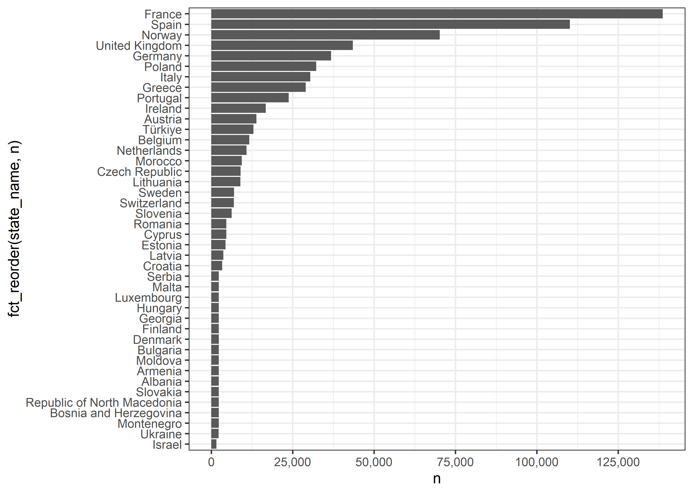
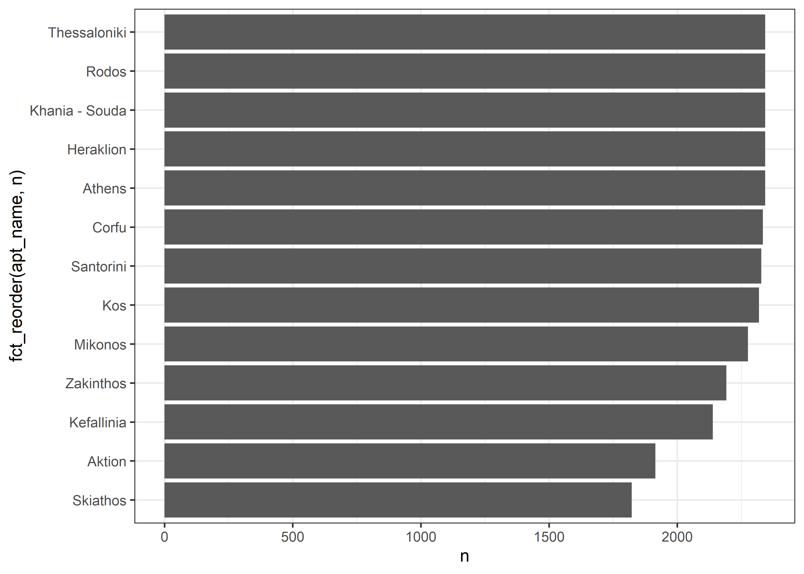
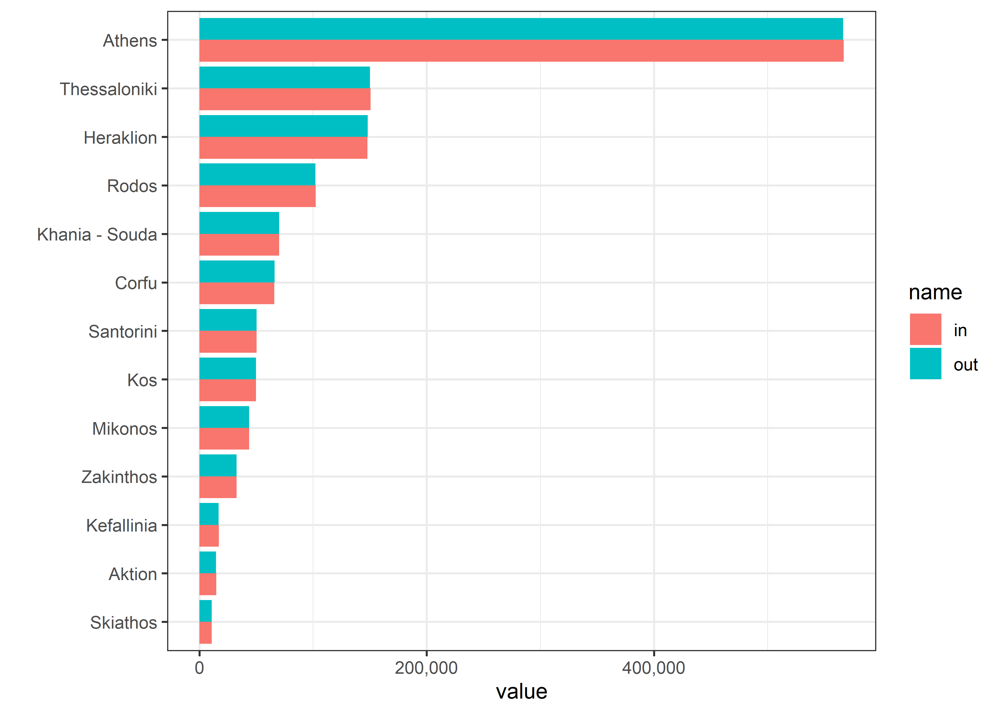
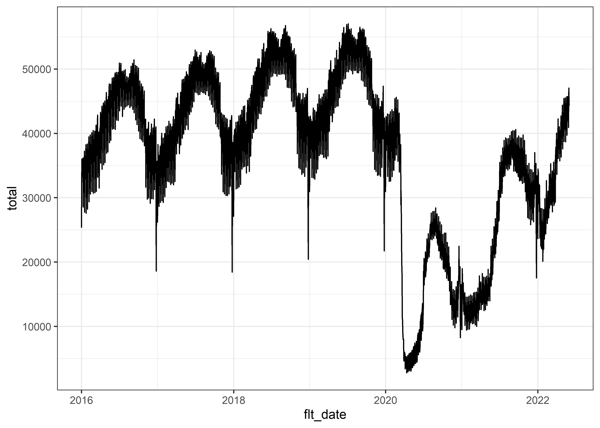
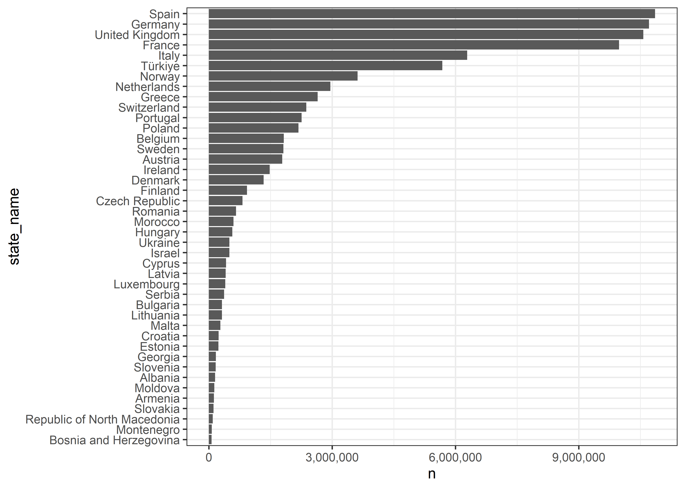
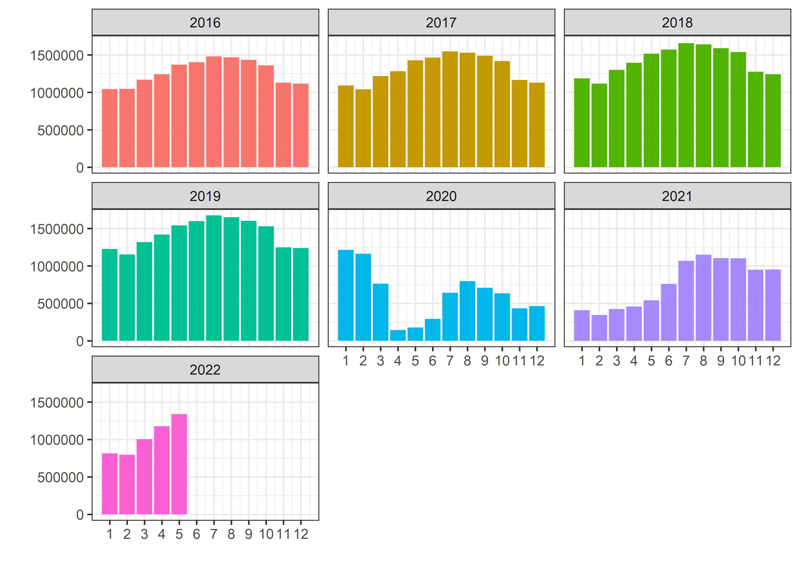

European Flights
================
Matthew
2022-07-13

``` r
flights <- read_csv('https://raw.githubusercontent.com/rfordatascience/tidytuesday/master/data/2022/2022-07-12/flights.csv')
```

    ## Rows: 688099 Columns: 14
    ## -- Column specification --------------------------------------------------------
    ## Delimiter: ","
    ## chr  (6): MONTH_NUM, MONTH_MON, APT_ICAO, APT_NAME, STATE_NAME, Pivot Label
    ## dbl  (7): YEAR, FLT_DEP_1, FLT_ARR_1, FLT_TOT_1, FLT_DEP_IFR_2, FLT_ARR_IFR_...
    ## dttm (1): FLT_DATE
    ## 
    ## i Use `spec()` to retrieve the full column specification for this data.
    ## i Specify the column types or set `show_col_types = FALSE` to quiet this message.

``` r
flights$MONTH_NUM <- as.numeric(flights$MONTH_NUM)

flights <- flights %>% 
  rename_with(tolower)
```

``` r
flights %>% 
  ggplot(aes(fct_reorder(month_mon, month_num))) + geom_bar() + labs(x = "")
```

<!-- -->

``` r
flights %>% 
  ggplot(aes(year)) + geom_bar()
```

<!-- -->

``` r
flights %>% 
  count(state_name) %>% 
  ggplot(aes(n, fct_reorder(state_name,n))) + geom_col() +
  scale_x_continuous(breaks = seq(0, 200000, 25000), labels = comma)
```

<!-- -->

``` r
flights %>% 
  filter(state_name == "Greece") %>% 
  count(apt_name, sort = TRUE) %>% 
  ggplot(aes(n, fct_reorder(apt_name, n))) + geom_col()
```

<!-- -->

``` r
flights %>% 
  filter(state_name == "Greece") %>% 
  group_by(apt_name) %>% 
  summarize("in" = sum(flt_arr_1),
            out = sum(flt_dep_1)) %>% 
  pivot_longer(-apt_name) %>% 
  ggplot(aes(value, fct_reorder(apt_name, value, max), fill = name)) + geom_col(position = "dodge") +
  labs(y = "") + scale_x_continuous(labels = comma)
```

<!-- -->

``` r
flights %>% 
  filter(state_name == "Greece") %>% 
  mutate(month_mon = fct_reorder(month_mon, month_num)) %>% 
  group_by(month_mon) %>% 
  summarize(diff = sum(flt_arr_1) - sum(flt_dep_1)) %>% 
  ggplot(aes(month_mon, diff, group = 1)) + geom_line()
```

<!-- -->

``` r
flights %>% 
  group_by(flt_date) %>% 
  summarize(total = sum(flt_tot_1)) %>% 
  ggplot(aes(flt_date, total)) + geom_line()
```

<!-- -->

``` r
flights %>% 
  group_by(state_name) %>% 
  summarize(n = sum(flt_tot_1)) %>% 
  mutate(state_name = fct_reorder(state_name,n)) %>% 
  ggplot(aes(n, state_name)) + geom_col() +
  scale_x_continuous(label = comma)
```

<!-- -->

``` r
flights %>% 
  group_by(year, month = month_num) %>% 
  summarize(sum = sum(flt_tot_1)) %>% 
  ggplot(aes(month, sum, fill = as.factor(year))) + geom_col() + 
  facet_wrap(~year) + scale_x_continuous(breaks = seq(1,12,1)) +
  theme(legend.position = "none") + labs(y = "", x = "")
```

    ## `summarise()` has grouped output by 'year'. You can override using the
    ## `.groups` argument.

<!-- -->
