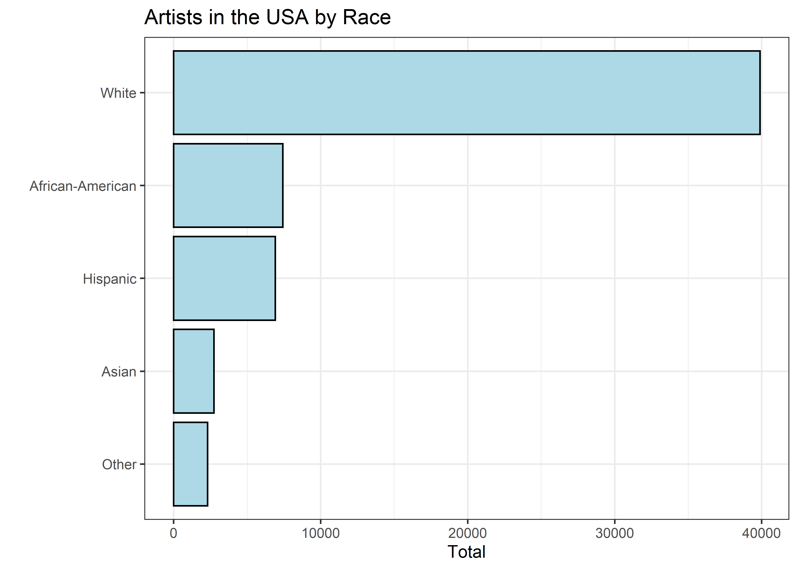
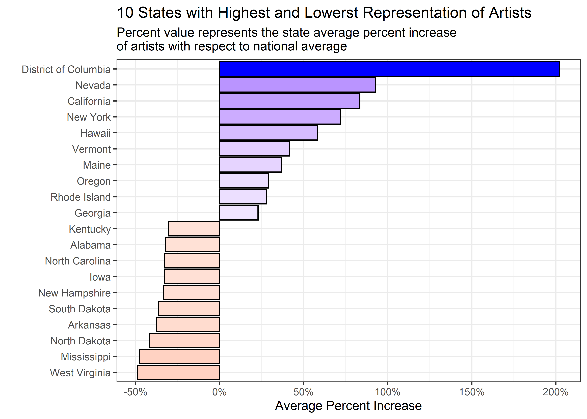

Artists
================
Matthew
2022-09-27

-   <a href="#eda" id="toc-eda">EDA</a>
    -   <a href="#summarize-function" id="toc-summarize-function">Summarize
        Function</a>
    -   <a href="#where-are-the-most-artists"
        id="toc-where-are-the-most-artists">Where are the most artists?</a>
    -   <a href="#states-vs-national-average"
        id="toc-states-vs-national-average">States vs National Average</a>

``` r
artists <- read_csv('https://raw.githubusercontent.com/rfordatascience/tidytuesday/master/data/2022/2022-09-27/artists.csv')
```

    ## Rows: 3380 Columns: 7
    ## -- Column specification --------------------------------------------------------
    ## Delimiter: ","
    ## chr (3): state, race, type
    ## dbl (4): all_workers_n, artists_n, artists_share, location_quotient
    ## 
    ## i Use `spec()` to retrieve the full column specification for this data.
    ## i Specify the column types or set `show_col_types = FALSE` to quiet this message.

# EDA

``` r
artists %>% 
  head(15)
```

    ## # A tibble: 15 x 7
    ##    state      race  type  all_workers_n artists_n artists_share location_quotie~
    ##    <chr>      <chr> <chr>         <dbl>     <dbl>         <dbl>            <dbl>
    ##  1 Alabama    Hisp~ Arch~         88165        45      0.000510            0.875
    ##  2 Alaska     Hisp~ Arch~         26875        15      0.000558            0.957
    ##  3 Arizona    Hisp~ Arch~       1033370       270      0.000261            0.448
    ##  4 Arkansas   Hisp~ Arch~        101405        NA     NA                  NA    
    ##  5 California Hisp~ Arch~       7470730      3870      0.000518            0.888
    ##  6 Colorado   Hisp~ Arch~        594525       200      0.000336            0.577
    ##  7 Connectic~ Hisp~ Arch~        288845       150      0.000519            0.891
    ##  8 Delaware   Hisp~ Arch~         41365         0     NA                  NA    
    ##  9 District ~ Hisp~ Arch~         44885       185      0.00412             7.07 
    ## 10 Florida    Hisp~ Arch~       2752995      2900      0.00105             1.81 
    ## 11 Georgia    Hisp~ Arch~        467240       370      0.000792            1.36 
    ## 12 Hawaii     Hisp~ Arch~         69470        40      0.000576            0.987
    ## 13 Idaho      Hisp~ Arch~        101285         0     NA                  NA    
    ## 14 Illinois   Hisp~ Arch~       1100445       700      0.000636            1.09 
    ## 15 Indiana    Hisp~ Arch~        212120        75      0.000354            0.606

``` r
skimr::skim(artists)
```

|                                                  |         |
|:-------------------------------------------------|:--------|
| Name                                             | artists |
| Number of rows                                   | 3380    |
| Number of columns                                | 7       |
| \_\_\_\_\_\_\_\_\_\_\_\_\_\_\_\_\_\_\_\_\_\_\_   |         |
| Column type frequency:                           |         |
| character                                        | 3       |
| numeric                                          | 4       |
| \_\_\_\_\_\_\_\_\_\_\_\_\_\_\_\_\_\_\_\_\_\_\_\_ |         |
| Group variables                                  | None    |

Data summary

**Variable type: character**

| skim_variable | n_missing | complete_rate | min | max | empty | n_unique | whitespace |
|:--------------|----------:|--------------:|----:|----:|------:|---------:|-----------:|
| state         |         0 |             1 |   4 |  20 |     0 |       52 |          0 |
| race          |         0 |             1 |   5 |  16 |     0 |        5 |          0 |
| type          |         0 |             1 |   6 |  42 |     0 |       13 |          0 |

**Variable type: numeric**

| skim_variable     | n_missing | complete_rate |      mean |         sd |   p0 |      p25 |       p50 |       p75 |       p100 | hist  |
|:------------------|----------:|--------------:|----------:|-----------:|-----:|---------:|----------:|----------:|-----------:|:------|
| all_workers_n     |         0 |          1.00 | 637910.62 | 1217325.01 | 1335 | 40325.00 | 149612.50 | 627290.00 | 7686845.00 | ▇▁▁▁▁ |
| artists_n         |       699 |          0.79 |    892.33 |    3407.91 |    0 |     0.00 |    110.00 |    470.00 |   83575.00 | ▇▁▁▁▁ |
| artists_share     |      1454 |          0.57 |      0.00 |       0.00 |    0 |     0.00 |      0.00 |      0.00 |       0.02 | ▇▁▁▁▁ |
| location_quotient |      1471 |          0.56 |      1.07 |       0.94 |    0 |     0.61 |      0.86 |      1.19 |      15.63 | ▇▁▁▁▁ |

``` r
artists <- artists %>% 
  rename_with(~gsub("artists", "artist", .x))
```

Is artist_share = artist_n/all_workers_n?

``` r
artists %>% 
  mutate(new = artist_n/all_workers_n) %>% 
  select(artist_share, new)
```

    ## # A tibble: 3,380 x 2
    ##    artist_share       new
    ##           <dbl>     <dbl>
    ##  1     0.000510  0.000510
    ##  2     0.000558  0.000558
    ##  3     0.000261  0.000261
    ##  4    NA        NA       
    ##  5     0.000518  0.000518
    ##  6     0.000336  0.000336
    ##  7     0.000519  0.000519
    ##  8    NA         0       
    ##  9     0.00412   0.00412 
    ## 10     0.00105   0.00105 
    ## # ... with 3,370 more rows

``` r
artists %>% 
  mutate(new = artist_n/all_workers_n) %>% 
  select(artist_share, new) %>% 
  summarize(mean(artist_share == new, na.rm = TRUE))
```

    ## # A tibble: 1 x 1
    ##   `mean(artist_share == new, na.rm = TRUE)`
    ##                                       <dbl>
    ## 1                                     0.475

``` r
artists %>% 
  mutate(new = artist_n/all_workers_n) %>% 
  filter(new != artist_share) %>% 
  select(-location_quotient)
```

    ## # A tibble: 1,012 x 7
    ##    state        race     type       all_workers_n artist_n artist_share      new
    ##    <chr>        <chr>    <chr>              <dbl>    <dbl>        <dbl>    <dbl>
    ##  1 Florida      Hispanic Architects       2752995     2900     0.00105  0.00105 
    ##  2 Georgia      Hispanic Architects        467240      370     0.000792 0.000792
    ##  3 New York     Hispanic Architects       1819490     1830     0.00101  0.00101 
    ##  4 Ohio         Hispanic Architects        204545      225     0.00110  0.00110 
    ##  5 Pennsylvania Hispanic Architects        423215      185     0.000437 0.000437
    ##  6 Tennessee    Hispanic Architects        167595       20     0.000119 0.000119
    ##  7 Arizona      White    Architects       1857110     2420     0.00130  0.00130 
    ##  8 California   White    Architects       7686845    15935     0.00207  0.00207 
    ##  9 Colorado     White    Architects       2172170     4625     0.00213  0.00213 
    ## 10 Connecticut  White    Architects       1329540     2670     0.00201  0.00201 
    ## # ... with 1,002 more rows

``` r
artists %>% 
  mutate(new = artist_n/all_workers_n) %>% 
  filter(new != artist_share) %>% 
  summarize(difference = sum(artist_share - new),
            avg = mean(artist_share - new, na.rm = TRUE))
```

    ## # A tibble: 1 x 2
    ##   difference        avg
    ##        <dbl>      <dbl>
    ## 1    0.00113 0.00000112

It appears there may be a minor difference in *artist_share* and
*artist_n/all_workers_n*, but its most likely a computational error
(floating point). Moving forward, *artist_share* will be used for
simplicity. Further more, it appears as though *all_workers_n*
represents all workers (**artists**) of a specific race in a state
(total count of all artists in a state by race). Ideally, it would be
shown by summing *artist_n* by race and state; and then showing they are
equal. Unfortunately, there are many NA’s that prohibit that method from
working. I come to this conclusion because the variable *all_workers_n*
is constant for a specific race and state.

``` r
artists %>% 
  distinct(all_workers_n, state, race) %>% 
  arrange(state)
```

    ## # A tibble: 260 x 3
    ##    state   race             all_workers_n
    ##    <chr>   <chr>                    <dbl>
    ##  1 Alabama Hispanic                 88165
    ##  2 Alabama White                  1496830
    ##  3 Alabama African-American        581200
    ##  4 Alabama Asian                    33515
    ##  5 Alabama Other                    43075
    ##  6 Alaska  Hispanic                 26875
    ##  7 Alaska  White                   253950
    ##  8 Alaska  African-American         13760
    ##  9 Alaska  Asian                    26420
    ## 10 Alaska  Other                    71330
    ## # ... with 250 more rows

As shown above, each state and race has only one distinct
*all_workers_n* value. A further example for a specific state below.

``` r
artists %>% 
  filter(state == "Alabama") %>% 
  distinct(all_workers_n, race)
```

    ## # A tibble: 5 x 2
    ##   race             all_workers_n
    ##   <chr>                    <dbl>
    ## 1 Hispanic                 88165
    ## 2 White                  1496830
    ## 3 African-American        581200
    ## 4 Asian                    33515
    ## 5 Other                    43075

## Summarize Function

``` r
summarize_fun <- function(x, y = NULL){
  artists %>% 
    group_by({{x}}, {{y}}) %>% 
    summarize(sum = sum(artist_n, na.rm = TRUE))
}
```

``` r
summarize_fun(race, type) %>% 
  filter(type == "Actors") %>% 
  ungroup() %>% 
  ggplot(aes(sum, fct_reorder(race, sum))) + geom_col(color = "black", fill = "lightblue") +
  labs(y = "", x = "Total", title = "Artists in the USA by Race")
```

    ## `summarise()` has grouped output by 'race'. You can override using the
    ## `.groups` argument.

<!-- -->

## Where are the most artists?

``` r
artists %>% 
  group_by(state, type) %>% 
  summarize(artist_n = sum(artist_n, na.rm = TRUE)) %>% 
  ungroup() %>% group_by(type) %>% 
  slice_max(artist_n, n = 1) %>% 
  arrange(-artist_n) %>% 
  ungroup() %>% 
  ggplot(aes(artist_n, fct_reorder(type, artist_n))) + 
  geom_col(color = "black", fill = "lightblue") + 
  labs(y = "", x = "Artists", title = "The most artists of a type in a state",
       subtitle = "California has the most artists for every type")
```

    ## `summarise()` has grouped output by 'state'. You can override using the
    ## `.groups` argument.

<!-- -->

``` r
knitr::kable(artists %>% 
  group_by(type) %>%   
  slice_max(artist_n, n = 1) %>% 
  select(state, race, type, artist_n, location_quotient)) 
```

| state      | race  | type                                       | artist_n | location_quotient |
|:-----------|:------|:-------------------------------------------|---------:|------------------:|
| California | White | Actors                                     |    14585 |          4.867477 |
| California | White | Announcers                                 |     3970 |          1.173030 |
| California | White | Architects                                 |    15935 |          1.617196 |
| California | White | Dancers And Choreographers                 |     1405 |          1.546436 |
| California | White | Designers                                  |    83575 |          1.646499 |
| California | White | Entertainers                               |     6030 |          2.443303 |
| California | White | Fine Artists, Art Directors, And Animators |    30250 |          2.299725 |
| California | White | Landscape Architects                       |     3340 |          1.784626 |
| California | White | Music Directors And Composers              |     5625 |          2.092000 |
| California | White | Musicians                                  |    15280 |          1.733929 |
| California | White | Photographers                              |    17910 |          1.712045 |
| California | White | Producers And Directors                    |    36220 |          3.704667 |
| California | White | Writers And Authors                        |    34710 |          2.258506 |

## States vs National Average

The variable *location_quotient* shows the proportional difference of
artists compared to the national average. A quote from TidyTuesday
explaining this variable: “For example, an LQ of 1.2 indicates that the
state’s labor force in an occupation is 20 percent greater than the
occupation’s national labor force share. An LQ of 0.8 indicates that the
state’s labor force in an occupation is 20 percent below the
occupation’s national labor force share.” We will explore this variable
below.

``` r
loc_artists <- artists %>% 
  group_by(state) %>% 
  summarize(m = (mean(location_quotient, na.rm = TRUE)) - 1)
```

The function created above will simplify the code moving forward. It
gets the average *location_quotient* by state, and then **-1** to get
the increase.

``` r
loc_artists %>% 
  slice_max(m, n = 10) %>% 
  bind_rows(loc_artists %>% slice_min(m, n = 10)) %>% 
  ggplot(aes(m, fct_reorder(state, m), fill = m)) + 
  geom_col(color = "black") + 
  scale_x_continuous(labels = percent) + 
  scale_fill_gradient2(low = "red", mid = "white", high = "blue", midpoint = 0) +
  labs(y = "", x = "Average Percent Increase", 
       title = "10 States with Highest and Lowerst Representation of Artists",
       subtitle = 
         "Percent value represents the state average percent increase 
of artists with respect to national average") +
  theme(legend.position = "")
```

<!-- -->

``` r
artists %>% 
  summarize(m = mean(location_quotient > 1, na.rm = TRUE))
```

    ## # A tibble: 1 x 1
    ##       m
    ##   <dbl>
    ## 1 0.379

Another function is created below to allow for quick plots of lowest and
highest values.

``` r
loc2_artists <- artists %>% 
  group_by(state) %>% 
  slice_max(location_quotient, n = 1) %>% 
  bind_rows(artists %>% 
              group_by(state) %>% 
              slice_min(location_quotient, n = 1))
```

``` r
loc2_artists %>% 
  ungroup() %>% 
  slice_max(location_quotient, n = 4) %>% 
  bind_rows(loc2_artists %>% ungroup() %>% filter(state != "West Virginia") %>% 
            slice_min(location_quotient, n = 4)) %>% 
  mutate(location_quotient = ifelse(location_quotient >= 1, 
                                    location_quotient, 
                                    -1/location_quotient)) %>% 
  ggplot(aes(location_quotient, fct_reorder(state, location_quotient), fill = race)) +
  geom_col(color = "black") +
  scale_x_continuous(labels = number_format(suffix = "x")) +
  labs(y = "", x = "Number of times more than national average", 
       title = "The 4 States with Highest and Lowest Number of Artists")
```

<!-- -->

The variable *location_quotient* does not account for state population,
thus many of the states that have the least number of artist subgroup
have smaller populations as well.
