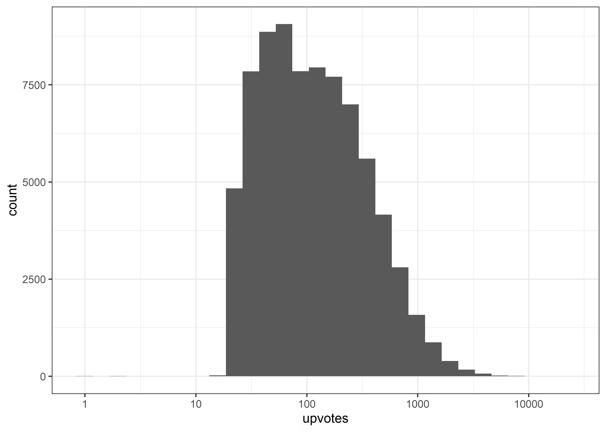
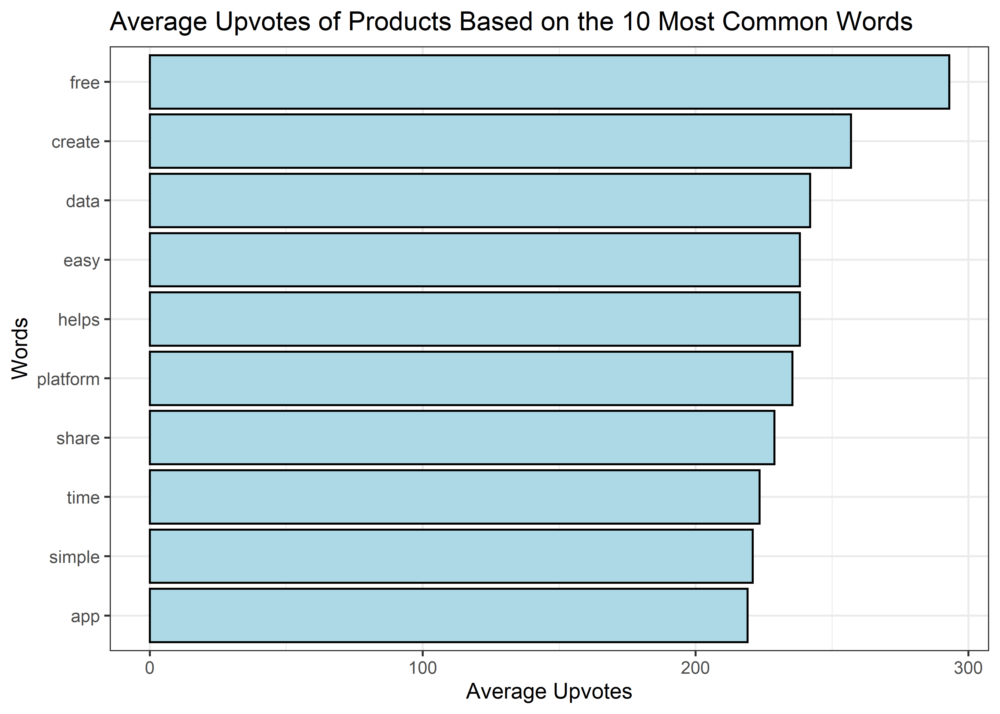
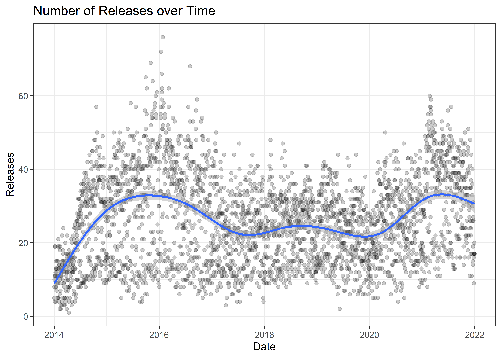
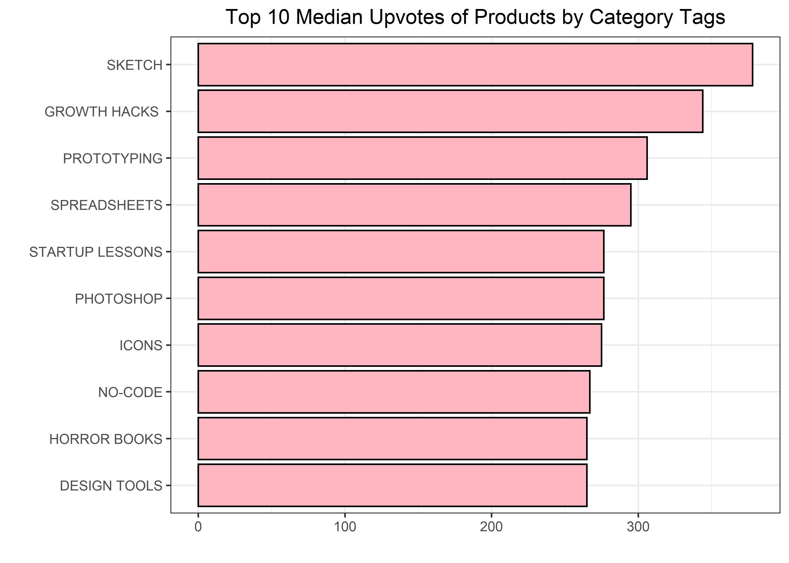
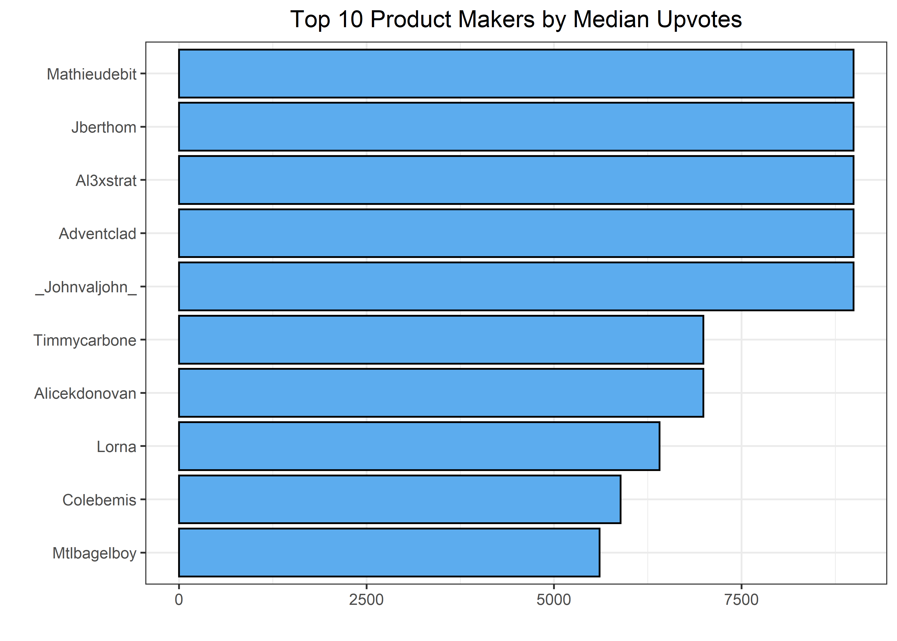
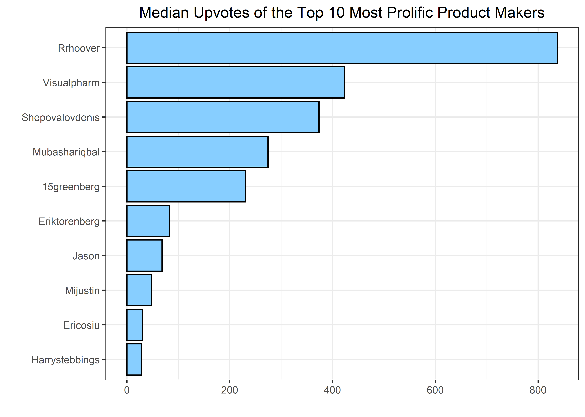
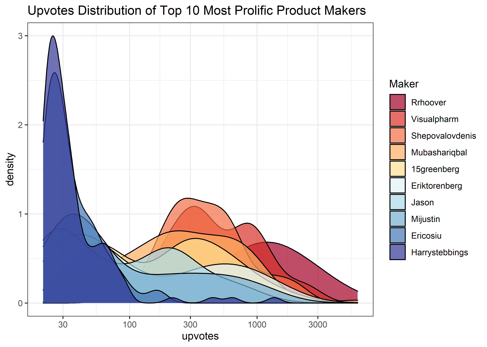
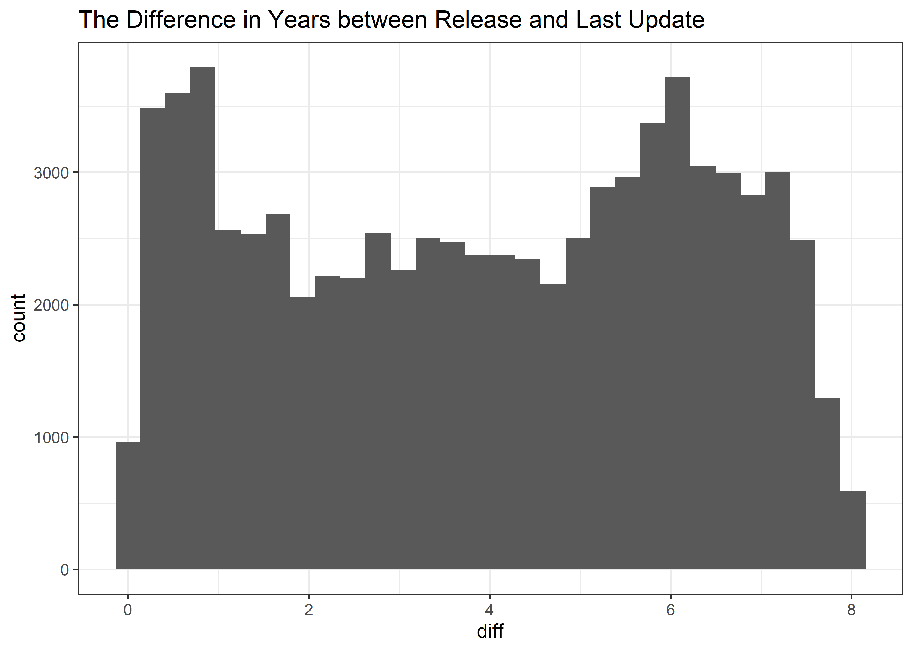
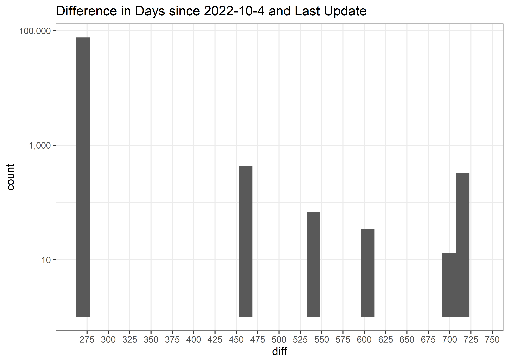

Product Hunt
================
Matthew
2022-10-04

-   <a href="#eda" id="toc-eda">EDA</a>
    -   <a href="#most-common-words-in-product-description"
        id="toc-most-common-words-in-product-description">Most Common Words in
        Product Description</a>
    -   <a href="#releases-of-time" id="toc-releases-of-time">Releases of
        Time</a>
    -   <a href="#most-upvoted-products" id="toc-most-upvoted-products">Most
        Upvoted Products</a>
-   <a href="#upvotes" id="toc-upvotes">Upvotes</a>
    -   <a href="#category-tags" id="toc-category-tags">Category Tags</a>
    -   <a href="#product-makers" id="toc-product-makers">Product Makers</a>
        -   <a href="#the-most-prolific" id="toc-the-most-prolific">The Most
            Prolific</a>
-   <a href="#date" id="toc-date">Date</a>

# EDA

``` r
product <- read_csv('https://raw.githubusercontent.com/rfordatascience/tidytuesday/master/data/2022/2022-10-04/product_hunt.csv')
```

    ## Rows: 76822 Columns: 12
    ## -- Column specification --------------------------------------------------------
    ## Delimiter: ","
    ## chr  (7): id, name, product_description, main_image, category_tags, hunter, ...
    ## dbl  (2): product_ranking, upvotes
    ## dttm (2): release_date, last_updated
    ## date (1): product_of_the_day_date
    ## 
    ## i Use `spec()` to retrieve the full column specification for this data.
    ## i Specify the column types or set `show_col_types = FALSE` to quiet this message.

``` r
knitr::kable(head(product[,1:6]))
```

| id                                    | name                                    | product_description                                                                                                                                                                                                                                                                                                         | release_date | product_of_the_day_date | product_ranking |
|:--------------------------------------|:----------------------------------------|:----------------------------------------------------------------------------------------------------------------------------------------------------------------------------------------------------------------------------------------------------------------------------------------------------------------------------|:-------------|:------------------------|----------------:|
| ar-fidget-spinner                     | AR Fidget Spinner                       | AR Fidget Spinner brings back the fidget spinner, in augmented reality. Play with multiple colors of spinners, anytime, anywhere. Never lose yours again.                                                                                                                                                                   | 2017-09-19   | NA                      |              NA |
| e-botfinder                           | e-botfinder                             | NA                                                                                                                                                                                                                                                                                                                          | 2016-05-29   | NA                      |              NA |
| bioglo                                | BioGlo                                  | BioGlo brings the beauty of bioluminescence into your home or classroom. Inside its sleek hourglass shape, BioGlo contains hundreds of tiny microbes called dinoflagellates (aka dinos). These dinos have the natural ability to absorb the sun’s rays during the day and emit a mysterious blue glow when shaken at night! | 2018-01-06   | NA                      |              NA |
| onsites                               | Onsites                                 | Onsites helps companies craft the best candidate interview experience by offering tools for hiring teams. We help companies with two products: detailed onsite schedules and fully transparent offer letters.                                                                                                               | 2018-02-09   | 2018-02-09              |               4 |
| easylistr-ios-twitter-lists-made-easy | Easylistr iOS - Twitter lists made easy | NA                                                                                                                                                                                                                                                                                                                          | 2016-06-01   | NA                      |              NA |
| cuttlefish                            | Cuttlefish                              | NA                                                                                                                                                                                                                                                                                                                          | 2014-10-30   | NA                      |              NA |

``` r
knitr::kable(head(product[,7:12]))
```

| main_image                                                             | upvotes | category_tags                                                                   | hunter          | makers                        | last_updated        |
|:-----------------------------------------------------------------------|--------:|:--------------------------------------------------------------------------------|:----------------|:------------------------------|:--------------------|
| <https://ph-files.imgix.net/9f8f55b2-2a94-4915-84f1-dbb5ef3336c4.jpeg> |     134 | \[‘IPAD’, ‘IPHONE’, ‘ARKIT’, ‘AUGMENTED REALITY’\]                              | shanev          | \[‘shanev’, ‘tettoffensive’\] | 2022-01-11 01:34:10 |
| <https://ph-files.imgix.net/bca825ce-a4e9-4d95-9a5f-1310cb7059f5.png>  |     183 | \[‘BOTS’, ‘ARTIFICIAL INTELLIGENCE’, ‘TECH’, ‘SLACK’, ‘MESSAGING’\]             | fabian_beringer | \[‘fabian_beringer’\]         | 2022-01-12 19:28:49 |
| <https://ph-files.imgix.net/99d69c10-0e58-4b0b-8c93-e80c379968b5.png>  |     196 | \[‘TECH’, ‘EDUCATION’, ‘CROWDFUNDING’, ‘HOME’, ‘BIOHACKING’\]                   | keegan_cooke    | \[‘keegan_cooke’\]            | 2022-01-11 09:00:59 |
| <https://ph-files.imgix.net/b6483b87-d952-40ff-95bc-5803b6ea77b1.png>  |     315 | \[‘PRODUCTIVITY’, ‘USER EXPERIENCE’, ‘TECH’, ‘EMAIL’, ‘HIRING AND RECRUITING’\] | \_shahedk       | \[‘jmtame’\]                  | 2022-01-12 11:04:49 |
| <https://ph-files.imgix.net/bd5cb6ff-78da-4762-95cc-fb35b21580e4.jpeg> |     104 | \[‘TWITTER’, ‘PRODUCTIVITY’, ‘IPHONE’, ‘TECH’\]                                 | igorbogdanovski | \[\]                          | 2022-01-12 14:52:25 |
| NA                                                                     |      69 | \[‘TECH’\]                                                                      | erictwillis     | \[‘matthewlandauer’\]         | 2022-01-11 17:03:06 |

``` r
skimr::skim(product)
```

|                                                  |         |
|:-------------------------------------------------|:--------|
| Name                                             | product |
| Number of rows                                   | 76822   |
| Number of columns                                | 12      |
| \_\_\_\_\_\_\_\_\_\_\_\_\_\_\_\_\_\_\_\_\_\_\_   |         |
| Column type frequency:                           |         |
| character                                        | 7       |
| Date                                             | 1       |
| numeric                                          | 2       |
| POSIXct                                          | 2       |
| \_\_\_\_\_\_\_\_\_\_\_\_\_\_\_\_\_\_\_\_\_\_\_\_ |         |
| Group variables                                  | None    |

Data summary

**Variable type: character**

| skim_variable       | n_missing | complete_rate | min |  max | empty | n_unique | whitespace |
|:--------------------|----------:|--------------:|----:|-----:|------:|---------:|-----------:|
| id                  |         0 |          1.00 |   1 |  109 |     0 |    76822 |          0 |
| name                |         3 |          1.00 |   1 |  110 |     0 |    73263 |          0 |
| product_description |     32767 |          0.57 |   1 | 2019 |     0 |    43789 |          0 |
| main_image          |     10078 |          0.87 |  63 |   83 |     0 |    66513 |          0 |
| category_tags       |         0 |          1.00 |   2 |  307 |     0 |    29190 |          0 |
| hunter              |         0 |          1.00 |   1 |   30 |     0 |    27954 |          0 |
| makers              |         0 |          1.00 |   2 |  804 |     0 |    47420 |          0 |

**Variable type: Date**

| skim_variable           | n_missing | complete_rate | min        | max        | median     | n_unique |
|:------------------------|----------:|--------------:|:-----------|:-----------|:-----------|---------:|
| product_of_the_day_date |     62200 |          0.19 | 2014-01-01 | 2021-12-31 | 2018-01-11 |     2920 |

**Variable type: numeric**

| skim_variable   | n_missing | complete_rate |   mean |     sd |  p0 | p25 | p50 | p75 |  p100 | hist  |
|:----------------|----------:|--------------:|-------:|-------:|----:|----:|----:|----:|------:|:------|
| product_ranking |     62140 |          0.19 |   3.05 |   1.40 |   1 |   2 |   3 |   4 |     5 | ▇▇▇▇▇ |
| upvotes         |         0 |          1.00 | 214.53 | 351.82 |   0 |  48 | 104 | 246 | 21798 | ▇▁▁▁▁ |

**Variable type: POSIXct**

| skim_variable | n_missing | complete_rate | min                 | max                 | median              | n_unique |
|:--------------|----------:|--------------:|:--------------------|:--------------------|:--------------------|---------:|
| release_date  |         0 |             1 | 2014-01-01 00:00:00 | 2021-12-31 00:00:00 | 2017-12-28 00:00:00 |     2922 |
| last_updated  |         0 |             1 | 2020-10-10 21:33:29 | 2022-01-14 15:02:31 | 2022-01-12 01:02:32 |    63077 |

``` r
product %>% 
  count(makers, sort = TRUE)
```

    ## # A tibble: 47,420 x 2
    ##    makers                n
    ##    <chr>             <int>
    ##  1 []                17152
    ##  2 ['mijustin']         55
    ##  3 ['ericosiu']         37
    ##  4 ['levelsio']         34
    ##  5 ['mubashariqbal']    33
    ##  6 ['evanspiegel']      32
    ##  7 ['tim1']             30
    ##  8 ['awt']              29
    ##  9 ['clarkvalberg']     29
    ## 10 ['jason']            29
    ## # ... with 47,410 more rows

``` r
product %>% 
  filter(upvotes != 0) %>% 
  ggplot(aes(upvotes)) + geom_histogram() +
  scale_x_log10()
```

    ## `stat_bin()` using `bins = 30`. Pick better value with `binwidth`.

<!-- -->

## Most Common Words in Product Description

``` r
product %>% 
  unnest_tokens(word,product_description) %>% 
  anti_join(stop_words) %>%
  mutate(word = fct_lump(word, 10)) %>% 
  filter(word != "Other", !is.na(word)) %>% 
  group_by(word) %>% 
  summarize(m = mean(upvotes, na.rm = TRUE)) %>% 
  arrange(-m) %>% 
  ggplot(aes(m, fct_reorder(word, m))) + geom_col(color = "black", fill = "lightblue") +
  labs(y = "Words", x = "Average Upvotes", title = "Average Upvotes of Products Based on the 10 Most Common Words")
```

    ## Joining, by = "word"

<!-- -->

## Releases of Time

``` r
product %>% 
  count(release_date, sort = TRUE) %>% 
  ggplot(aes(release_date, n)) + geom_point(alpha = 0.2) +
  geom_smooth() + labs(title = "Number of Releases over Time", x = "Date", y = "Releases")
```

    ## `geom_smooth()` using method = 'gam' and formula 'y ~ s(x, bs = "cs")'

<!-- -->

## Most Upvoted Products

``` r
product %>% 
  slice_max(upvotes, n = 10) %>% 
  ggplot(aes(upvotes, fct_reorder(name, upvotes))) + 
  geom_col(color = "black", fill = "lightgreen") +
  labs(y = "Product Name")
```

<!-- -->

# Upvotes

## Category Tags

``` r
head(product$category_tags)
```

    ## [1] "['IPAD', 'IPHONE', 'ARKIT', 'AUGMENTED REALITY']"                             
    ## [2] "['BOTS', 'ARTIFICIAL INTELLIGENCE', 'TECH', 'SLACK', 'MESSAGING']"            
    ## [3] "['TECH', 'EDUCATION', 'CROWDFUNDING', 'HOME', 'BIOHACKING']"                  
    ## [4] "['PRODUCTIVITY', 'USER EXPERIENCE', 'TECH', 'EMAIL', 'HIRING AND RECRUITING']"
    ## [5] "['TWITTER', 'PRODUCTIVITY', 'IPHONE', 'TECH']"                                
    ## [6] "['TECH']"

``` r
product_tags <- product %>% 
  mutate(category_tags = str_split(category_tags, "', ")) %>% 
  unnest(category_tags) %>% 
  mutate(category_tags = str_remove_all(category_tags, "\\[|'|\\]"))
```

New dataset is made; expanding the number of rows by cleaning and
separating the *category_tags* variable into a row per category tag.

``` r
product_tags %>% 
  group_by(category_tags) %>% 
  summarize(Median = median(upvotes, na.rm = TRUE)) %>% 
  slice_max(Median, n = 10) %>% 
  ggplot(aes(Median, fct_reorder(category_tags, Median))) + 
  geom_col(color = "black", fill = "lightpink") +
  labs(title = "Top 10 Median Upvotes of Products by Category Tags", y = "", x = "") +
  theme(plot.title = element_text(hjust = 0.5))
```

<!-- -->

## Product Makers

``` r
head(product$makers)
```

    ## [1] "['shanev', 'tettoffensive']" "['fabian_beringer']"        
    ## [3] "['keegan_cooke']"            "['jmtame']"                 
    ## [5] "[]"                          "['matthewlandauer']"

``` r
product_makers <- product %>% 
  mutate(makers = str_split(makers, ", ")) %>%  unnest(makers) %>%   # split into a list and then un-list into rows
  mutate(makers = str_remove_all(makers, "\\[|'|\\]|\\\""),          # remove extra characters
         makers = noquote(makers),                                   # remove quotes
         makers = ifelse(makers == "", NA, makers),                  # turn empty string into NA
         makers = str_to_title(makers))                              # convert into title case
```

``` r
product_makers %>%  
  count(makers, sort = TRUE)
```

    ## # A tibble: 73,860 x 2
    ##    makers              n
    ##    <chr>           <int>
    ##  1 <NA>            17152
    ##  2 Harrystebbings    119
    ##  3 Mubashariqbal      78
    ##  4 Eriktorenberg      74
    ##  5 Jason              73
    ##  6 Ericosiu           72
    ##  7 Shepovalovdenis    70
    ##  8 Rrhoover           69
    ##  9 Visualpharm        65
    ## 10 Mijustin           64
    ## # ... with 73,850 more rows

Unfortunately, the majority of *makers* contains **NA’s**. Regardless,
it would be interesting to observe the number of upvotes by product
*makers*.

``` r
product_makers %>% 
  filter(!is.na(makers)) %>% 
  group_by(makers) %>% 
  summarize(median = median(upvotes, na.rm = TRUE)) %>% 
  slice_max(median, n = 10) %>% 
  ggplot(aes(median, fct_reorder(makers, median))) + 
  geom_col(color = "black", fill = "steelblue2") +
  labs(y = "", x = "", title = "Top 10 Product Makers by Median Upvotes") +
  theme(plot.title = element_text(hjust = 0.5))
```

<!-- -->

The top 4 *makers* suspiciously have the same exact median upvote. This
may be due to the fact that many *makers* were grouped together on the
same product.

``` r
product_makers %>% 
  filter(!is.na(makers)) %>% 
  group_by(makers) %>% 
  summarize(median = median(upvotes, na.rm = TRUE),
            n = n()) %>% 
  slice_max(median, n = 10)
```

    ## # A tibble: 10 x 3
    ##    makers        median     n
    ##    <chr>          <dbl> <int>
    ##  1 _Johnvaljohn_  8993      1
    ##  2 Adventclad     8993      1
    ##  3 Al3xstrat      8993      1
    ##  4 Jberthom       8993      1
    ##  5 Mathieudebit   8993      1
    ##  6 Alicekdonovan  6991      1
    ##  7 Timmycarbone   6991      1
    ##  8 Lorna          6406      1
    ##  9 Colebemis      5887      1
    ## 10 Mtlbagelboy    5606.     2

``` r
product_makers %>% 
  filter(upvotes == 8993) %>% 
  select(makers, name, id)
```

    ## # A tibble: 5 x 3
    ##   makers        name    id       
    ##   <chr>         <chr>   <chr>    
    ## 1 Jberthom      Station station-3
    ## 2 Al3xstrat     Station station-3
    ## 3 _Johnvaljohn_ Station station-3
    ## 4 Mathieudebit  Station station-3
    ## 5 Adventclad    Station station-3

A median of one product vote does not tell us much about the makers of
the products, especially if we want to predict upvotes based on makers.

### The Most Prolific

``` r
product_makers %>% 
  filter(!is.na(makers)) %>% 
  count(makers, sort = TRUE)
```

    ## # A tibble: 73,859 x 2
    ##    makers              n
    ##    <chr>           <int>
    ##  1 Harrystebbings    119
    ##  2 Mubashariqbal      78
    ##  3 Eriktorenberg      74
    ##  4 Jason              73
    ##  5 Ericosiu           72
    ##  6 Shepovalovdenis    70
    ##  7 Rrhoover           69
    ##  8 Visualpharm        65
    ##  9 Mijustin           64
    ## 10 15greenberg        58
    ## # ... with 73,849 more rows

``` r
product_makers %>% 
  filter(!is.na(makers)) %>% 
  mutate(makers = fct_lump(makers, n = 10)) %>%       # keep top 10 makers
  filter(makers != "Other") %>% 
  group_by(makers) %>% 
  summarize(median = median(upvotes, na.rm = TRUE)) %>% 
  ggplot(aes(median, fct_reorder(makers, median))) + 
  geom_col(color = "black", fill = "skyblue1") +
  labs(y = "", x = "", title = "Median Upvotes of the Top 10 Most Prolific Product Makers") +
  theme(plot.title = element_text(hjust = 0.5))
```

<!-- -->

``` r
product_makers %>% 
  filter(!is.na(makers)) %>% 
  mutate(makers = fct_lump(makers, n = 10)) %>%
  filter(makers != "Other") %>% 
  ggplot(aes(upvotes, fill = fct_reorder(makers, upvotes, median, .desc = TRUE))) + geom_density(alpha = 0.7) +
  scale_x_log10() + labs(fill = "Maker", title = "Upvotes Distribution of Top 10 Most Prolific Product Makers") +
  scale_fill_brewer(palette = "RdYlBu")
```

<!-- -->

# Date

``` r
product %>% 
  mutate(diff = time_length(last_updated - release_date, "years")) %>% 
  ggplot(aes(diff)) + geom_histogram() +
  labs(title = "The Difference in Years between Release and Last Update")
```

    ## `stat_bin()` using `bins = 30`. Pick better value with `binwidth`.

<!-- -->

``` r
product %>% 
  mutate(diff = as.Date("2022-10-4") - as.Date(last_updated)) %>% 
  ggplot(aes(diff)) + geom_histogram() +
  scale_y_log10(labels = comma_format()) +
  scale_x_continuous(breaks = seq(275,750,25), minor_breaks = NULL) +
  labs(title = "Difference in Days since 2022-10-4 and Last Update")
```

    ## `stat_bin()` using `bins = 30`. Pick better value with `binwidth`.

<!-- -->
