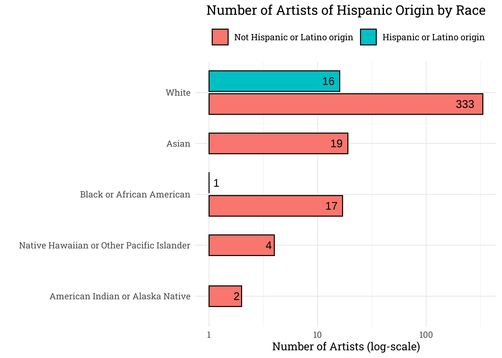
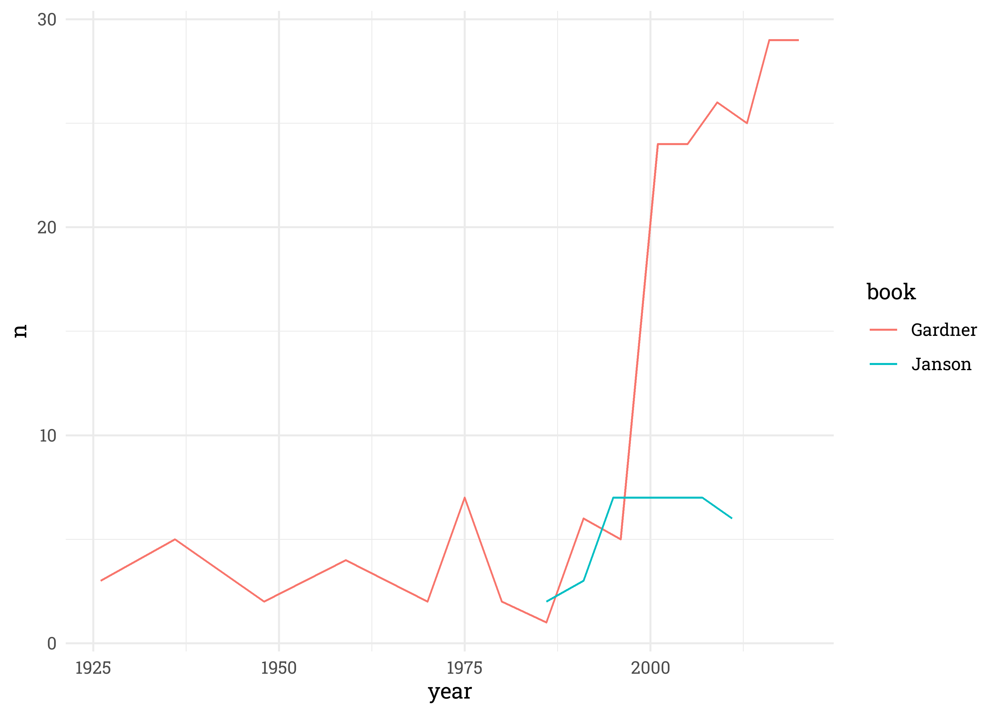
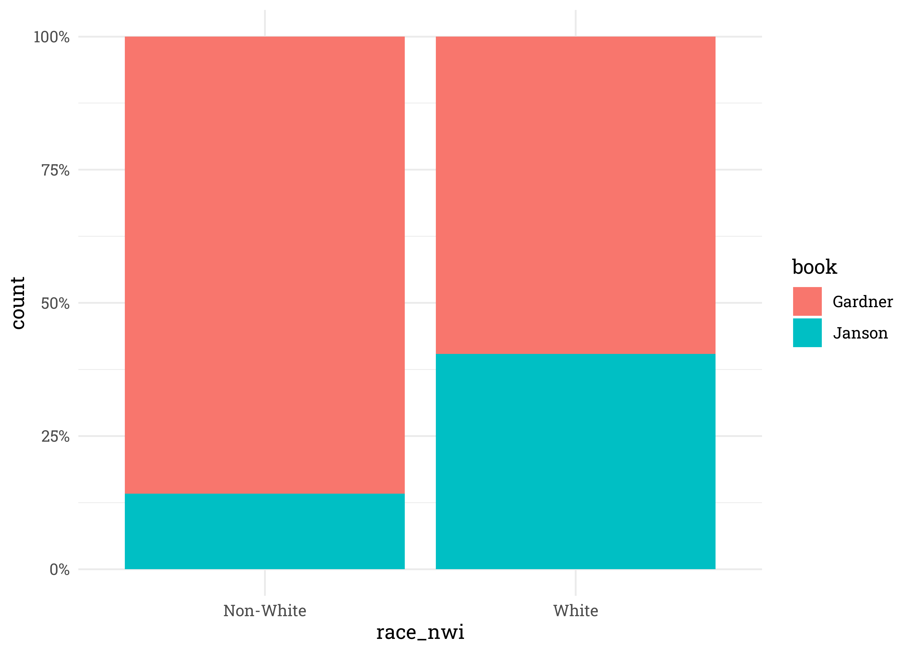
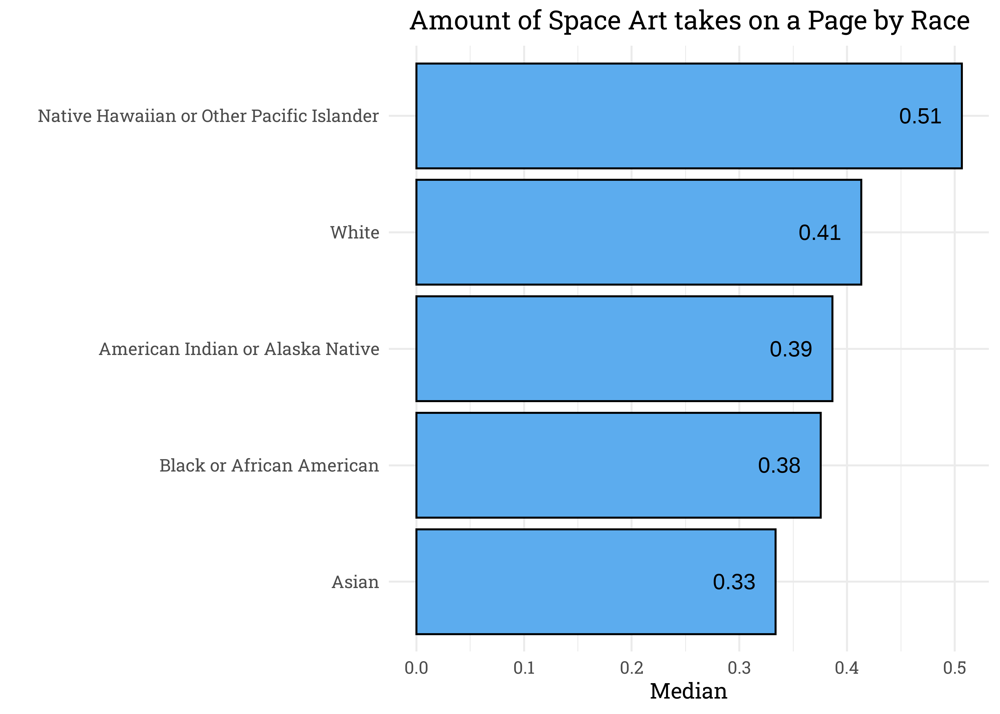

Art Publications
================
Matthew
2023-01-17

-   <a href="#data-cleaning" id="toc-data-cleaning">Data Cleaning</a>
    -   <a href="#missing-values" id="toc-missing-values">Missing Values</a>
    -   <a href="#counts" id="toc-counts">Counts</a>
-   <a href="#exploratory-data-analysis"
    id="toc-exploratory-data-analysis">Exploratory Data Analysis</a>
    -   <a href="#race" id="toc-race">Race</a>
        -   <a href="#years" id="toc-years">Years</a>
        -   <a href="#book" id="toc-book">Book</a>
        -   <a href="#amount-of-space-on-the-page"
            id="toc-amount-of-space-on-the-page">Amount of Space on the Page</a>
    -   <a href="#artist" id="toc-artist">Artist</a>

``` r
artist <- read_csv('https://raw.githubusercontent.com/rfordatascience/tidytuesday/master/data/2023/2023-01-17/artists.csv')
```

    ## Rows: 3162 Columns: 14
    ## -- Column specification --------------------------------------------------------
    ## Delimiter: ","
    ## chr (8): artist_name, artist_nationality, artist_nationality_other, artist_g...
    ## dbl (6): edition_number, year, space_ratio_per_page_total, artist_unique_id,...
    ## 
    ## i Use `spec()` to retrieve the full column specification for this data.
    ## i Specify the column types or set `show_col_types = FALSE` to quiet this message.

``` r
# shorten column names by removing 'artist_' from it
artist <- artist %>% 
  rename_with(~gsub("artist_", "", .x))
```

# Data Cleaning

## Missing Values

``` r
skimr::skim(artist) %>% select(skim_type, skim_variable, n_missing)
```

|                                                  |        |
|:-------------------------------------------------|:-------|
| Name                                             | artist |
| Number of rows                                   | 3162   |
| Number of columns                                | 14     |
| \_\_\_\_\_\_\_\_\_\_\_\_\_\_\_\_\_\_\_\_\_\_\_   |        |
| Column type frequency:                           |        |
| character                                        | 8      |
| numeric                                          | 6      |
| \_\_\_\_\_\_\_\_\_\_\_\_\_\_\_\_\_\_\_\_\_\_\_\_ |        |
| Group variables                                  | None   |

Data summary

**Variable type: character**

| skim_variable     | n_missing |
|:------------------|----------:|
| name              |         0 |
| nationality       |         0 |
| nationality_other |         0 |
| gender            |         0 |
| race              |         0 |
| ethnicity         |        58 |
| book              |         0 |
| race_nwi          |         0 |

**Variable type: numeric**

| skim_variable              | n_missing |
|:---------------------------|----------:|
| edition_number             |         0 |
| year                       |         0 |
| space_ratio_per_page_total |         0 |
| unique_id                  |         0 |
| moma_count_to_year         |         0 |
| whitney_count_to_year      |         0 |

## Counts

``` r
artist %>% 
  count(race, sort = TRUE)
```

    ## # A tibble: 6 x 2
    ##   race                                          n
    ##   <chr>                                     <int>
    ## 1 White                                      2936
    ## 2 Black or African American                    83
    ## 3 Asian                                        79
    ## 4 N/A                                          29
    ## 5 Native Hawaiian or Other Pacific Islander    23
    ## 6 American Indian or Alaska Native             12

*race* has a string called N/A, this should be replaced with NA values
as missing data.

``` r
artist <- artist %>% 
  mutate(race = ifelse(race == "N/A", NA, race))
```

# Exploratory Data Analysis

## Race

``` r
artist %>% 
  group_by(ethnicity) %>% 
  count(race, sort = TRUE) %>% 
  drop_na() %>% 
  ggplot(aes(n, fct_reorder(race, n, sum))) +
  geom_col(color = "black", aes(fill = fct_rev(ethnicity))) +
  scale_x_log10() +
  labs(y = "", x = "", fill = "")
```

<!-- -->

### Years

``` r
artist %>% 
  drop_na() %>% 
  group_by(year) %>% 
  count(race) %>% 
  ggplot(aes(year, n, color = race)) +
  geom_line() +
  labs(title = "Art Publications", x = "Year", y = "", color = "")
```

<!-- -->

``` r
artist %>% 
  drop_na() %>% 
  ggplot(aes(year, fill = race, color = race)) +
  geom_density(alpha = 0.5) +
  labs(title = "Proportion of Publications of each Race",
       x = "Year", y = "")
```

<!-- -->

``` r
artist %>% 
  filter(race_nwi == "Non-White") %>% 
  group_by(year) %>% 
  count(book) %>% 
  ggplot(aes(year, n, color = book)) +
  geom_line()
```

<!-- -->

``` r
artist %>% 
  ggplot(aes(fill = book, x = race_nwi)) +
  geom_bar(position = "fill") +
  scale_y_continuous(label = percent_format())
```

<!-- -->

### Book

``` r
artist %>% 
  count(race_nwi, book) %>% 
  group_by(race_nwi) %>% 
  mutate(pct = n/sum(n)) %>% 
  ggplot(aes(x = race_nwi, y = pct, fill = fct_rev(book), label = percent(pct))) + 
  geom_col(position = 'fill') + 
  geom_text(position = "fill", size = 4, vjust = 2) + 
  scale_y_continuous(labels = percent) +
  scale_fill_manual(values = c("steelblue2", "green3")) +
  labs(y = "", x = "", fill = "", title = "Where Non-Whites Publish Art") 
```

<!-- -->

We can see that the majority of Non-White artists had their art
published on **Gardener**.

### Amount of Space on the Page

``` r
artist %>% 
  drop_na() %>% 
  group_by(race) %>% 
  summarize(n = n()) %>% 
  arrange(-n) %>% 
  knitr::kable()
```

| race                                      |    n |
|:------------------------------------------|-----:|
| White                                     | 2935 |
| Black or African American                 |   83 |
| Asian                                     |   66 |
| Native Hawaiian or Other Pacific Islander |   12 |
| American Indian or Alaska Native          |    4 |

``` r
artist %>% 
  drop_na() %>% 
  ggplot(aes(space_ratio_per_page_total, fill = race)) +
  geom_histogram() +
  facet_wrap(~race, scales = "free", ncol = 2) +
  theme(legend.position = "none")
```

    ## `stat_bin()` using `bins = 30`. Pick better value with `binwidth`.

<!-- -->

``` r
artist %>%
  drop_na() %>% 
  group_by(race) %>% 
  summarize(median = median(space_ratio_per_page_total)) %>% 
  ggplot(aes(median, fct_reorder(race, median))) +
  geom_col(color = "black", fill = "steelblue2") +
  geom_text(aes(label = round(median, 2)), hjust = 1.5) +
  labs(y = "", x = "Median", title = "Amount of Space Art takes on a Page by Race")
```

<!-- -->

## Artist

``` r
artist %>% 
  group_by(name, nationality) %>% 
  summarize(avg_space = mean(space_ratio_per_page_total, na.rm = TRUE)) %>% 
  ungroup() %>% 
  slice_max(avg_space, n = 10) %>% 
  ggplot(aes(avg_space, fct_reorder(name, avg_space), fill = nationality)) +
  geom_col(color = "black") +
  labs(y = "", x = "", title = "Average Art Space on Page by Artist", 
       fill = "Nationality")
```

    ## `summarise()` has grouped output by 'name'. You can override using the
    ## `.groups` argument.

<!-- -->
