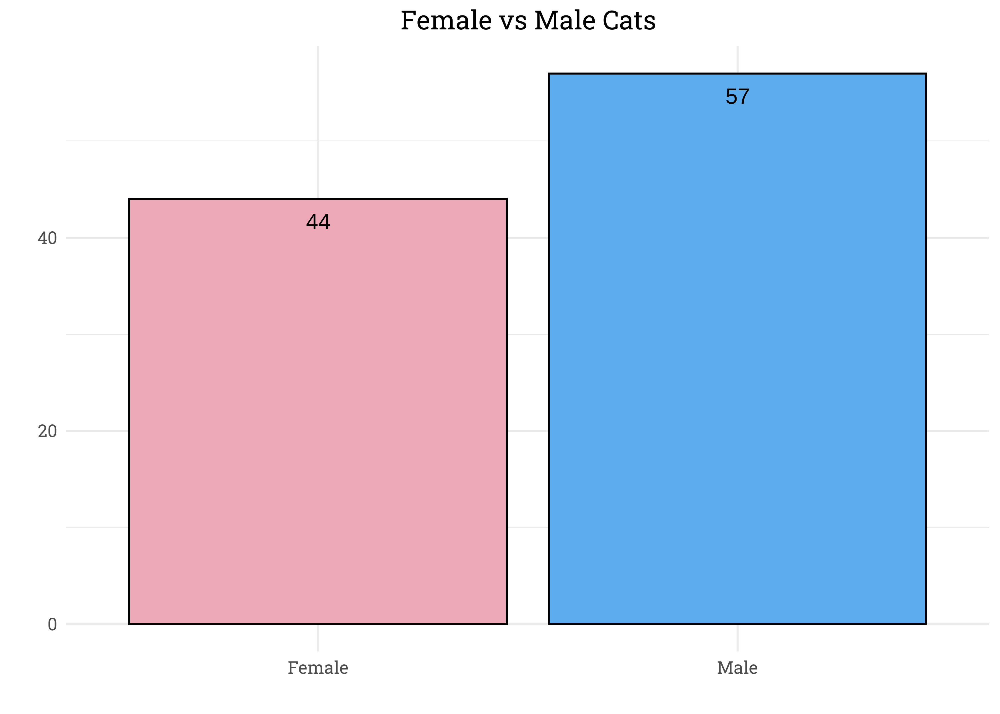

Cats in the UK
================
Matthew
2023-01-30

- <a href="#exploratory-data-analysis"
  id="toc-exploratory-data-analysis">Exploratory Data Analysis</a>
  - <a href="#number-of-cats" id="toc-number-of-cats">Number of Cats</a>
  - <a href="#prey-per-year" id="toc-prey-per-year">Prey Per Year</a>
  - <a href="#hours-indoors" id="toc-hours-indoors">Hours Indoors</a>
  - <a href="#cat-gender" id="toc-cat-gender">Cat Gender</a>
  - <a href="#age" id="toc-age">Age</a>

``` r
cats <- read_csv('https://raw.githubusercontent.com/rfordatascience/tidytuesday/master/data/2023/2023-01-31/cats_uk_reference.csv')
```

# Exploratory Data Analysis

## Number of Cats

``` r
cats %>% 
  ggplot(aes(n_cats)) +
  geom_bar(fill = "steelblue2") +
  geom_text(aes(label = ..count..), stat = "count", vjust = 2) +
  labs(y = "Households", x = "", title = "Cats per Household")
```

<!-- -->

## Prey Per Year

``` r
cats %>% 
  count(prey_p_month) %>% 
  mutate(prey_year = 12*prey_p_month) %>% 
  ggplot(aes(fct_reorder(factor(prey_year),prey_year), n)) +
  geom_col(fill = "steelblue2") + 
  geom_text(aes(label = n), vjust = 2) +
  labs(y = "Cats", x = "Prey per Year", 
       title = "Prey Caught per Year")
```

<!-- -->

## Hours Indoors

``` r
cats %>% 
  count(hrs_indoors) %>% 
  ggplot(aes(hrs_indoors, n)) +
  geom_col(fill = "steelblue2") +
  geom_text(aes(label = n), vjust = 2) +
  scale_x_continuous(breaks = seq(2.5,22.5,5)) +
  labs(y = "Cats", x = "Hours Indoors", 
       title = "Hours Spent Indoors")
```

<!-- -->

## Cat Gender

``` r
cats %>% 
  count(animal_sex) %>% 
  ggplot(aes(animal_sex, n, fill = animal_sex)) +
  geom_col(color = "black") +
  geom_text(aes(label = n), vjust = 2) +
  labs(x = "", y = "", title = "Female vs Male Cats") +
  scale_x_discrete(labels = c("Female", "Male")) +
  scale_fill_manual(values = c("pink2", "steelblue2")) +
  theme(legend.position = "none")
```

<!-- -->

## Age

``` r
cats %>% 
  count(age_years) %>% 
  drop_na() %>% 
  ggplot(aes(age_years, n, fill = factor(age_years))) +
  geom_col(color = "black") + 
  scale_x_continuous(breaks = seq(0,16,1)) +
  scale_y_continuous(expand = c(0,0)) +
  labs(y = "Number of Cats", x = "", title = "Age Distribution") +
  theme(panel.grid.minor.x = element_blank(),
        legend.position = "none")
```

<!-- -->
