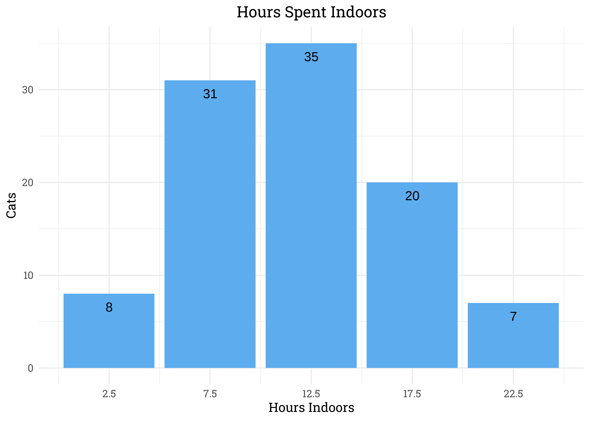

Cats in the UK
================
Matthew
2023-01-30

-   <a href="#exploratory-data-analysis"
    id="toc-exploratory-data-analysis">Exploratory Data Analysis</a>
    -   <a href="#number-of-cats" id="toc-number-of-cats">Number of Cats</a>
    -   <a href="#prey-per-month" id="toc-prey-per-month">Prey Per Month</a>
    -   <a href="#hours-indoors" id="toc-hours-indoors">Hours Indoors</a>

``` r
cats <- read_csv('https://raw.githubusercontent.com/rfordatascience/tidytuesday/master/data/2023/2023-01-31/cats_uk_reference.csv')
```

# Exploratory Data Analysis

## Number of Cats

``` r
cats %>% 
  ggplot(aes(n_cats)) +
  geom_bar(fill = "steelblue2") +
  geom_text(aes(label = ..count..), stat = "count", vjust = 2) +
  labs(y = "", x = "", title = "Number of Cats per Household")
```

<!-- -->

## Prey Per Month

``` r
cats %>% 
  count(prey_p_month) %>% 
  mutate(prey_year = 12*prey_p_month) %>% 
  ggplot(aes(prey_year, n)) +
  geom_col(fill = "steelblue2") +
  labs(y = "Number of Cats", x = "Prey per Year", title = "Number of Cats by the Number of Prey Caught per Year")
```

<!-- -->

## Hours Indoors

``` r
cats %>% 
  count(hrs_indoors) %>% 
  ggplot(aes(hrs_indoors, n)) +
  geom_col(fill = "steelblue2") +
  geom_text(aes(label = n), vjust = 2) +
  scale_x_continuous(breaks = seq(2.5,22.5,5)) +
  labs(y = "Count", x = "Hours Indoors", title = "Number of Cats by the Hours Spent Indoors")
```

<!-- -->
