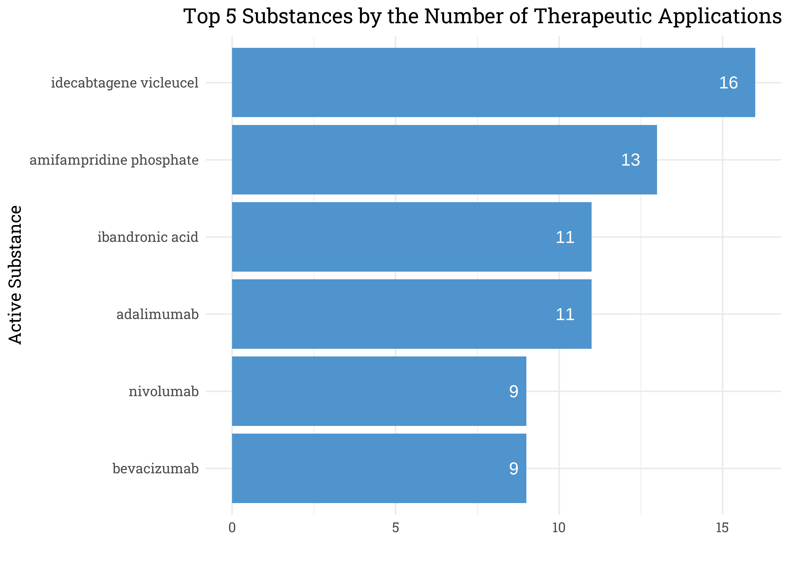
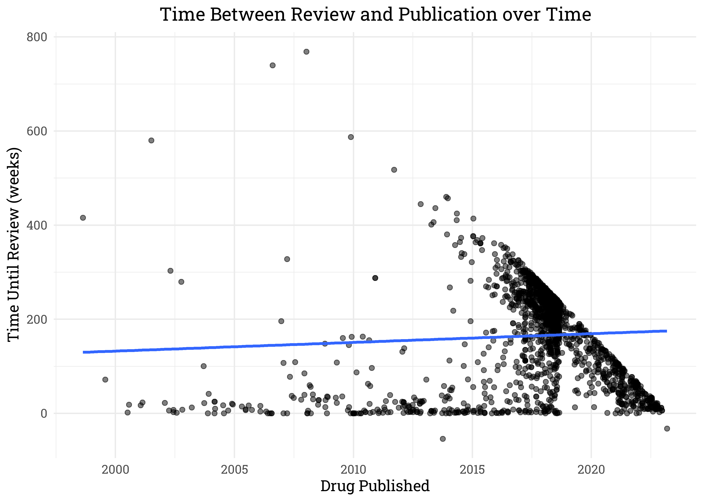
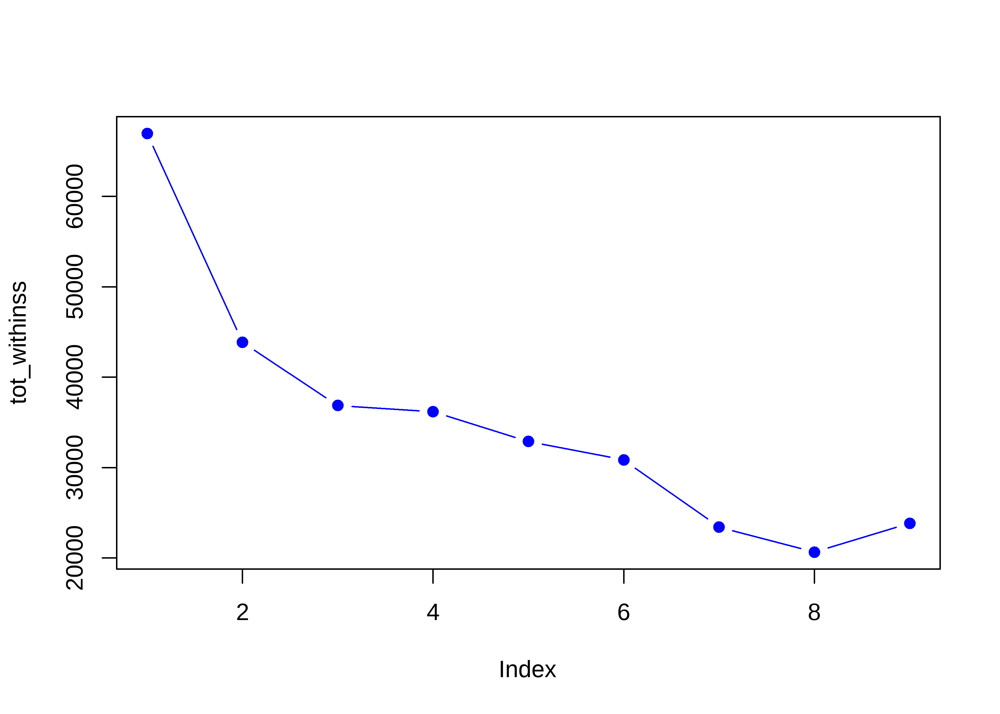

European Drug Development
================
Matthew
2023-03-14

- <a href="#eda" id="toc-eda">EDA</a>
  - <a href="#categorical-counts" id="toc-categorical-counts">Categorical
    Counts</a>
  - <a href="#therapeutic-areas" id="toc-therapeutic-areas">Therapeutic
    Areas</a>
  - <a href="#authorization-status"
    id="toc-authorization-status">Authorization Status</a>
  - <a href="#active-substance" id="toc-active-substance">Active
    Substance</a>
    - <a href="#cluster" id="toc-cluster">Cluster</a>

``` r
drugs <- read_csv('https://raw.githubusercontent.com/rfordatascience/tidytuesday/master/data/2023/2023-03-14/drugs.csv')
```

# EDA

## Categorical Counts

``` r
drugs %>% 
  count(category) %>% 
  knitr::kable()
```

| category   |    n |
|:-----------|-----:|
| human      | 1706 |
| veterinary |  282 |

``` r
drugs %>% 
  count(authorisation_status, sort = TRUE) %>% 
  knitr::kable()
```

| authorisation_status |    n |
|:---------------------|-----:|
| authorised           | 1573 |
| withdrawn            |  357 |
| refused              |   57 |
| NA                   |    1 |

``` r
drugs %>% 
  count(active_substance, sort = TRUE) %>% 
  slice_max(n, n = 5) %>% 
  knitr::kable()
```

| active_substance |   n |
|:-----------------|----:|
| meloxicam        |  18 |
| adalimumab       |  16 |
| bevacizumab      |  12 |
| insulin human    |  12 |
| olanzapine       |  12 |
| pegfilgrastim    |  12 |

## Therapeutic Areas

``` r
drugs %>% 
  mutate(len = nchar(therapeutic_area)) %>% 
  arrange(-len) %>% 
  head(3) %>% 
  pull(therapeutic_area)
```

    ## [1] "Lambert-Eaton Myasthenic Syndrome;  Paraneoplastic Syndromes, Nervous System;  Nervous System Neoplasms;  Paraneoplastic Syndromes;  Nervous System Diseases;  Autoimmune Diseases of the Nervous System;  Neurodegenerative Diseases;  Neuromuscular Diseases;  Neuromuscular Junction Diseases;  Immune System Diseases;  Autoimmune Diseases;  Autoimmune Diseases of the Nervous System;  Cancer;  Neoplasms"
    ## [2] "Multiple Myeloma;  Neoplasms;  Cancer;  Neoplasms, Plasma Cell;  Hemostatic Disorders;  Vascular Diseases;  Cardiovascular Diseases;  Paraproteinemias;  Blood Protein Disorders;  Hematologic Diseases;  Hemic and Lymphatic Diseases;  Hemorrhagic Disorders;  Infectious Mononucleosis;  Lymphoproliferative Disorders;  Immunoproliferative Disorders;  Immune System Diseases"                              
    ## [3] "Precursor Cell Lymphoblastic Leukemia-Lymphoma;  Gastrointestinal Stromal Tumors;  Dermatofibrosarcoma;  Myelodysplastic-Myeloproliferative Diseases;  Leukemia, Myelogenous, Chronic, BCR-ABL Positive;  Hypereosinophilic Syndrome"

As it can be seen, the column *therapeutic_area* contains all possible
uses for each drug, separated by **“;”**. Thus in order to count how
many distinct therapeutic areas a drug is used for, we will need to
separate the column into multiple rows based on the delimiter, **“;”**.

For example, below we have all the therapeutic areas for the substance
*adalimumab*.

``` r
drugs %>% 
  filter(active_substance == "adalimumab") %>% 
  select(active_substance, therapeutic_area) %>% 
  separate_rows(therapeutic_area, sep = ";  ") %>% 
  distinct(therapeutic_area)
```

    ## # A tibble: 11 x 1
    ##    therapeutic_area              
    ##    <chr>                         
    ##  1 Arthritis, Psoriatic          
    ##  2 Arthritis, Juvenile Rheumatoid
    ##  3 Arthritis, Rheumatoid         
    ##  4 Colitis, Ulcerative           
    ##  5 Crohn Disease                 
    ##  6 Hidradenitis Suppurativa      
    ##  7 Psoriasis                     
    ##  8 Spondylitis, Ankylosing       
    ##  9 Uveitis                       
    ## 10 Skin Diseases, Papulosquamous 
    ## 11 Arthritis

``` r
drugs %>% 
  group_by(active_substance) %>% 
  select(active_substance, therapeutic_area) %>% 
  separate_rows(therapeutic_area, sep = ";  ") %>% 
  distinct(therapeutic_area) %>% 
  summarize(n = n()) %>% 
  arrange(-n) %>% 
  slice_max(n, n = 5) %>% 
  ggplot(aes(n, fct_reorder(active_substance, n))) +
  geom_col(fill = "steelblue3") +
  geom_text(aes(label = n), hjust = 2, color = "white") +
  labs(y = "Active Substance",
       x = "",
       title = "Top 5 Substances by the Number of Therapeutic Applications") +
  theme(plot.title = element_text(hjust = 1))
```

<!-- -->

## Authorization Status

``` r
drugs %>% 
  filter(!is.na(authorisation_status)) %>% 
  ggplot(aes(str_to_title(category), fill = authorisation_status)) +
  geom_bar(position = "fill") +
  scale_fill_manual(values = c("springgreen2", "darkblue", "red3")) +
  labs(title = "Proportion of Drugs Authorization Status by Category",
       y = "Proportion",
       fill = "",
       x = "") +
  scale_y_continuous(labels = percent_format())
```

<!-- -->

``` r
table(drugs$category, drugs$authorisation_status) %>% 
  chisq.test()
```

    ## 
    ##  Pearson's Chi-squared test
    ## 
    ## data:  .
    ## X-squared = 3.3104, df = 2, p-value = 0.191

There does not appear to be a statistically significant difference
between *human* and *veterinary* drugs with respect to whether they were
*authorized* or *withdrawn*.

``` r
drugs %>% 
  group_by(active_substance) %>% 
  count(authorisation_status, sort = TRUE) %>% 
  filter(authorisation_status == "withdrawn")
```

    ## # A tibble: 267 x 3
    ## # Groups:   active_substance [267]
    ##    active_substance               authorisation_status     n
    ##    <chr>                          <chr>                <int>
    ##  1 clopidogrel                    withdrawn                8
    ##  2 pioglitazone hydrochloride     withdrawn                6
    ##  3 adalimumab                     withdrawn                5
    ##  4 docetaxel                      withdrawn                5
    ##  5 insulin human                  withdrawn                5
    ##  6 ribavirin                      withdrawn                5
    ##  7 aliskiren                      withdrawn                4
    ##  8 clopidogrel (as hydrochloride) withdrawn                4
    ##  9 meloxicam                      withdrawn                4
    ## 10 aliskiren, hydrochlorothiazide withdrawn                3
    ## # ... with 257 more rows

``` r
drugs %>% 
  filter(!is.na(authorisation_status)) %>% 
  group_by(y = year(first_published)) %>% 
  count(authorisation_status) %>% 
  ggplot(aes(y, n, color = authorisation_status)) +
  geom_line() +
  labs(y = "Total", x = "", color = "",
       title = "Authorization of Time") +
  theme(legend.position = c(0.38, 0.835),
        panel.grid.minor.x = element_blank())
```

<!-- -->

``` r
drugs %>% 
  mutate(diff = as.numeric(
    difftime(revision_date, first_published, units = "weeks"))) %>% 
  select(first_published, diff) %>% 
  filter(!is.na(diff)) %>% 
  ggplot(aes(first_published, diff)) +
  geom_point(alpha = 0.5) +
  geom_smooth(method = "lm", se = FALSE) +
  labs(x = "Drug Published", 
       y = "Time Until Review (weeks)",
       title = "Time Between Review and Publication over Time")
```

    ## `geom_smooth()` using formula 'y ~ x'

<!-- -->

``` r
drugs %>% 
  group_by(marketing_authorisation_holder_company_name) %>% 
  summarize(n = n(),
            prop = mean(authorisation_status == "authorised")) %>% 
  arrange(-n, -prop) %>% 
  slice(1:10) %>% 
  ggplot(aes(prop, fct_reorder(
    marketing_authorisation_holder_company_name, prop))) +
  geom_col(color = "black", fill = "steelblue2") +
  geom_text(aes(label = paste0(prop*n, "/", n), hjust = 1.5)) +
  geom_text(aes(label = marketing_authorisation_holder_company_name),
            x = 0.05, 
            hjust = "inward") +
  labs(y = "",
       x = "",
       title = 
         "Most Prolific Companies Ordered by Proportion of Drugs Authorized") +
  scale_x_continuous(labels = percent_format()) +
  theme(axis.text.y = element_blank())
```

<!-- -->

## Active Substance

``` r
dlong <- drugs %>% 
  separate_rows(therapeutic_area, sep = "; ") %>% 
  mutate(therapeutic_area = trimws(therapeutic_area),
         main_thera = str_remove_all(therapeutic_area, ",.*"))
```

``` r
dlong %>% 
  count(main_thera, sort = TRUE) %>% 
  filter(grepl("Diabetes", main_thera))
```

    ## # A tibble: 2 x 2
    ##   main_thera                 n
    ##   <chr>                  <int>
    ## 1 Diabetes Mellitus        117
    ## 2 Diabetes Complications     5

### Cluster

``` r
unique_df <- dlong %>%
  filter(!is.na(main_thera)) %>% slice(-1666) %>% 
  select(medicine_name, main_thera) %>% 
  distinct()

binary_matrix <- unique_df %>% 
  mutate(value = 1) %>%
  spread(key = main_thera, value = value, fill = 0)
```

``` r
dist_matrix <- dist(binary_matrix[,-1])

tot_withinss <- map_dbl(2:10, function(k){
  model <- kmeans(dist_matrix, centers = k, nstart = 5)
  model$tot.withinss
})

plot(tot_withinss)
```

<!-- -->

``` r
clusters <- kmeans(dist_matrix, 4, 5)

new_df <- data.frame(medicine_name = binary_matrix$medicine_name,
                     cluster = clusters$cluster)

dlong_cluster <- dlong %>% 
  left_join(new_df)
```

    ## Joining, by = "medicine_name"

``` r
dlong_cluster %>% 
  filter(!is.na(cluster)) %>% 
  group_by(marketing_authorisation_holder_company_name) %>% 
  count(cluster) %>% 
  mutate(prop = n/sum(n)) %>% 
  arrange(-n, -prop)
```

    ## # A tibble: 723 x 4
    ## # Groups:   marketing_authorisation_holder_company_name [544]
    ##    marketing_authorisation_holder_company_name cluster     n  prop
    ##    <chr>                                         <int> <int> <dbl>
    ##  1 Accord Healthcare S.L.U.                          2    45 0.409
    ##  2 Novartis Europharm Limited                        2    42 0.467
    ##  3 Sandoz GmbH                                       3    37 0.544
    ##  4 GlaxoSmithKline Biologicals S.A.                  2    36 0.554
    ##  5 Samsung Bioepis NL B.V.                           3    35 0.875
    ##  6 Merck Sharp & Dohme B.V.                          3    35 0.515
    ##  7 Bristol-Myers Squibb Pharma EEIG                  3    34 0.507
    ##  8 Accord Healthcare S.L.U.                          4    34 0.309
    ##  9 Pfizer Europe MA EEIG                             2    33 0.44 
    ## 10 Celltrion Healthcare Hungary Kft.                 3    32 0.8  
    ## # ... with 713 more rows
