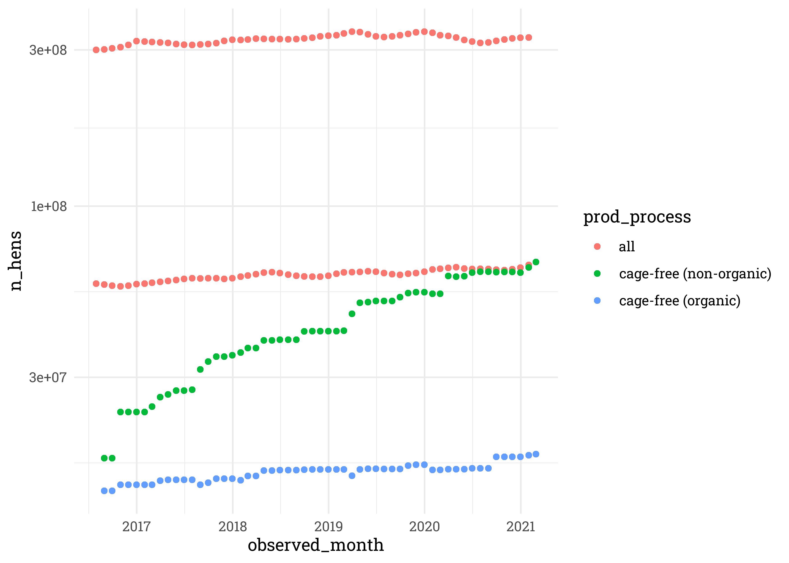
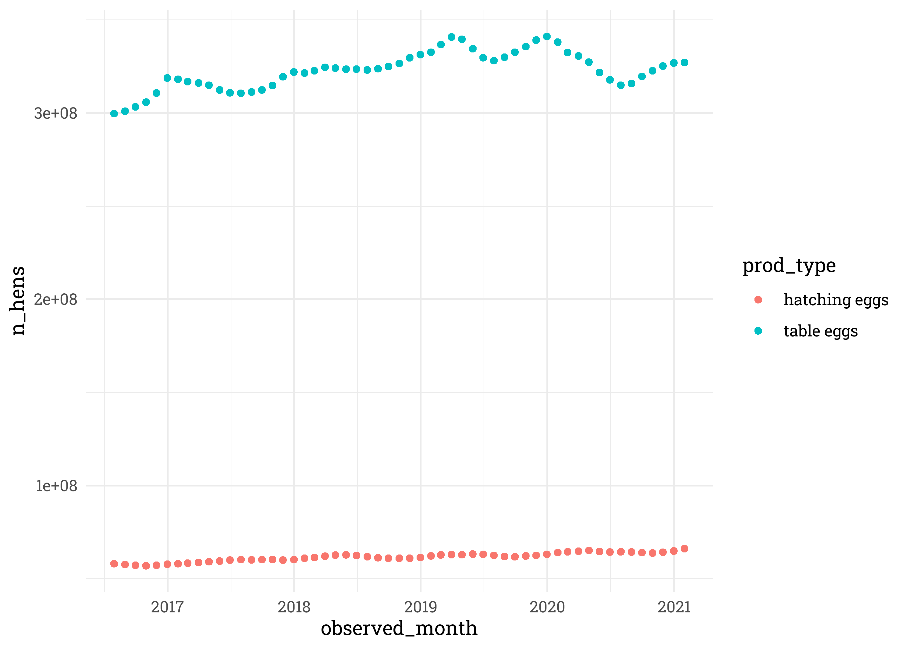
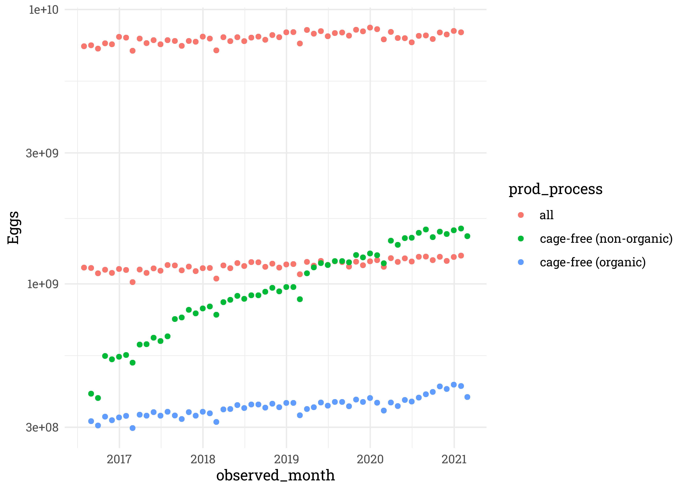
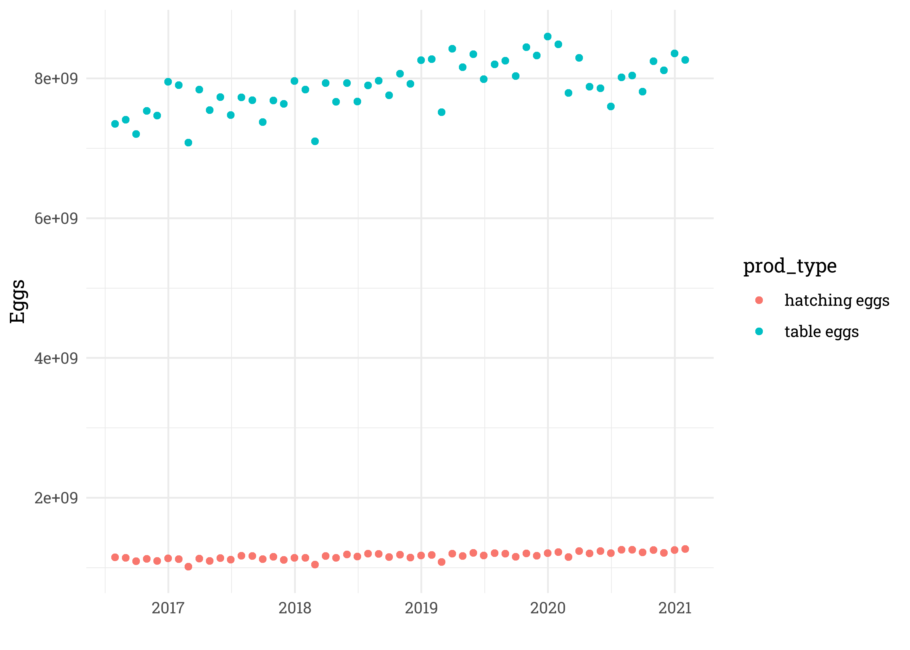

Egg Production
================
Matthew
04/13/23

- <a href="#eda" id="toc-eda">EDA</a>
  - <a href="#hens" id="toc-hens">Hens</a>
  - <a href="#eggs" id="toc-eggs">Eggs</a>

``` r
eggproduction  <- read_csv('https://raw.githubusercontent.com/rfordatascience/tidytuesday/master/data/2023/2023-04-11/egg-production.csv')
cagefreepercentages <- read_csv('https://raw.githubusercontent.com/rfordatascience/tidytuesday/master/data/2023/2023-04-11/cage-free-percentages.csv')
```

# EDA

## Hens

``` r
eggproduction %>% 
  ggplot(aes(observed_month, n_hens, color = prod_process)) +
  geom_point() +
  scale_y_log10()
```

<!-- -->

``` r
eggproduction %>% 
  filter(prod_process == "all") %>% 
  ggplot(aes(observed_month, n_hens, color = prod_type)) +
  geom_point()
```

<!-- -->

## Eggs

``` r
eggproduction %>% 
  ggplot(aes(observed_month, n_eggs, color = prod_process)) +
  geom_point() +
  scale_y_log10() +
  labs(y = "Eggs")
```

<!-- -->

``` r
eggproduction %>% 
  filter(prod_process == "all") %>% 
  ggplot(aes(observed_month, n_eggs, color = prod_type)) +
  geom_point() +
  labs(x = "", y = "Eggs")
```

<!-- -->
