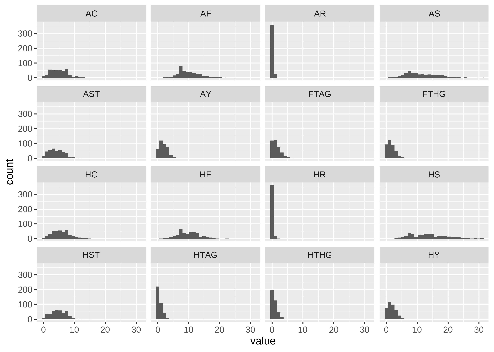

Premier League
================
Matthew
2023-04-6

- <a href="#eda" id="toc-eda">EDA</a>
  - <a href="#numeric-distribution" id="toc-numeric-distribution">Numeric
    Distribution</a>
  - <a href="#halftime-leads" id="toc-halftime-leads">Halftime Leads</a>

``` r
soccer <- read_csv('https://raw.githubusercontent.com/rfordatascience/tidytuesday/master/data/2023/2023-04-04/soccer21-22.csv')
```

# EDA

## Numeric Distribution

``` r
soccer %>% 
  keep(is.numeric) %>% 
  gather() %>% 
  ggplot(aes(value)) +
  geom_histogram() +
  facet_wrap(~key)
```

    ## `stat_bin()` using `bins = 30`. Pick better value with `binwidth`.

<!-- -->

## Halftime Leads

``` r
soccer %>% 
  filter(HTAG != HTHG) %>% 
  mutate(leading = ifelse(HTHG > HTAG, HTHG - HTAG, HTAG - HTHG),
         l_win = ifelse(((HTHG > HTAG) & HTR == "H") | 
                            ((HTAG > HTHG) & HTR == "A"),
                          1,
                          0)) %>% 
  group_by(leading) %>% 
  summarize(n = n(),
            prop = paste0(mean(l_win) * 100, "%")) %>% 
  knitr::kable()
```

| leading |   n | prop |
|--------:|----:|:-----|
|       1 | 155 | 100% |
|       2 |  57 | 100% |
|       3 |  14 | 100% |
|       4 |   3 | 100% |

All teams that were leading in the half time, won the game by full time.

``` r
equalhf <- soccer %>% 
  filter(HTAG == HTHG) %>% 
  select(is.numeric, FTR)

equalhf %>% 
  count(FTR)
```

    ## # A tibble: 3 x 2
    ##   FTR       n
    ##   <chr> <int>
    ## 1 A        44
    ## 2 D        51
    ## 3 H        56
