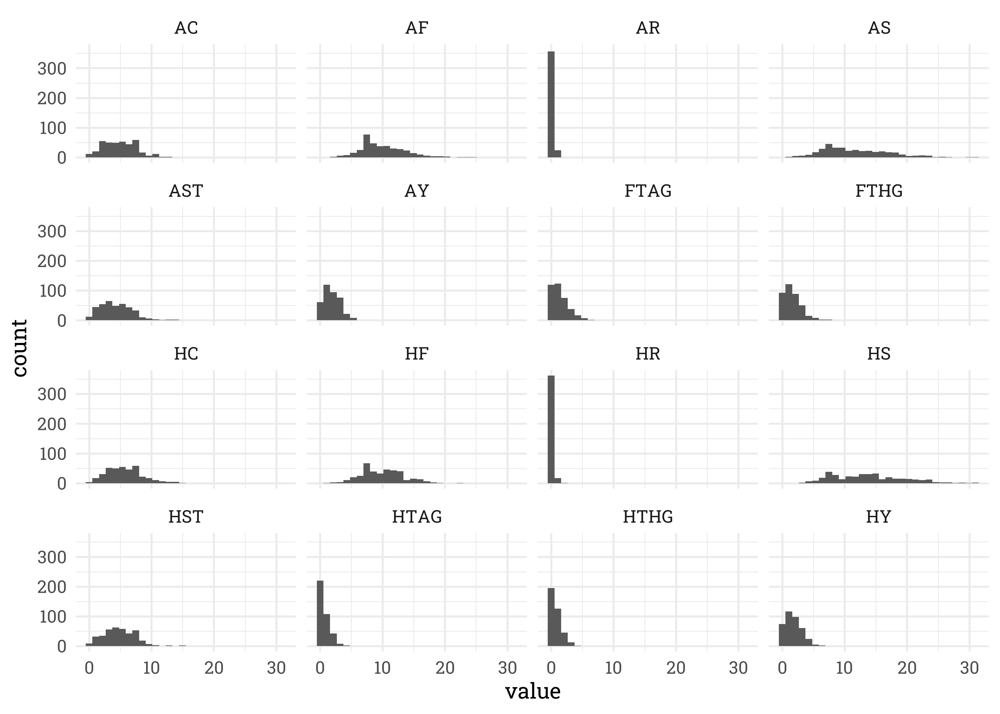
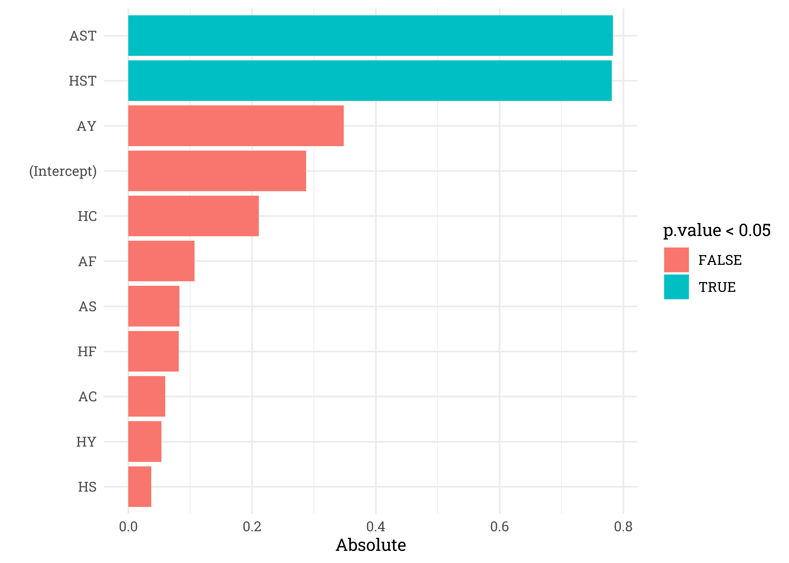

Premier League
================
Matthew
2023-04-6

- <a href="#eda" id="toc-eda">EDA</a>
  - <a href="#numeric-distribution" id="toc-numeric-distribution">Numeric
    Distribution</a>
  - <a href="#halftime-leads" id="toc-halftime-leads">Halftime Leads</a>

``` r
soccer <- read_csv('https://raw.githubusercontent.com/rfordatascience/tidytuesday/master/data/2023/2023-04-04/soccer21-22.csv')
```

``` r
input_text <- "|variable |class     |description |
|:--------|:---------|:-----------|
|Date     |character |The date when the match was played  |
|HomeTeam |character |The home team    |
|AwayTeam |character |The away team    |
|FTHG     |double    |Full time home goals        |
|FTAG     |double    |Full time away goals        |
|FTR      |character |Full time result         |
|HTHG     |double    |Halftime home goals        |
|HTAG     |double    |Halftime away goals        |
|HTR      |character |Halftime results         |
|Referee  |character |Referee of the match    |
|HS       |double    |Number of shots taken by the home team          |
|AS       |double    |Number of shots taken by the away team          |
|HST      |double    |Number of shots on target by the home team   |
|AST      |double    |Number of shots on target by the away team   |
|HF       |double    |Number of fouls by the home team   |
|AF       |double    |Number of fouls by the away team    |
|HC       |double    |Number of corners taken by the home team |
|AC       |double    |Number of corners taken by the away team |
|HY       |double    |Number of yellow cards received by the home team |
|AY       |double    |Number of yellow cards received by the away team  |
|HR       |double    |Number of red cards received by the home team  |
|AR       |double    |Number of red cards received by the away team  |"

data <- read.table(text = input_text, sep = "|", header = TRUE, stringsAsFactors = FALSE, strip.white = TRUE)

data <- data[-1, -c(1, ncol(data))]
```

``` r
variable <- data$variable
description <- data$description

column_mapping <- setNames(description, variable)

soccer_renamed <- soccer

colnames(soccer_renamed) <- column_mapping[colnames(soccer_renamed)]
colnames(soccer_renamed)
```

    ##  [1] "The date when the match was played"              
    ##  [2] "The home team"                                   
    ##  [3] "The away team"                                   
    ##  [4] "Full time home goals"                            
    ##  [5] "Full time away goals"                            
    ##  [6] "Full time result"                                
    ##  [7] "Halftime home goals"                             
    ##  [8] "Halftime away goals"                             
    ##  [9] "Halftime results"                                
    ## [10] "Referee of the match"                            
    ## [11] "Number of shots taken by the home team"          
    ## [12] "Number of shots taken by the away team"          
    ## [13] "Number of shots on target by the home team"      
    ## [14] "Number of shots on target by the away team"      
    ## [15] "Number of fouls by the home team"                
    ## [16] "Number of fouls by the away team"                
    ## [17] "Number of corners taken by the home team"        
    ## [18] "Number of corners taken by the away team"        
    ## [19] "Number of yellow cards received by the home team"
    ## [20] "Number of yellow cards received by the away team"
    ## [21] "Number of red cards received by the home team"   
    ## [22] "Number of red cards received by the away team"

``` r
data.frame(variable, description) %>% 
  knitr::kable()
```

| variable | description                                      |
|:---------|:-------------------------------------------------|
| Date     | The date when the match was played               |
| HomeTeam | The home team                                    |
| AwayTeam | The away team                                    |
| FTHG     | Full time home goals                             |
| FTAG     | Full time away goals                             |
| FTR      | Full time result                                 |
| HTHG     | Halftime home goals                              |
| HTAG     | Halftime away goals                              |
| HTR      | Halftime results                                 |
| Referee  | Referee of the match                             |
| HS       | Number of shots taken by the home team           |
| AS       | Number of shots taken by the away team           |
| HST      | Number of shots on target by the home team       |
| AST      | Number of shots on target by the away team       |
| HF       | Number of fouls by the home team                 |
| AF       | Number of fouls by the away team                 |
| HC       | Number of corners taken by the home team         |
| AC       | Number of corners taken by the away team         |
| HY       | Number of yellow cards received by the home team |
| AY       | Number of yellow cards received by the away team |
| HR       | Number of red cards received by the home team    |
| AR       | Number of red cards received by the away team    |

``` r
soccer_renamed %>% 
  janitor::clean_names() %>% 
  colnames()
```

    ##  [1] "the_date_when_the_match_was_played"              
    ##  [2] "the_home_team"                                   
    ##  [3] "the_away_team"                                   
    ##  [4] "full_time_home_goals"                            
    ##  [5] "full_time_away_goals"                            
    ##  [6] "full_time_result"                                
    ##  [7] "halftime_home_goals"                             
    ##  [8] "halftime_away_goals"                             
    ##  [9] "halftime_results"                                
    ## [10] "referee_of_the_match"                            
    ## [11] "number_of_shots_taken_by_the_home_team"          
    ## [12] "number_of_shots_taken_by_the_away_team"          
    ## [13] "number_of_shots_on_target_by_the_home_team"      
    ## [14] "number_of_shots_on_target_by_the_away_team"      
    ## [15] "number_of_fouls_by_the_home_team"                
    ## [16] "number_of_fouls_by_the_away_team"                
    ## [17] "number_of_corners_taken_by_the_home_team"        
    ## [18] "number_of_corners_taken_by_the_away_team"        
    ## [19] "number_of_yellow_cards_received_by_the_home_team"
    ## [20] "number_of_yellow_cards_received_by_the_away_team"
    ## [21] "number_of_red_cards_received_by_the_home_team"   
    ## [22] "number_of_red_cards_received_by_the_away_team"

# EDA

## Numeric Distribution

``` r
soccer %>% 
  keep(is.numeric) %>% 
  gather() %>% 
  ggplot(aes(value)) +
  geom_histogram() +
  facet_wrap(~key)
```

    ## `stat_bin()` using `bins = 30`. Pick better value with `binwidth`.

<!-- -->

## Halftime Leads

``` r
soccer %>% 
  filter(HTAG != HTHG) %>% 
  mutate(leading = ifelse(HTHG > HTAG, HTHG - HTAG, HTAG - HTHG),
         l_win = ifelse(((HTHG > HTAG) & HTR == "H") | 
                            ((HTAG > HTHG) & HTR == "A"),
                          1,
                          0)) %>% 
  group_by(leading) %>% 
  summarize(n = n(),
            prop = paste0(mean(l_win) * 100, "%")) %>% 
  knitr::kable()
```

| leading |   n | prop |
|--------:|----:|:-----|
|       1 | 155 | 100% |
|       2 |  57 | 100% |
|       3 |  14 | 100% |
|       4 |   3 | 100% |

All teams that were leading in the half time, won the game by full time.

``` r
equalhf <- soccer %>% 
  filter(HTAG == HTHG) %>% 
  select(where(is.numeric), FTR)

equalhf %>% 
  count(FTR)
```

    ## # A tibble: 3 x 2
    ##   FTR       n
    ##   <chr> <int>
    ## 1 A        44
    ## 2 D        51
    ## 3 H        56

``` r
mod <- glm(FTR ~ ., 
    data = equalhf %>% filter(FTR != "D") %>% mutate(FTR = as.factor(FTR)) %>% 
      select(-c(FTAG, FTHG, AR, HR, HTAG, HTHG)),
    family = "binomial")
```

``` r
equalhf %>% 
  filter(FTR != "D") %>% 
  mutate(predictions = predict(mod, equalhf %>% filter(FTR != "D"), type = "response"),
         pred = ifelse(predictions > 0.5, "H", "A")) %>% 
  select(FTR, pred) %>% 
  summarize(accuracy = mean(FTR == pred))
```

    ## # A tibble: 1 x 1
    ##   accuracy
    ##      <dbl>
    ## 1     0.85

``` r
mod %>% tidy() %>% 
  arrange(-abs(estimate)) 
```

    ## # A tibble: 11 x 5
    ##    term        estimate std.error statistic  p.value
    ##    <chr>          <dbl>     <dbl>     <dbl>    <dbl>
    ##  1 AST          -0.783     0.221     -3.54  0.000401
    ##  2 HST           0.781     0.214      3.65  0.000266
    ##  3 AY            0.349     0.286      1.22  0.223   
    ##  4 (Intercept)   0.287     1.82       0.158 0.874   
    ##  5 HC           -0.211     0.112     -1.88  0.0606  
    ##  6 AF           -0.107     0.0841    -1.28  0.202   
    ##  7 AS            0.0829    0.0914     0.907 0.365   
    ##  8 HF            0.0819    0.0861     0.951 0.341   
    ##  9 AC            0.0599    0.114      0.524 0.600   
    ## 10 HY           -0.0538    0.277     -0.194 0.846   
    ## 11 HS           -0.0373    0.0754    -0.494 0.621

``` r
mod %>% 
  tidy() %>% 
  ggplot(aes(abs(estimate), fct_reorder(term, abs(estimate)), fill = p.value < 0.05)) +
  geom_col() +
  labs(y = "", x = "Absolute")
```

<!-- -->

``` r
mod2 <- glm(FTR ~ AST + HST, 
    data = equalhf %>% filter(FTR != "D") %>% mutate(FTR = as.factor(FTR)),
    family = "binomial")

equalhf %>% 
  filter(FTR != "D") %>% 
  mutate(predictions = predict(mod2, equalhf %>% filter(FTR != "D"), type = "response"),
         pred = ifelse(predictions > 0.5, "H", "A")) %>% 
  select(FTR, pred) %>% 
  summarize(accuracy = mean(FTR == pred))
```

    ## # A tibble: 1 x 1
    ##   accuracy
    ##      <dbl>
    ## 1     0.78

``` r
mod2 %>% 
  tidy() %>% 
  arrange(-abs(estimate))
```

    ## # A tibble: 3 x 5
    ##   term        estimate std.error statistic   p.value
    ##   <chr>          <dbl>     <dbl>     <dbl>     <dbl>
    ## 1 AST           -0.528     0.135    -3.91  0.0000940
    ## 2 HST            0.495     0.130     3.80  0.000147 
    ## 3 (Intercept)    0.288     0.737     0.390 0.696

``` r
mod2 %>% 
  tidy() %>% 
  mutate(term = case_when(term == "AST" ~ "Away Shots Taken",
                          term == "HST" ~ "Home Shots Taken",
                          term == "(Intercept)" ~ as.character(term))) %>% 
  ggplot(aes(abs(estimate), fct_reorder(term, abs(estimate)), fill = estimate > 0)) +
  geom_col() +
  labs(y = "", x = "Absolute")
```

<!-- -->
