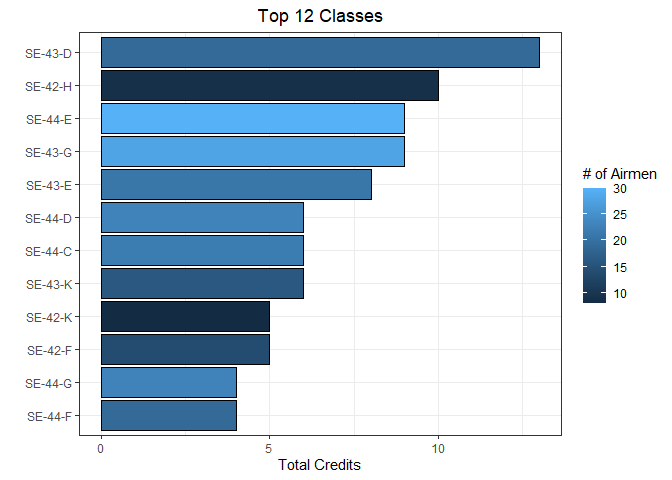

Airmen
================
Matthew
2/8/2022

``` r
airmen <- read_csv('https://raw.githubusercontent.com/rfordatascience/tidytuesday/master/data/2022/2022-02-08/airmen.csv')
```

    ## 
    ## -- Column specification --------------------------------------------------------
    ## cols(
    ##   name = col_character(),
    ##   last_name = col_character(),
    ##   first_name = col_character(),
    ##   graduation_date = col_datetime(format = ""),
    ##   rank_at_graduation = col_character(),
    ##   class = col_character(),
    ##   graduated_from = col_character(),
    ##   pilot_type = col_character(),
    ##   military_hometown_of_record = col_character(),
    ##   state = col_character(),
    ##   aerial_victory_credits = col_character(),
    ##   number_of_aerial_victory_credits = col_double(),
    ##   reported_lost = col_character(),
    ##   reported_lost_date = col_datetime(format = ""),
    ##   reported_lost_location = col_character(),
    ##   web_profile = col_character()
    ## )

``` r
airmen <- airmen %>% select(-web_profile)
```

# EDA

## Credits

### Hometown

``` r
gplot <- function(x){
  airmen %>%
    group_by({{x}}) %>%
    summarize(n = n(), credits = sum(number_of_aerial_victory_credits)) %>%
    arrange(-credits) %>%
    head(12) %>%
    ggplot(aes(credits, fct_reorder({{x}}, credits), fill = n)) + geom_col(color = "black")
}
gplot(military_hometown_of_record) +
  scale_x_continuous(breaks = seq(0,10,2)) +
  labs(x = "Total Credits", y = "", title = "Top 12 Hometowns", fill = "# of Airmen") +
  theme(plot.title = element_text(hjust = 0.5))
```

<!-- -->

### Class

``` r
gplot(class) + labs(x = "Total Credits", y = "", title = "Top 12 Classes", fill = "# of Airmen") +
  theme(plot.title = element_text(hjust = 0.5))
```

<!-- -->

## Graduation

``` r
airmen %>%
  group_by(graduation_date) %>%
  summarize(n = n()) %>%
  drop_na() %>%
  mutate(sum = cumsum(n)) %>%
  arrange(graduation_date) %>%
  gather(-graduation_date, key = "key", value = "value") %>%
  ggplot(aes(graduation_date, value)) + geom_line() + facet_wrap(~key, scales = "free", nrow = 2) +
  labs(x = "Graduation Date", y = "", title = "Number of Graduations and Cummulative Graduations over time")
```

<!-- -->

``` r
airmen %>%
  group_by(graduation_date) %>%
  summarize(n = n()) %>%
  drop_na() %>%
  mutate(sum = cumsum(n)) %>%
  arrange(graduation_date) %>%
  gather(-graduation_date, key = "key", value = "value") %>%
  ggplot(aes(graduation_date, value)) + facet_wrap(~key, scales = "free", nrow = 2) +
  geom_smooth(se = FALSE, size = 0.3) +
  labs(x = "Graduation Date", y = "", title = "Number of Graduations and Cummulative Graduations over time",
       subtitle = "Appears as the Normal PDF and CDF", caption = "Plotted as a geom_smooth (loess)")
```

    ## `geom_smooth()` using method = 'loess' and formula 'y ~ x'

<!-- -->

### Year 1945

``` r
airmen %>%
  filter(year(graduation_date) == 1945) %>% 
  group_by(graduation_date) %>%
  summarize(n = n()) %>%
  arrange(graduation_date) %>%
  ggplot(aes(graduation_date, n)) + geom_line() + geom_point()
```

<!-- -->
