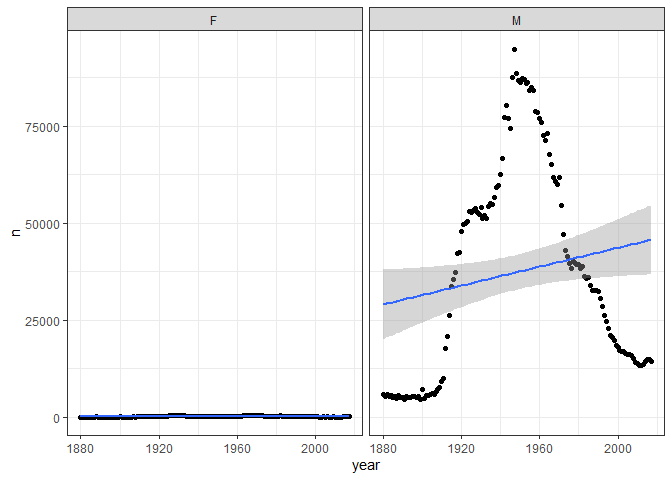
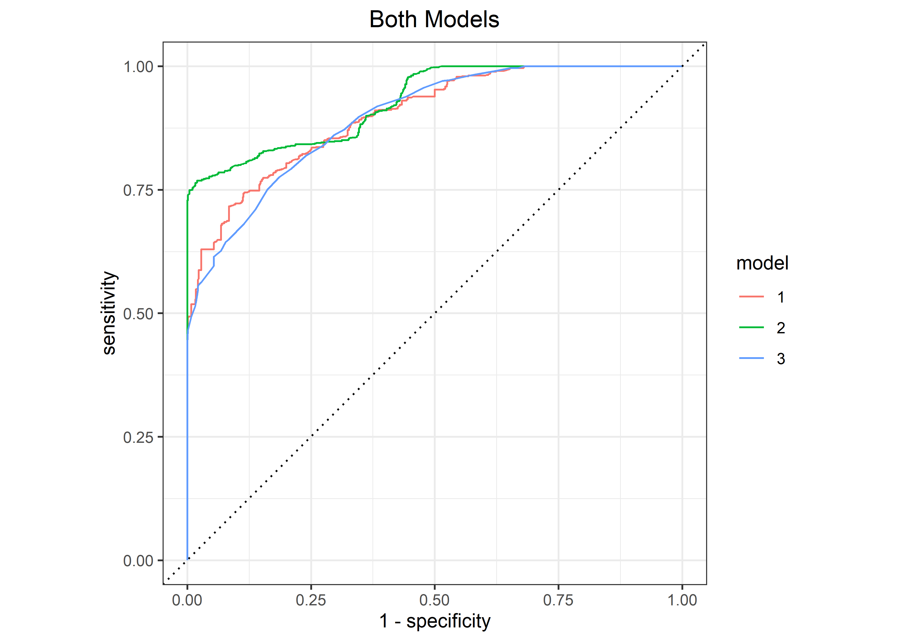
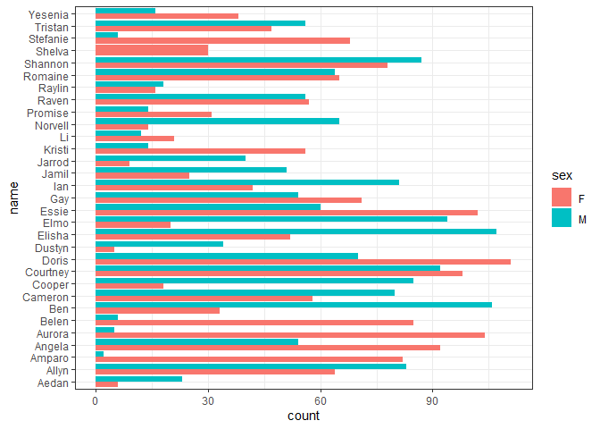
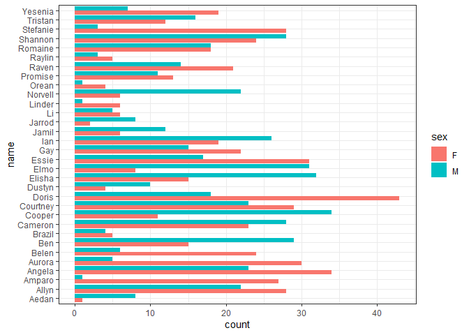
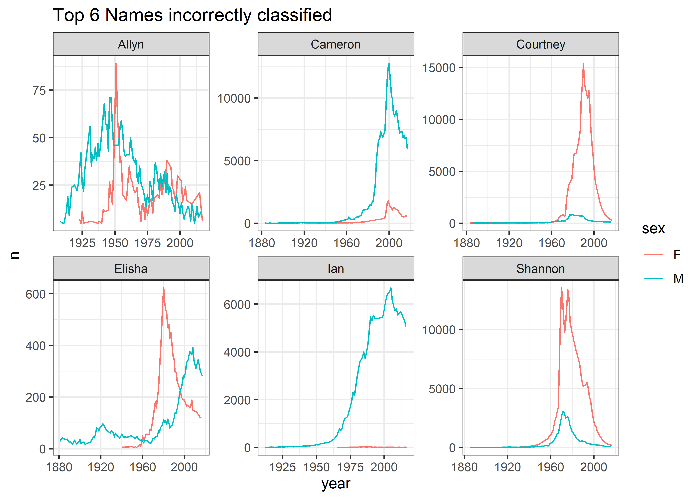

Baby Names
================
Matthew
3/21/2022

``` r
babynames <- read_csv('https://raw.githubusercontent.com/rfordatascience/tidytuesday/master/data/2022/2022-03-22/babynames.csv')
```

    ## Rows: 1924665 Columns: 5
    ## -- Column specification --------------------------------------------------------
    ## Delimiter: ","
    ## chr (2): sex, name
    ## dbl (3): year, n, prop
    ## 
    ## i Use `spec()` to retrieve the full column specification for this data.
    ## i Specify the column types or set `show_col_types = FALSE` to quiet this message.

``` r
babynames <- babynames %>%
  mutate(sex = factor(sex))
```

# EDA

``` r
babynames %>%
  group_by(name) %>%
  summarize(k = sum(n)) %>%
  arrange(-k) %>%
  head(20) %>%
  knitr::kable()
```

| name        |       k |
|:------------|--------:|
| James       | 5173828 |
| John        | 5137142 |
| Robert      | 4834915 |
| Michael     | 4372536 |
| Mary        | 4138360 |
| William     | 4118553 |
| David       | 3624225 |
| Joseph      | 2614083 |
| Richard     | 2572613 |
| Charles     | 2398453 |
| Thomas      | 2313415 |
| Christopher | 2031626 |
| Daniel      | 1915517 |
| Elizabeth   | 1634860 |
| Matthew     | 1595949 |
| Patricia    | 1576654 |
| George      | 1474117 |
| Jennifer    | 1471118 |
| Linda       | 1456006 |
| Anthony     | 1439784 |

``` r
babynames %>%
  group_by(name) %>%
  summarize(min = min(n),
            max = max(n),
            diff = max - min) %>%
  arrange(-diff)
```

    ## # A tibble: 97,310 x 4
    ##    name       min   max  diff
    ##    <chr>    <dbl> <dbl> <dbl>
    ##  1 Linda        5 99686 99681
    ##  2 James       18 94756 94738
    ##  3 Michael      5 92695 92690
    ##  4 Robert       7 91642 91635
    ##  5 John        10 88318 88308
    ##  6 David        5 86251 86246
    ##  7 Mary         5 73982 73977
    ##  8 William     14 66986 66972
    ##  9 Jennifer     5 63604 63599
    ## 10 Lisa         5 60266 60261
    ## # ... with 97,300 more rows

``` r
babynames %>%
  filter(name == "James") %>%
  ggplot(aes(year, n)) + geom_point() + geom_smooth(method = "lm") +
  facet_wrap(~ sex)
```

    ## `geom_smooth()` using formula 'y ~ x'

<!-- -->

``` r
babynames %>%
  filter(name == "James") %>%
  arrange(year) %>%
  select(year, n)
```

    ## # A tibble: 276 x 2
    ##     year     n
    ##    <dbl> <dbl>
    ##  1  1880    22
    ##  2  1880  5927
    ##  3  1881    24
    ##  4  1881  5441
    ##  5  1882    18
    ##  6  1882  5892
    ##  7  1883    25
    ##  8  1883  5223
    ##  9  1884    33
    ## 10  1884  5693
    ## # ... with 266 more rows

# Model

``` r
library(tidymodels)
```

    ## Registered S3 method overwritten by 'tune':
    ##   method                   from   
    ##   required_pkgs.model_spec parsnip

    ## -- Attaching packages -------------------------------------- tidymodels 0.1.4 --

    ## v dials        0.1.0     v rsample      0.1.1
    ## v infer        1.0.0     v tune         0.1.6
    ## v modeldata    0.1.1     v workflows    0.2.4
    ## v parsnip      0.2.0     v workflowsets 0.2.1
    ## v recipes      0.2.0     v yardstick    0.0.9

    ## -- Conflicts ----------------------------------------- tidymodels_conflicts() --
    ## x scales::discard() masks purrr::discard()
    ## x dplyr::filter()   masks stats::filter()
    ## x recipes::fixed()  masks stringr::fixed()
    ## x dplyr::lag()      masks stats::lag()
    ## x yardstick::spec() masks readr::spec()
    ## x recipes::step()   masks stats::step()
    ## x tune::tune()      masks parsnip::tune()
    ## * Search for functions across packages at https://www.tidymodels.org/find/

``` r
set.seed(123)
```

``` r
split_data <- initial_split(babynames %>% filter(name %in% sample(babynames$name, 100)), strata = name)

train_data <- training(split_data)
test_data <- testing(split_data)
```

## Build Model

``` r
mod <- logistic_reg()

rec <- recipe(sex ~ name + n, train_data) %>%
  step_dummy(all_nominal_predictors())
  
mod_wf <- workflow() %>%
  add_model(mod) %>%
  add_recipe(rec)
```

## Fit Model and Evaluate

``` r
fit <- fit(mod_wf, train_data)

augment(fit, test_data) %>%
  roc_auc(sex, .pred_F)
```

    ## # A tibble: 1 x 3
    ##   .metric .estimator .estimate
    ##   <chr>   <chr>          <dbl>
    ## 1 roc_auc binary         0.900

## Fit Model 2

``` r
mod2_aug <- mod %>%
  fit(sex ~ name:n, train_data) %>%
  augment(test_data)

mod2_aug %>%
  roc_auc(sex, .pred_F)
```

    ## # A tibble: 1 x 3
    ##   .metric .estimator .estimate
    ##   <chr>   <chr>          <dbl>
    ## 1 roc_auc binary         0.928

``` r
mod3_aug <- mod %>%
  fit(sex ~ name, train_data) %>%
  augment(test_data)

mod3_aug %>%
  roc_auc(sex, .pred_F)
```

    ## # A tibble: 1 x 3
    ##   .metric .estimator .estimate
    ##   <chr>   <chr>          <dbl>
    ## 1 roc_auc binary         0.895

## All models plot

``` r
fit %>%
  augment(test_data) %>%
  mutate(model = "1") %>%
  bind_rows(mod2_aug %>%
              mutate(model = "2")) %>%
  bind_rows(mod3_aug %>%
              mutate(model = "3")) %>%
  group_by(model) %>%
  roc_curve(sex, .pred_F) %>%
  autoplot() +
  labs(title = "Both Models") +
  theme(plot.title = element_text(hjust = 0.5))
```

<!-- -->

### Checking wrongly predicted names of Model 2

``` r
(names <- mod2_aug %>%
  filter(sex != .pred_class) %>%
  count(name, sort = TRUE))
```

    ## # A tibble: 32 x 2
    ##    name         n
    ##    <chr>    <int>
    ##  1 Allyn       28
    ##  2 Cameron     23
    ##  3 Courtney    21
    ##  4 Elisha      19
    ##  5 Ian         19
    ##  6 Shannon     16
    ##  7 Ben         15
    ##  8 Romaine     14
    ##  9 Raven       13
    ## 10 Tristan     12
    ## # ... with 22 more rows

``` r
train_data %>%
  filter(name %in% names$name) %>%
  ggplot(aes(y = name, fill = sex)) + geom_bar(position = "dodge")
```

<!-- -->

``` r
test_data %>%
  filter(name %in% names$name) %>%
  ggplot(aes(y = name, fill = sex)) + geom_bar(position = "dodge")
```

<!-- -->

``` r
train_data %>%
  filter(name %in% names$name[1:6]) %>%
  ggplot(aes(year, n, color = sex)) + geom_line() +
  facet_wrap(~name, scales = "free") +
  labs(title = "Top 6 Names incorrectly classified")
```

<!-- -->
