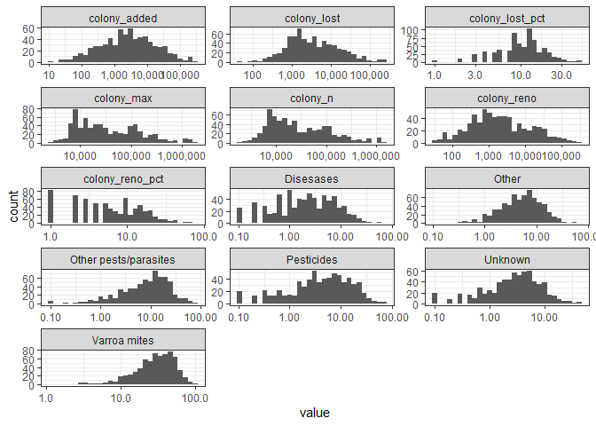
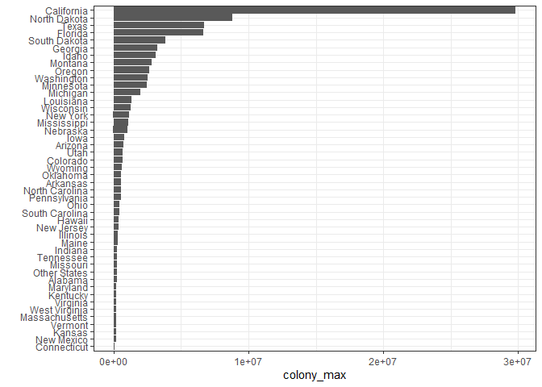

# Explore


```r
beecolony <- na.omit(beecolony)

beecolony %>%
  select(where(is.numeric)) %>%
  gather() %>%
  ggplot(aes(value)) + geom_histogram() + facet_wrap(~key, scales = "free")
```

```
## `stat_bin()` using `bins = 30`. Pick better value with `binwidth`.
```

<!-- -->

```r
beecolony <- na.omit(beecolony)

beecolony %>%
  group_by(state) %>%
  summarize(sum(colony_lost), sum(colony_added), sum(colony_added)/sum(colony_lost)) %>%
  arrange(-`sum(colony_lost)`, `sum(colony_added)`)
```

```
## # A tibble: 46 x 4
##    state        `sum(colony_lost)` `sum(colony_added)` `sum(colony_added)/sum(c~
##    <chr>                     <dbl>               <dbl>                     <dbl>
##  1 California             20736000            19866000                     0.958
##  2 Florida                 5262000             6840000                     1.30 
##  3 North Dakota            3805200             1962600                     0.516
##  4 Texas                   3112000             6790200                     2.18 
##  5 Georgia                 2496000             3097200                     1.24 
##  6 South Dakota            1791300             1067100                     0.596
##  7 Idaho                   1736500             1605200                     0.924
##  8 Minnesota               1225400             1054490                     0.861
##  9 Oregon                  1162900             1328720                     1.14 
## 10 Michigan                1127200             1037270                     0.920
## # ... with 36 more rows
```


```r
gplot <- function(x){
  colony %>%
    filter(!is.na({{x}})) %>%
    distinct(months, year, state, {{x}}) %>%
    group_by(months, year, state) %>%
    ggplot(aes({{x}}, fct_reorder(state, {{x}}))) + geom_col() + labs(y = "")
}

gplot(colony_reno)
```

<!-- -->

