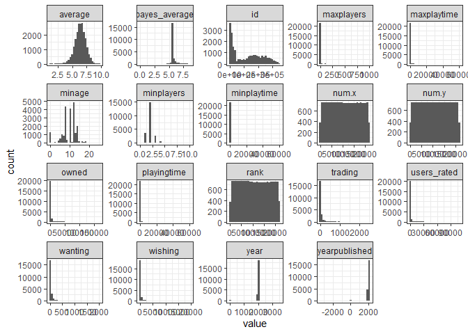
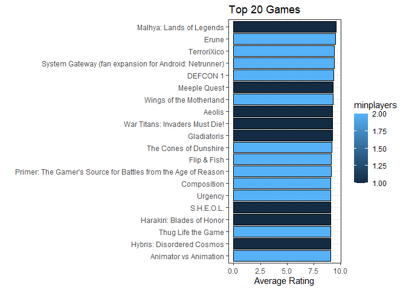
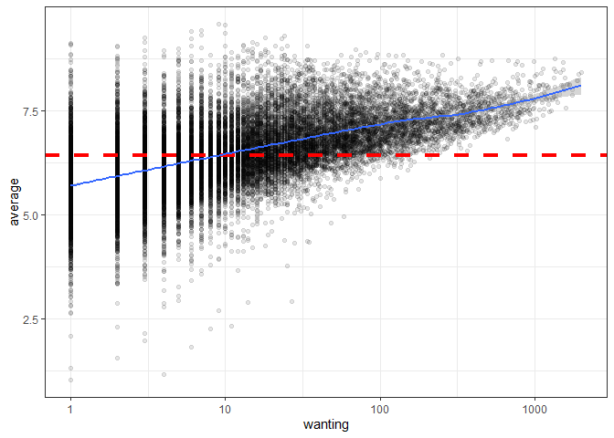
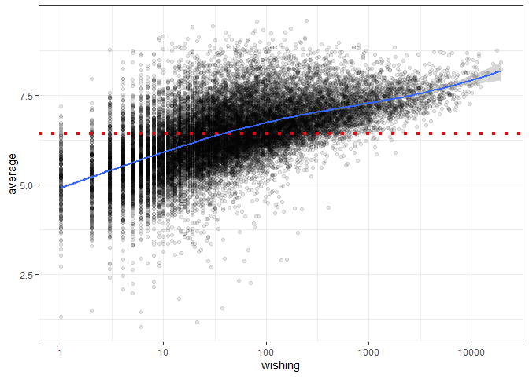
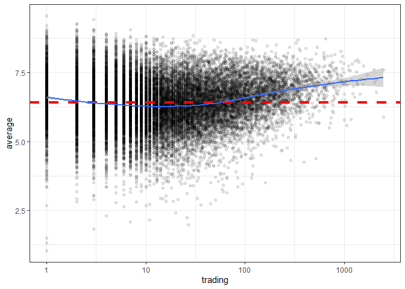
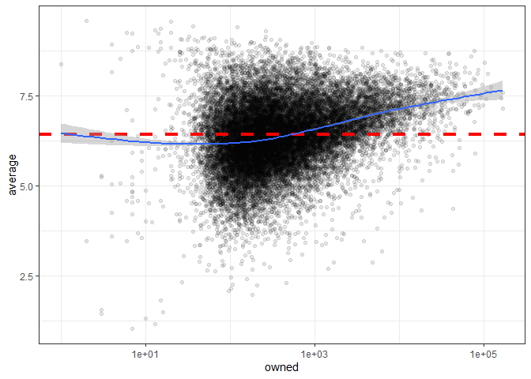
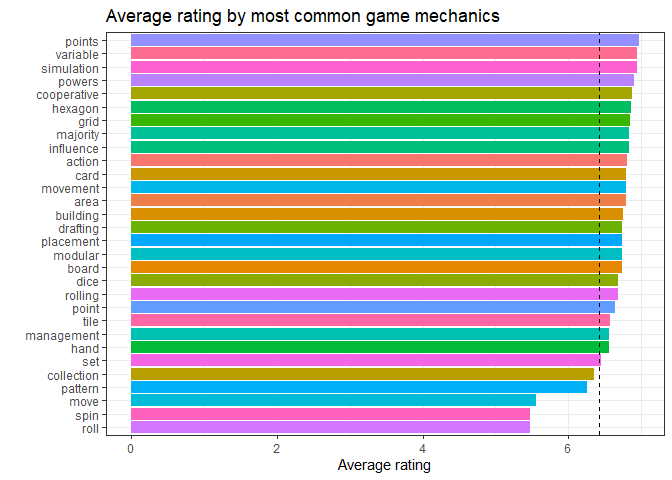
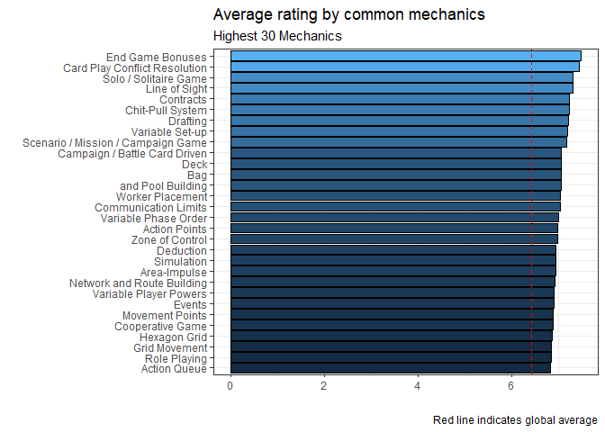
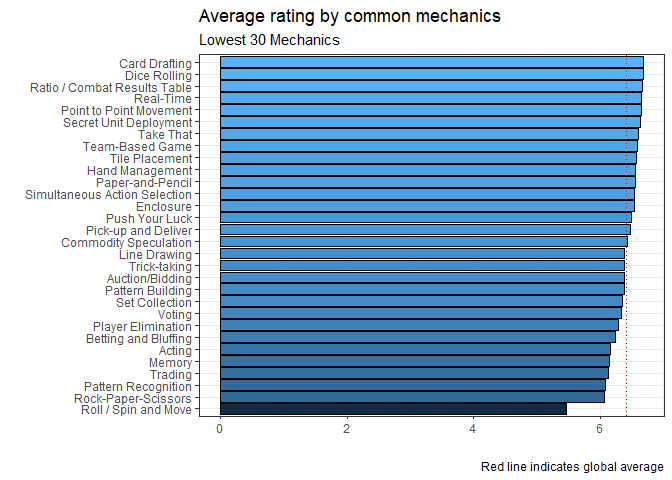
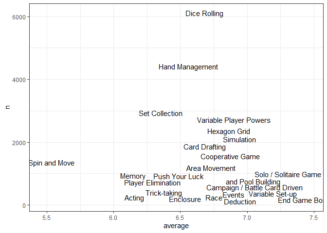

Boardgames
================
Matthew
1/25/2022

# EDA

## Check Data

``` r
games %>%
  select_if(is.numeric) %>%
  gather() %>%
  ggplot(aes(value)) + geom_histogram() + facet_wrap(~key, scales = "free")
```

    ## `stat_bin()` using `bins = 30`. Pick better value with `binwidth`.

<!-- -->

``` r
games %>%
  count(mechanic, sort = TRUE)
```

    ## # A tibble: 8,292 x 2
    ##    mechanic                                           n
    ##    <chr>                                          <int>
    ##  1 <NA>                                            1590
    ##  2 ['Hand Management']                              428
    ##  3 ['Hexagon Grid']                                 389
    ##  4 ['Roll / Spin and Move']                         381
    ##  5 ['Dice Rolling']                                 365
    ##  6 ['Tile Placement']                               287
    ##  7 ['Dice Rolling', 'Hexagon Grid', 'Simulation']   264
    ##  8 ['Dice Rolling', 'Hexagon Grid']                 252
    ##  9 ['Set Collection']                               237
    ## 10 ['Hand Management', 'Set Collection']            180
    ## # ... with 8,282 more rows

## Facet numerics

### Playtime

``` r
games %>%
  group_by(name) %>%
  arrange(-average) %>%
  head(20) %>%
  pivot_longer(contains("playtime"), names_to = "key", values_to = "value") %>%
  ggplot(aes(average, fct_reorder(name, average), fill = factor(value))) + geom_col(color = "black") + facet_wrap(~key) +
  scale_fill_viridis_d(option = "magma") +
  labs(x = "Average Rating", y = "", title = "Top 20 Games") 
```

<!-- -->

### Number of players

``` r
games %>%
  group_by(name) %>%
  arrange(-average) %>%
  head(20) %>%
  pivot_longer(contains("player"), names_to = "key", values_to = "value") %>%
  ggplot(aes(average, fct_reorder(name, average), fill = factor(value))) + geom_col(color = "black") + facet_wrap(~key) +
  scale_fill_viridis_d(option = "magma") +
  labs(x = "Average Rating", y = "", title = "Top 20 Games")
```

<!-- -->

### Gplot column function for filling by numeric

``` r
Gplot <- function(x) {
  games %>%
    group_by(name) %>%
    arrange(-average) %>%
    head(20) %>%
    ggplot(aes(average, fct_reorder(name, average), fill = {{x}})) + geom_col(color = "black") +
    labs(x = "Average Rating", y = "", title = "Top 20 Games") 
}

Gplot(maxplayers)
```

<!-- -->

``` r
Gplot(minplayers)
```

<!-- -->

### Gplot2 point function of numerics and average

``` r
Gplot2 <- function(x) {
  games %>%
    filter({{x}} != 0) %>%
    ggplot(aes({{x}}, average)) + geom_point(alpha = 0.1) + scale_x_log10() + 
    geom_hline(yintercept = mean(games$average), lty = 2, size = 1.5, color = "red") +
    geom_smooth()
}

Gplot2(wanting)
```

    ## `geom_smooth()` using method = 'gam' and formula 'y ~ s(x, bs = "cs")'

<!-- -->

``` r
Gplot2(wishing)
```

    ## `geom_smooth()` using method = 'gam' and formula 'y ~ s(x, bs = "cs")'

<!-- -->

``` r
Gplot2(trading)
```

    ## `geom_smooth()` using method = 'gam' and formula 'y ~ s(x, bs = "cs")'

<!-- -->

``` r
Gplot2(owned)
```

    ## `geom_smooth()` using method = 'gam' and formula 'y ~ s(x, bs = "cs")'

<!-- -->

## Game Mechanics

``` r
games %>%
  unnest_tokens(word, mechanic) %>%
  group_by(word) %>%
  summarize(n = n(), mean = mean(average)) %>%
  arrange(-n) %>%
  filter(!word %in% c("game", "and", "player"), !is.na(word)) %>%
  head(30) %>%
  ggplot(aes(mean, fct_reorder(word, mean), fill = word)) + geom_col() + geom_vline(xintercept = mean(games$average), lty = 2) +
  theme(legend.position = "") + labs(y = "", x = "Average rating", title = "Average rating by most common game mechanics")
```

<!-- -->

### Tidy mechanic column and furthur analysis

``` r
games %>%
  separate_rows(mechanic, sep = ",") %>%
  mutate(mechanic = str_replace_all(mechanic, "\\[|\\]", ""),
         mechanic = str_replace_all(mechanic, "\'", ""),
         mechanic = str_trim(mechanic, "both")) %>% 
  group_by(mechanic) %>%
  summarize(n = n(), average = mean(average)) %>%
  filter(n >100) %>%
  arrange(-average) %>%
  head(30) %>%
  ggplot(aes(average, fct_reorder(mechanic, average), fill = average)) + geom_col(color = "black") + 
  theme(legend.position = "") +
  geom_vline(xintercept = mean(games$average), lty = 2, color = "red") +
  labs(y = "", x = "", title = "Average rating by common mechanics", subtitle = "Highest 30 Mechanics",
       caption = "Red line indicates global average")
```

<!-- -->

``` r
games %>%
  separate_rows(mechanic, sep = ",") %>%
  mutate(mechanic = str_replace_all(mechanic, "\\[|\\]", ""),
         mechanic = str_replace_all(mechanic, "\'", ""),
         mechanic = str_trim(mechanic, "both")) %>% 
  group_by(mechanic) %>%
  summarize(n = n(), average = mean(average)) %>%
  filter(n >100, !is.na(mechanic)) %>%
  arrange(average) %>%
  head(30) %>%
  ggplot(aes(average, fct_reorder(mechanic, average), fill = average)) + geom_col(color = "black") + 
  geom_vline(xintercept = mean(games$average), lty = 2, color = "red") +
  theme(legend.position = "") +
  labs(y = "", x = "", title = "Average rating by common mechanics", subtitle = "Lowest 30 Mechanics",
       caption = "Red line indicates global average")
```

<!-- -->

``` r
games %>%
  separate_rows(mechanic, sep = ",") %>%
  mutate(mechanic = str_replace_all(mechanic, "\\[|\\]", ""),
         mechanic = str_replace_all(mechanic, "\'", ""),
         mechanic = str_trim(mechanic, "both")) %>% 
  group_by(mechanic) %>%
  summarize(n = n(), average = mean(average)) %>%
  filter(n >100, !is.na(mechanic)) %>%
  arrange(-average) %>%
  ggplot(aes(average, n)) + geom_text(aes(label = mechanic), check_overlap = TRUE)
```

<!-- -->
