Chocolate Bar Ratings
================
Matthew
1/18/2022

# EDA

## Plot of Numerics

``` r
chocolate %>%
  keep(is.numeric) %>%
  gather() %>%
  ggplot(aes(value)) + geom_histogram() + facet_wrap(~key, scales = "free")
```

    ## `stat_bin()` using `bins = 30`. Pick better value with `binwidth`.

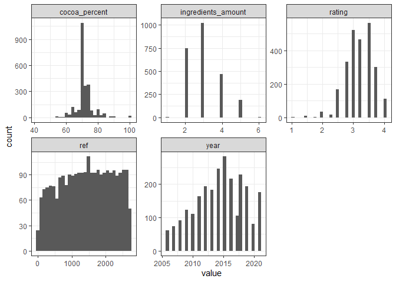<!-- -->

``` r
chocolate %>%
  gather() %>%
  count(value, sort = TRUE)
```

    ## # A tibble: 5,433 x 2
    ##    value      n
    ##    <chr>  <int>
    ##  1 3       1546
    ##  2 U.S.A.  1169
    ##  3 70      1046
    ##  4 B,S,C    999
    ##  5 2        783
    ##  6 B,S      718
    ##  7 4        581
    ##  8 3.5      565
    ##  9 3.25     464
    ## 10 2.75     333
    ## # ... with 5,423 more rows

## Plot function

``` r
ratingplot <- function(x) {
  chocolate %>%
    group_by({{x}}) %>%
    summarize(n = mean(rating)) %>%
    arrange(-n) %>%
    head(10) %>%
    ggplot(aes(n, fct_reorder({{x}}, n))) + geom_col() + labs(x = "Average Rating")
}
ratingplot(company_manufacturer) + labs(y = "Manufacturer")
```

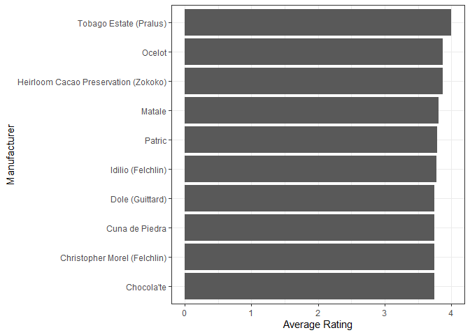<!-- -->

``` r
ratingplot(company_location) + labs(y = "Location")
```

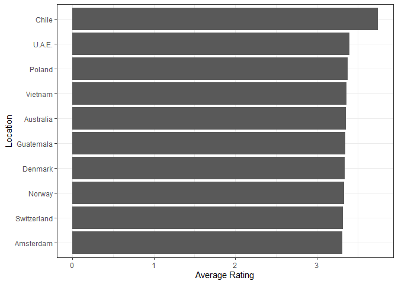<!-- -->

``` r
ratingplot(country_of_bean_origin) + labs(y = "Bean Origin")
```

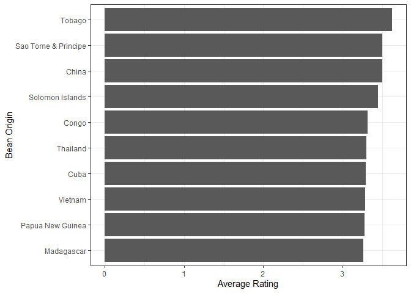<!-- -->

## Rating by Year

``` r
chocolate %>%
  group_by(year) %>%
  summarize(n = mean(rating)) %>%
  ggplot(aes(year, n)) + geom_point() + geom_smooth() + ylim(ymin = 0, ymax = 5)
```

    ## `geom_smooth()` using method = 'loess' and formula 'y ~ x'

<!-- -->

## Rating by Cocoa Percent

``` r
chocolate %>%
  group_by(cocoa_percent) %>%
  summarize(n = mean(rating)) %>%
  ggplot(aes(cocoa_percent, n)) + geom_point() + geom_line() + 
  geom_smooth(se = FALSE) + labs(y = "Mean Rating", x = "Cocoa Percent")
```

    ## `geom_smooth()` using method = 'loess' and formula 'y ~ x'

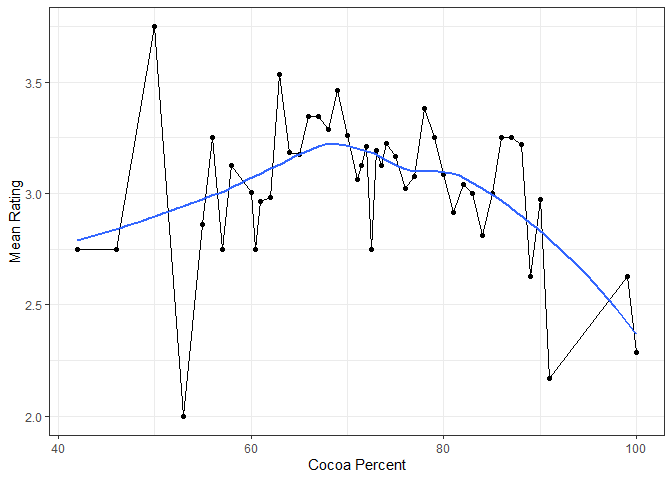<!-- -->

## Rating by amount of ingredients

``` r
chocolate %>%
  drop_na() %>%
  group_by(ingredients_amount) %>%
  mutate(new = mean(rating)) %>%
  ggplot(aes(ingredients_amount, rating, group = ingredients_amount)) + geom_boxplot() + 
  geom_line(aes(x = ingredients_amount, y = new, group = 1), color = "blue") +
  geom_point(aes(x = ingredients_amount, y = new), color = "blue", size = 2) +
  labs(caption = "Blue line/dots represent the average per group")
```

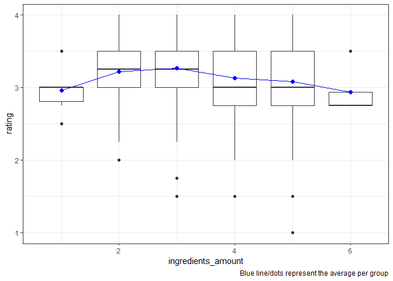<!-- -->

``` r
chocolate %>%
  drop_na() %>%
  group_by(ingredients_amount) %>%
  summarize(Average = mean(rating)) %>%
  ggplot(aes(ingredients_amount, Average)) + geom_line() + labs(title = "Zoomed in")
```

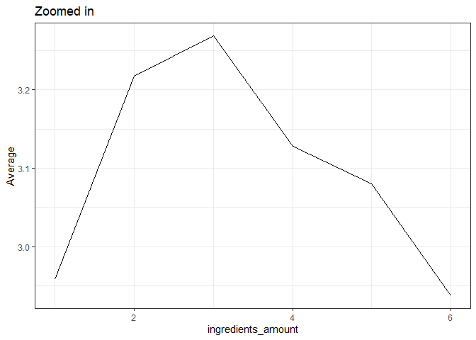<!-- -->

### Ingredients Type

``` r
chocolate %>%
  drop_na() %>%
  group_by(ingredients_type) %>%
  summarize(Average = mean(rating)) %>%
  ggplot(aes(Average, fct_reorder(ingredients_type, Average), fill = Average)) + geom_col() +
  scale_fill_viridis_c(option = "H", direction = -1) +
  labs(title = "Average Rating of all Ingredients", 
       y = "Ingredients", x = "Average Rating")
```

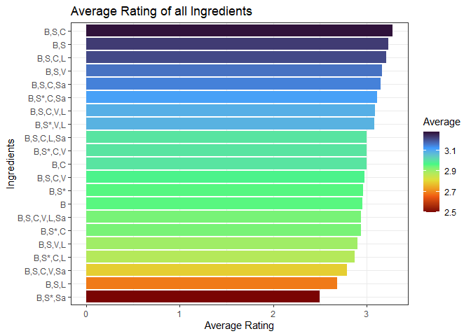<!-- -->

``` r
chocolate %>%
  drop_na() %>%
  mutate(ingredients_type = fct_lump(ingredients_type, n = 5)) %>%
  group_by(ingredients_type) %>%
  summarize(Average = mean(rating)) %>%
  ggplot(aes(Average, fct_reorder(ingredients_type, Average))) + geom_col() + 
  labs(title = "Average Rating of Top 5 Ingredients", subtitle = "Ratings not in top 5 are collapsed as Other", 
       y = "Ingredients", x = "Average Rating")
```

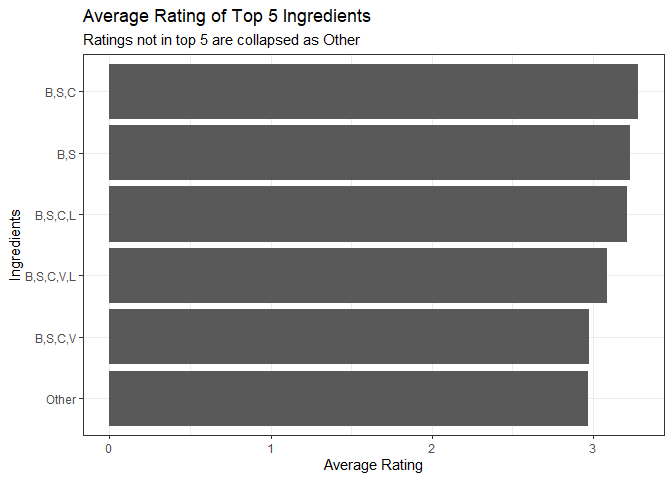<!-- -->

## Type of Sugar

``` r
chocolate %>%
  drop_na() %>%
  mutate(sugar = str_detect(ingredients_type, "\\*"),
         sugar = ifelse(sugar == FALSE, "Real Sugar", "Sweetener")) %>%
  ggplot(aes(sugar, rating)) + geom_boxplot() + 
  labs(y = "Rating", x = "Sugar", title = "Ratings separated by synthetic or real sugar",
       subtitle = "There is far more real sugar in the dataset, than sweetener substitutes", 
       caption = "Real Sugar: 2,367     Sweetener: 76")
```

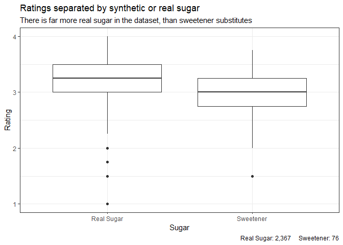<!-- -->

``` r
chocolate %>%
  drop_na() %>%
  mutate(sugar = str_detect(ingredients_type, "\\*"),
         sugar = ifelse(sugar == FALSE, "Real Sugar", "Sweetener")) %>%
  ggplot(aes(rating, color = sugar)) + geom_density()
```

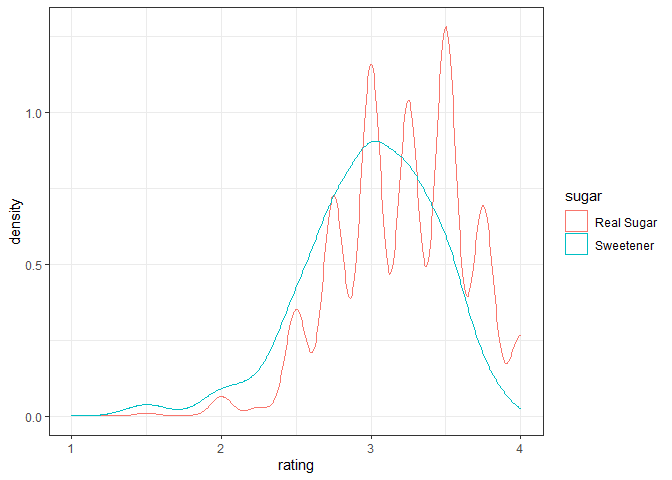<!-- -->

## Company location and bean origin

``` r
chocolate <- chocolate %>%
  mutate(location_origin = ifelse(company_location == country_of_bean_origin, "Same","Different"))

t.test(rating ~ location_origin, chocolate)
```

    ## 
    ##  Welch Two Sample t-test
    ## 
    ## data:  rating by location_origin
    ## t = 2.958, df = 410.71, p-value = 0.003276
    ## alternative hypothesis: true difference in means is not equal to 0
    ## 95 percent confidence interval:
    ##  0.02660304 0.13201587
    ## sample estimates:
    ## mean in group Different      mean in group Same 
    ##                3.206281                3.126972

``` r
chocolate %>%
  ggplot(aes(location_origin, rating, group = location_origin)) + geom_boxplot() + 
  stat_summary(fun = mean, geom ="line", color = "blue", group = 1) +
  stat_summary(fun = mean, geom ="point", color = "blue")
```

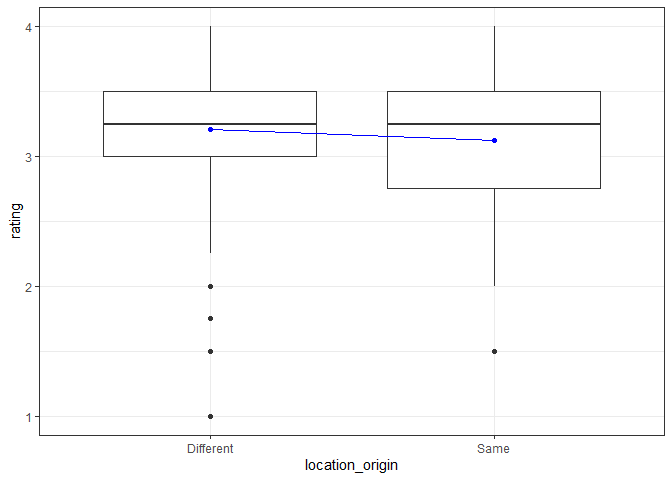<!-- -->

``` r
chocolate %>%
  ggplot(aes(rating, color = location_origin)) + geom_density()
```

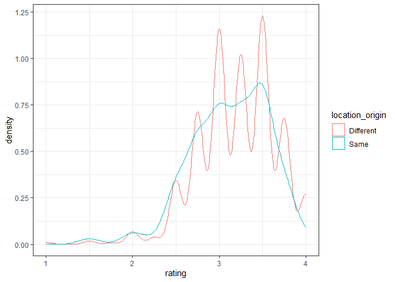<!-- -->

``` r
chocolate %>%
  group_by(company_location) %>%
  summarize(rating = mean(rating),
            location_origin) %>%
  distinct(company_location, rating, location_origin) %>%
  arrange(-rating) %>%
  head(20) %>%
  ggplot(aes(rating, reorder(company_location, rating, order = TRUE), fill = location_origin)) + geom_col(position = "identity") +
  labs(y = "Company Location", x = "Average Rating", title = "Top 20 Countries", subtitle = "Colored by Companies Location = Bean Location")
```

    ## `summarise()` has grouped output by 'company_location'. You can override using the `.groups` argument.

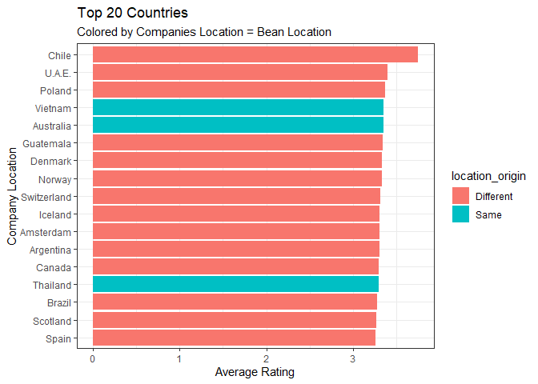<!-- -->
