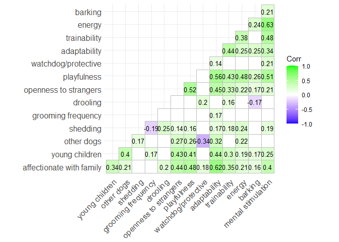
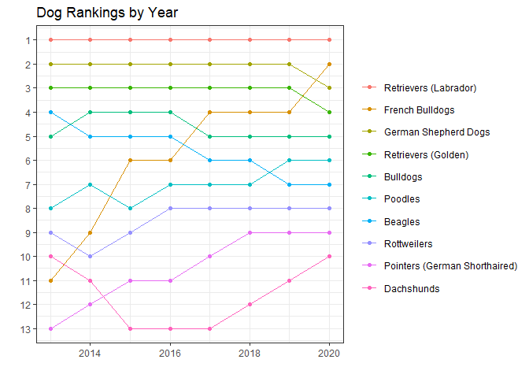

Dog Breeds
================
Matthew
2/1/2022

# EDA

``` r
breed_traits %>%
  keep(is.numeric) %>%
  gather() %>%
  ggplot(aes(value)) + geom_histogram() + facet_wrap(~key)
```

    ## `stat_bin()` using `bins = 30`. Pick better value with `binwidth`.

<!-- -->

## Correlation plot

``` r
library(ggcorrplot)
breed_traits %>%
  keep(is.numeric) %>%
  cor() %>%
  round(1) %>%
  ggcorrplot(type = "lower", lab = TRUE, p.mat = cor_pmat(keep(breed_traits, is.numeric)), insig = "blank")
```

<!-- -->

## Top 13 dogs by total score

``` r
breed_long %>%
  group_by(breed) %>%
  mutate(value = ifelse(trait %in% c("drooling level", "coat grooming frequency", "shedding level", "barking level"),
                        -value, value)) %>%
  summarize(total_score = sum(value)) %>%
  arrange(-total_score) %>% 
  head(13) %>%
  ggplot(aes(total_score, fct_reorder(breed, total_score), fill = breed)) + geom_col() +
  theme(legend.position = "") +
  labs(title = "Top 13 Dogs", subtitle = "The sum of positive and negative trait scores",
       y = "", x = "Total Score", 
       caption = "Drooling, Grooming frequency, Shedding and Barking = Negative Scores\n
                  The choice of displaying 13 was because the following 10 (#14-23) were a tie")
```

<!-- -->

## Top 10 Dog Rankings

``` r
breed_rank %>%
  rename_with(~ gsub(pattern = " Rank", replace = "", .x), starts_with("20")) %>%
  head(10) %>%
  pivot_longer(cols = where(is.numeric), names_to = "year", values_to = "rank") %>%
  mutate(year = as.numeric(year)) %>%
  ggplot(aes(year, rank, color = fct_reorder2(Breed, year, rank, .desc = FALSE))) + geom_line() + geom_point() +
  scale_y_reverse(breaks = 1:13) + theme(legend.title = element_blank()) +
  labs(title = "Dog Rankings by Year", x = "", y = "")
```

<!-- -->
