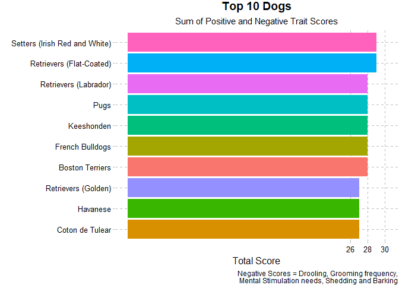

Dog Breeds
================
Matthew
2/1/2022

# EDA

``` r
breed_traits %>%
  keep(is.numeric) %>%
  gather() %>%
  ggplot(aes(value)) + geom_histogram() + facet_wrap(~key)
```

    ## `stat_bin()` using `bins = 30`. Pick better value with `binwidth`.

<!-- -->

## Correlation plot

``` r
library(ggcorrplot)
breed_traits %>%
  keep(is.numeric) %>%
  rename_with(~ gsub(" level|good with |coat | nature| needs",
                     "", .x)) %>%
  cor() %>%
  round(2) %>%
  ggcorrplot(type = "lower", lab = TRUE, p.mat = cor_pmat(keep(breed_traits, is.numeric)), 
             insig = "blank", color = c("#0000FF","#FFFFFF","#00FF00"), lab_size = 3.5)
```

<!-- -->

``` r
breed_traits %>%
  ggplot(aes(`adaptability level`, `affectionate with family`)) + geom_count()
```

<!-- -->

## Top 10 dogs by total score

``` r
breed_long %>%
  group_by(breed) %>%
  mutate(value = ifelse(trait %in% c("drooling level", "coat grooming frequency", 
                                     "shedding level", "barking level", "mental stimulation needs"),
                        -value, value)) %>%
  summarize(total_score = sum(value)) %>%
  arrange(-total_score) %>% 
  head(10) %>%
  ggplot(aes(total_score, fct_reorder(breed, total_score), fill = breed)) + geom_col() + theme_pander() + 
  scale_x_continuous(minor_breaks = seq(26,30,2), breaks = seq(26,30,2), limits = c(0,30)) +
  labs(title = "Top 10 Dogs", subtitle = "Sum of Positive and Negative Trait Scores",
       y = "", x = "Total Score", 
       caption = "Drooling, Grooming frequency, Mental Stimulation needs, Shedding and Barking = Negative Scores") +
  theme(legend.position = "", plot.caption = element_text(lineheight = 0.5), 
        plot.title = element_text(hjust = 0.5), plot.subtitle = element_text(hjust = 0.5))
```

<!-- -->

## Top 10 Dog Rankings

``` r
breed_rank %>%
  rename_with(~ gsub(pattern = " Rank", replace = "", .x), starts_with("20")) %>%
  head(10) %>%
  pivot_longer(cols = where(is.numeric), names_to = "year", values_to = "rank") %>%
  mutate(year = as.numeric(year)) %>%
  ggplot(aes(year, rank, color = fct_reorder2(Breed, year, rank, .desc = FALSE))) + geom_line() + geom_point() +
  scale_y_reverse(breaks = 1:13) + 
  theme(legend.title = element_blank(), legend.key.height = unit(0.75,'cm')) +
  labs(title = "Dog Rankings by Year", x = "", y = "")
```

<!-- -->
