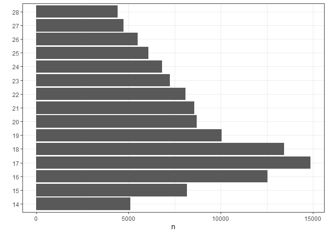
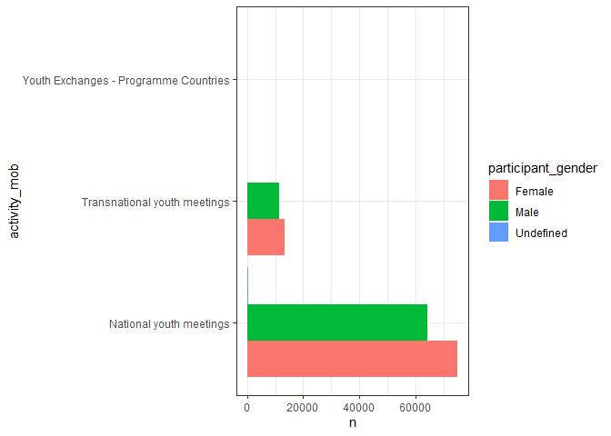
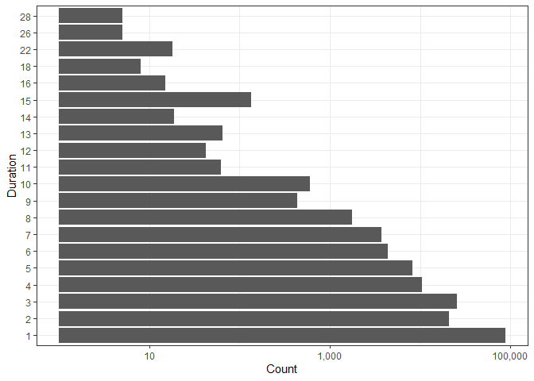
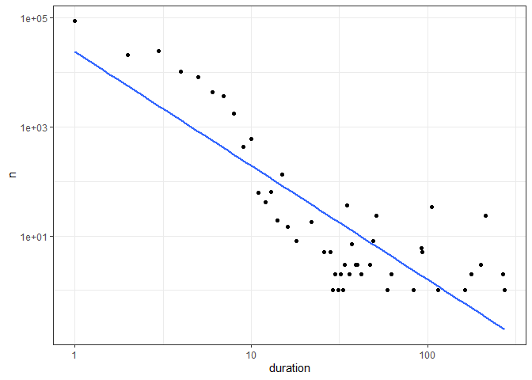
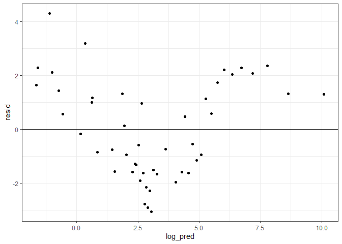

Erasmus
================
Matthew
3/8/2022

``` r
erasmus <- read_csv('https://raw.githubusercontent.com/rfordatascience/tidytuesday/master/data/2022/2022-03-08/erasmus.csv')
```

    ## 
    ## -- Column specification --------------------------------------------------------
    ## cols(
    ##   .default = col_character(),
    ##   mobility_duration = col_double(),
    ##   participant_age = col_double(),
    ##   participants = col_double()
    ## )
    ## i Use `spec()` for the full column specifications.

``` r
erasmus <- erasmus %>%
  rename_with(~ gsub("mobility_","", .x)) %>%
  mutate(start_month = as.Date(anytime(start_month)),
         end_month = as.Date(anytime(end_month)))
```

# EDA

``` r
skim(erasmus)
```

|                                                  |         |
|:-------------------------------------------------|:--------|
| Name                                             | erasmus |
| Number of rows                                   | 164635  |
| Number of columns                                | 24      |
| \_\_\_\_\_\_\_\_\_\_\_\_\_\_\_\_\_\_\_\_\_\_\_   |         |
| Column type frequency:                           |         |
| character                                        | 19      |
| Date                                             | 2       |
| numeric                                          | 3       |
| \_\_\_\_\_\_\_\_\_\_\_\_\_\_\_\_\_\_\_\_\_\_\_\_ |         |
| Group variables                                  | None    |

Data summary

**Variable type: character**

| skim\_variable                         | n\_missing | complete\_rate | min | max | empty | n\_unique | whitespace |
|:---------------------------------------|-----------:|---------------:|----:|----:|------:|----------:|-----------:|
| project\_reference                     |          0 |              1 |  24 |  24 |     0 |      1394 |          0 |
| academic\_year                         |          0 |              1 |   9 |   9 |     0 |         6 |          0 |
| activity\_mob                          |          0 |              1 |  23 |  37 |     0 |         3 |          0 |
| field\_of\_education                   |          0 |              1 |  11 |  11 |     0 |         1 |          0 |
| participant\_nationality               |          0 |              1 |   1 |   2 |     0 |       167 |          0 |
| education\_level                       |          0 |              1 |  17 |  17 |     0 |         1 |          0 |
| participant\_gender                    |          0 |              1 |   4 |   9 |     0 |         3 |          0 |
| participant\_profile                   |          0 |              1 |   7 |   7 |     0 |         1 |          0 |
| special\_needs                         |          0 |              1 |   2 |   3 |     0 |         2 |          0 |
| fewer\_opportunities                   |          0 |              1 |   2 |   3 |     0 |         2 |          0 |
| group\_leader                          |          0 |              1 |   2 |   2 |     0 |         1 |          0 |
| sending\_country\_code                 |          0 |              1 |   2 |   2 |     0 |        54 |          0 |
| sending\_city                          |          0 |              1 |   1 |  80 |     0 |     14451 |          0 |
| sending\_organization                  |          0 |              1 |   3 | 164 |     0 |      2463 |          0 |
| sending\_organisation\_erasmus\_code   |          0 |              1 |   1 |  12 |     0 |        49 |          0 |
| receiving\_country\_code               |          0 |              1 |   2 |   2 |     0 |        34 |          0 |
| receiving\_city                        |          0 |              1 |   1 | 184 |     0 |      2676 |          0 |
| receiving\_organization                |          0 |              1 |   3 | 153 |     0 |      1083 |          0 |
| receiving\_organisation\_erasmus\_code |          0 |              1 |   1 |  12 |     0 |        12 |          0 |

**Variable type: Date**

| skim\_variable | n\_missing | complete\_rate | min        | max        | median     | n\_unique |
|:---------------|-----------:|---------------:|:-----------|:-----------|:-----------|----------:|
| start\_month   |          0 |              1 | 2014-07-01 | 2019-12-01 | 2017-06-01 |        66 |
| end\_month     |          0 |              1 | 2014-07-01 | 2020-02-01 | 2017-06-01 |        68 |

**Variable type: numeric**

| skim\_variable   | n\_missing | complete\_rate |  mean |    sd |    p0 | p25 | p50 | p75 | p100 | hist  |
|:-----------------|-----------:|---------------:|------:|------:|------:|----:|----:|----:|-----:|:------|
| duration         |          0 |              1 |  2.35 |  4.03 |     1 |   1 |   1 |   3 |  273 | ▇▁▁▁▁ |
| participant\_age |          0 |              1 | 24.54 | 29.75 | -7184 |  17 |  21 |  28 | 1049 | ▁▁▁▁▇ |
| participants     |          0 |              1 |  1.88 |  3.43 |     1 |   1 |   1 |   2 |  279 | ▇▁▁▁▁ |

``` r
erasmus %>%
  count(participant_age, sort = TRUE) %>%
  head(15) %>%
  ggplot(aes(x = n, y = as.character(participant_age))) + geom_col() + ylab("")
```

<!-- -->

``` r
erasmus %>%
  group_by(participant_gender) %>%
  summarize(m = mean(special_needs == "No"))
```

    ## # A tibble: 3 x 2
    ##   participant_gender     m
    ##   <chr>              <dbl>
    ## 1 Female             0.986
    ## 2 Male               0.983
    ## 3 Undefined          0.983

``` r
propfun <- function(x){
  erasmus %>%
    count({{x}}, sort = TRUE) %>%
    mutate(prop = n/sum(n))
}

propfun(receiving_organisation_erasmus_code)
```

    ## # A tibble: 12 x 3
    ##    receiving_organisation_erasmus_code      n       prop
    ##    <chr>                                <int>      <dbl>
    ##  1 -                                   163536 0.993     
    ##  2 UK OMAGH01                             337 0.00205   
    ##  3 E  OVIEDO23                            262 0.00159   
    ##  4 TR ANKARA04                            210 0.00128   
    ##  5 TR BURSA01                             120 0.000729  
    ##  6 TR IZMIR04                              43 0.000261  
    ##  7 PL WARSZAW05                            38 0.000231  
    ##  8 E  BILBAO01                             34 0.000207  
    ##  9 I  SASSARI01                            20 0.000121  
    ## 10 A  WIEN02                               17 0.000103  
    ## 11 TR ANKARA15                             17 0.000103  
    ## 12 PL OPOLE01                               1 0.00000607

``` r
propfun(activity_mob)
```

    ## # A tibble: 3 x 3
    ##   activity_mob                               n       prop
    ##   <chr>                                  <int>      <dbl>
    ## 1 National youth meetings               139800 0.849     
    ## 2 Transnational youth meetings           24834 0.151     
    ## 3 Youth Exchanges - Programme Countries      1 0.00000607

``` r
propfun(duration)
```

    ## # A tibble: 48 x 3
    ##    duration     n    prop
    ##       <dbl> <int>   <dbl>
    ##  1        1 88142 0.535  
    ##  2        3 25343 0.154  
    ##  3        2 20942 0.127  
    ##  4        4 10547 0.0641 
    ##  5        5  8177 0.0497 
    ##  6        6  4364 0.0265 
    ##  7        7  3761 0.0228 
    ##  8        8  1763 0.0107 
    ##  9       10   608 0.00369
    ## 10        9   433 0.00263
    ## # ... with 38 more rows

``` r
propfun(receiving_city)
```

    ## # A tibble: 2,676 x 3
    ##    receiving_city     n    prop
    ##    <chr>          <int>   <dbl>
    ##  1 Berlin          2877 0.0175 
    ##  2 London          2268 0.0138 
    ##  3 Dublin          2201 0.0134 
    ##  4 Budapest        2053 0.0125 
    ##  5 Tallinn         1581 0.00960
    ##  6 Paris           1530 0.00929
    ##  7 Hagen           1431 0.00869
    ##  8 Strasbourg      1386 0.00842
    ##  9 Luxembourg      1276 0.00775
    ## 10 Ljubljana       1172 0.00712
    ## # ... with 2,666 more rows

``` r
propfun(participant_profile)
```

    ## # A tibble: 1 x 3
    ##   participant_profile      n  prop
    ##   <chr>                <int> <dbl>
    ## 1 Learner             164635     1

``` r
erasmus %>%
  group_by(participant_gender) %>%
  count(receiving_city, sort = TRUE)
```

    ## # A tibble: 5,060 x 3
    ## # Groups:   participant_gender [3]
    ##    participant_gender receiving_city     n
    ##    <chr>              <chr>          <int>
    ##  1 Male               Berlin          1445
    ##  2 Female             Berlin          1387
    ##  3 Female             London          1287
    ##  4 Female             Dublin          1199
    ##  5 Female             Budapest        1067
    ##  6 Male               Dublin           988
    ##  7 Male               Budapest         984
    ##  8 Male               London           900
    ##  9 Female             Paris            861
    ## 10 Female             Tallinn          861
    ## # ... with 5,050 more rows

``` r
erasmus %>%
  filter(100 < abs(participant_age)) %>%
  count(participant_age)
```

    ## # A tibble: 38 x 2
    ##    participant_age     n
    ##              <dbl> <int>
    ##  1           -7184     1
    ##  2           -5182     1
    ##  3           -4184     1
    ##  4           -2184     1
    ##  5            -986     1
    ##  6            -984     2
    ##  7            -983     1
    ##  8            -974     1
    ##  9            -971     1
    ## 10            -962     1
    ## # ... with 28 more rows

``` r
erasmus %>%
  group_by(participant_gender) %>%
  count(activity_mob) %>%
  ggplot(aes(n, activity_mob, fill = participant_gender)) + 
  geom_col(position = "dodge")
```

<!-- -->

``` r
erasmus %>%
  select(start_month, end_month, duration) %>%
  count(duration) %>% arrange(duration) %>%
  head(20) %>%
  ggplot(aes(n, fct_reorder(as.factor(duration), duration))) + 
  geom_col() + scale_x_log10(labels=comma) +
  labs(y = "Duration", x = "Count")
```

<!-- -->

``` r
df <- erasmus %>%
  count(duration)

df %>%
  ggplot(aes(duration, n)) + geom_point() +
  geom_smooth(method = "lm", se = FALSE) +
  scale_y_log10() + scale_x_log10()
```

    ## `geom_smooth()` using formula 'y ~ x'

<!-- -->

``` r
mod <- lm(log(n) ~ log(duration), df)

mod %>% summary()
```

    ## 
    ## Call:
    ## lm(formula = log(n) ~ log(duration), data = df)
    ## 
    ## Residuals:
    ##     Min      1Q  Median      3Q     Max 
    ## -3.0485 -1.5674 -0.3597  1.3397  4.2903 
    ## 
    ## Coefficients:
    ##               Estimate Std. Error t value Pr(>|t|)    
    ## (Intercept)    10.0913     0.7368   13.70  < 2e-16 ***
    ## log(duration)  -2.0915     0.2059  -10.16 2.46e-13 ***
    ## ---
    ## Signif. codes:  0 '***' 0.001 '**' 0.01 '*' 0.05 '.' 0.1 ' ' 1
    ## 
    ## Residual standard error: 1.807 on 46 degrees of freedom
    ## Multiple R-squared:  0.6917, Adjusted R-squared:  0.685 
    ## F-statistic: 103.2 on 1 and 46 DF,  p-value: 2.46e-13

``` r
df %>%
  mutate(log_pred = predict(mod, df),
         resid = log(n) - log_pred) %>%
  ggplot(aes(log_pred, resid)) + geom_point() +
  geom_hline(yintercept = 0)
```

<!-- -->

Bias in residuals: Not a very good linear regression model.
