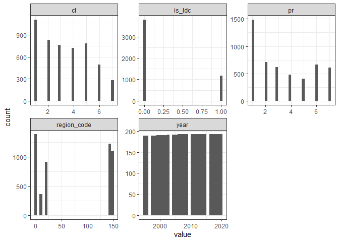
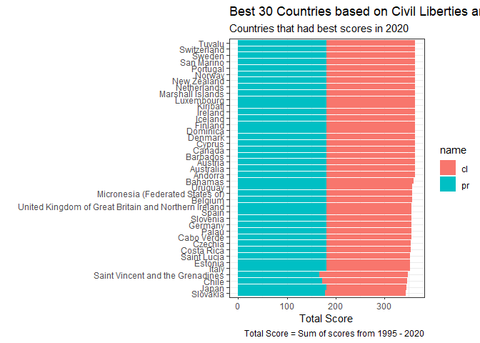

Freedom
================
Matthew
2/21/2022

``` r
freedom <- read_csv("https://raw.githubusercontent.com/rfordatascience/tidytuesday/master/data/2022/2022-02-22/freedom.csv")
```

    ## 
    ## -- Column specification --------------------------------------------------------
    ## cols(
    ##   country = col_character(),
    ##   year = col_double(),
    ##   CL = col_double(),
    ##   PR = col_double(),
    ##   Status = col_character(),
    ##   Region_Code = col_double(),
    ##   Region_Name = col_character(),
    ##   is_ldc = col_double()
    ## )

``` r
freedom <- freedom %>%
  rename_with(tolower)
```

# EDA

``` r
freedom %>%
  select(where(is.numeric)) %>%
  gather() %>%
  ggplot(aes(value)) + geom_histogram() + facet_wrap(~key, scales = "free")
```

    ## `stat_bin()` using `bins = 30`. Pick better value with `binwidth`.

<!-- -->

``` r
freedom %>%
  lm(cl ~ pr,.) %>%
  summary()
```

    ## 
    ## Call:
    ## lm(formula = cl ~ pr, data = .)
    ## 
    ## Residuals:
    ##     Min      1Q  Median      3Q     Max 
    ## -2.4420 -0.4384 -0.2391  0.5616  2.1594 
    ## 
    ## Coefficients:
    ##             Estimate Std. Error t value Pr(>|t|)    
    ## (Intercept) 0.637658   0.017347   36.76   <2e-16 ***
    ## pr          0.800724   0.004284  186.91   <2e-16 ***
    ## ---
    ## Signif. codes:  0 '***' 0.001 '**' 0.01 '*' 0.05 '.' 0.1 ' ' 1
    ## 
    ## Residual standard error: 0.6598 on 4977 degrees of freedom
    ## Multiple R-squared:  0.8753, Adjusted R-squared:  0.8753 
    ## F-statistic: 3.493e+04 on 1 and 4977 DF,  p-value: < 2.2e-16

``` r
x <- freedom %>%
  filter(year == 2020) %>%
  mutate(pr = -pr + 8,
         cl = -cl + 8,
         total = cl + pr) %>%
  arrange(-total) %>%
  head(41)

freedom %>%
  filter(country %in% x$country) %>%
  select(country, year, pr, cl) %>%
  pivot_longer(c("pr","cl")) %>%
  mutate(value = -value + 8) %>%
  group_by(country) %>%
  mutate(total = sum(value)) %>%
  ggplot(aes(value, fct_reorder2(country, value, total, .desc = FALSE), fill = name)) + geom_col() +
  labs(y = "", x = "Total Score", subtitle = "Countries that had best scores in 2020",
       title = "Best 30 Countries based on Civil Liberties and Political Rights",
       caption = "Total Score = Sum of scores from 1995 - 2020")
```

<!-- -->
