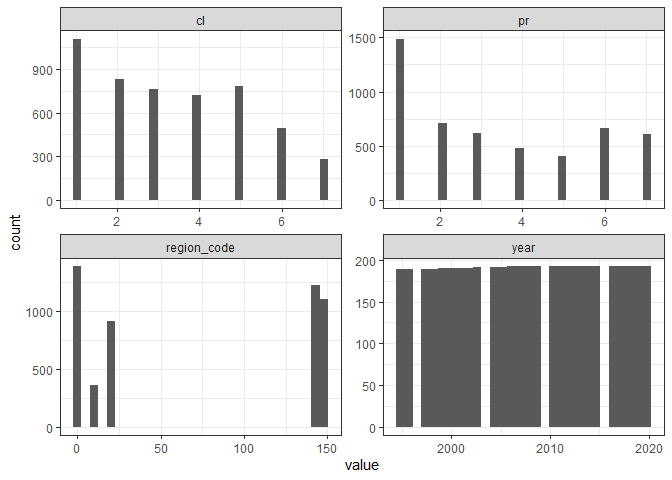
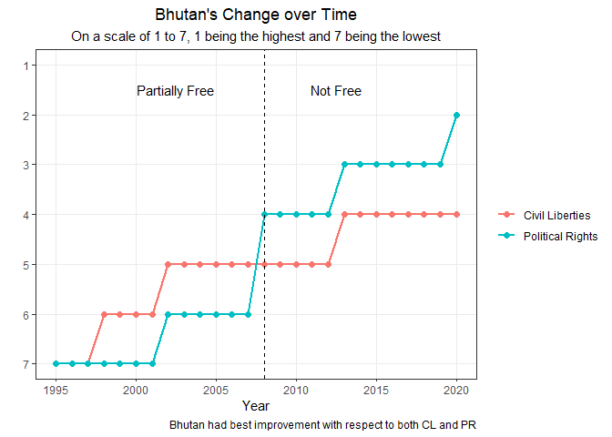

Freedom
================
Matthew
2/21/2022

``` r
freedom <- read_csv("https://raw.githubusercontent.com/rfordatascience/tidytuesday/master/data/2022/2022-02-22/freedom.csv")
```

    ## 
    ## -- Column specification --------------------------------------------------------
    ## cols(
    ##   country = col_character(),
    ##   year = col_double(),
    ##   CL = col_double(),
    ##   PR = col_double(),
    ##   Status = col_character(),
    ##   Region_Code = col_double(),
    ##   Region_Name = col_character(),
    ##   is_ldc = col_double()
    ## )

``` r
freedom <- freedom %>%
  rename_with(tolower) %>%
  mutate(is_ldc = fct_rev(as.factor(is_ldc)))
```

# EDA

``` r
freedom %>%
  select(where(is.numeric)) %>%
  gather() %>%
  ggplot(aes(value)) + geom_histogram() + facet_wrap(~key, scales = "free")
```

    ## `stat_bin()` using `bins = 30`. Pick better value with `binwidth`.

<!-- -->

## Cl \~ Pr relationship

``` r
freedom %>%
  lm(cl ~ pr, .) %>%
  summary()
```

    ## 
    ## Call:
    ## lm(formula = cl ~ pr, data = .)
    ## 
    ## Residuals:
    ##     Min      1Q  Median      3Q     Max 
    ## -2.4420 -0.4384 -0.2391  0.5616  2.1594 
    ## 
    ## Coefficients:
    ##             Estimate Std. Error t value Pr(>|t|)    
    ## (Intercept) 0.637658   0.017347   36.76   <2e-16 ***
    ## pr          0.800724   0.004284  186.91   <2e-16 ***
    ## ---
    ## Signif. codes:  0 '***' 0.001 '**' 0.01 '*' 0.05 '.' 0.1 ' ' 1
    ## 
    ## Residual standard error: 0.6598 on 4977 degrees of freedom
    ## Multiple R-squared:  0.8753, Adjusted R-squared:  0.8753 
    ## F-statistic: 3.493e+04 on 1 and 4977 DF,  p-value: < 2.2e-16

## Top countries

``` r
x <- freedom %>%
  filter(year == 2020) %>%
  mutate(pr = -pr + 8,
         cl = -cl + 8,
         total = cl + pr) %>%
  arrange(-total) %>%
  head(41)

freedom %>%
  filter(country %in% x$country) %>%
  select(country, year, pr, cl) %>%
  pivot_longer(c("pr","cl")) %>%
  mutate(value = -value + 8) %>%
  group_by(country) %>%
  mutate(total = sum(value)) %>%
  ggplot(aes(value, fct_reorder2(country, value, total, .desc = FALSE), fill = name)) + geom_col() +
  labs(y = "", x = "Total Score", subtitle = "Countries that had best scores in 2020",
       title = "Best 30 Countries based on Civil Liberties and Political Rights",
       caption = "Total Score = Sum of scores from 1995 - 2020")
```

<!-- -->

## Status

``` r
freedom %>%
  mutate(pr = -pr +8,
         cl = -cl +8) %>%
  group_by(status) %>%
  summarize(mean_pr = mean(pr),
            mean_cl = mean(cl)) %>%
  pivot_longer(-status) %>%
  ggplot(aes(value, fct_reorder(status, value), fill = fct_reorder(status, value))) + geom_col() +
  facet_wrap(~name) + labs(y = "", x = "Average Value") 
```

<!-- -->

### By Region

``` r
freedom %>%
  mutate(status = fct_relevel(status,"NF", "PF", "F")) %>%
  ggplot(aes(fill = status, y = fct_reorder(region_name, status, function(.x) mean(.x == "F")))) + 
  geom_bar(position = "fill") + labs(y = "", x = "Proportion") + 
  scale_fill_manual(values = c("#B81D13", "#F5A33E", "#00C301")) +
  scale_x_continuous(labels = scales::label_percent())
```

<!-- -->

## Region

``` r
freedom %>%
  ggplot(aes(fill = is_ldc, y = fct_reorder(region_name, is_ldc, function(.x) mean(.x == "0")))) + 
  geom_bar(position = "fill") + 
  labs(y = "", x = "Percent", title = "The Proportion of Underdeveloped Countries per Region") + 
  scale_x_continuous(labels = scales::label_percent()) + 
  theme(legend.position = "", plot.title = element_text(hjust = 0.5))
```

<!-- -->

``` r
table(freedom$is_ldc, freedom$region_name) %>%
  chisq.test()
```

    ## 
    ##  Pearson's Chi-squared test
    ## 
    ## data:  .
    ## X-squared = 1629.2, df = 4, p-value < 2.2e-16

## Is least developed and has perfect Cl and Pr

``` r
freedom %>%
  filter(is_ldc == 1 & cl == 1 & pr == 1) %>%
  distinct(country, region_name)
```

    ## # A tibble: 2 x 2
    ##   country  region_name
    ##   <chr>    <chr>      
    ## 1 Kiribati Oceania    
    ## 2 Tuvalu   Oceania

# Multiple lm models of Pr or Cl by year for each country

``` r
freedom_nest <- freedom %>%
  select(country, pr, cl, year) %>%
  nest(-country) %>%
  mutate(fitpr = map(data, ~ lm(pr ~ year, .x)),
         fitcl = map(data, ~ lm(cl ~ year, .x)),
         tidypr = map(fitpr, tidy),
         tidycl = map(fitcl, tidy)) %>%
  unnest(tidypr,tidycl)

freedom_nest %>%
  filter(term == "year") %>%
  select(country, estimate) %>%
  arrange(estimate)
```

    ## # A tibble: 193 x 2
    ##    country             estimate
    ##    <chr>                  <dbl>
    ##  1 Tunisia              -0.222 
    ##  2 Bhutan               -0.219 
    ##  3 Indonesia            -0.174 
    ##  4 Tonga                -0.162 
    ##  5 Liberia              -0.136 
    ##  6 Croatia              -0.129 
    ##  7 Timor-Leste          -0.128 
    ##  8 Iraq                 -0.105 
    ##  9 Nigeria              -0.102 
    ## 10 Antigua and Barbuda  -0.0995
    ## # ... with 183 more rows

``` r
freedom_nest %>%
  filter(term == "year") %>%
  select(country, estimate1) %>%
  arrange(estimate1)
```

    ## # A tibble: 193 x 2
    ##    country      estimate1
    ##    <chr>            <dbl>
    ##  1 Bhutan         -0.118 
    ##  2 Sierra Leone   -0.110 
    ##  3 Tunisia        -0.104 
    ##  4 Liberia        -0.0988
    ##  5 Myanmar        -0.0862
    ##  6 Viet Nam       -0.0821
    ##  7 Brazil         -0.0821
    ##  8 Senegal        -0.0797
    ##  9 Croatia        -0.0769
    ## 10 Slovakia       -0.0759
    ## # ... with 183 more rows

## Plots of fastest decline in PR or CL (based on largest estimate)

``` r
gplot <- function(x,y){
  freedom %>%
    filter(country == {{x}}) %>%
    ggplot(aes(year, {{y}})) + geom_line() +
    geom_point()
}
sub = "On a scale of 1 to 7, 1 being the highest and 7 being the lowest"
gplot("Thailand", pr) + scale_y_reverse() + 
  labs(y = "Political Rights", title = "Thailand's Political Rights over the Years",
       subtitle = sub)
```

<!-- -->

``` r
gplot("South Sudan", cl) + scale_y_reverse(breaks = seq(5,7,1)) + 
  scale_x_continuous(breaks = seq(2011,2020,1)) + 
  labs(y = "Civil Liberties", title = "South Sudan's Civil Liberties over the Years",
       subtitle = sub)
```

<!-- -->

## Plots of fastest incline (based on largest estimate)

``` r
gplot("Tunisia", pr) +
  scale_y_reverse(breaks = seq(1,7,1)) +
  labs(y = "Political Rights", title = "Tunisia's Political Rights over the Years",
       subtitle = sub)
```

<!-- -->

``` r
gplot("Bhutan", pr) + 
  scale_y_reverse() +
  labs(y = "Civil Liberties", title = "Bhutan's Civil Liberties over the Years",
       subtitle = sub)
```

<!-- -->

# Difference between first and last rating

``` r
freedom %>%
  group_by(country) %>%
  summarize(diff = cl[year == max(year)] - cl[year == min(year)]) %>%
  arrange(-diff)
```

    ## # A tibble: 193 x 2
    ##    country                             diff
    ##    <chr>                              <dbl>
    ##  1 Central African Republic               3
    ##  2 Eritrea                                3
    ##  3 Venezuela (Bolivarian Republic of)     3
    ##  4 Honduras                               2
    ##  5 Mali                                   2
    ##  6 Russian Federation                     2
    ##  7 South Sudan                            2
    ##  8 Bangladesh                             1
    ##  9 Belarus                                1
    ## 10 Cameroon                               1
    ## # ... with 183 more rows

``` r
freedom %>%
  group_by(country) %>%
  summarize(diff = pr[year == max(year)] - pr[year == min(year)]) %>%
  arrange(-diff)
```

    ## # A tibble: 193 x 2
    ##    country                             diff
    ##    <chr>                              <dbl>
    ##  1 Central African Republic               4
    ##  2 Mali                                   4
    ##  3 Russian Federation                     4
    ##  4 Thailand                               4
    ##  5 Venezuela (Bolivarian Republic of)     4
    ##  6 Congo                                  3
    ##  7 Kyrgyzstan                             3
    ##  8 Bangladesh                             2
    ##  9 Belarus                                2
    ## 10 Benin                                  2
    ## # ... with 183 more rows

## Countries with the largest decrease from first and last rating

``` r
freedom %>%
  filter(country %in% c("Central African Republic", "Venezuela (Bolivarian Republic of)")) %>%
  pivot_longer(c("cl","pr")) %>%
  mutate(name = ifelse(name == "cl", "Civil Liberties", "Political Rights")) %>%
  ggplot(aes(year, value, color = country)) + geom_line(size = 1) +
  geom_point(size = 2) + facet_wrap(~name, nrow = 2) + scale_y_reverse() +
  labs(title = "Countries with largest decline", y = "", color = "", x = "Year",
       subtitle = sub,
       caption = "Largest decline with respect to first and last rating") +
  theme(plot.title = element_text(hjust = 0.5), plot.subtitle = element_text(hjust = 0.5))
```

<!-- -->

### Individual Plots

``` r
gplot("Central African Republic", cl) + scale_y_reverse() +
  labs(y = "Civil Liberties", title = "Central African Republic's Civil Liberties over the Years",
       subtitle = sub)
```

<!-- -->

``` r
gplot("Central African Republic", pr) + scale_y_reverse() +
  labs(y = "Political Rights", title = "Central African Republic's Political Rights over the Years",
       subtitle = sub)
```

<!-- -->

``` r
gplot("Venezuela (Bolivarian Republic of)", pr) + scale_y_reverse() +
  labs(y = "Political Rights", title = "Venezuela's Political Rights over the Years",
       subtitle = sub)
```

<!-- -->

``` r
gplot("Venezuela (Bolivarian Republic of)", cl) + scale_y_reverse() +
  labs(y = "Civil Liberties", title = "Venezuela's Civil Liberties over the Years",
       subtitle = sub)
```

<!-- -->

## Country with the largest increase from first and last rating

``` r
freedom %>%
  filter(country == "Bhutan") %>%
  pivot_longer(c("cl","pr")) %>%
  mutate(name = ifelse(name == "cl", "Civil Liberties", "Political Rights")) %>%
  ggplot(aes(year, value, color = name)) + geom_line(size = 1) +
  geom_point(size = 2) + scale_y_reverse() + geom_vline(xintercept = 2008, linetype = "dashed") +
  annotate(geom = "text", label = c("Partially Free", "Not Free"), x = c(2005, 2011), y = 2.2) +
  labs(y = "", x = "Year", title = "Bhutan's Change over Time", color = "",
       subtitle = sub, caption = "Bhutan had best improvement with respect to both CL and PR") +
  theme(plot.title = element_text(hjust = 0.5),
        plot.subtitle = element_text(hjust = 0.5))
```

<!-- -->
