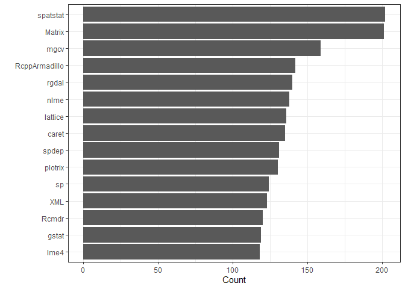
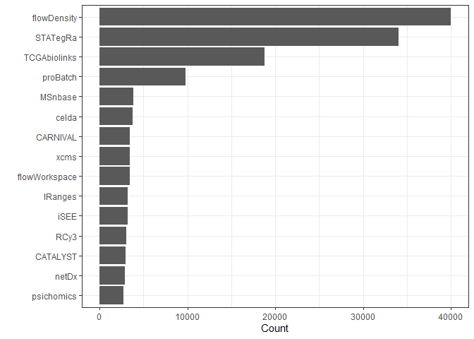

Packages
================
Matthew
3/14/2022

``` r
bioc <- read_csv('https://raw.githubusercontent.com/rfordatascience/tidytuesday/master/data/2022/2022-03-15/bioc.csv')
```

    ## Rows: 608016 Columns: 4
    ## -- Column specification --------------------------------------------------------
    ## Delimiter: ","
    ## chr  (1): package
    ## dbl  (2): rnw, rmd
    ## dttm (1): date
    ## 
    ## i Use `spec()` to retrieve the full column specification for this data.
    ## i Specify the column types or set `show_col_types = FALSE` to quiet this message.

``` r
cran <- read_csv('https://raw.githubusercontent.com/rfordatascience/tidytuesday/master/data/2022/2022-03-15/cran.csv')
```

    ## Rows: 109408 Columns: 5
    ## -- Column specification --------------------------------------------------------
    ## Delimiter: ","
    ## chr (3): package, version, date
    ## dbl (2): rnw, rmd
    ## 
    ## i Use `spec()` to retrieve the full column specification for this data.
    ## i Specify the column types or set `show_col_types = FALSE` to quiet this message.

``` r
countplot <- function(data) {
  data %>%
    count(package, sort = TRUE) %>%
    head(15) %>%
    ggplot(aes(n, fct_reorder(package, n))) + geom_col() + 
    labs(y = "", x = "Count")
}
countplot(cran)
```

<!-- -->

``` r
countplot(bioc)
```

<!-- -->
